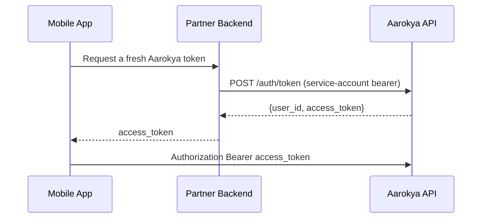

## Overview

Every Aarokya endpoint is authenticated with a JSON Web Token passed as `Authorization: Bearer <jwt>`. Tokens come from one of two issuers:

<CardGroup cols={2}>
  <Card title="App-user token" icon="phone" color="#16a34a" href="/modules/auth">
    Issued by `POST /auth/token`. A partner platform's backend exchanges a worker's phone number and id-proof for a short-lived app JWT. This is the token mobile apps use.
  </Card>
  <Card title="OIDC token" icon="building-lock" color="#3b82f6" href="/modules/platform">
    Minted by Keycloak. Platform and benefit-provider **service accounts** (via `client_credentials`), and admin / dashboard **users** (via login) authenticate this way.
  </Card>
</CardGroup>

Once obtained, every request carries the token the same way:

```bash
curl https://api.aarokya.in/users/<user_id> \
  -H 'Authorization: Bearer <access_token>'
```

---

## Issuing an App-User Token

A partner backend authenticates as its **platform service account** and calls `POST /auth/token`. Aarokya validates the platform, find-or-creates the user by phone number, and returns an app JWT. See the [Auth module](/modules/auth) for the full flow and the [Platform module](/modules/platform) for provisioning the service-account credential.

<Steps>
  <Step title="Authenticate as the platform service account">
    The partner exchanges its platform credential `basic_token` with Keycloak (`client_credentials` grant) for a service-account JWT. The handler gates on `actor.require_platform_service()`.
  </Step>
  <Step title="Exchange a phone number for an app token">
    ```bash
    curl -X POST https://api.aarokya.in/auth/token \
      -H 'Authorization: Bearer <platform_service_token>' \
      -H 'Content-Type: application/json' \
      -d '{
        "phone_number": "9876543210",
        "phone_country_code": "+91",
        "id_proof": { "proof_type": "AADHAAR", "number": "123456789012" }
      }'
    ```
    ```json Response 200
    {
      "user_id": "047382910564",
      "access_token": "eyJhbGciOiJSUzI1NiIsInR5cCI6IkpXVCJ9..."
    }
    ```
  </Step>
  <Step title="Hand the app token to the client">
    The mobile app receives the `access_token` from its own backend (not from Aarokya directly) and uses it as a Bearer token. The path `user_id` on user-scoped routes must match the token's user.
  </Step>
</Steps>

<Note>
  `id_proof.proof_type` accepts `AADHAAR`, `PAN`, `PASSPORT`, `DRIVING_LICENSE`, or `VOTER_ID`. `id_proof` is consumed only when the user is first created; on repeat calls it is ignored.
</Note>

---

## App Token Reference

<CardGroup cols={2}>
  <Card title="App JWT" icon="key" color="#16a34a">
    **Signature:** RS256, verifiable with Aarokya's public key.

    **Claims:** `actor_type: "app"`, a `user_info` block (`user_id`, `phone_number`, `phone_country_code`, names), `status`, `platform_id`, plus `iss` / `aud` / `iat` / `exp`.

    **Expiry:** configurable (`auth.app.expiry_hours`).

    **Usage:** `Authorization: Bearer <token>` on every user-scoped request.
  </Card>
  <Card title="Token renewal" icon="rotate" color="#16a34a">
    App tokens are short-lived and stateless. When one expires, the client requests a fresh one from its own backend, which re-calls `POST /auth/token`.
  </Card>
</CardGroup>

The `status` claim (`ONBOARDING`, `ACTIVE`, or `DEACTIVATED`) drives the client's onboarding UI. A freshly created user is `ONBOARDING` until `POST /users/{user_id}/complete_onboarding` succeeds.

---

## Renewal

Because tokens are minted server-side by the partner backend, renewal is a backend concern, not a device concern:



Implement proactive renewal: when the app token is close to its `exp`, request a new one from your backend before the next API call rather than waiting for a `401`.

---

## Token Storage — Client

Store the app token in platform-secure storage and keep it off disk in plaintext. The token is a bearer credential: anyone holding it can act as the user until it expires.

<CardGroup cols={2}>
  <Card title="iOS" icon="apple" color="#16a34a">
    Keychain with `kSecAttrAccessibleWhenUnlockedThisDeviceOnly`. In-memory is fine for the lifetime of the session.
  </Card>
  <Card title="Android" icon="android" color="#3b82f6">
    `EncryptedSharedPreferences` (API 23+), which is backed by the Android Keystore.
  </Card>
  <Card title="React Native" icon="react" color="#7c3aed">
    `react-native-keychain` with `ACCESSIBLE.WHEN_UNLOCKED_THIS_DEVICE_ONLY` — Keychain on iOS, Keystore-backed storage on Android.
  </Card>
  <Card title="Web / PWA" icon="globe" color="#f59e0b">
    Keep the token in memory (JS variable / app state). Never use `localStorage` or `sessionStorage` — both are exposed to XSS.
  </Card>
</CardGroup>

---

## Error Responses

| HTTP | Error code | Cause |
|------|-----------|-------|
| `401` | `AUE_301` | Bearer token missing, expired, or malformed |
| `403` | `AUE_302` | The user account is not active |
| `400` | `AUE_304` | Platform not found for the issuing token |
| `400` | `AUE_305` | Platform is inactive |
| `500` | `AUE_300` | Internal server error |

Authorization failures on a specific resource (wrong scope, not the owner, admin-only) surface as that domain's own error code — see [Errors](/api/errors).

---

## Security Checklist for Client Developers

<CardGroup cols={2}>
  <Card title="Token storage" icon="database" color="#16a34a">
    - iOS: Keychain with `kSecAttrAccessibleWhenUnlockedThisDeviceOnly`
    - Android: `EncryptedSharedPreferences` (API 23+)
    - Web: in memory only — never `localStorage` / `sessionStorage`
  </Card>
  <Card title="Token transmission" icon="lock" color="#0891b2">
    - Always use HTTPS in production
    - Never log tokens
    - Never put tokens in URLs or query parameters
  </Card>
  <Card title="Renewal" icon="arrows-rotate" color="#7c3aed">
    - Fetch a fresh token from your backend before `exp`
    - Do not embed long-lived platform service-account credentials in the client
  </Card>
  <Card title="Scope" icon="shield-check" color="#f59e0b">
    - Use the `user_id` from the token for user-scoped paths
    - Clear the stored token on logout and on app reinstall
  </Card>
</CardGroup>
