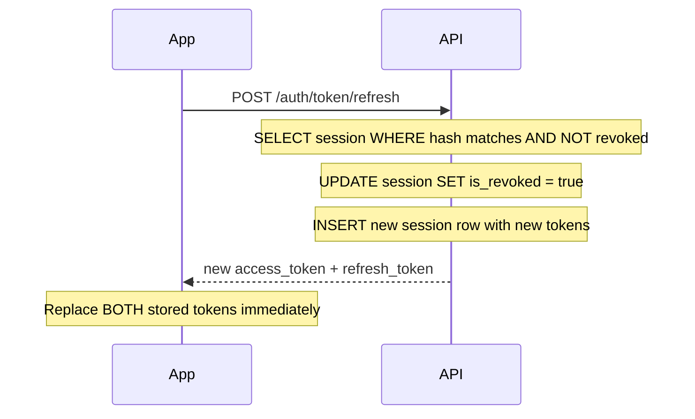

## Overview

Aarokya supports two authentication channels:

<CardGroup cols={2}>
  <Card title="Direct OTP Login" icon="phone" color="#16a34a" href="/api/authentication#channel-1-direct-otp-login">
    For standalone app use. Phone OTP -> JWT tokens. No passwords.
  </Card>
  <Card title="Partner SDK Token" icon="link" color="#3b82f6" href="/api/sdk-authentication">
    For embedded SDK use (NammaYatri). Partner backend requests token via API key. **This is the primary flow for drivers.**
  </Card>
</CardGroup>

Both channels issue the same JWT access tokens. Once a token is obtained (via either channel), all subsequent API calls use `Authorization: Bearer <token>`.

---

## Channel 1: Direct OTP Login

Aarokya uses **phone OTP -> JWT** authentication. There are no passwords. Every session starts with a 6-digit OTP sent to the user's mobile number and verified within 10 minutes.

<Steps>
  <Step title="Trigger OTP">
    Send the user's 10-digit mobile number. In UAT the OTP is always `123456` — no SMS is sent.
    ```bash
    curl -X POST https://api.aarokya.in/auth/otp/trigger \
      -H 'Content-Type: application/json' \
      -d '{"phone": "9876543210"}'
    ```
  </Step>
  <Step title="Verify OTP">
    Exchange the OTP for a token pair. `is_new_user: true` means show the onboarding flow.
    ```bash
    curl -X POST https://api.aarokya.in/auth/otp/verify \
      -H 'Content-Type: application/json' \
      -d '{"phone": "9876543210", "otp": "123456"}'
    ```
    Response includes `access_token`, `refresh_token`, and `is_new_user`.
  </Step>
  <Step title="Use the access token">
    Pass it as a Bearer token on every protected request.
    ```bash
    curl https://api.aarokya.in/user/profile \
      -H 'Authorization: Bearer <access_token>'
    ```
  </Step>
  <Step title="Refresh before expiry">
    Access tokens expire after **24 hours**. Use the refresh token to get a new pair silently (no re-authentication required).
    ```bash
    curl -X POST https://api.aarokya.in/auth/token/refresh \
      -H 'Content-Type: application/json' \
      -d '{"refresh_token": "<refresh_token>"}'
    ```
  </Step>
</Steps>

---

## Token Reference

<CardGroup cols={2}>
  <Card title="Access Token (JWT)" icon="key" color="#16a34a">
    **Expiry:** 24 hours

    **Format:** JWT (HS256). Claims: `user_id`, `exp`.

    **Usage:** `Authorization: Bearer <token>` on every protected request.

    **Storage:** In-memory preferred; SecureEnclave/TEE for persistence.
  </Card>
  <Card title="Refresh Token (opaque)" icon="arrows-rotate" color="#3b82f6">
    **Expiry:** 30 days

    **Format:** Opaque 256-bit hex string (SHA-256 hashed in DB).

    **Usage:** Only for `POST /auth/token/refresh`.

    **Storage:** iOS Keychain / Android Keystore. Never in plaintext files or logs.
  </Card>
</CardGroup>

---

## Token Storage — Per Platform

### iOS

```swift
// Store refresh token in Keychain (Swift)
import Security

func saveToKeychain(key: String, value: String) {
    let data = value.data(using: .utf8)!
    let query: [String: Any] = [
        kSecClass as String: kSecClassGenericPassword,
        kSecAttrAccount as String: key,
        kSecValueData as String: data,
        kSecAttrAccessible as String: kSecAttrAccessibleWhenUnlockedThisDeviceOnly
    ]
    SecItemDelete(query as CFDictionary)  // Remove existing entry
    SecItemAdd(query as CFDictionary, nil)
}

func loadFromKeychain(key: String) -> String? {
    let query: [String: Any] = [
        kSecClass as String: kSecClassGenericPassword,
        kSecAttrAccount as String: key,
        kSecReturnData as String: true,
        kSecMatchLimit as String: kSecMatchLimitOne
    ]
    var result: AnyObject?
    SecItemCopyMatching(query as CFDictionary, &result)
    guard let data = result as? Data else { return nil }
    return String(data: data, encoding: .utf8)
}

// Usage
saveToKeychain(key: "aarokya_refresh_token", value: refreshToken)
saveToKeychain(key: "aarokya_access_token", value: accessToken)
```

- Use `kSecAttrAccessibleWhenUnlockedThisDeviceOnly` for maximum security
- Access tokens can also be held in memory (UserDefaults is acceptable for access tokens only if encrypted)
- Refresh tokens MUST go in Keychain

### Android

```kotlin
// Store refresh token in EncryptedSharedPreferences (Kotlin)
import androidx.security.crypto.EncryptedSharedPreferences
import androidx.security.crypto.MasterKeys

val masterKeyAlias = MasterKeys.getOrCreate(MasterKeys.AES256_GCM_SPEC)

val sharedPreferences = EncryptedSharedPreferences.create(
    "aarokya_secure_prefs",
    masterKeyAlias,
    context,
    EncryptedSharedPreferences.PrefKeyEncryptionScheme.AES256_SIV,
    EncryptedSharedPreferences.PrefValueEncryptionScheme.AES256_GCM
)

// Save
sharedPreferences.edit().putString("refresh_token", refreshToken).apply()
sharedPreferences.edit().putString("access_token", accessToken).apply()

// Read
val refreshToken = sharedPreferences.getString("refresh_token", null)
val accessToken = sharedPreferences.getString("access_token", null)
```

- `EncryptedSharedPreferences` uses Android Keystore under the hood
- Available from API level 23 (Android 6.0+)
- For API < 23, use the legacy `KeyStore` API directly

### React Native

```typescript
// Use react-native-keychain for secure storage
import * as Keychain from 'react-native-keychain';

// Store
await Keychain.setGenericPassword(
  'aarokya_tokens',
  JSON.stringify({ accessToken, refreshToken }),
  {
    service: 'in.aarokya.app',
    // iOS: Keychain, Android: Keystore-backed EncryptedSharedPreferences
    accessible: Keychain.ACCESSIBLE.WHEN_UNLOCKED_THIS_DEVICE_ONLY,
  }
);

// Load
const credentials = await Keychain.getGenericPassword({
  service: 'in.aarokya.app'
});
if (credentials) {
  const { accessToken, refreshToken } = JSON.parse(credentials.password);
}
```

### Web (PWA / Browser)

For web applications, the recommended approach is **httpOnly cookies** (server-managed) rather than storing tokens in JavaScript-accessible storage:

- **Never** store tokens in `localStorage` — vulnerable to XSS
- **Never** store tokens in `sessionStorage` — same vulnerability
- **Preferred:** Store access token in memory (JavaScript variable / React state); store refresh token in a `httpOnly`, `Secure`, `SameSite=Strict` cookie

```typescript
// Memory-only store for web (TypeScript)
let accessToken: string | null = null;

export function setAccessToken(token: string) {
  accessToken = token;
}

export function getAccessToken(): string | null {
  return accessToken;
}

// On page refresh, user must re-authenticate or
// the server uses the httpOnly refresh token cookie to reissue
```

---

## Token Rotation

Refresh tokens are **single-use**. Calling `/auth/token/refresh`:

1. Revokes the submitted refresh token immediately (sets `is_revoked = true`)
2. Issues a new access token + refresh token pair
3. Returns `401` if the token is already revoked or expired



<Warning>
  If the same refresh token is used **twice** (e.g. a race condition where two requests fire simultaneously), the second call returns `401 INVALID_TOKEN`. The user must log in again with a new OTP. Implement a mutex or semaphore in your token refresh logic to prevent concurrent refresh calls.
</Warning>

---

## Refresh Strategy — Client Code Examples

Implement proactive token refresh: check the access token expiry before each request and refresh 5 minutes before it expires.

<CodeGroup>
```typescript TypeScript / React Native
interface TokenStore {
  accessToken: string;
  refreshToken: string;
  accessTokenExpiresAt: number; // Unix timestamp
}

let tokenStore: TokenStore | null = null;
let refreshPromise: Promise<TokenStore> | null = null;

async function getValidAccessToken(): Promise<string> {
  if (!tokenStore) throw new Error('Not authenticated');

  const fiveMinutesFromNow = Date.now() / 1000 + 300;

  if (tokenStore.accessTokenExpiresAt > fiveMinutesFromNow) {
    return tokenStore.accessToken; // Still valid
  }

  // Proactive refresh — deduplicate concurrent calls
  if (!refreshPromise) {
    refreshPromise = refreshTokens().finally(() => {
      refreshPromise = null;
    });
  }

  tokenStore = await refreshPromise;
  return tokenStore.accessToken;
}

async function refreshTokens(): Promise<TokenStore> {
  const response = await fetch('https://api.aarokya.in/auth/token/refresh', {
    method: 'POST',
    headers: { 'Content-Type': 'application/json' },
    body: JSON.stringify({ refresh_token: tokenStore!.refreshToken }),
  });

  if (!response.ok) {
    // Refresh failed — force re-login
    tokenStore = null;
    navigateToLogin();
    throw new Error('Session expired');
  }

  const data = await response.json();
  const newStore: TokenStore = {
    accessToken: data.access_token,
    refreshToken: data.refresh_token,
    accessTokenExpiresAt: data.access_token_expires_at,
  };

  // Persist to secure storage
  await saveTokensToKeychain(newStore);
  return newStore;
}

// Wrap all API calls
async function apiCall(path: string, options: RequestInit = {}) {
  const token = await getValidAccessToken();
  return fetch(`https://api.aarokya.in${path}`, {
    ...options,
    headers: {
      ...options.headers,
      'Authorization': `Bearer ${token}`,
      'Content-Type': 'application/json',
    },
  });
}
```

```kotlin Kotlin (Android)
class TokenManager(private val prefs: EncryptedSharedPreferences) {

    private val mutex = Mutex()

    suspend fun getValidAccessToken(): String {
        val expiresAt = prefs.getLong("access_token_expires_at", 0)
        val fiveMinutesFromNow = System.currentTimeMillis() / 1000 + 300

        if (expiresAt > fiveMinutesFromNow) {
            return prefs.getString("access_token", "")!!
        }

        return mutex.withLock {
            // Double-check after acquiring lock
            val freshExpiresAt = prefs.getLong("access_token_expires_at", 0)
            if (freshExpiresAt > fiveMinutesFromNow) {
                return@withLock prefs.getString("access_token", "")!!
            }
            refreshTokens()
        }
    }

    private suspend fun refreshTokens(): String {
        val refreshToken = prefs.getString("refresh_token", null)
            ?: throw IllegalStateException("No refresh token stored")

        val response = authApi.refreshToken(RefreshRequest(refreshToken))

        prefs.edit()
            .putString("access_token", response.accessToken)
            .putString("refresh_token", response.refreshToken)
            .putLong("access_token_expires_at", response.accessTokenExpiresAt)
            .apply()

        return response.accessToken
    }
}
```
</CodeGroup>

---

## Error Responses

| HTTP | Error code | Cause |
|------|-----------|-------|
| `401` | `INVALID_OTP` | OTP is wrong or already used |
| `401` | `OTP_EXPIRED` | OTP session older than 10 minutes |
| `401` | `INVALID_TOKEN` | Access token expired, missing, or malformed |
| `401` | `MISSING_TOKEN` | `Authorization` header absent on protected endpoint |
| `429` | `TOO_MANY_OTP_ATTEMPTS` | 5 wrong OTP attempts on one session |
| `429` | `RATE_LIMIT_EXCEEDED` | OTP trigger rate limit hit |

---

## Security Checklist for Client Developers

<CardGroup cols={2}>
  <Card title="Token storage" icon="database" color="#16a34a">
    - iOS: Keychain with `kSecAttrAccessibleWhenUnlockedThisDeviceOnly`
    - Android: `EncryptedSharedPreferences` (API 23+)
    - Web: Memory only + httpOnly cookie for refresh token
    - Never: `localStorage`, `AsyncStorage` (unencrypted), plaintext files
  </Card>
  <Card title="Token transmission" icon="lock" color="#0891b2">
    - Always use HTTPS in production
    - Never log tokens (access or refresh)
    - Never include tokens in URLs or query parameters
    - Never send refresh tokens to any endpoint other than `/auth/token/refresh`
  </Card>
  <Card title="Refresh logic" icon="arrows-rotate" color="#7c3aed">
    - Implement proactive refresh (5 minutes before expiry)
    - Deduplicate concurrent refresh calls with a mutex
    - On refresh failure, clear all tokens and redirect to login
    - Replace BOTH tokens atomically after a successful refresh
  </Card>
  <Card title="Session hygiene" icon="shield-check" color="#f59e0b">
    - Call `POST /auth/logout` on user-initiated logout
    - Clear all stored tokens on logout (both in memory and secure storage)
    - On app reinstall, old tokens should be treated as invalid (Keychain survives reinstall on iOS — clear on first launch after reinstall)
  </Card>
</CardGroup>
