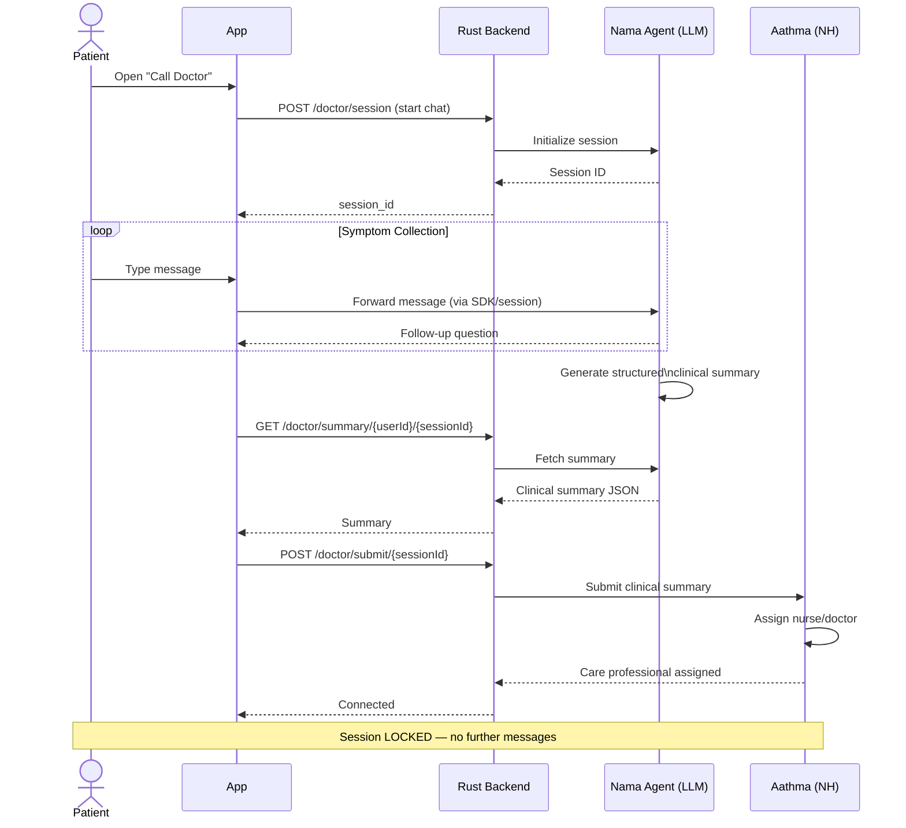
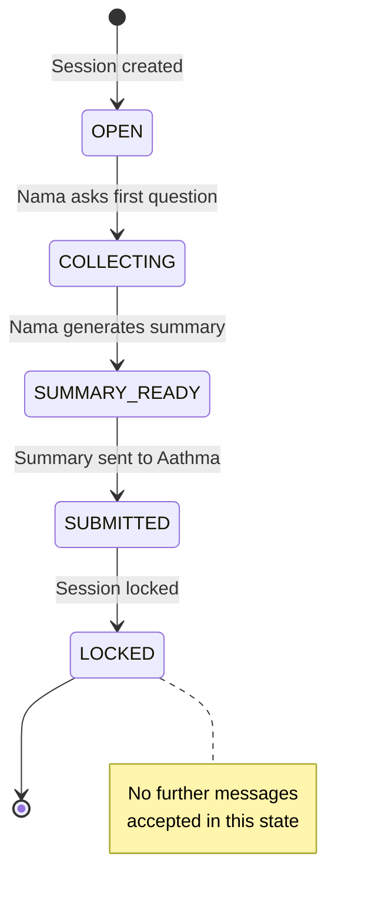

<Info>
  **Authentication:** All endpoints require `Authorization: Bearer <access_token>`.

  **External Dependencies:** Nama Agent (internal LLM) · Aathma (Narayana Health doctor platform)
</Info>

## How It Works



---

## Key Concept: Session Locking

Once a clinical summary is submitted to Aathma, the chat session is **locked**. No further messages are accepted. This prevents patients from editing their symptoms after a doctor has already been assigned.



---

## Get Clinical Summary

Retrieve the structured clinical summary generated by Nama Agent for a session.

<CodeGroup>
```bash Request
curl -X POST "http://localhost:8080/doctor/summary/{userId}/{sessionId}" \
  -H 'Authorization: Bearer eyJhbGci...'
```

```json Response 200
{
  "session_id": "sess-abc123",
  "user_id": "550e8400-e29b-41d4-a716-446655440000",
  "summary": {
    "chief_complaint": "Fever and body ache for 3 days",
    "symptoms": ["fever", "body ache", "fatigue", "mild headache"],
    "duration": "3 days",
    "severity": "moderate",
    "existing_conditions": ["none reported"],
    "current_medications": ["none"],
    "allergies": ["none known"]
  },
  "generated_at": "2025-06-14T09:15:00Z",
  "status": "READY"
}
```

```json Response 404 — summary not yet ready
{
  "error": "SUMMARY_NOT_READY",
  "message": "The Nama Agent has not yet generated a summary for this session"
}
```
</CodeGroup>

<ResponseField name="summary.chief_complaint" type="string">
  Primary symptom the patient presented with.
</ResponseField>

<ResponseField name="summary.symptoms" type="array">
  Structured list of all reported symptoms extracted by Nama Agent.
</ResponseField>

<ResponseField name="status" type="string (enum)">
  `COLLECTING` | `READY` | `SUBMITTED` | `LOCKED`
</ResponseField>

---

## Data Owned

| Table | Purpose |
|-------|---------|
| `chat_sessions` | One per consultation attempt — tracks status and Nama session ID |
| `chat_messages` | Full conversation history per session (retrieved from Nama Agent) |

---

## What This Module Does NOT Own

<CardGroup cols={3}>
  <Card title="Doctor Scheduling" icon="calendar" color="#6b7280">
    Handled entirely by Aathma (Narayana Health). We only submit the clinical summary.
  </Card>
  <Card title="Video/Audio Calls" icon="video" color="#6b7280">
    Out of scope for v1. Doctor consultation happens via Narayana Health's platform after Aathma assigns a care professional.
  </Card>
  <Card title="Summary Generation" icon="brain" color="#6b7280">
    Nama Agent generates the clinical summary — it is never hand-written by the patient or the Aarokya backend.
  </Card>
</CardGroup>

<Note>
  The Nama Agent session management API (SDK callback vs. persistent session) is **TBC**. Endpoint contracts for the session initiation flow are pending confirmation from the Nama Agent team.
</Note>
