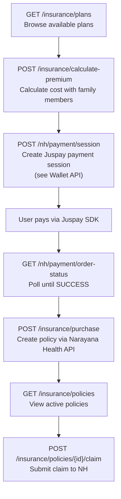
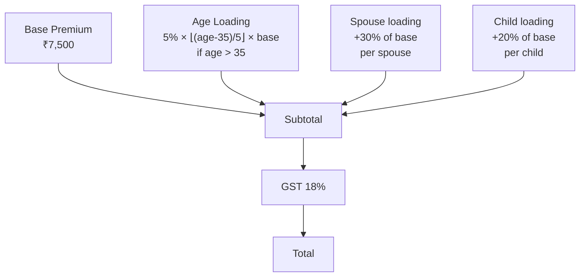

<Info>
  **Authentication:** All endpoints require `Authorization: Bearer <access_token>`.

  **External Dependency:** Narayana Health Insurance API (purchase, claims, status).
</Info>

## Overview



---

## List Plans

<CodeGroup>
```bash Request
curl "http://localhost:8080/insurance/plans" \
  -H 'Authorization: Bearer eyJhbGci...'
```

```bash Request with filters
curl "http://localhost:8080/insurance/plans?plan_type=FAMILY&coverage_type=BASIC" \
  -H 'Authorization: Bearer eyJhbGci...'
```

```json Response 200
{
  "plans": [
    {
      "id": "a1b2c3d4-e5f6-7890-abcd-ef1234567890",
      "plan_code": "NH-BASIC-IND-001",
      "plan_name": "Basic Individual Plan",
      "plan_type": "INDIVIDUAL",
      "sum_insured": 200000.00,
      "base_premium": 5000.00,
      "coverage_type": "BASIC",
      "max_dependants": 0,
      "teleconsult_included": true
    },
    {
      "id": "b2c3d4e5-f6a7-8901-bcde-f12345678901",
      "plan_code": "NH-COMP-FAM-002",
      "plan_name": "Comprehensive Family Plan",
      "plan_type": "FAMILY",
      "sum_insured": 500000.00,
      "base_premium": 7500.00,
      "coverage_type": "COMPREHENSIVE",
      "max_dependants": 4,
      "teleconsult_included": true
    }
  ]
}
```
</CodeGroup>

**Query filters (all optional):**

| Parameter | Type | Values |
|-----------|------|--------|
| `plan_type` | string | `INDIVIDUAL` \| `FAMILY` \| `GROUP` |
| `coverage_type` | string | `BASIC` \| `COMPREHENSIVE` \| `PREMIUM` |
| `min_sum_insured` | number | e.g. `200000` |
| `max_premium` | number | e.g. `10000` |

---

## Calculate Premium

<CodeGroup>
```bash Request — individual
curl -X POST http://localhost:8080/insurance/calculate-premium \
  -H 'Authorization: Bearer eyJhbGci...' \
  -H 'Content-Type: application/json' \
  -d '{
    "plan_id": "b2c3d4e5-f6a7-8901-bcde-f12345678901",
    "policyholder": {
      "dob": "1985-03-20",
      "gender": "MALE"
    },
    "dependants": [
      { "relationship": "SPOUSE", "dob": "1988-07-12", "gender": "FEMALE" },
      { "relationship": "CHILD", "dob": "2015-01-05", "gender": "MALE" }
    ]
  }'
```

```json Response 200
{
  "plan_id": "b2c3d4e5-f6a7-8901-bcde-f12345678901",
  "plan_name": "Comprehensive Family Plan",
  "breakdown": {
    "base_premium": 7500.00,
    "age_loading": 750.00,
    "dependant_premium": 3750.00,
    "subtotal": 12000.00,
    "gst": 2160.00,
    "total": 14160.00
  },
  "dependants_count": 2,
  "currency": "INR"
}
```
</CodeGroup>

**Premium formula:**



| Component | Formula |
|-----------|---------|
| Base | `plan.base_premium` |
| Age loading (age > 35) | `5% × ⌊(age − 35) / 5⌋ × base_premium` |
| Per spouse | `+30% of base_premium` |
| Per child | `+20% of base_premium` |
| GST | `+18% of subtotal` |

---

## Purchase Insurance

Called **after** a successful payment (order status = `SUCCESS`).

<CodeGroup>
```bash Request
curl -X POST http://localhost:8080/insurance/purchase \
  -H 'Authorization: Bearer eyJhbGci...' \
  -H 'Content-Type: application/json' \
  -d '{
    "plan_id": "b2c3d4e5-f6a7-8901-bcde-f12345678901",
    "payment_order_id": "aarokya-1767808100",
    "dependants": [
      { "name": "Sunita Kumar", "relationship": "SPOUSE", "dob": "1988-07-12", "gender": "FEMALE" },
      { "name": "Aryan Kumar", "relationship": "CHILD", "dob": "2015-01-05", "gender": "MALE" }
    ]
  }'
```

```json Response 201
{
  "policy_id": "c3d4e5f6-a7b8-9012-cdef-123456789012",
  "policy_number": "NH-2025-00123456",
  "plan_name": "Comprehensive Family Plan",
  "status": "ACTIVE",
  "start_date": "2025-06-15",
  "expiry_date": "2026-06-14",
  "premium_amount": 14160.00,
  "sum_insured": 500000.00,
  "dependants_count": 2
}
```
</CodeGroup>

---

## Get Policy Details

<CodeGroup>
```bash Request
curl "http://localhost:8080/insurance/policies/{policyId}" \
  -H 'Authorization: Bearer eyJhbGci...'
```

```json Response 200
{
  "policy_id": "c3d4e5f6-a7b8-9012-cdef-123456789012",
  "policy_number": "NH-2025-00123456",
  "plan_name": "Comprehensive Family Plan",
  "provider": "Narayana Health",
  "status": "ACTIVE",
  "coverage_type": "COMPREHENSIVE",
  "sum_insured": 500000.00,
  "premium_amount": 14160.00,
  "start_date": "2025-06-15",
  "expiry_date": "2026-06-14",
  "document_url": "https://nh.example.com/policy/NH-2025-00123456.pdf",
  "dependants": [
    {
      "name": "Sunita Kumar",
      "relationship": "SPOUSE",
      "dob": "1988-07-12",
      "gender": "FEMALE"
    },
    {
      "name": "Aryan Kumar",
      "relationship": "CHILD",
      "dob": "2015-01-05",
      "gender": "MALE"
    }
  ]
}
```
</CodeGroup>

---

## Submit Claim

<CodeGroup>
```bash Request
curl -X POST "http://localhost:8080/insurance/policies/{policyId}/claim" \
  -H 'Authorization: Bearer eyJhbGci...' \
  -H 'Content-Type: application/json' \
  -d '{
    "reason": "Hospitalization for appendicitis surgery",
    "hospital_name": "Narayana Health City, Bengaluru",
    "admission_date": "2025-06-10",
    "amount_claimed": 45000.00
  }'
```

```json Response 200
{
  "claim_reference": "CLM-2025-00456",
  "status": "SUBMITTED",
  "message": "Claim submitted to Narayana Health for processing",
  "nh_reference": "NH-CLM-789012"
}
```
</CodeGroup>

<Note>
  Claims are **forwarded to Narayana Health's API** — adjudication happens on their side. Aarokya does not own the claims workflow beyond submission.
</Note>

---

## Endpoint Summary

| Method | Path | Description |
|--------|------|-------------|
| `GET` | `/insurance/plans` | List available plans (with optional filters) |
| `GET` | `/insurance/plans/{id}` | Full plan detail with features + exclusions |
| `POST` | `/insurance/calculate-premium` | Premium breakdown for a plan + dependants |
| `POST` | `/insurance/purchase` | Purchase plan, create policy via NH API |
| `GET` | `/insurance/policies` | List user's active policies |
| `GET` | `/insurance/policies/{id}` | Policy detail with dependants |
| `POST` | `/insurance/policies/{id}/claim` | Submit claim to Narayana Health |
