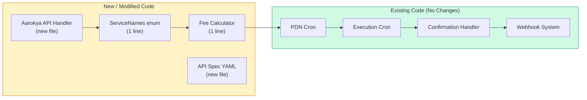
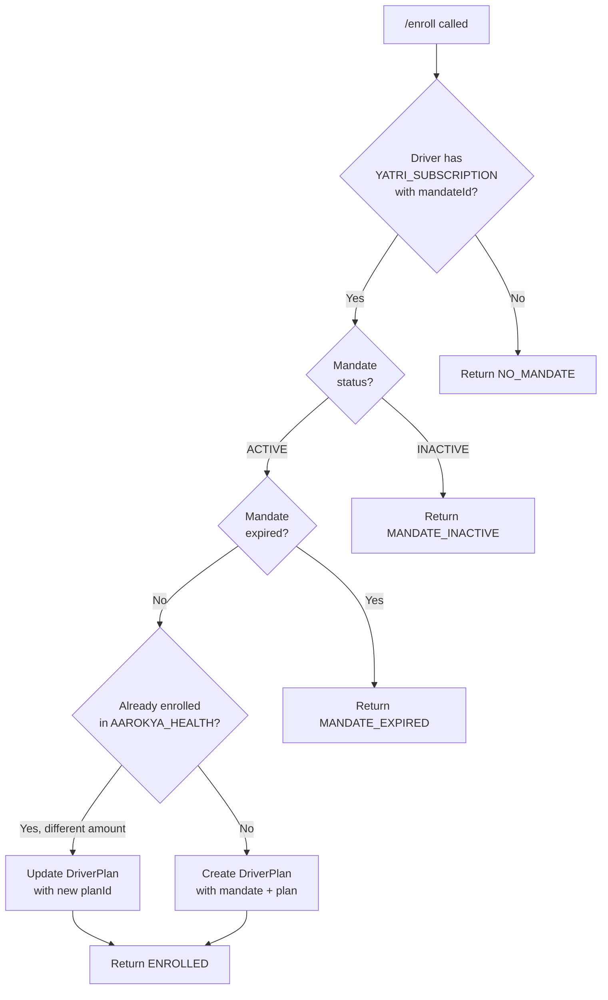

## Required Changes in Namma Yatri

### Code Changes

| # | Change | File | Description |
|---|--------|------|-------------|
| 1 | Add `AAROKYA_HEALTH` to ServiceNames enum | `Domain/Types/Extra/Plan.hs` | 1 line. All tables and crons filter by this. |
| 2 | Add `AAROKYA_HEALTH` case in fee calculator | `SharedLogic/Allocator/Jobs/DriverFeeUpdates/DriverFee.hs` (line ~584) | 1 line. Tells the cron how to generate fees for this service. Uses same path as `YATRI_RENTAL`. |
| 3 | Enroll API handler | New file: `Domain/Action/UI/AarokyaPayment.hs` | Finds mandate, finds/creates Plan, creates DriverPlan. |
| 4 | Unenroll API handler | Same file | Sets `enableServiceUsageCharge = false`. |
| 5 | CollectionStatus API handler | Same file | Reads DriverFee by driverId + date. |
| 6 | API spec YAML | New file: `spec/API/AarokyaPayment.yaml` | Defines the 3 endpoints. Run generator after. |



## Database Configuration

### 1. subscription_config

One row per city. Tells the crons which Juspay account to use and where to send webhooks.

```sql
INSERT INTO atlas_driver_offer_bpp.subscription_config (
  service_name, merchant_id, merchant_operating_city_id,
  payment_service_name, autopay_enabled, allow_driver_fee_calc_schedule,
  is_triggered_at_end_ride, send_in_app_fcm_notifications,
  max_retry_count, is_ui_enabled,
  free_trial_rides_applicable, is_free_trial_days_applicable,
  enable_city_based_fee_switch, enable_service_usage_charge_default,
  is_subscription_enabled_at_category_level,
  use_overlay_service, send_deep_link,
  allow_due_addition, allow_manual_payment_links,
  generic_batch_size_for_jobs,
  generic_job_reschedule_time, generic_next_job_schedule_time_threshold,
  payment_link_channel, payment_link_job_time,
  default_city_vehicle_category,
  waive_off_offer_title, waive_off_offer_description,
  data_entity_to_send,
  events_enabled_for_webhook, ext_webhook_configs, webhook_config,
  created_at, updated_at
)
SELECT
  'AAROKYA_HEALTH', merchant_id, merchant_operating_city_id,
  payment_service_name,
  true, true,
  false, true,
  3, false,
  false, false,
  false, true,
  false,
  false, false,
  false, false,
  25,
  300, 300,
  'SMS', 3600,
  'AUTO_CATEGORY',
  '', '',
  '{}',
  '{MANDATE}',
  '{"baseUrl":"https://aarokya.example.com","username":"aarokya","password":"<encrypted>","merchantId":"aarokya-org-id","apiKey":null}',
  '{"batchSize":50,"retryLimit":3,"rescheduleTimeThreshold":60,"nextJobScheduleTimeThreshold":300,"webhookDeliveryMode":"REAL_TIME"}',
  NOW(), NOW()
FROM atlas_driver_offer_bpp.subscription_config
WHERE service_name = 'YATRI_SUBSCRIPTION' LIMIT 1;
```

**Key fields:**

| Field | Value | Purpose |
|-------|-------|---------|
| `payment_service_name` | _(copied from YATRI_SUBSCRIPTION)_ | Reuses the same Juspay merchant account |
| `ext_webhook_configs` | `{"baseUrl":"https://aarokya.example.com",...}` | Aarokya's webhook URL and BasicAuth credentials |
| `events_enabled_for_webhook` | `{MANDATE}` | Fires webhooks on mandate events |
| `max_retry_count` | `3` | PDN notification retry limit |
| `autopay_enabled` | `true` | Enables autopay flow |

### 2. plan

One row per Aarokya pricing tier. Defines the daily premium amount that the cron reads to determine how much to charge.

```sql
-- Rs 5/day (Basic)
INSERT INTO atlas_driver_offer_bpp.plan (
  id, name, description, plan_base_amount,
  service_name, frequency, payment_mode, plan_type,
  max_amount, max_credit_limit, max_mandate_amount,
  based_on_entity, free_ride_count,
  cgst_percentage, sgst_percentage,
  registration_amount, product_ownership_amount,
  eligible_for_coin_discount, subscribed_flag_toggle_allowed,
  is_offer_applicable, is_deprecated, allow_strike_off,
  vehicle_category, merchant_id, merchant_op_city_id,
  created_at, updated_at
)
SELECT
  'aarokya-daily-5', 'Aarokya Basic', 'Basic health cover',
  'DAILY_BASE_5.0',
  'AAROKYA_HEALTH', 'DAILY', 'AUTOPAY', 'SUBSCRIPTION',
  5.0, 50.0, 500.0,
  'NONE', 0, 0, 0, 0, 0,
  false, false, false, false, false,
  'AUTO_CATEGORY', merchant_id, merchant_operating_city_id,
  NOW(), NOW()
FROM atlas_driver_offer_bpp.subscription_config
WHERE service_name = 'YATRI_SUBSCRIPTION' LIMIT 1;

-- Rs 10/day (Standard)
-- Same as above with: id='aarokya-daily-10', name='Aarokya Standard',
-- plan_base_amount='DAILY_BASE_10.0', max_amount=10.0

-- Rs 15/day (Premium)
-- Same as above with: id='aarokya-daily-15', name='Aarokya Premium',
-- plan_base_amount='DAILY_BASE_15.0', max_amount=15.0
```

<Tip>
Alternatively, the enroll API can auto-create Plan rows when Aarokya sends a new amount that doesn't match any existing Plan.
</Tip>

### 3. Scheduler Job

One row per city to seed the first run of `CalculateDriverFees` for `AAROKYA_HEALTH`. The job reschedules itself after each run.

**Job data:**

```json
{
  "merchantId": "<merchant-id>",
  "merchantOperatingCityId": "<city-id>",
  "serviceName": "AAROKYA_HEALTH",
  "startTime": "<today-start>",
  "endTime": "<today-end>",
  "scheduleNotification": true,
  "scheduleOverlay": false,
  "scheduleManualPaymentLink": false,
  "scheduleDriverFeeCalc": true,
  "createChildJobs": true
}
```

## Edge Cases

| Case | Outcome |
|------|---------|
| Driver has no Yatri autopay | `/enroll` returns `NO_MANDATE` |
| Mandate is inactive (revoked/paused) | `/enroll` returns `MANDATE_INACTIVE` |
| Mandate has expired | `/enroll` returns `MANDATE_EXPIRED` |
| Driver already enrolled | `/enroll` returns `ALREADY_ENROLLED` (or updates plan if amount changed) |
| Driver revokes mandate after enrollment | Webhook fires `CANCELLED_PSP`, all pending fees become `PAYMENT_OVERDUE` |
| Bank has insufficient funds | Execution fails, `bankErrorCode` stored, fee becomes `PAYMENT_OVERDUE` |
| PDN notification fails | Namma Yatri retries 3 times with exponential backoff |
| Aarokya webhook endpoint is down | Namma Yatri retries webhook delivery automatically |
| Driver unenrolls mid-day | Today's in-progress fee completes, tomorrow's fee is not generated |
| Yatri + Aarokya debit on same day | Both execute independently on the same mandate, separate fees and notifications |
| Cron misses a day | Next run generates only that day's fee, dedup prevents double charge |
| Driver changes plan (Rs 10 -> Rs 15) | Call `/enroll` again with new amount, next day charges Rs 15 |
| Daily amount exceeds mandate maxAmount | Extremely unlikely (Rs 5-15 vs mandate Rs 200-500+) |


