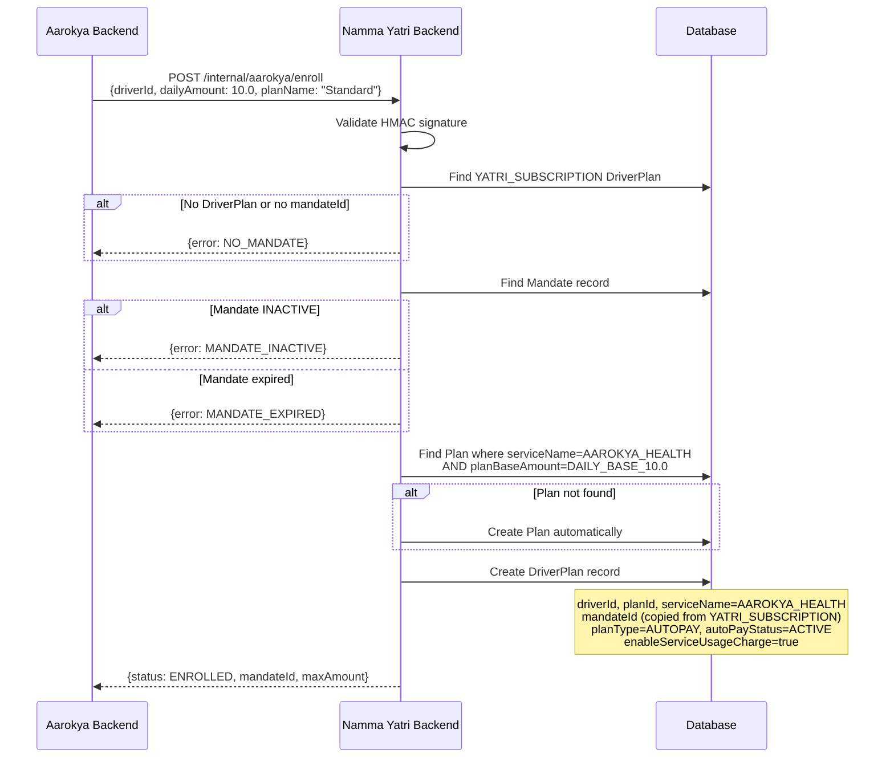
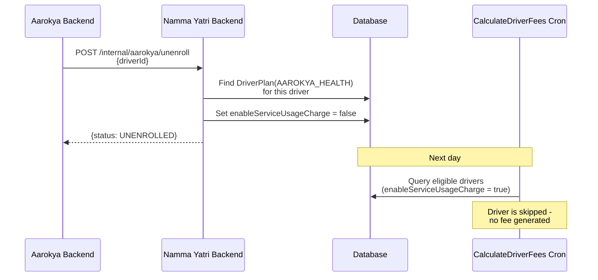
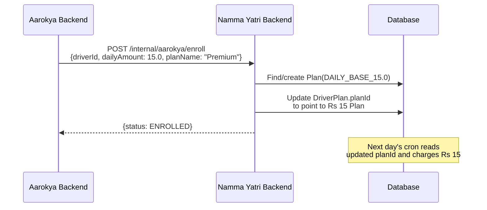
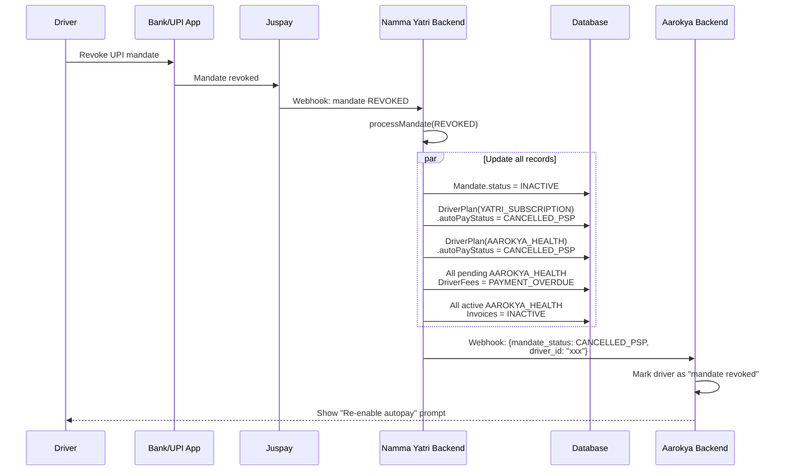

## Enrollment

When a driver selects an Aarokya health plan in the SDK, the Aarokya backend calls Namma Yatri's enroll API.

### What the DriverPlan Record Controls

The DriverPlan record created during enrollment is the enrollment record. It tells Namma Yatri's daily cron:

| Field | Purpose |
|-------|---------|
| `driverId` | **Who** to charge |
| `planId` -> `Plan.planBaseAmount` | **How much** to charge (e.g., Rs 10) |
| `mandateId` | **How** to charge (the driver's UPI mandate) |
| `serviceName = AAROKYA_HEALTH` | **What service** this is for |
| `enableServiceUsageCharge = true` | **Whether** to generate fees |

Without this record, no fees are generated and nothing happens.

## Unenrollment

When a driver opts out of Aarokya:

<Note>
If a driver unenrolls mid-day, any in-progress fee for today will still complete. The unenrollment takes effect from the next day onward.
</Note>

<Warning>
Refund policy for mid-day unenrollment is still to be decided.
</Warning>

## Plan Change

When a driver switches plans (e.g., Rs 10/day to Rs 15/day), the same enroll API is called with the new amount:

The same `/enroll` endpoint handles both first-time enrollment and plan changes.

## Mandate Revocation

When a driver revokes their UPI mandate from their banking app, it affects **both** the Yatri subscription and Aarokya simultaneously since they share the same mandate.

