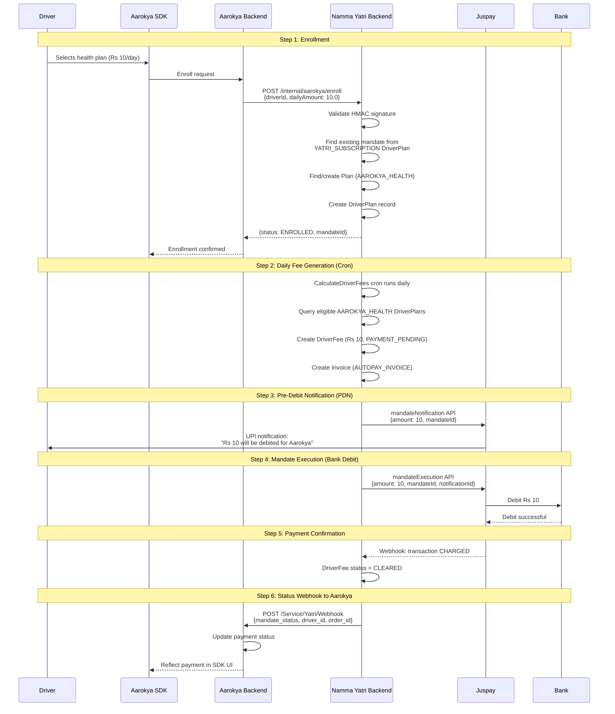
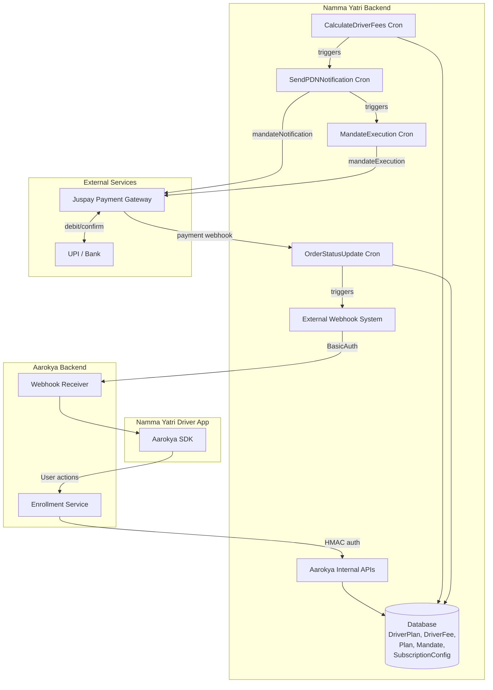

## Overview

Aarokya is a health insurance SDK embedded in the Namma Yatri driver app. Drivers who opt in pay a daily premium (Rs 5 / Rs 10 / Rs 15 depending on plan) that is automatically debited from their bank account.

This integration reuses Namma Yatri's existing UPI mandate infrastructure. When a driver has already set up autopay for their Yatri subscription, the same mandate is used by Aarokya to collect insurance premiums. No new mandate creation or payment gateway integration is required.

**Namma Yatri handles all payment operations** — fee generation, pre-debit notification, bank debit, retries, status tracking, and failure handling. Aarokya's responsibility is limited to enrollment, unenrollment, and receiving payment status via webhooks.

## Authentication

Aarokya and Namma Yatri share a secret key. All API calls between the two systems are authenticated using HMAC signature verification.

| Direction | Auth Method |
|-----------|------------|
| Aarokya -> Namma Yatri (API calls) | HMAC signature in request header, signed with shared secret |
| Namma Yatri -> Aarokya (webhooks) | BasicAuth credentials stored in Namma Yatri's `SubscriptionConfig` |

## End-to-End Flow

The complete lifecycle from enrollment to payment confirmation:

## Architecture Overview

