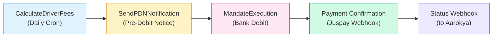
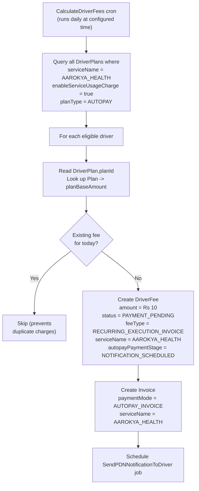
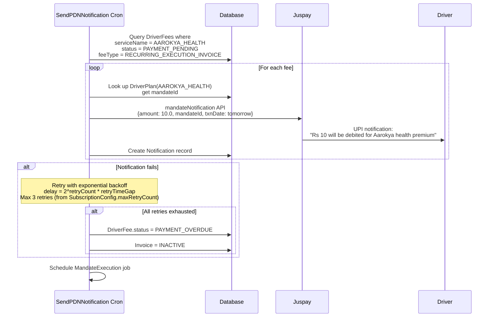
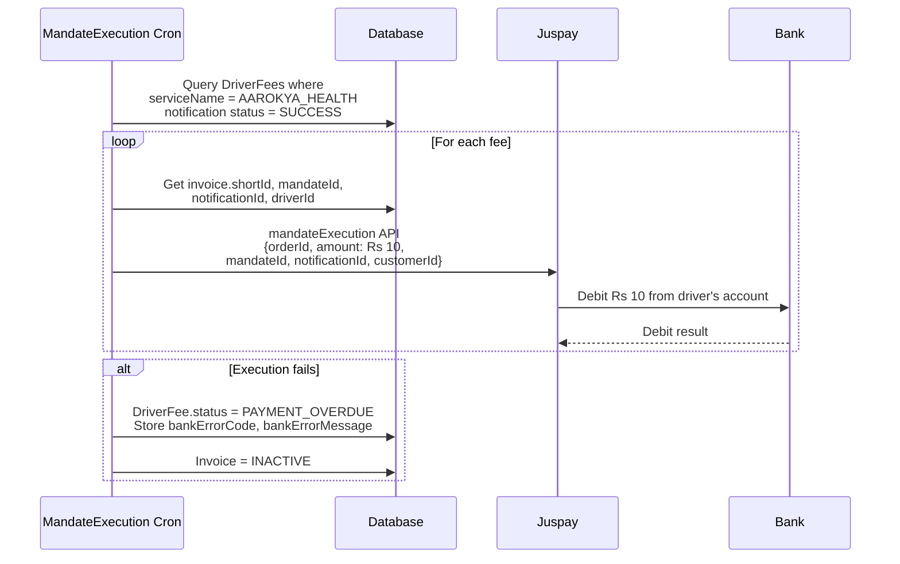
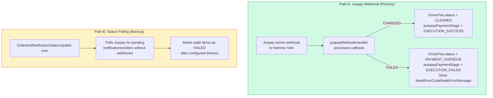
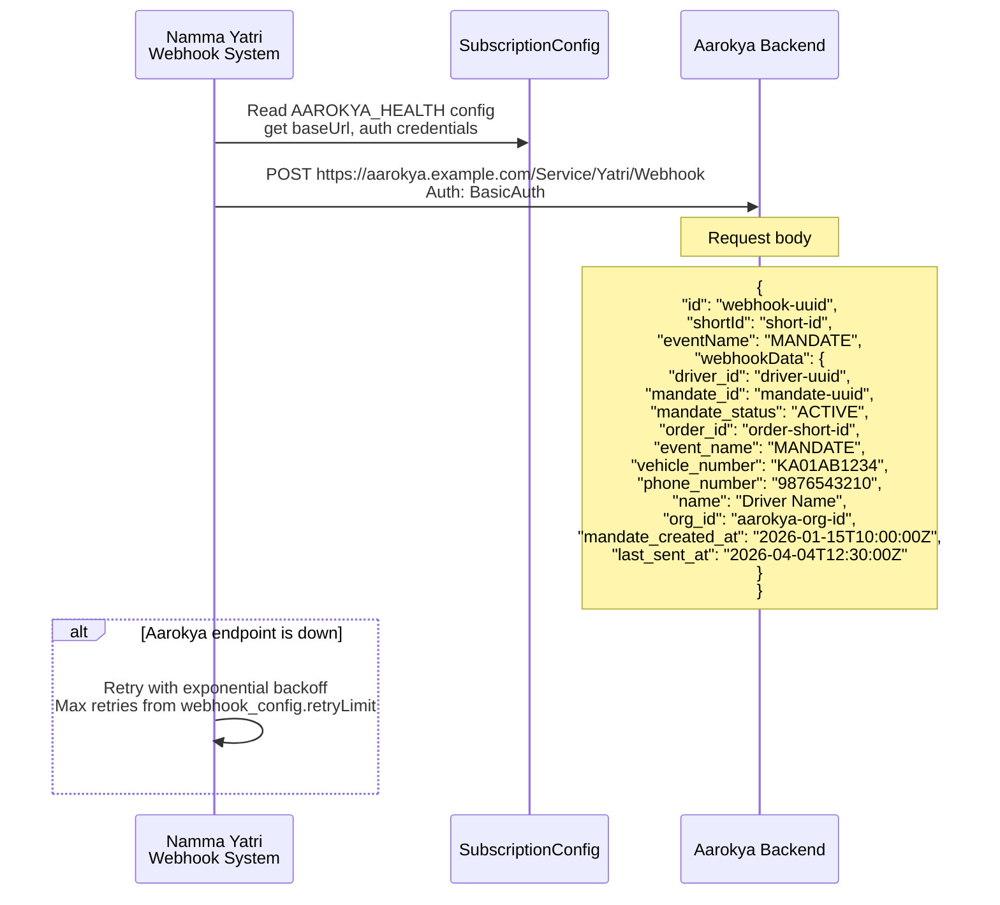

## Payment Lifecycle Overview

After enrollment, Namma Yatri's existing cron infrastructure handles the entire daily payment cycle automatically. No external triggers are needed.

## Step 1: Daily Fee Generation

Runs automatically every day via Namma Yatri's `CalculateDriverFees` scheduled job.

<Info>
This step requires a code change in Namma Yatri — one line added to the fee calculator to handle the `AAROKYA_HEALTH` service name. All other steps use existing code with zero modifications.
</Info>

## Step 2: Pre-Debit Notification (PDN)

Runs automatically after fee generation. This is **mandated by NPCI/UPI** — a notification must be sent to the driver before any auto-debit.

## Step 3: Mandate Execution (Bank Debit)

Runs automatically after PDN succeeds. This is where the actual money transfer happens.

## Step 4: Payment Confirmation

Juspay confirms whether the bank debit succeeded or failed. There are two paths:

## Step 5: Status Webhook to Aarokya

After payment confirmation, Namma Yatri's existing external webhook system delivers the result to Aarokya.

### Webhook Payload Reference

| Field | Type | Description |
|-------|------|-------------|
| `id` | string | Unique webhook event ID |
| `shortId` | string | Short identifier |
| `eventName` | string | Event type (e.g., `MANDATE`) |
| `webhookData.driver_id` | string | Driver's unique ID |
| `webhookData.mandate_id` | string | UPI mandate ID |
| `webhookData.mandate_status` | string | `ACTIVE`, `CANCELLED_PSP`, etc. |
| `webhookData.order_id` | string | Payment order ID |
| `webhookData.event_name` | string | Event type within webhook data |
| `webhookData.vehicle_number` | string | Driver's vehicle registration |
| `webhookData.phone_number` | string | Driver's phone number |
| `webhookData.name` | string | Driver's name |
| `webhookData.org_id` | string | Aarokya organization ID |
| `webhookData.mandate_created_at` | datetime | When the mandate was created |
| `webhookData.last_sent_at` | datetime | Timestamp of this webhook delivery |
