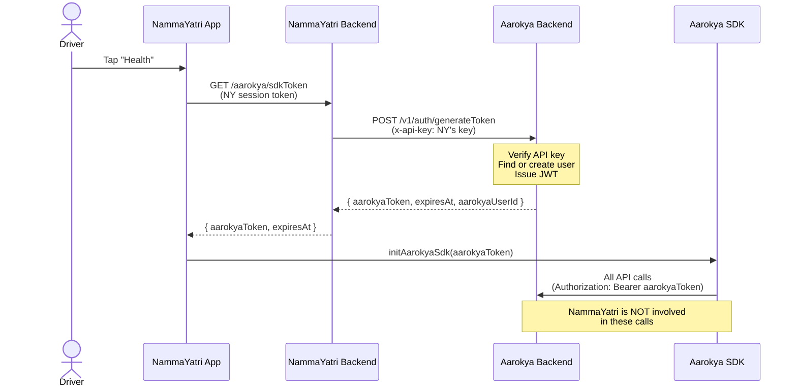
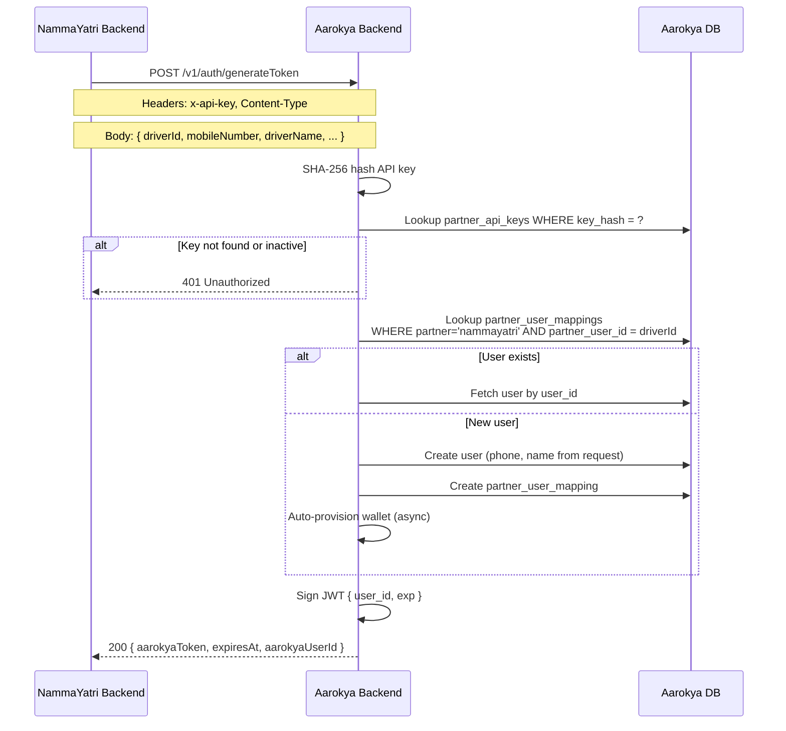
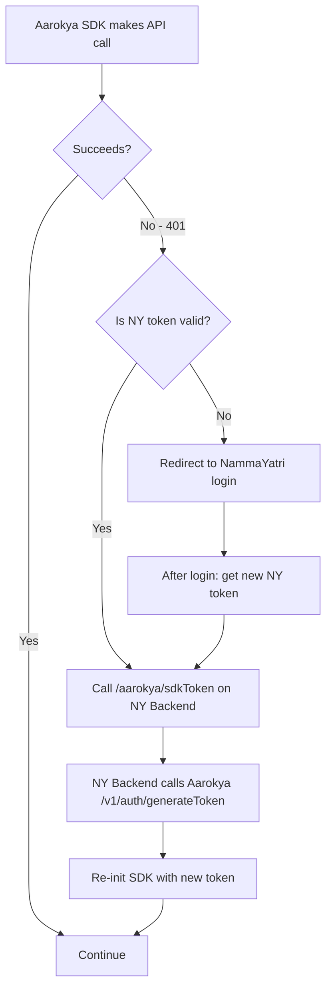
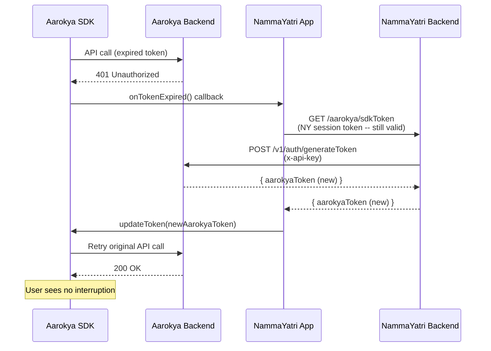
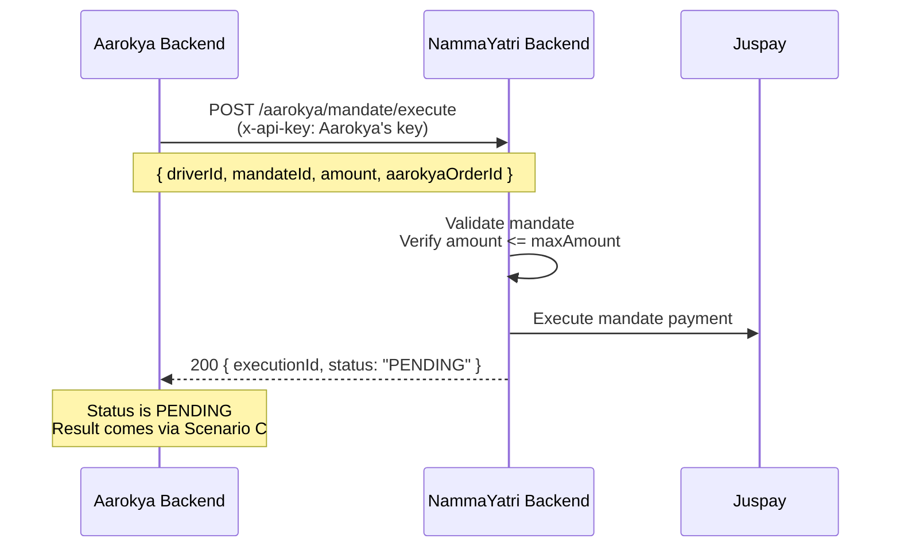
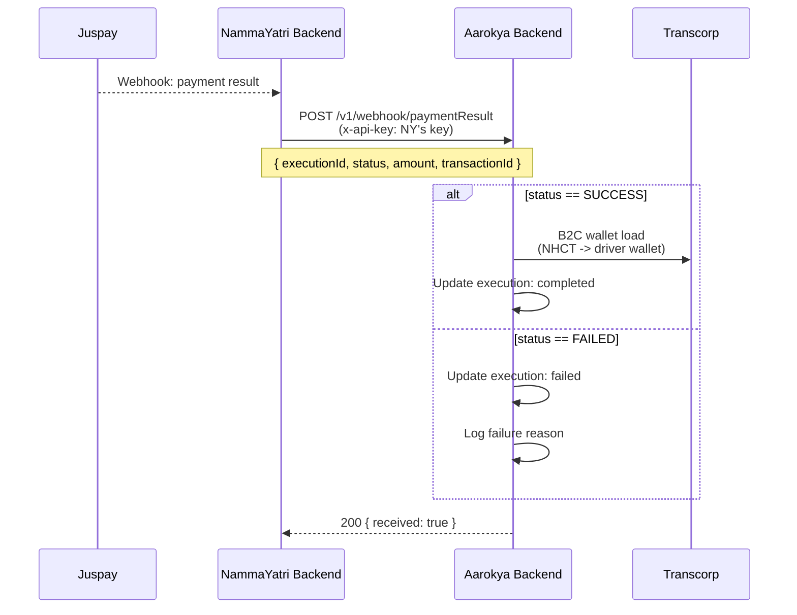
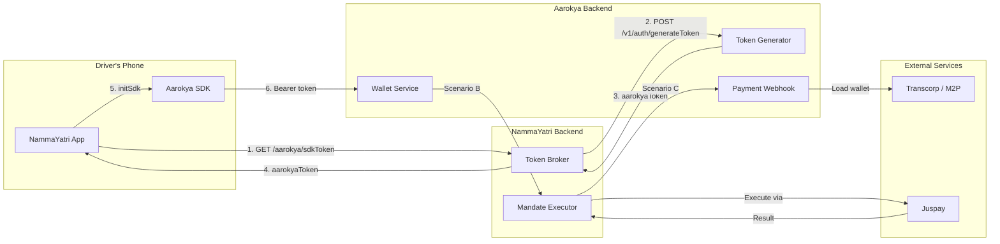

## Overview

Aarokya is a **native SDK** embedded inside partner apps (e.g., NammaYatri). Users are already authenticated in the partner app. When they open the Aarokya section, the partner's backend requests an SDK token from Aarokya's backend on the user's behalf.

There are **two separate auth mechanisms**:

1. **Partner-to-Aarokya (S2S)** -- API key authentication for backend-to-backend calls
2. **SDK-to-Aarokya** -- JWT token for SDK-to-backend calls (issued via the S2S flow)



---

## Auth Relationships

| Relationship | Credential | Issuer | Used For |
|---|---|---|---|
| Driver -> NammaYatri | NY session token | NammaYatri | User already logged in |
| NammaYatri -> Aarokya | `x-api-key` (NY key) | Aarokya (pre-shared) | Token generation, payment webhooks |
| Aarokya -> NammaYatri | `x-api-key` (AK key) | NammaYatri (pre-shared) | Mandate execution |
| Driver -> Aarokya (via SDK) | Aarokya JWT | Aarokya Backend | All wallet, insurance, profile calls |

<Info>
  Two separate API keys exist -- one in each direction. NammaYatri gives Aarokya a key, and Aarokya gives NammaYatri a key. Each side stores only the **hash** of the key they issued.
</Info>

---

## Token Generation Flow

When a driver opens the Health section for the first time (or after token expiry):



### Request

```bash
POST /v1/auth/generateToken
```

```json
{
  "driver_id": "driver_id_456",
  "mobile_number": "+919876543210",
  "driver_name": "Ramesh Kumar",
  "merchant_id": "merchant_id_789",
  "city": "Bangalore",
  "token_validity_seconds": 3600
}
```

**Headers:**
- `x-api-key: <NammaYatri's API key with Aarokya>`
- `Content-Type: application/json`

### Response

```json
{
  "aarokya_token": "eyJhbGciOiJIUzI1NiJ9...",
  "expires_at": "2026-04-03T15:00:00Z",
  "aarokya_user_id": "aark_user_001"
}
```

---

## Token Expiry and Refresh

Aarokya SDK tokens are **short-lived** (1-4 hours). NammaYatri session tokens are **long-lived** (7-30 days). This means silent token refresh is the common case.

### Expiry Matrix

| | Aarokya Token Valid | Aarokya Token Expired |
|---|---|---|
| **NY Token Valid** | Happy path -- SDK works | Silent refresh (common) |
| **NY Token Expired** | SDK works but can't refresh | Both dead -- re-login required |



### Silent Refresh Flow (Case 2 -- Most Common)



### Proactive Refresh (Recommended)

Don't wait for a 401. Refresh proactively before each SDK interaction:

```text
if (aarokyaTokenExpiresIn < 5 minutes):
    refresh token in background
    update SDK with new token
then proceed with SDK action
```

---

## Token Lifetimes

| Token | Lifetime | Refresh Mechanism |
|---|---|---|
| Aarokya SDK token (JWT) | 1-4 hours (configurable) | NammaYatri Backend calls `generateToken` again |
| NammaYatri session | 7-30 days | Not Aarokya's concern |
| Partner API keys | No expiry | Manual rotation, revoke old key |

<Tip>
  Set Aarokya token lifetime shorter than NammaYatri token lifetime. With NY token = 7 days and Aarokya token = 1 hour, the SDK can silently refresh ~168 times before the driver ever needs to re-login to NammaYatri.
</Tip>

---

## Backend-to-Backend Scenarios

There are exactly **3 scenarios** where the two backends communicate:

### Scenario A: Token Generation (NY -> Aarokya)

Driver opens Health section. NammaYatri asks Aarokya for an SDK token.

- **Direction:** NammaYatri Backend -> Aarokya Backend
- **Endpoint:** `POST /v1/auth/generateToken`
- **Auth:** `x-api-key` (NammaYatri's key with Aarokya)

### Scenario B: Mandate Execution (Aarokya -> NY)

Aarokya triggers a recurring health savings deduction via mandate autopay.

- **Direction:** Aarokya Backend -> NammaYatri Backend
- **Endpoint:** `POST /aarokya/mandate/execute` (on NY side)
- **Auth:** `x-api-key` (Aarokya's key with NammaYatri)



<Warning>
  The response status is always `PENDING`. Mandate execution is async -- Juspay takes time to process. The actual result arrives via Scenario C (webhook).
</Warning>

### Scenario C: Payment Result Webhook (NY -> Aarokya)

After Juspay processes the mandate, NammaYatri forwards the result to Aarokya.

- **Direction:** NammaYatri Backend -> Aarokya Backend
- **Endpoint:** `POST /v1/webhook/paymentResult`
- **Auth:** `x-api-key` (NammaYatri's key with Aarokya)



---

## API Key Security

<CardGroup cols={2}>
  <Card title="Key Storage" icon="database" color="#16a34a">
    Each side stores only the **SHA-256 hash** of the key they issued. The plaintext key is given to the partner during onboarding and never stored by the issuer.
  </Card>
  <Card title="Key Rotation" icon="arrows-rotate" color="#3b82f6">
    Multiple active keys per partner are supported. To rotate: issue a new key, partner updates their config, then revoke the old key. Zero-downtime rotation.
  </Card>
  <Card title="Transmission" icon="lock" color="#0891b2">
    API keys are sent in the `x-api-key` header over HTTPS. Never in URL parameters, request body, or logs.
  </Card>
  <Card title="Scope" icon="shield-check" color="#7c3aed">
    Each key is scoped to a specific partner (`PartnerName` enum). A NammaYatri key cannot be used to impersonate another partner.
  </Card>
</CardGroup>

---

## Complete System Diagram


