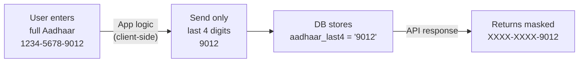

<Info>
  **Authentication:** All endpoints require `Authorization: Bearer <access_token>`.
</Info>

## Overview

The User Profile module manages all personal details. Auth creates the base `users` row on first login — this module reads and writes the profile fields on top of that.

<CardGroup cols={2}>
  <Card title="Updatable Fields" icon="pen" color="#3b82f6">
    `first_name`, `last_name`, `email`, `dob`, `gender`, `address`, `occupation`, `employer`
  </Card>
  <Card title="Immutable Fields" icon="lock" color="#dc2626">
    `phone` (identity, set by Auth), `aadhaar` (set via separate KYC flow — returns 400 if attempted via PATCH)
  </Card>
</CardGroup>

---

## GET /user/profile

Fetches the authenticated user's complete profile. The `profile_complete` boolean is computed server-side on every request.

### What happens server-side

1. Extracts `user_id` from JWT claims
2. Queries `users WHERE id = user_id`
3. Computes `profile_complete = (first_name IS NOT NULL AND last_name IS NOT NULL)`
4. Returns the profile with Aadhaar masked as `XXXX-XXXX-{last4}`

<ParamField header="Authorization" type="string" required>
  `Bearer <access_token>`
</ParamField>

<CodeGroup>
```bash Request
curl http://localhost:8080/user/profile \
  -H 'Authorization: Bearer eyJhbGci...'
```

```json Response 200 — complete profile
{
  "user_id": "550e8400-e29b-41d4-a716-446655440000",
  "phone": "+919876543210",
  "first_name": "Priya",
  "last_name": "Kumar",
  "email": "priya@example.com",
  "dob": "1990-05-15",
  "gender": "FEMALE",
  "aadhaar": "XXXX-XXXX-1234",
  "address": "12, MG Road, Bengaluru",
  "occupation": "Delivery Partner",
  "employer": "Namma Yatri",
  "profile_complete": true
}
```

```json Response 200 — new user (no profile filled)
{
  "user_id": "550e8400-e29b-41d4-a716-446655440000",
  "phone": "+919876543210",
  "first_name": null,
  "last_name": null,
  "email": null,
  "dob": null,
  "gender": null,
  "aadhaar": null,
  "address": null,
  "occupation": null,
  "employer": null,
  "profile_complete": false
}
```

```json Response 401 — invalid token
{
  "error": "INVALID_TOKEN",
  "message": "Access token is invalid or has expired",
  "status_code": 401
}
```
</CodeGroup>

<ResponseField name="user_id" type="string (UUID)" required>
  Permanent unique identifier for the user.
</ResponseField>

<ResponseField name="phone" type="string" required>
  10-digit mobile number with `+91` prefix. Set by Auth — never changes.
</ResponseField>

<ResponseField name="aadhaar" type="string">
  Always returned as `XXXX-XXXX-{last4}`. The full Aadhaar number is **never** returned. Only the last 4 digits are stored in the database.
</ResponseField>

<ResponseField name="profile_complete" type="boolean" required>
  `true` when both `first_name` and `last_name` are non-null and non-empty. Used by the app to decide whether to show the onboarding screen.
</ResponseField>

<ResponseField name="dob" type="string (ISO 8601 date)">
  Format: `YYYY-MM-DD`. Null if not set. Used for insurance premium age-loading calculation.
</ResponseField>

<ResponseField name="gender" type="string (enum)">
  One of `MALE`, `FEMALE`, `OTHER`. Null if not set. See enum values below.
</ResponseField>

<ResponseField name="occupation" type="string (enum)">
  One of the `OccupationType` values. Null if not set. See full list below.
</ResponseField>

---

## PATCH /user/profile

Partially updates the user's profile. Only the fields included in the request body are updated — all other fields remain unchanged.

### What happens server-side

1. Extracts `user_id` from JWT claims
2. Validates all provided fields against their respective constraints
3. Checks that no immutable fields (`phone`, `aadhaar`) are included — returns `400` if so
4. Applies a partial SQL `UPDATE` (only non-null fields from the request body)
5. Recomputes `profile_complete`
6. Returns the full updated profile

### profile_complete Transition

When this PATCH sets both `first_name` and `last_name` for the first time (transitioning `profile_complete` from `false` to `true`), the app should:

1. Dismiss the onboarding screen
2. Persist the `profile_complete: true` state locally
3. Navigate to the home screen

The transition is idempotent — submitting the names again does not change any behaviour.

<CodeGroup>
```bash Request — full profile update
curl -X PATCH http://localhost:8080/user/profile \
  -H 'Authorization: Bearer eyJhbGci...' \
  -H 'Content-Type: application/json' \
  -d '{
    "first_name": "Priya",
    "last_name": "Sharma",
    "dob": "1990-05-15",
    "gender": "FEMALE",
    "address": "12, MG Road, Bengaluru",
    "occupation": "Delivery Partner",
    "employer": "Namma Yatri"
  }'
```

```bash Request — partial update (name only)
curl -X PATCH http://localhost:8080/user/profile \
  -H 'Authorization: Bearer eyJhbGci...' \
  -H 'Content-Type: application/json' \
  -d '{
    "first_name": "Priya",
    "last_name": "Sharma"
  }'
```

```json Response 200
{
  "user_id": "550e8400-e29b-41d4-a716-446655440000",
  "phone": "+919876543210",
  "first_name": "Priya",
  "last_name": "Sharma",
  "dob": "1990-05-15",
  "gender": "FEMALE",
  "occupation": "Delivery Partner",
  "employer": "Namma Yatri",
  "profile_complete": true
}
```

```json Response 400 — attempt to update phone
{
  "error": "IMMUTABLE_FIELD",
  "message": "phone and aadhaar cannot be updated via this endpoint",
  "status_code": 400
}
```

```json Response 400 — invalid date
{
  "error": "INVALID_DATE_FORMAT",
  "message": "dob must be in YYYY-MM-DD format and must be a past date",
  "status_code": 400
}
```

```json Response 400 — invalid gender
{
  "error": "VALIDATION_ERROR",
  "message": "gender: must be one of MALE, FEMALE, OTHER",
  "status_code": 400
}
```

```json Response 400 — invalid occupation
{
  "error": "VALIDATION_ERROR",
  "message": "occupation: must be one of the supported OccupationType values",
  "status_code": 400
}
```
</CodeGroup>

All request body fields are **optional** — send only the fields you want to update.

---

## Field Validation Rules

| Field | Type | Constraints |
|-------|------|-------------|
| `first_name` | string | Max 100 chars; trimmed whitespace |
| `last_name` | string | Max 100 chars; trimmed whitespace |
| `email` | string | Valid RFC 5322 format; max 255 chars |
| `dob` | string | `YYYY-MM-DD`; must be strictly in the past; age 18–100 years |
| `gender` | string (enum) | `MALE` \| `FEMALE` \| `OTHER` |
| `address` | string | Max 500 chars; free text |
| `occupation` | string (enum) | See `OccupationType` list below |
| `employer` | string | Max 100 chars; free text |

---

## Gender Enum Values

| Value | Notes |
|-------|-------|
| `MALE` | |
| `FEMALE` | |
| `OTHER` | Inclusive — covers non-binary, prefer-not-to-say, and all other identities |

---

## OccupationType Enum Values

| Value | Description |
|-------|-------------|
| `Driver` | Cab, auto, or bike taxi driver (Ola, Namma Yatri, Uber, Rapido) |
| `Delivery Partner` | Package or food delivery (Swiggy, Zomato, Blinkit, Amazon, DTDC) |
| `Domestic Worker` | House cleaner, cook, nanny, or care assistant |
| `Construction Worker` | Daily-wage labourer on construction sites |
| `Factory Worker` | Manufacturing or industrial floor worker |
| `Healthcare Worker` | Nursing aide, ASHA/ANM worker, hospital support staff |
| `Retail Worker` | Kirana, mall, or shop employee |
| `Security Guard` | Building, campus, or premises security |
| `Other` | Any gig or informal work not listed above |

---

## PII Policy

### Aadhaar Masking Logic



| PII Field | Stored As | Returned As | Rationale |
|-----------|-----------|-------------|-----------|
| Aadhaar number | Last 4 digits only (`aadhaar_last4`) | `XXXX-XXXX-1234` | Minimises PII footprint; avoids DPDP Act compliance overhead for full national ID storage |
| Phone | `+91XXXXXXXXXX` | As stored | Primary identity anchor |
| Email | Plaintext | As stored | Low-sensitivity; used for notifications |
| Name | Plaintext | As stored | Required for insurance |
| DOB | `DATE` column | `YYYY-MM-DD` string | Sensitive but necessary for age-rated insurance |

<Warning>
  Sending `phone` or `aadhaar` in the PATCH body will return **400 Bad Request**. These are identity fields managed by dedicated flows. Phone is immutable after account creation. Aadhaar is set via a separate KYC flow and cannot be changed via the profile endpoint.
</Warning>
