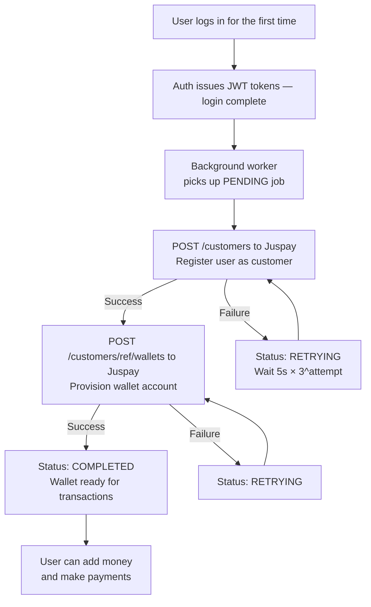
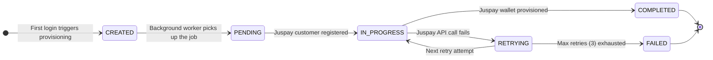
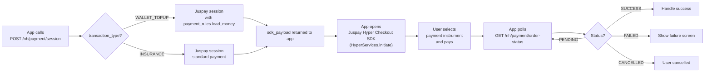

<Info>
  **Authentication:** All endpoints require `Authorization: Bearer <access_token>`.

  **External Dependency:** Juspay (sandbox: `https://sandbox.juspay.in`)
</Info>

## Wallet Provisioning Flow

The wallet is **automatically created** after the user's first login — the app never needs to trigger this.



<Note>
  Wallet creation is **async** — it never blocks the login response. The app should check wallet status before initiating payments. Status transitions: `CREATED` → `PENDING` → `IN_PROGRESS` → `COMPLETED` | `FAILED` | `RETRYING`.
</Note>

---

## Wallet Status State Machine

Understanding wallet status is critical for app UX — the wallet UI should adapt to each state.



| Status | Meaning | App UX Recommendation |
|--------|---------|----------------------|
| `CREATED` | DB row created; Juspay provisioning not started | Show "Setting up your wallet..." spinner |
| `PENDING` | Background worker picked up job | Show "Setting up your wallet..." spinner |
| `IN_PROGRESS` | Juspay customer created; wallet creation in flight | Show "Almost ready..." |
| `COMPLETED` | Wallet fully active in Juspay | Show balance and top-up button |
| `RETRYING` | Transient failure; retry in progress | Show "Hang on, setting up..." |
| `FAILED` | All retries exhausted; manual intervention needed | Show "Wallet setup failed" with support contact |

---

## GET /wallet

Returns the authenticated user's wallet summary.

<CodeGroup>
```bash Request
curl http://localhost:8080/wallet \
  -H 'Authorization: Bearer eyJhbGci...'
```

```json Response 200 — wallet ready
{
  "wallet_id": "wlm_jUT7wpiZAkpFFvaT",
  "creation_status": "COMPLETED",
  "wallet_status": "ACTIVE",
  "current_balance": 1500.00,
  "payment_method": "CUMTA_WALLET",
  "last_balance_refreshed_at": "2025-06-14T10:30:00Z"
}
```

```json Response 200 — wallet still provisioning
{
  "wallet_id": null,
  "creation_status": "PENDING",
  "wallet_status": null,
  "current_balance": null,
  "payment_method": null,
  "last_balance_refreshed_at": null
}
```

```json Response 200 — provisioning failed
{
  "wallet_id": null,
  "creation_status": "FAILED",
  "wallet_status": null,
  "current_balance": null
}
```
</CodeGroup>

<ResponseField name="wallet_id" type="string">
  The **Transcorp wallet identifier** assigned by Juspay during provisioning (e.g. `wlm_jUT7wpiZAkpFFvaT`). This is the `transcorp_wallet_id` stored internally. Use this value as the `wallet_id` path parameter in all subsequent wallet endpoints (`/balance`, `/status`, `/transactions/history/{n}`). Null until `creation_status` = `COMPLETED`.
</ResponseField>

<ResponseField name="creation_status" type="string (enum)" required>
  Internal provisioning state: `CREATED` | `PENDING` | `IN_PROGRESS` | `COMPLETED` | `RETRYING` | `FAILED`
</ResponseField>

<ResponseField name="wallet_status" type="string">
  Live Juspay status: `ACTIVE` | `BLOCKED`. Null until `COMPLETED`.
</ResponseField>

<ResponseField name="current_balance" type="number">
  Balance in INR. Null until wallet is `COMPLETED`. Cached locally — use the `/balance` endpoint for a live Juspay query.
</ResponseField>

---

## POST /wallet (Idempotent Create)

Explicitly creates a wallet for the authenticated user. This is idempotent — safe to call multiple times. The wallet is normally auto-created on first login, so this endpoint is a fallback for edge cases (e.g. first login failed mid-provisioning).

<CodeGroup>
```bash Request
curl -X POST http://localhost:8080/wallet \
  -H 'Authorization: Bearer eyJhbGci...'
```

```json Response 201 — wallet just created
{
  "user_id": "a3f8c2d1-...",
  "transcorp_wallet_id": "tcx_550e8400-...",
  "balance": 0,
  "wallet_status": "Created",
  "wallet_status_transcorp": "Unknown",
  "created": true
}
```

```json Response 200 — wallet already exists
{
  "user_id": "a3f8c2d1-...",
  "transcorp_wallet_id": "tcx_550e8400-...",
  "balance": 0,
  "wallet_status": "Created",
  "wallet_status_transcorp": "Unknown",
  "created": false
}
```
</CodeGroup>

---

## GET /wallet/{wallet_id}/balance

Fetches **fresh balance from Juspay** — not a cached value. Use this when displaying the wallet balance screen to ensure the user sees a real-time figure.

<Note>
  The `wallet_id` path parameter is the **`transcorp_wallet_id`** — the wallet identifier on Transcorp's PPI system, returned by `GET /wallet` in the `wallet_id` field (e.g. `wlm_jUT7wpiZAkpFFvaT`). This ID is assigned by Juspay/Transcorp when the wallet is first provisioned and stored in Aarokya's database. It is null until `creation_status` = `COMPLETED`.
</Note>

<Note>
  This endpoint makes a live API call to Juspay. It may be 200–500ms slower than other endpoints. Use the balance from `GET /wallet` (cached) for non-balance screens and this endpoint only for the balance screen.
</Note>

<CodeGroup>
```bash Request
curl "http://localhost:8080/wallet/wlm_jUT7wpiZAkpFFvaT/balance" \
  -H 'Authorization: Bearer eyJhbGci...'
```

```json Response 200
{
  "wallet_id": "wlm_jUT7wpiZAkpFFvaT",
  "current_balance": 1500.00,
  "payment_method": "CUMTA_WALLET",
  "payment_method_type": "WALLET",
  "last_refreshed": "2025-06-14T10:30:00Z",
  "linked": true
}
```

```json Response 404 — wallet not yet provisioned
{
  "error": "RESOURCE_NOT_FOUND",
  "message": "Wallet not found or not yet provisioned",
  "status_code": 404
}
```
</CodeGroup>

---

## GET /wallet/{wallet_id}/status

Returns the wallet's current provisioning status enum only. Lightweight alternative to `GET /wallet` when you only need to poll the status.

<Note>
  The `wallet_id` path parameter is the **`transcorp_wallet_id`** from `GET /wallet`. See the balance endpoint note above for details.
</Note>

<CodeGroup>
```bash Request
curl "http://localhost:8080/wallet/tcx_550e8400-.../status" \
  -H 'Authorization: Bearer eyJhbGci...'
```

```json Response 200
{
  "wallet_id": "tcx_550e8400-...",
  "wallet_status": "Completed",
  "wallet_status_transcorp": "ACTIVE"
}
```
</CodeGroup>

---

## GET /wallet/{wallet_id}/transactions/history/{number_of_days}

Returns recent transaction history. The `number_of_days` path parameter filters by recency. The `wallet_id` is the **`transcorp_wallet_id`** from `GET /wallet`.

| Value | Behaviour |
|-------|-----------|
| `0` | All history (no time filter) |
| `1–365` | Entries from the last N days |
| `> 365` | Returns `400 NUMBER_OF_DAYS_OUT_OF_RANGE` |
| `< 0` | Returns `400 NUMBER_OF_DAYS_OUT_OF_RANGE` |

Maximum **10 entries** are returned per call (stub limit — paginated results will be added with live Juspay integration).

<CodeGroup>
```bash Last 30 days
curl "http://localhost:8080/wallet/tcx_550e8400-.../transactions/history/30" \
  -H 'Authorization: Bearer eyJhbGci...'
```

```bash All history
curl "http://localhost:8080/wallet/tcx_550e8400-.../transactions/history/0" \
  -H 'Authorization: Bearer eyJhbGci...'
```

```json Response 200
{
  "wallet_id": "tcx_550e8400-...",
  "transactions": [
    {
      "transaction_id": "txn_001",
      "transaction_status": "Success",
      "amount": 50000,
      "currency": "INR",
      "type": "CREDIT",
      "description": "Wallet top-up via UPI",
      "occurred_at": { "seconds": 1750000000 }
    },
    {
      "transaction_id": "txn_002",
      "transaction_status": "Success",
      "amount": 14160,
      "currency": "INR",
      "type": "DEBIT",
      "description": "Insurance premium — NH Comprehensive Family",
      "occurred_at": { "seconds": 1749800000 }
    }
  ]
}
```

```json Response 400 — invalid days value
{
  "error": "NUMBER_OF_DAYS_OUT_OF_RANGE",
  "message": "number_of_days must be between 0 and 365",
  "status_code": 400
}
```
</CodeGroup>

---

## POST /nh/payment/session — Create Payment Session

Single endpoint for both **wallet top-up** and **insurance purchase**. The `transaction_type` field determines the Juspay session configuration.

### Payment Flow



### Key Differences Between Transaction Types

| | WALLET_TOPUP | INSURANCE |
|--|--------------|-----------|
| Juspay session config | Includes `payment_rules.load_money` | No `payment_rules` |
| Money destination | User's health wallet (Transcorp) | Narayana Health |
| Status check path | `wallet.topup.status` field | Top-level `status` field |
| `CHARGED` maps to | `SUCCESS` via topup status | `SUCCESS` directly |
| Post-success action | Refresh wallet balance display | Call `POST /insurance/purchase` |

<CodeGroup>
```bash Wallet Top-up
curl -X POST http://localhost:8080/nh/payment/session \
  -H 'Authorization: Bearer eyJhbGci...' \
  -H 'Content-Type: application/json' \
  -d '{
    "amount": 1000.00,
    "transaction_type": "WALLET_TOPUP"
  }'
```

```bash Insurance Premium Payment
curl -X POST http://localhost:8080/nh/payment/session \
  -H 'Authorization: Bearer eyJhbGci...' \
  -H 'Content-Type: application/json' \
  -d '{
    "amount": 14160.00,
    "transaction_type": "INSURANCE"
  }'
```

```json Response 200
{
  "order_id": "aarokya-1767808067",
  "payment_url": "https://sandbox.assets.juspay.in/payment-page/order/ordeh_...",
  "sdk_payload": {
    "payload": {
      "clientId": "cumta",
      "orderId": "1767808067",
      "amount": "1000.00",
      "currency": "INR",
      "customerId": "aarokya_550e8400-...",
      "customerEmail": "priya@example.com",
      "customerPhone": "9876543210"
    }
  }
}
```

```json Response 400 — invalid amount
{
  "error": "VALIDATION_ERROR",
  "message": "amount must be greater than 0 and less than 100000",
  "status_code": 400
}
```

```json Response 400 — wallet not ready
{
  "error": "WALLET_NOT_READY",
  "message": "Wallet is not yet provisioned. Please wait and try again.",
  "status_code": 400
}
```
</CodeGroup>

<Tip>
  Pass `sdk_payload` **directly** to `HyperServices.initiate(sdk_payload)` in the React Native app — do not modify it. The Juspay SDK handles all payment instrument selection, UPI deep-linking, and card tokenization internally.
</Tip>

---

## GET /nh/payment/order-status — Poll Order Status

Poll this endpoint until a **terminal status** is returned. The `poll_interval_seconds` field in the response tells you how long to wait before the next poll.

<CodeGroup>
```bash Request
curl "http://localhost:8080/nh/payment/order-status?order_id=aarokya-1767808067" \
  -H 'Authorization: Bearer eyJhbGci...'
```

```json Response — PENDING (keep polling)
{
  "order_id": "aarokya-1767808067",
  "status": "PENDING",
  "transaction_type": "WALLET_TOPUP",
  "amount": 1000.00,
  "currency": "INR",
  "poll_interval_seconds": 5
}
```

```json Response — SUCCESS (stop polling)
{
  "order_id": "aarokya-1767808067",
  "status": "SUCCESS",
  "transaction_type": "WALLET_TOPUP",
  "amount": 1000.00,
  "currency": "INR",
  "poll_interval_seconds": 5
}
```

```json Response — FAILED (stop polling, show error)
{
  "order_id": "aarokya-1767808067",
  "status": "FAILED",
  "transaction_type": "WALLET_TOPUP",
  "amount": 1000.00,
  "currency": "INR",
  "poll_interval_seconds": 5,
  "failure_reason": "Payment declined by bank"
}
```
</CodeGroup>

<ResponseField name="status" type="string (enum)" required>
  `PENDING` | `SUCCESS` | `FAILED` | `CANCELLED`

  - `PENDING` — payment is being processed; keep polling
  - `SUCCESS` — payment confirmed; proceed with post-payment action
  - `FAILED` — payment failed; show failure screen with retry option
  - `CANCELLED` — user cancelled; return to previous screen
</ResponseField>

<ResponseField name="poll_interval_seconds" type="integer" required>
  Seconds to wait before the next poll. Configured via `app_config` table (`PAYMENT_STATUS_POLL_INTERVAL` = `5`). Respect this value — do not poll faster than specified.
</ResponseField>

### Polling Implementation

```typescript
async function pollPaymentStatus(orderId: string): Promise<'SUCCESS' | 'FAILED' | 'CANCELLED'> {
  const MAX_POLLS = 36; // 36 × 5s = 3 minutes max wait
  let polls = 0;

  while (polls < MAX_POLLS) {
    const response = await apiFetch(
      `/nh/payment/order-status?order_id=${orderId}`,
      { headers: { 'Authorization': `Bearer ${accessToken}` } }
    );

    const data = await response.json();

    if (data.status !== 'PENDING') {
      return data.status; // Terminal status
    }

    polls++;
    await sleep(data.poll_interval_seconds * 1000);
  }

  // Timeout — show "payment status unknown" screen
  throw new Error('Payment status check timed out');
}
```

### Post-Payment Actions

After receiving `SUCCESS`, the app must perform a follow-up action depending on `transaction_type`:

| `transaction_type` | `SUCCESS` → | Action |
|--------------------|-------------|--------|
| `WALLET_TOPUP` | Balance updated in Juspay | Call `GET /wallet/{id}/balance` to refresh displayed balance |
| `INSURANCE` | Payment received by NH | Call `POST /insurance/purchase` with the `order_id` to create the policy record |

<Warning>
  For `INSURANCE` payments, never skip the `POST /insurance/purchase` step after payment success. The payment alone does not create a policy — the purchase call is required to issue the policy through Narayana Health's API and store it in Aarokya's database.
</Warning>
