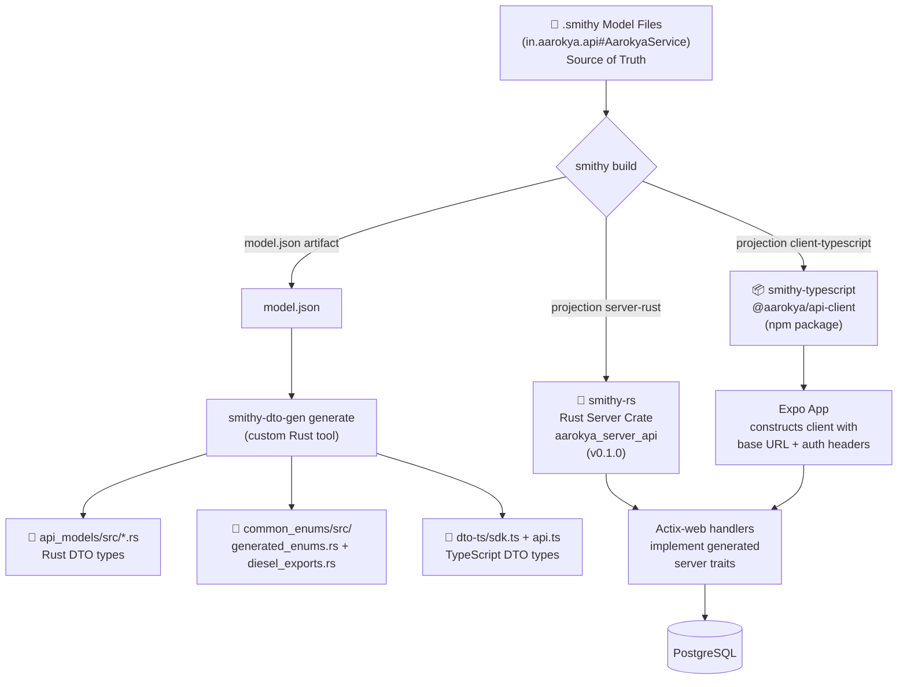
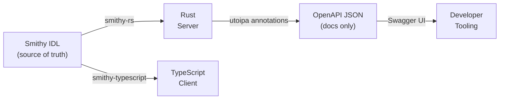

## The Problem We Solved

In a traditional setup, API contracts drift between backend and frontend: the Rust team writes structs, the TypeScript team writes matching types, and they diverge silently. We eliminated this entirely.

<CardGroup cols={3}>
  <Card
    title="Before: 3 Sources of Truth"
    icon="triangle-exclamation"
    color="#dc2626"
  >
    Hand-written Rust structs + hand-written TypeScript types + an OpenAPI doc
    nobody keeps in sync.
  </Card>
  <Card title="After: 1 Source of Truth" icon="circle-check" color="#16a34a">
    The `.smithy` models generate **everything** — Rust server traits, the
    TypeScript SDK, and the shared DTO + enum types.
  </Card>
  <Card title="Zero Drift" icon="lock" color="#0891b2">
    If the Smithy model doesn't compile, nothing builds. Contract mismatch
    caught at compile time, not runtime.
  </Card>
</CardGroup>

---

## Codegen Pipeline Diagram



---

## Step-by-Step

<Steps>
  <Step title="Define the contract in Smithy IDL">
    API shapes, operations, and errors are described once in `.smithy` files under `smithy/model/` (one file per domain — `auth.smithy`, `account.smithy`, `insurance_policy.smithy`, `consultation.smithy`, …). The service is `in.aarokya.api#AarokyaService`, assembled from per-domain namespaces in `main.smithy`.

    ```smithy
    @http(method: "POST", uri: "/auth/generate_token")
    operation GenerateToken {
        input: GenerateTokenInput
        output: GenerateTokenOutput
        errors: [ValidationException]
    }
    ```

  </Step>

  <Step title="Generate the Rust server (smithy-rs)">
    ```bash
    cd smithy
    smithy build --projection server-rust
    ```

    Produces the `aarokya_server_api` Rust crate with generated handler traits. Your Actix-web handlers implement these traits — the compiler enforces the contract.

  </Step>

  <Step title="Generate the TypeScript client">
    ```bash
    cd smithy
    smithy build --projection client-typescript
    # Then patch tsconfig for Yarn 4 compatibility:
    node scripts/patch-typescript-client-tsconfig.mjs
    ```

    Produces `@aarokya/api-client` — a fully typed npm package. The Expo app consumes it directly via a `file:` dependency path.

  </Step>

  <Step title="Generate DTO types + shared enums (Rust + TypeScript)">
    ```bash
    cd smithy-codegen
    cargo run --release -- generate --emit-lib \
      --common-enums-out ../backend/crates/common_enums/src \
      --ts-sdk-out ../backend/smithy-api-model-generated/dto-ts/sdk.ts
    ```

    The custom `smithy-dto-gen` tool reads `model.json` and emits:
    - `backend/crates/api_models/src/*.rs` — per-domain Rust DTO modules
    - `backend/crates/common_enums/src/generated_enums.rs` + `diesel_exports.rs` — shared enums
    - `backend/smithy-api-model-generated/dto-ts/sdk.ts` (and `api.ts`) — TypeScript types

    In practice you run the whole thing with **`just gen`** (smithy build → `smithy-dto-gen generate` → `rustfmt` → `npm install`).

  </Step>

  <Step title="OpenAPI docs (separate, from Rust annotations)">
    The Rust backend uses **utoipa** to generate OpenAPI 3.1 from code annotations. This powers the Swagger UI at `/api_docs/ui` and is independent of the Smithy codegen pipeline.

    ```bash
    GET /api_docs/openapi.json  →  raw OpenAPI spec
    GET /api_docs/ui            →  Swagger UI
    ```

  </Step>
</Steps>

---

## Build Matrix

| Projection          | Maven Plugin                           | Output                            | Used By               |
| ------------------- | -------------------------------------- | --------------------------------- | --------------------- |
| `server-rust`       | `codegen-server:0.1.6`                 | Rust crate with server traits     | Actix-web backend     |
| `client-typescript` | `smithy-aws-typescript-codegen:0.47.0` | npm package `@aarokya/api-client` | Expo React Native app |
| `smithy-dto-gen`    | `cargo run` (custom Rust binary)       | `api_models/*.rs`, `common_enums`, `dto-ts/sdk.ts` | Both ends |

---

## Why No OpenAPI in Codegen?

<Note>
  Smithy generates Rust server code and TypeScript clients **directly**, bypassing OpenAPI entirely in the codegen path. OpenAPI is only generated from Rust code annotations (via utoipa) — separately — for documentation/developer tooling purposes.

This means the Smithy model is the authoritative contract, not an OpenAPI document that could drift.

</Note>



See [ADR-001: Smithy as IDL](/decisions/adr-001-smithy) and [ADR-002: Rust Stack](/decisions/adr-002-rust-stack) for the full reasoning.
