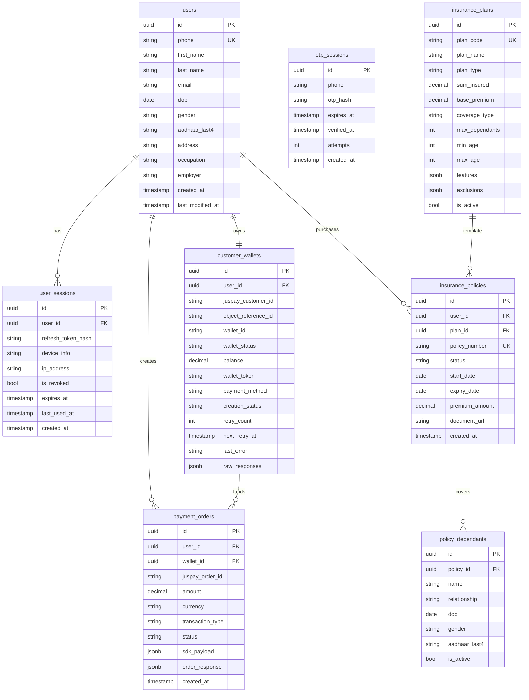
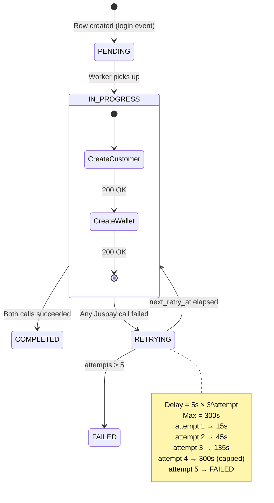
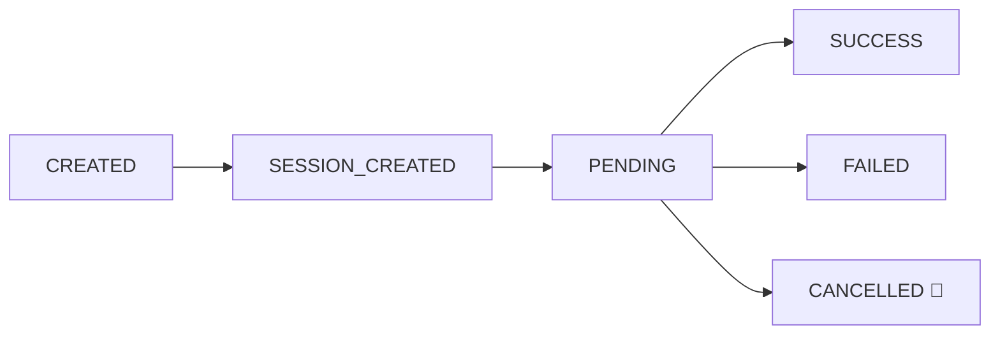

## Entity Relationship Diagram

---

## Domain Ownership

<CardGroup cols={2}>
  <Card title="Auth owns" icon="lock" color="#f59e0b">
    - `users` — creates row on first login
    - `otp_sessions` — created on trigger, invalidated on verify
    - `user_sessions` — one per device login, revoked on logout
  </Card>
  <Card title="User Profile reads/writes" icon="user" color="#3b82f6">
    - `users` — profile fields only (`first_name`, `last_name`, `email`, `dob`, `gender`, `address`, `occupation`, `employer`)
    - **Cannot write:** `phone`, `aadhaar` (identity fields owned by Auth)
  </Card>
  <Card title="Wallet owns" icon="wallet" color="#16a34a">
    - `customer_wallets` — one per user, creation status tracked here
    - `payment_orders` — co-owned with Insurance for the payment session
  </Card>
  <Card title="Insurance owns" icon="file-medical" color="#ec4899">
    - `insurance_plans` — seeded catalog from Narayana Health
    - `insurance_policies` — purchased policies
    - `policy_dependants` — family members under a policy
  </Card>
</CardGroup>

---

## PII Storage Policy

<Warning>
  These rules are **non-negotiable** and enforced at the application layer.
</Warning>

| Field | Storage Rule | API Response |
|-------|-------------|-------------|
| `phone` | Stored as `+91XXXXXXXXXX` | Returned as-is |
| `aadhaar` | **Last 4 digits only** stored in DB | Returned as `XXXX-XXXX-1234` |
| `refresh_token` | **SHA-256 hash** stored — never plaintext | Never returned |
| `otp` | **Hash** stored — never plaintext | Never returned |
| `email` | Plaintext, optional | Returned if set |
| Wallet responses | Full Juspay JSON stored as **JSONB blob** for debugging | Internal only |

---

## Wallet Creation State Machine

---

## Payment Order Lifecycle

| Status | Triggered By |
|--------|-------------|
| `CREATED` | App calls `/nh/payment/session` |
| `SESSION_CREATED` | Backend gets `sdk_payload` from Juspay |
| `PENDING` | App polling, Juspay not yet terminal |
| `SUCCESS` | Juspay returns `CHARGED` (insurance) or `wallet.topup.status = SUCCESS` |
| `FAILED` | Juspay returns `FAILED` |
| `CANCELLED` | User cancels in SDK |
