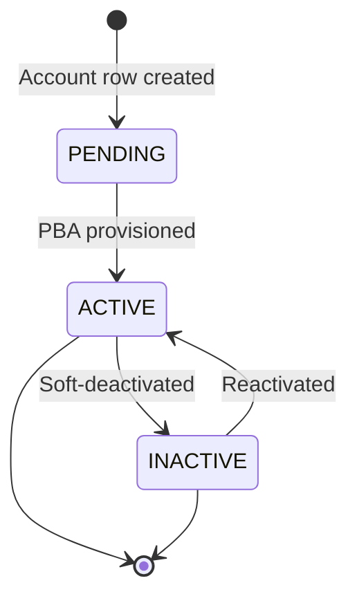
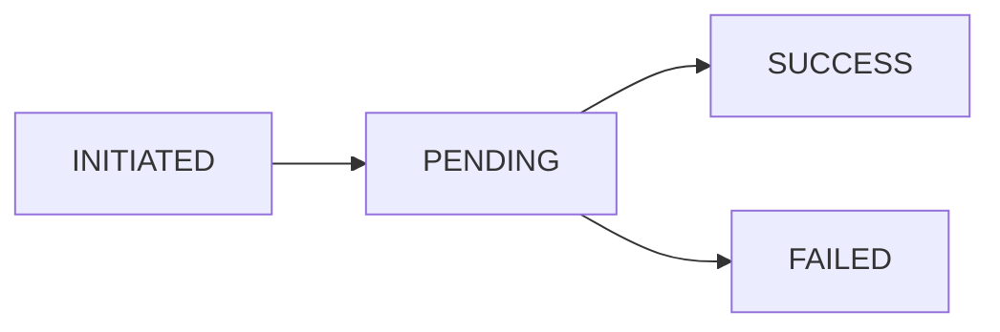

## Entity Relationship Diagram

IDs follow a strict convention: `users.id` is a 12-digit numeric `VARCHAR(12)`; every other entity uses a native PostgreSQL `uuid` (v7). All monetary columns are `BIGINT` minor units (INR paise). The schema below is a subset focused on relationships — the authoritative definition is `backend/crates/diesel_models/src/schema.rs`.

```mermaid
erDiagram
    users {
        varchar id PK "12-digit numeric"
        varchar phone_number
        varchar phone_country_code
        varchar first_name
        varchar last_name
        varchar email
        date dob
        Gender gender
        jsonb address
        IdProofType id_proof_type
        varchar id_proof_number
        UserStatus status
        timestamp created_at
        timestamp last_modified_at
    }

    accounts {
        uuid id PK
        varchar external_account_id
        AccountStatus status
        AccountType account_type
        jsonb account_details
        varchar holder "user_id or sponsor_id (URN)"
        timestamp created_at
        timestamp last_modified_at
    }

    dependants {
        uuid id PK
        varchar primary_user_id FK
        Relationship relationship
        Salutation salutation
        varchar first_name
        varchar last_name
        date date_of_birth
        Gender gender
        DependantStatus status
        uuid previous_version_id FK
        timestamp created_at
        timestamp last_modified_at
    }

    benefit_providers {
        uuid id PK
        varchar name
        varchar slug
        BenefitProviderStatus status
        timestamp created_at
        timestamp last_modified_at
    }

    benefits {
        uuid id PK
        varchar name
        text description
        BenefitType benefit_type
        uuid provider_id FK
        jsonb benefit_details
        BenefitStatus status
        timestamp created_at
        timestamp last_modified_at
    }

    insurance_policies {
        uuid id PK
        varchar primary_user_id FK
        uuid benefit_id FK
        varchar external_policy_id
        date start_date
        date end_date
        uuidarray dependant_ids
        varchar plan_code
        jsonb premium_amounts
        PolicyStatus status
        jsonb nominee_details
        jsonb questionnaire
        timestamp created_at
        timestamp last_modified_at
    }

    consultations {
        uuid id PK
        varchar primary_user_id FK
        uuid dependant_id FK
        uuid benefit_id FK
        varchar external_reference_id
        jsonb chat_blob
        ConsultationStatus status
        timestamp created_at
        timestamp last_modified_at
    }

    mandates {
        uuid id PK
        varchar mandate_id "external"
        bigint amount
        bigint max_amount
        MandateFrequency frequency
        MandateStatus mandate_status
        uuid account_id FK
        varchar user_id FK
        Currency currency
        varchar job_id
        timestamp created_at
        timestamp last_modified_at
    }

    mandate_executions {
        uuid id PK
        uuid mandate_id FK
        bigint amount
        Currency currency
        MandateExecutionStatus status
        varchar job_execution_id UK
        uuid order_id FK
        timestamp created_at
        timestamp last_modified_at
    }

    orders {
        uuid id PK
        bigint amount
        Currency currency
        varchar external_status
        uuid account_id FK
        varchar user_id FK
        OrderStatus status
        varchar source "self_contribution or sponsor URN"
        varchar wallet_txn_data
        timestamp created_at
        timestamp last_modified_at
    }

    benefit_provider_orders {
        uuid id PK
        varchar user_id FK
        uuid account_id FK
        uuid benefit_provider_id FK
        varchar benefit_entity_id "polymorphic URN"
        varchar external_order_id
        bigint amount
        Currency currency
        timestamp created_at
        timestamp last_modified_at
    }

    benefit_entities {
        uuid entity_id PK "= policy.id or consultation.id"
        uuid benefit_id FK
        BenefitType entity_type
        varchar user_id FK
        timestamp created_at
    }

    mrns {
        uuid id PK
        varchar primary_user_id FK
        uuid dependant_id FK
        jsonb external_mrn
        uuid benefit_provider_id FK
        MrnStatus status
        timestamp created_at
        timestamp last_modified_at
    }

    sponsors {
        uuid id PK
        SponsorKind sponsor_kind
        varchar name
        varchar slug
        SponsorStatus status
        varchar pan
        jsonb address
        jsonb sponsor_details
        timestamp created_at
        timestamp last_modified_at
    }

    users ||--o{ dependants : "primary_user_id"
    users ||--o{ insurance_policies : "primary_user_id"
    users ||--o{ consultations : "primary_user_id"
    users ||--o{ orders : "user_id"
    users ||--o{ mandates : "user_id"
    users ||--o{ benefit_provider_orders : "user_id"
    users ||--o{ benefit_entities : "user_id"
    users ||--o{ mrns : "primary_user_id"
    dependants ||--o{ consultations : "dependant_id"
    dependants ||--o{ mrns : "dependant_id"
    benefit_providers ||--o{ benefits : "provider_id"
    benefit_providers ||--o{ mrns : "benefit_provider_id"
    benefit_providers ||--o{ benefit_provider_orders : "benefit_provider_id"
    benefits ||--o{ insurance_policies : "benefit_id"
    benefits ||--o{ consultations : "benefit_id"
    benefits ||--o{ benefit_entities : "benefit_id"
    accounts ||--o{ orders : "account_id"
    accounts ||--o{ mandates : "account_id"
    accounts ||--o{ benefit_provider_orders : "account_id"
    mandates ||--o{ mandate_executions : "mandate_id"
    orders ||--o{ mandate_executions : "order_id"
```

<Note>
  `benefit_entities.entity_id` and `benefit_provider_orders.benefit_entity_id` are **polymorphic** — they reference either an `insurance_policies.id` or a `consultations.id` (URN-encoded on the order). There is no database foreign key on those columns; referential integrity is enforced at write time.
</Note>

---

## Domain Ownership

<CardGroup cols={2}>
  <Card title="Auth / User owns" icon="lock" color="#f59e0b">
    - `users` — created at provisioning by `POST /auth/token`
    - `user_key_store` — per-user encryption key for PII at rest
    - `dependants` — family members (lineage tracked via `previous_version_id`)
  </Card>
  <Card title="Account owns" icon="wallet" color="#16a34a">
    - `accounts` — the PBA holder row (`holder` keys a `user:<id>` or `sponsor:<id>`)
    - `orders` — funding ledger; self-contribution or sponsor-funded
    - Balance and ledger are read from the PBA via `/users/{user_id}/balance` and `/users/{user_id}/ledger`
  </Card>
  <Card title="Insurance Policy owns" icon="file-medical" color="#ec4899">
    - `insurance_policies` — purchased policies, `dependant_ids` array for coverage
    - References a `benefit` (the catalog lives in `benefits`, not a separate `insurance_plans` table)
  </Card>
  <Card title="Benefit / Provider owns" icon="hand-holding-medical" color="#0891b2">
    - `benefit_providers`, `benefits` — provider catalog + benefit definitions
    - `benefit_entities` — append-only utilization ledger (one row per issued policy / consultation)
    - `benefit_provider_orders` — provider-side funding ledger
  </Card>
  <Card title="Mandate / Order owns" icon="credit-card" color="#06b6d4">
    - `mandates` — Juspay UPI autopay authorization
    - `mandate_executions` — one row per scheduled debit (idempotent on `job_execution_id`)
  </Card>
  <Card title="Consultation owns" icon="stethoscope" color="#8b5cf6">
    - `consultations` — chat-doctor sessions tied to a `dependant` + consultation `benefit`
    - `mrns` — provider-issued medical record numbers per dependant
  </Card>
</CardGroup>

---

## PII & Money Storage Policy

<Warning>
  These rules are **non-negotiable** and enforced at the application layer.
</Warning>

| Field | Storage Rule | API Response |
|-------|-------------|-------------|
| `phone_number` | `Secret<String>`, encrypted at rest via per-user key | Returned as set |
| `id_proof_number` | Encrypted at rest; `id_proof_type` enum kept alongside | Returned per access control |
| `address`, PII JSONB | Encrypted at rest (`user_key_store` data key) | Returned per access control |
| `access_token` | App JWT (RS256) — never persisted server-side | Returned once from `POST /auth/token` |
| Money (`amount`, `max_amount`, …) | `BIGINT` minor units (paise) internally | `AmountResponse` = `{ "value": <major-units float>, "currency": "INR" }` |

<Note>
  Identity is captured as `id_proof_type` + `id_proof_number`, and auth is a stateless bearer JWT.
</Note>

---

## Soft-Delete & Timestamps

Every domain table uses a **`status` enum for soft-delete** — there is no `deleted_at` column. Records are retired by transitioning `status` (e.g. `active → inactive`, `active → discarded`, `active → deactivated`) rather than being physically removed. Each table carries `created_at` and `last_modified_at` (not `updated_at`). The append-only ledgers (`benefit_entities`) are the exception — they have only `created_at` and no `status`.

Every domain table feeds `public.event_log` through an `*_audit` trigger that calls `public.event_logger()`, capturing the action (`INSERT`/`UPDATE`/`DELETE`), the old/new row as JSON, and the originating query. `event_log` is `RANGE`-partitioned by `timestamp` (monthly partitions).

---

## Account Status Lifecycle

`AccountStatus` is `pending | active | inactive`. `account_type` is `savings | hsa | education | sponsor`. The `holder` column (URN like `user:<id>` or `sponsor:<id>`) ties an account to its owner — there is no direct `user_id` foreign key on `accounts`.

---

## Order Lifecycle

`orders` carries two status fields: `status` (the internal `OrderStatus` lifecycle) and `external_status` (the free-form Juspay string, `NULL` until the first poll). The `wallet_txn_data` column records the PBA transaction outcome (`pending`, `success:<pba_txn_id>`, or `failed`).

| `OrderStatus` | Meaning |
|--------|-------------|
| `initiated` | Order row created, awaiting payment |
| `pending` | Submitted to Juspay, not yet terminal |
| `success` | Provider settled and PBA credited |
| `failed` | Provider declined or the PBA leg failed |
