## Actors

| Actor | Description |
|-------|-------------|
| **App** | Driver's mobile app — initiates autopay setup directly against Aarokya Backend and hosts the Juspay SDK for mandate signing. |
| **Aarokya Backend** | **Aarokya Autopay Backend** (this repository, `money-flows`) — orchestrates mandate registration, schedules debits, reconciles transactions, and emits ledger events. |
| **DB** | Aarokya Backend's PostgreSQL — stores mandate, transaction, and job state. |
| **Payment Servers** | Juspay Payment Gateway — handles session creation, SDK payloads, UPI mandate consent, order status polling, and mandate-activation webhooks. Involved in steps 1–19. |
| **Kronos** | Juspay Kronos — recurring job scheduler. Only involved from step 20 onwards: schedules debit jobs, executes `/txn/s`, fires order settlement webhooks. |
| **Dashboard** | Operator / ops dashboard used to kick off recurring debits. |
| **PBA** | **Partner Backend API** — the partner's ledger. Aarokya Backend notifies it only at the **end** of a debit cycle (ledger pending → ledger completed). PBA is **not** involved in mandate setup or activation. |

---

## High-Level Architecture

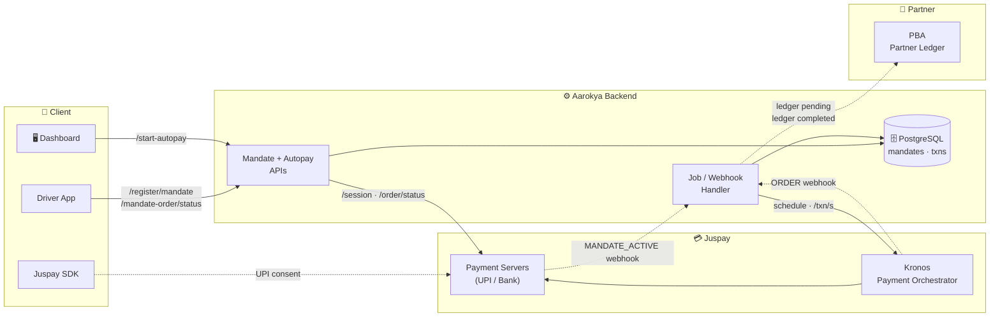

<Info>
  The **App** and **Dashboard** talk directly to **Aarokya Backend**. **PBA is only
  contacted at the tail end of a debit cycle** — once to record the pending
  ledger entry when the debit is dispatched, and again to mark it completed
  after the settlement webhook arrives. Mandate setup, activation, and
  scheduling do **not** touch PBA.
</Info>

---

## End-to-End Sequence

The complete journey — setup, activation, scheduling, and debit — in one view.

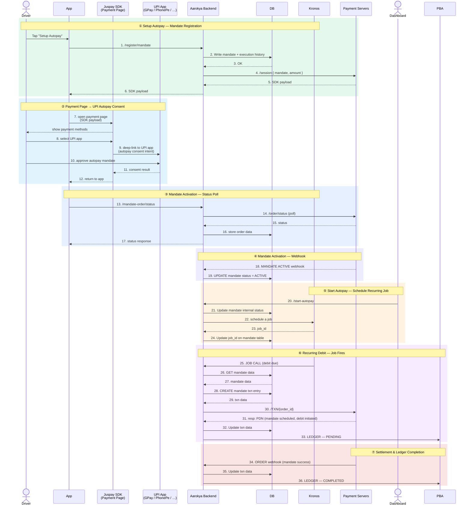

---

## Flow ① — Mandate Registration (Setup Autopay)

The driver opts into autopay. Aarokya Backend persists the mandate shell, creates a Juspay session scoped to the mandate amount, and returns an SDK payload that the app will hand to the Juspay SDK in the next step.

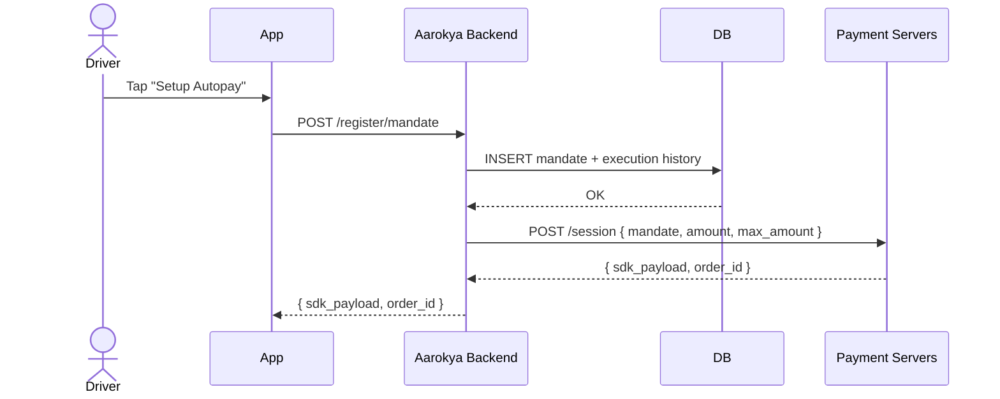

**Key writes on Aarokya Backend side:** a `mandates` row in `PENDING` state with the `order_id` returned by Payment Servers.

---

## Flow ② — Payment Page → UPI Autopay Consent

With the SDK payload in hand, the app opens the Juspay SDK's payment page. The user picks their UPI app; the SDK deep-links into it with an autopay consent intent; the user approves the mandate inside their UPI app; control returns to Aarokya. **Aarokya Backend is not called during this phase** — all interactions are between the app, the SDK, and the UPI app / rails.

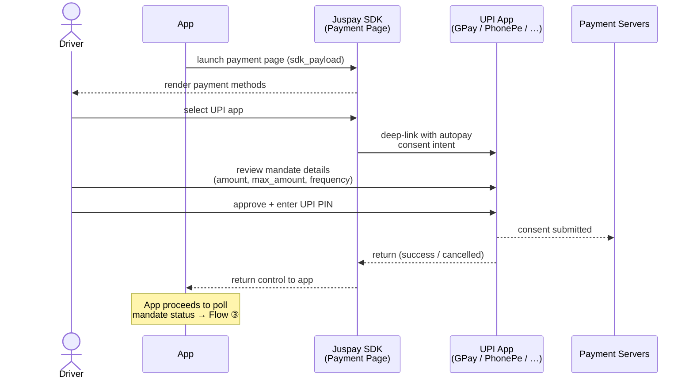

<Info>
  The UPI app talks to Payment Servers (not to Aarokya) when the user approves. Aarokya Backend
  only learns that the mandate is active via the status poll and/or the Payment Servers
  `MANDATE_ACTIVE` webhook in the next flow.
</Info>

---

## Flow ③ — Mandate Activation — Status Poll

After returning from the UPI app, the app polls Aarokya Backend for the mandate status. Aarokya Backend queries Payment Servers, stores the order data, and returns the status to the app.

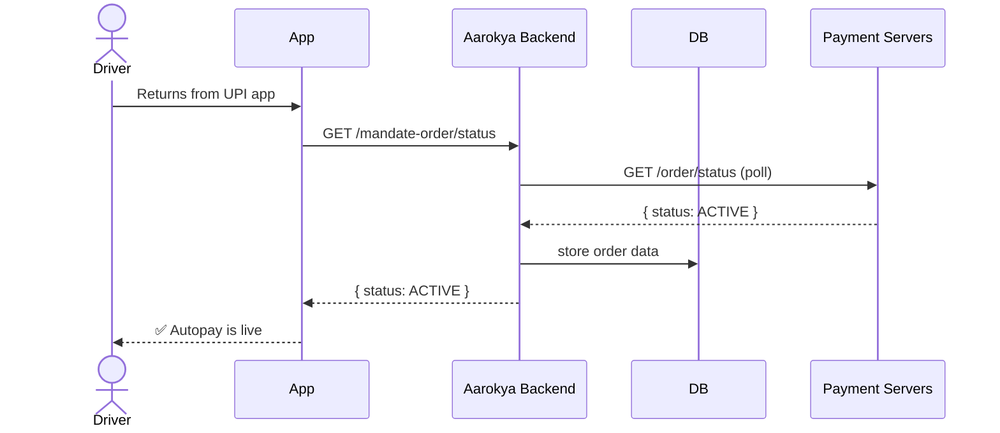

---

## Flow ④ — Mandate Activation — Webhook

Independently of the poll, Payment Servers fire a `MANDATE_ACTIVE` webhook to Aarokya Backend, which writes the final mandate status to DB.

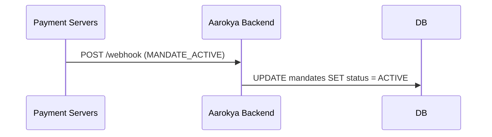

<Warning>
  Both the poll (Flow ③) and this webhook can arrive in either order — both
  paths are idempotent. Use `order_id` + `status` as the idempotency key when
  writing `mandates.status`.
</Warning>

---

## Flow ⑤ — Start Autopay (Schedule Recurring Job)

Ops (or an automated upstream) flips a mandate from "active" to "actively debiting" by scheduling a job on Kronos. Kronos owns the cron; Aarokya Backend owns the state.

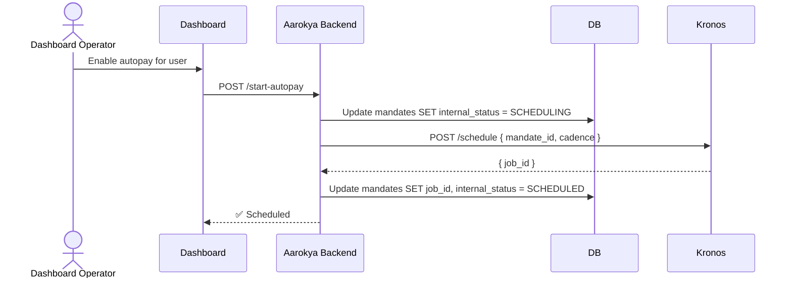

**State transitions:** `ACTIVE → SCHEDULING → SCHEDULED`. The intermediate `SCHEDULING` state lets us recover if the Kronos call fails — a retry worker can re-issue the schedule without double-booking.

---

## Flow ⑥ — Recurring Debit — Job Fires

Kronos fires the scheduled job. Aarokya Backend fetches mandate data, creates a txn entry, calls Payment Servers with the mandate txn order ID, and records a pending ledger entry with PBA.

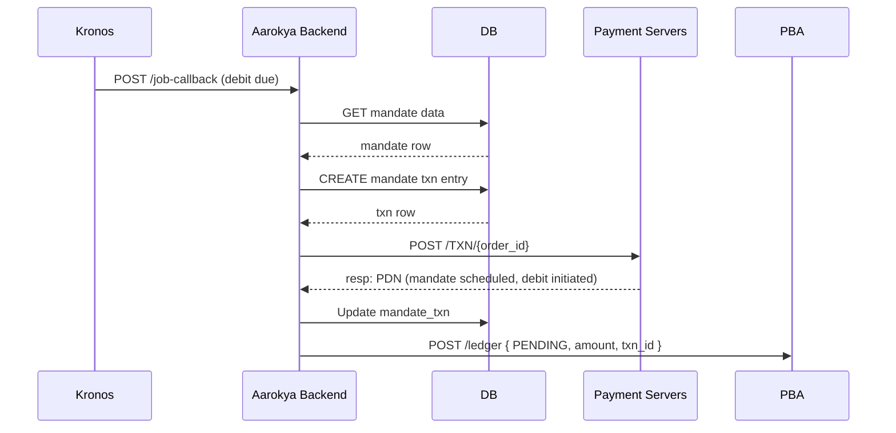

---

## Flow ⑦ — Settlement & Ledger Completion

Payment Servers fire an ORDER webhook once the debit settles. Aarokya Backend updates the txn and closes the ledger entry with PBA.

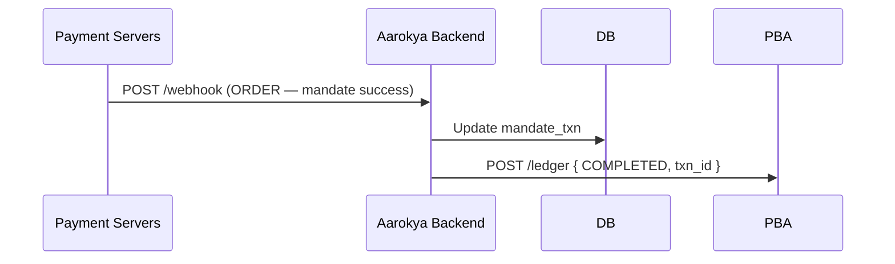

<Info>
  **Why two ledger calls?** The `PENDING` call (Flow ⑥) gives the partner a
  real-time hold on funds the moment we dispatch to Payment Servers. The
  `COMPLETED` call only fires after the ORDER webhook confirms money has moved.
  If the webhook reports a failure, Aarokya Backend calls PBA with `FAILED`
  instead — the partner never sees a phantom settlement.
</Info>

---

## State Machine — Mandate

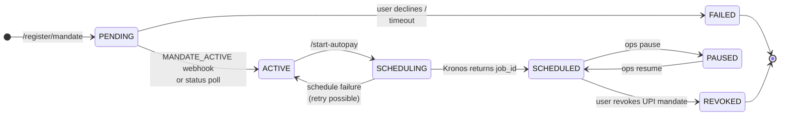

---

## State Machine — Debit Transaction

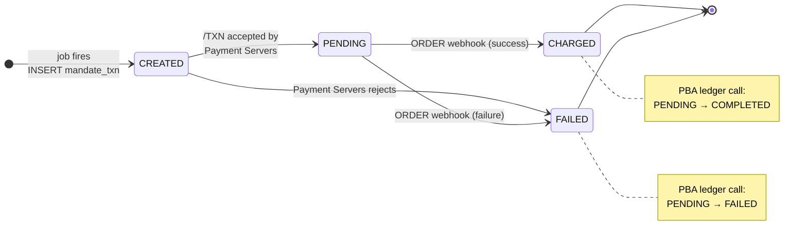

---

## Idempotency & Recovery

| Scenario | Guard |
|----------|-------|
| Duplicate `MANDATE_ACTIVE` webhook | `UPDATE ... WHERE status = 'PENDING'` — a second write is a no-op. |
| Status poll lands before webhook | Same row keyed by `order_id`; first writer wins, second is a no-op. |
| `/schedule` times out after Kronos accepted | Mandate is stuck in `SCHEDULING`; reconciler compares Aarokya Backend state against Kronos `GET /jobs/:id` and heals. |
| Poll and webhook both report ACTIVE | Idempotent — state transition is `PENDING → ACTIVE` only; duplicate `ACTIVE` signals from Payment Servers are ignored. |
| Duplicate `ORDER` webhook | `mandate_txn` transitions are one-way (`PENDING → CHARGED` / `PENDING → FAILED`); re-delivery is a no-op. |
| Duplicate PBA ledger call | PBA keys ledger entries by `txn_id`; both `PENDING` and `COMPLETED` calls are idempotent on re-delivery. |

---

## Related

- [System Architecture](./system-overview) — broader system context across all Aarokya modules.
- [Mandate Module](../modules/mandate) — schema and endpoint details.
- [Register Mandate API](../api/endpoints/mandate/register) — request / response shape.
- [Mandate Order Status API](../api/endpoints/mandate/order-status) — polling contract.
