## Overall User Journey

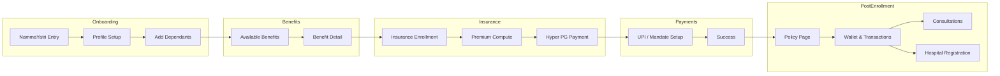

---

## Screen-by-Screen Breakdown

### 1. Onboarding (Profile Setup)

The driver enters Aarokya from NammaYatri for the first time. NammaYatri passes the driver's identity via the SDK token flow.

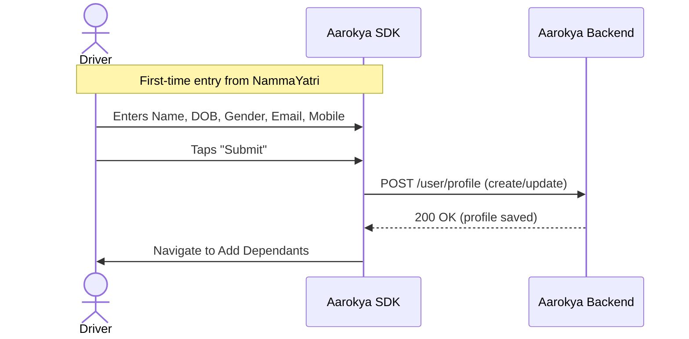

**Screen fields:**
- Name (pre-filled from NammaYatri if available)
- Date of Birth
- Gender
- Email
- Mobile (pre-filled, read-only)

**APIs called:**

| API | Method | Purpose |
|-----|--------|---------|
| `POST /user/profile` | Create | Create user profile with onboarding details |

---

### 2. Add Dependants

Driver adds family members who will be covered under the insurance plan. Can be skipped.

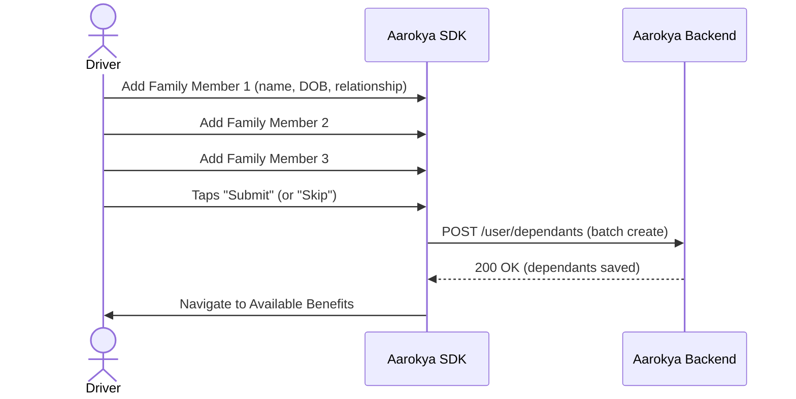

**Screen fields (per dependant):**
- Name
- Date of Birth
- Gender
- Relationship (spouse, child, parent, etc.)
- Add (+) button for more members

**APIs called:**

| API | Method | Purpose |
|-----|--------|---------|
| `POST /user/dependants` | Create | Save family members as dependants |

---

### 3. Available Benefits

Shows the benefits the driver can avail -- free doctor consultations, insurance plans, etc.

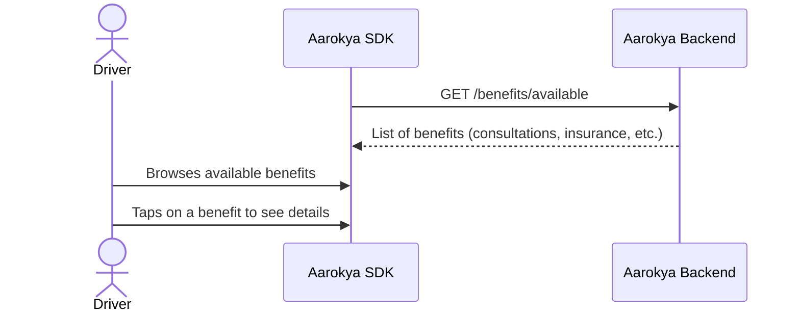

**Screen layout:**
- List/grid of benefit cards
- Each card: title, short description, icon
- Examples: "Free Doctor Consultations", "Health Insurance"

**APIs called:**

| API | Method | Purpose |
|-----|--------|---------|
| `GET /benefits/available` | Read | List benefits available to this driver |

---

### 4. Benefit Detail (To Avail)

Detail page for a specific benefit (e.g., Insurance). Shows what the benefit covers and how to avail it.

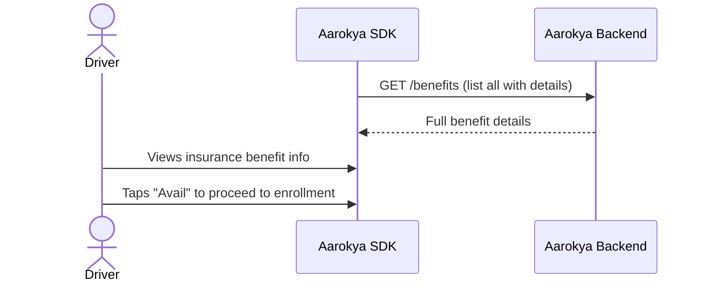

**Screen layout:**
- Benefit name and description
- Coverage details
- Info icon with more details
- "Avail" / "Enroll" CTA button

**APIs called:**

| API | Method | Purpose |
|-----|--------|---------|
| `GET /benefits` | Read | List all benefits with full details |

---

### 5. Insurance Enrollment

The main enrollment screen. Shows premium amount, lets the driver add/remove dependants from coverage, and proceeds to payment.

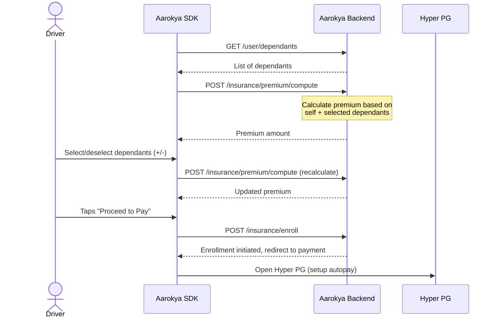

**Screen fields:**
- Premium amount (computed dynamically)
- Dependant list with +/- toggle
- "Setup Autopay" button
- Proceeds to Hyper PG for payment

**APIs called:**

| API | Method | Purpose |
|-----|--------|---------|
| `GET /user/dependants` | Read | Fetch saved dependants for selection |
| `POST /insurance/premium/compute` | Compute | Calculate premium for self + selected dependants |
| `POST /insurance/enroll` | Create | Initiate benefit enrollment |

---

### 6. Payments Page (UPI / Mandate Setup)

Payment collection via Hyper PG. Supports UPI payment and mandate setup for recurring autopay.

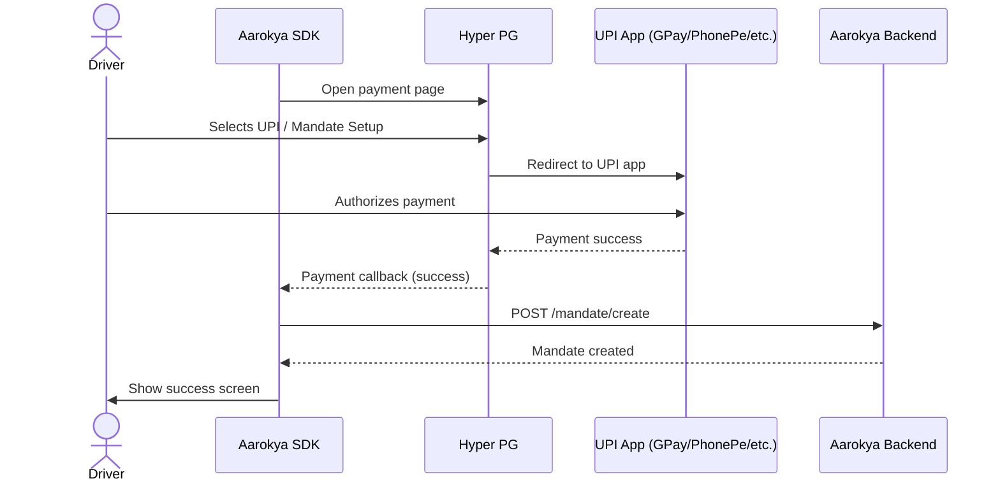

**Screen layout:**
- UPI payment option
- Mandate setup option
- Payment app icons (GPay, PhonePe, Paytm)
- Amount display

**APIs called:**

| API | Method | Purpose |
|-----|--------|---------|
| `POST /mandate/create` | Create | Create autopay mandate for recurring deductions |

---

### 7. Success Screen

Confirmation after successful payment and mandate setup.

**Screen layout:**
- Success checkmark
- "Payment Successful" message
- Summary of enrollment
- "Continue" button to go to wallet/home

---

### 8. Wallet Creation

Wallet setup screen. Collects any additional info needed for the health savings wallet (backed by Transcorp).

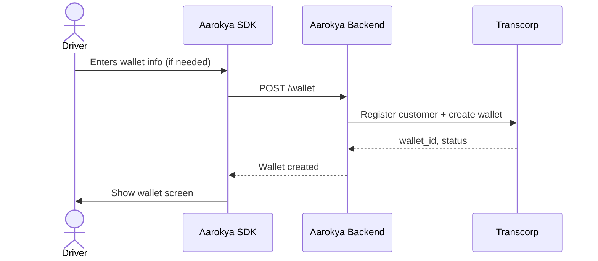

**APIs called:**

| API | Method | Purpose |
|-----|--------|---------|
| `POST /wallet` | Create | Create health savings wallet (Transcorp registration) |

---

### 9. Wallet & Transactions (Home)

Main wallet view showing balance, recent transactions, and add money option.

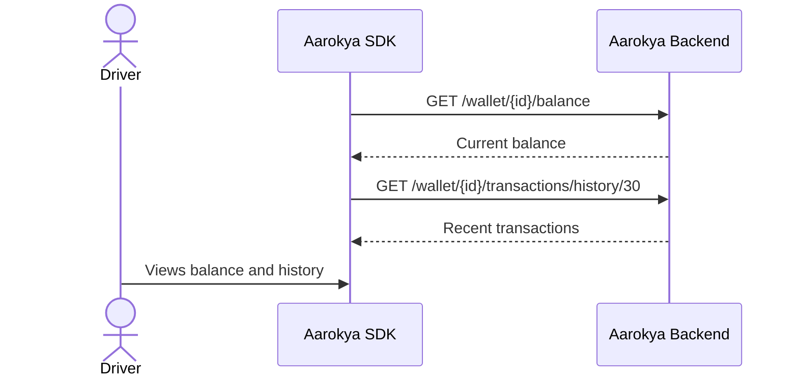

**Screen layout:**
- Balance display (prominent)
- Transaction history list
- "Add Money" button
- Each transaction: amount, status, date, description

**APIs called:**

| API | Method | Purpose |
|-----|--------|---------|
| `GET /wallet/{id}/balance` | Read | Fetch live balance from wallet provider |
| `GET /wallet/{id}/transactions/history/{days}` | Read | Fetch transaction history |

---

### 10. Hospital Registration (Dispute Region)

Register at a network hospital for cashless treatment.

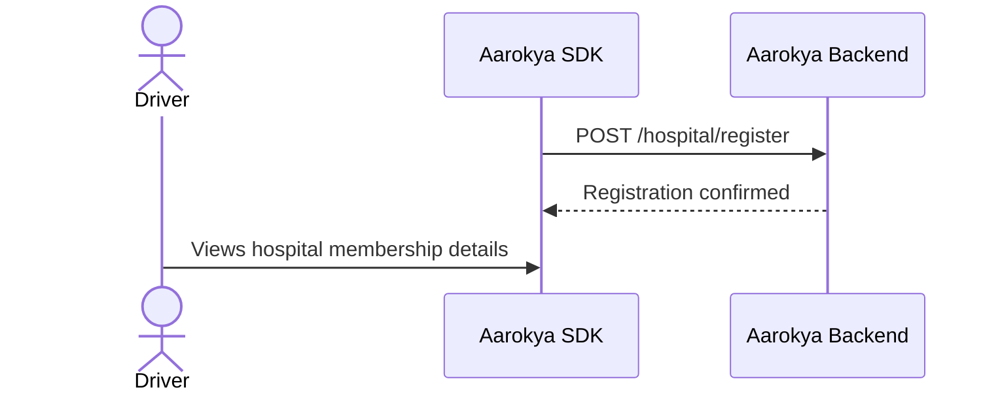

**APIs called:**

| API | Method | Purpose |
|-----|--------|---------|
| `POST /hospital/register` | Create | Register driver at a network hospital |

---

### 11. Consultations

View consultation history and book new doctor consultations (free benefit).

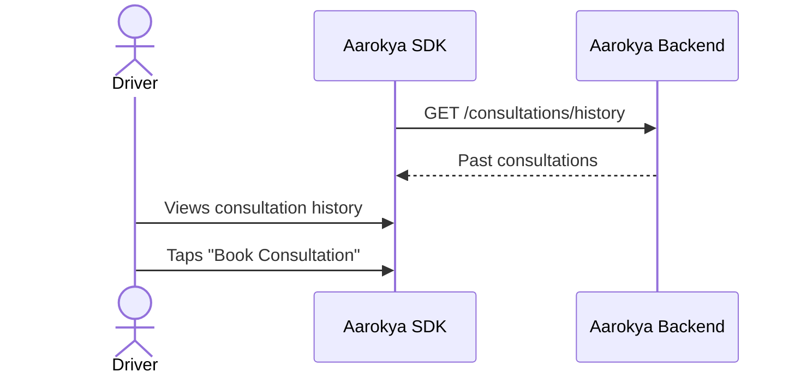

**APIs called:**

| API | Method | Purpose |
|-----|--------|---------|
| `GET /consultations/history` | Read | Fetch past consultation records |

---

### 12. Policy Page

View active insurance policy details, coverage, and claims.

**Screen layout:**
- Policy number
- Coverage amount
- Start and expiry dates
- Covered members
- Claim history link
- Policy document download

**APIs called:**

| API | Method | Purpose |
|-----|--------|---------|
| `GET /insurance/policies/{id}` | Read | Fetch policy details |

---

## Complete API Map by Screen

| # | Screen | APIs | Status |
|---|--------|------|--------|
| 1 | Onboarding | `POST /user/profile` | Exists |
| 2 | Add Dependants | `POST /user/dependants` | New |
| 3 | Available Benefits | `GET /benefits/available` | New |
| 4 | Benefit Detail | `GET /benefits` | New |
| 5 | Insurance Enrollment | `GET /user/dependants`, `POST /insurance/premium/compute`, `POST /insurance/enroll` | New |
| 6 | Payments | `POST /mandate/create` | New |
| 7 | Success | (no API call) | N/A |
| 8 | Wallet Creation | `POST /wallet` | Exists |
| 9 | Wallet & Transactions | `GET /wallet/{id}/balance`, `GET /wallet/{id}/transactions/history/{days}` | Exists |
| 10 | Hospital Registration | `POST /hospital/register` | New |
| 11 | Consultations | `GET /consultations/history` | New |
| 12 | Policy Page | `GET /insurance/policies/{id}` | Exists |

---

## Flow Connections

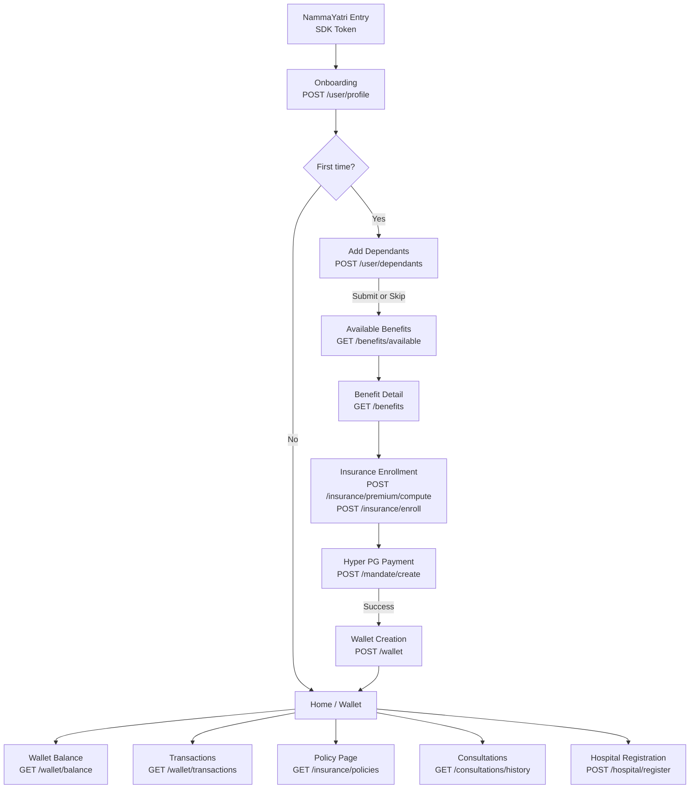
