## Overall User Journey

```mermaid
flowchart LR
    subgraph Onboarding
        A[NammaYatri Entry] --> B[Profile Setup]
        B --> C[Add Dependants]
    end

    subgraph Benefits
        C --> D[Available Benefits]
        D --> E[Benefit Detail]
    end

    subgraph Insurance
        E --> F[Insurance Enrollment]
        F --> G[Premium Compute]
        G --> H[Hyper PG Payment]
    end

    subgraph Payments
        H --> I[UPI / Mandate Setup]
        I --> J[Success]
    end

    subgraph PostEnrollment
        J --> K[Policy Page]
        K --> L[Account Balance & Ledger]
        L --> M[Consultations]
    end
```

---

## Screen-by-Screen Breakdown

### 1. Onboarding (Profile Setup)

The driver enters Aarokya from the host platform for the first time. The platform service account has already exchanged the driver's `{phone_number, phone_country_code, id_proof}` for a `user_id` + app JWT via `POST /auth/token`, so the user row already exists in `onboarding` status. The app fills in the remaining profile fields and completes onboarding.

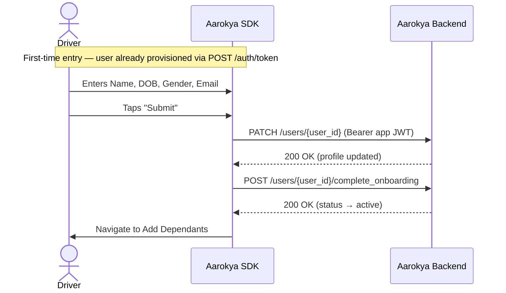

**Screen fields:**
- Name (pre-filled from host platform if available)
- Date of Birth
- Gender
- Email
- Mobile (pre-filled, read-only — set at provisioning)

**APIs called:**

| API | Method | Purpose |
|-----|--------|---------|
| `PATCH /users/{user_id}` | Update | Fill in onboarding profile fields |
| `POST /users/{user_id}/complete_onboarding` | Create | Transition user status to `active` |

---

### 2. Add Dependants

Driver adds family members who will be covered under the insurance plan. Can be skipped.

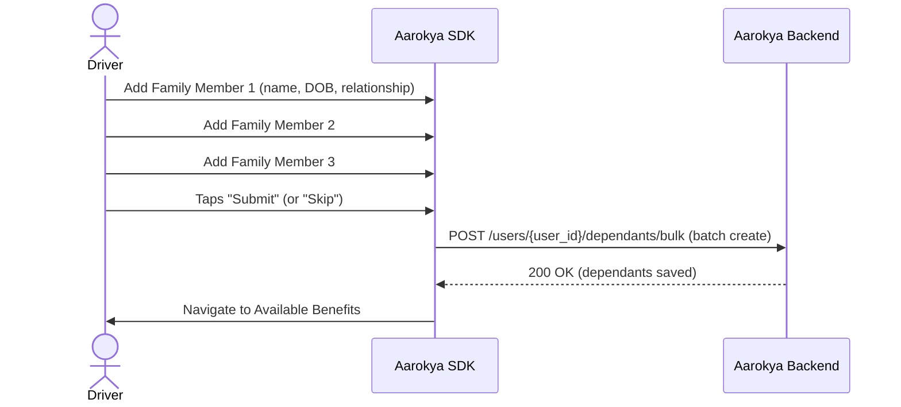

**Screen fields (per dependant):**
- Name
- Date of Birth
- Gender
- Relationship (`self`, `spouse`, `mother`, `father`, `child`, `father_in_law`, `mother_in_law`, `sibling`)
- Add (+) button for more members

**APIs called:**

| API | Method | Purpose |
|-----|--------|---------|
| `POST /users/{user_id}/dependants/bulk` | Create | Save family members as dependants (batch) |
| `POST /users/{user_id}/dependants` | Create | Save a single dependant |

---

### 3. Available Benefits

Shows the benefits the driver can avail -- free doctor consultations, insurance plans, etc.

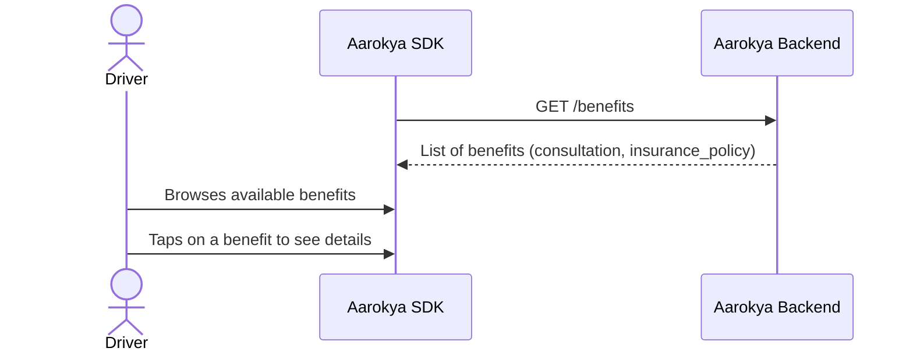

**Screen layout:**
- List/grid of benefit cards
- Each card: title, short description, icon
- `benefit_type` is one of `consultation` or `insurance_policy`

**APIs called:**

| API | Method | Purpose |
|-----|--------|---------|
| `GET /benefits` | Read | List benefits |

---

### 4. Benefit Detail (To Avail)

Detail page for a specific benefit (e.g., Insurance). Shows what the benefit covers and how to avail it.

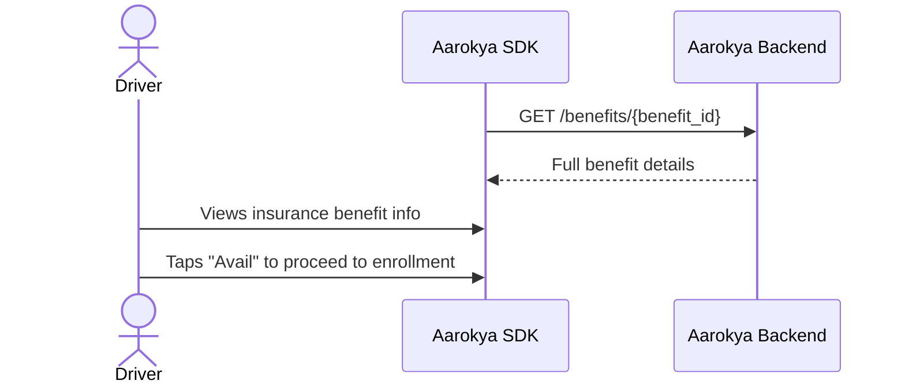

**Screen layout:**
- Benefit name and description
- Coverage details (`benefit_details` JSONB)
- Info icon with more details
- "Avail" / "Enroll" CTA button

**APIs called:**

| API | Method | Purpose |
|-----|--------|---------|
| `GET /benefits/{benefit_id}` | Read | Fetch one benefit with full details |

---

### 5. Insurance Enrollment

The main enrollment screen. Shows premium amount, lets the driver add/remove dependants from coverage, and proceeds to payment.

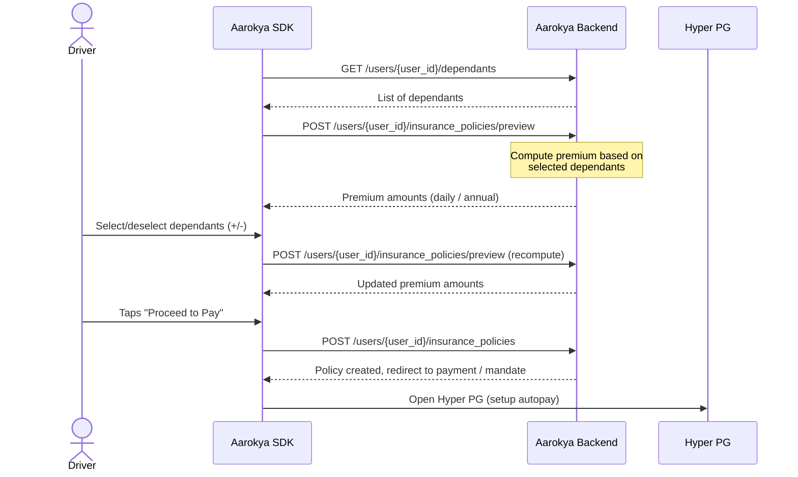

**Screen fields:**
- Premium amounts (`daily` / `annual`, computed dynamically)
- Dependant list with +/- toggle
- "Setup Autopay" button
- Proceeds to Hyper PG for payment

**APIs called:**

| API | Method | Purpose |
|-----|--------|---------|
| `GET /users/{user_id}/dependants` | Read | Fetch saved dependants for selection |
| `POST /users/{user_id}/insurance_policies/preview` | Compute | Preview premium for selected dependants |
| `POST /users/{user_id}/insurance_policies` | Create | Create the insurance policy |

---

### 6. Payments Page (UPI / Mandate Setup)

Payment collection via Hyper PG. Supports UPI payment and mandate setup for recurring autopay.

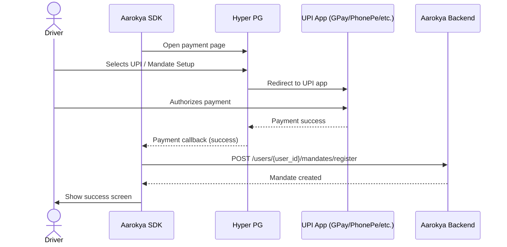

**Screen layout:**
- UPI payment option
- Mandate setup option
- Payment app icons (GPay, PhonePe, Paytm)
- Amount display

**APIs called:**

| API | Method | Purpose |
|-----|--------|---------|
| `POST /users/{user_id}/mandates/register` | Create | Create autopay mandate for recurring deductions |
| `GET /users/{user_id}/mandates/{mandate_id}/status` | Read | Poll mandate registration status |

---

### 7. Success Screen

Confirmation after successful payment and mandate setup.

**Screen layout:**
- Success checkmark
- "Payment Successful" message
- Summary of enrollment
- "Continue" button to go to wallet/home

---

### 8. Account Setup (PBA)

The Prepaid Bank Account (PBA) is the user's money store. An account row is created against the user; balance and ledger are then served from the PBA.

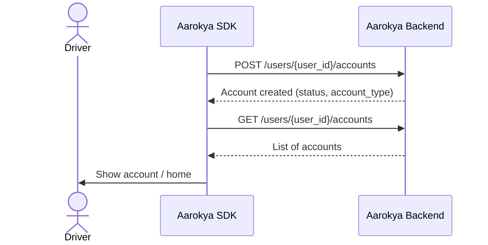

**APIs called:**

| API | Method | Purpose |
|-----|--------|---------|
| `POST /users/{user_id}/accounts` | Create | Create a PBA account for the user |
| `GET /users/{user_id}/accounts` | Read | List the user's accounts |

---

### 9. Balance & Ledger (Home)

Main money view showing balance, recent transactions, and add money option.

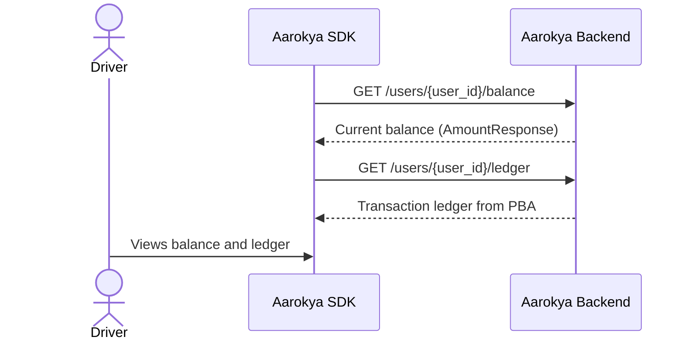

**Screen layout:**
- Balance display (prominent)
- Transaction ledger list
- "Add Money" button → `POST /users/{user_id}/contributions/self`
- Each entry: amount (`AmountResponse`), status, date, description

**APIs called:**

| API | Method | Purpose |
|-----|--------|---------|
| `GET /users/{user_id}/balance` | Read | Fetch live balance from the PBA |
| `GET /users/{user_id}/ledger` | Read | Fetch the account transaction ledger |
| `POST /users/{user_id}/contributions/self` | Create | Self-contribution top-up |

---

### 10. Consultations

View consultations and start a new chat-doctor consultation (a consultation `benefit`).

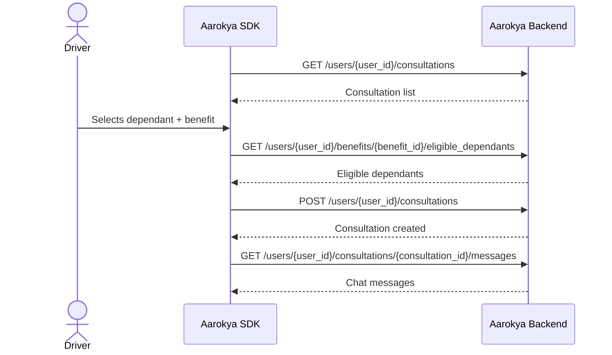

**APIs called:**

| API | Method | Purpose |
|-----|--------|---------|
| `GET /users/{user_id}/consultations` | Read | List the user's consultations |
| `GET /users/{user_id}/benefits/{benefit_id}/eligible_dependants` | Read | Dependants eligible for this consultation benefit |
| `POST /users/{user_id}/consultations` | Create | Start a consultation |
| `GET /users/{user_id}/consultations/{consultation_id}/messages` | Read | Fetch chat messages |

---

### 11. Policy Page

View active insurance policy details and coverage.

**Screen layout:**
- External policy id
- Coverage amount
- Start and end dates
- Covered members (`dependant_ids`)
- Policy document download

**APIs called:**

| API | Method | Purpose |
|-----|--------|---------|
| `GET /users/{user_id}/insurance_policies` | Read | List the user's policies |
| `GET /users/{user_id}/insurance_policies/{insurance_policy_id}` | Read | Fetch one policy |
| `GET /users/{user_id}/insurance_policies/{insurance_policy_id}/documents/{document_type}` | Read | Download a policy document |

---

## Complete API Map by Screen

| # | Screen | APIs |
|---|--------|------|
| 1 | Onboarding | `PATCH /users/{user_id}`, `POST /users/{user_id}/complete_onboarding` |
| 2 | Add Dependants | `POST /users/{user_id}/dependants/bulk` |
| 3 | Available Benefits | `GET /benefits` |
| 4 | Benefit Detail | `GET /benefits/{benefit_id}` |
| 5 | Insurance Enrollment | `GET /users/{user_id}/dependants`, `POST /users/{user_id}/insurance_policies/preview`, `POST /users/{user_id}/insurance_policies` |
| 6 | Payments | `POST /users/{user_id}/mandates/register` |
| 7 | Success | (no API call) |
| 8 | Account Setup | `POST /users/{user_id}/accounts`, `GET /users/{user_id}/accounts` |
| 9 | Balance & Ledger | `GET /users/{user_id}/balance`, `GET /users/{user_id}/ledger`, `POST /users/{user_id}/contributions/self` |
| 10 | Consultations | `GET /users/{user_id}/consultations`, `POST /users/{user_id}/consultations`, `GET /users/{user_id}/consultations/{consultation_id}/messages` |
| 11 | Policy Page | `GET /users/{user_id}/insurance_policies/{insurance_policy_id}` |

---

## Flow Connections

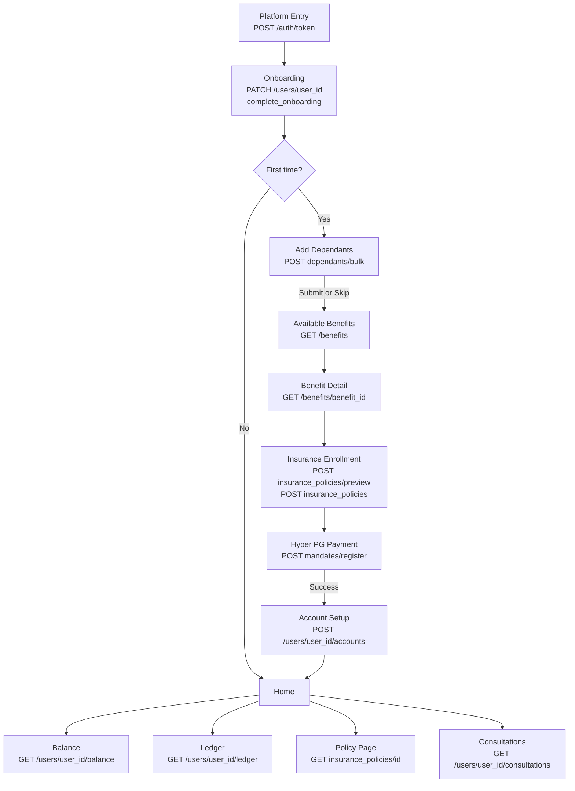
