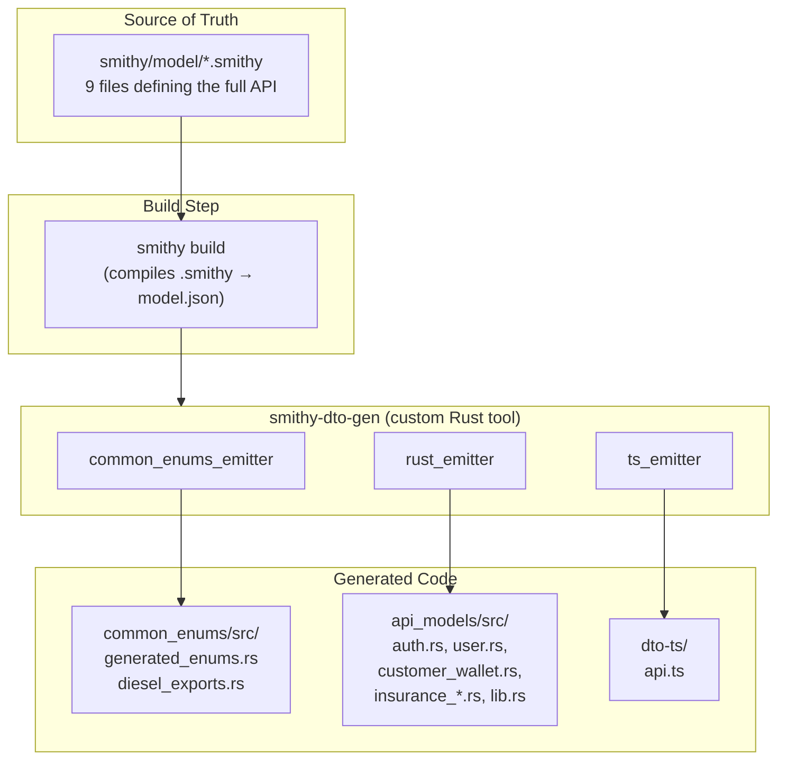
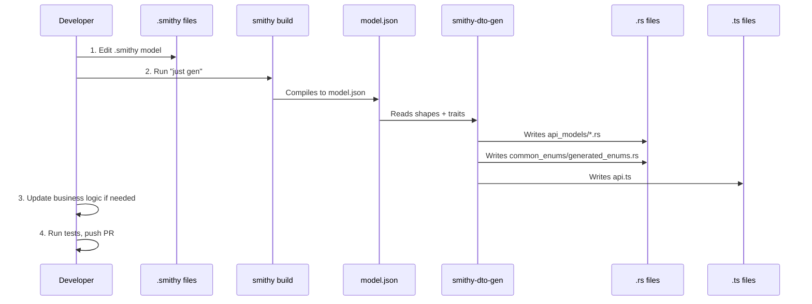
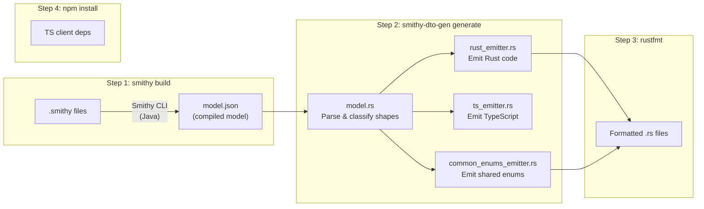
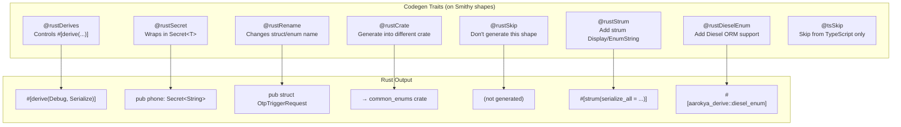
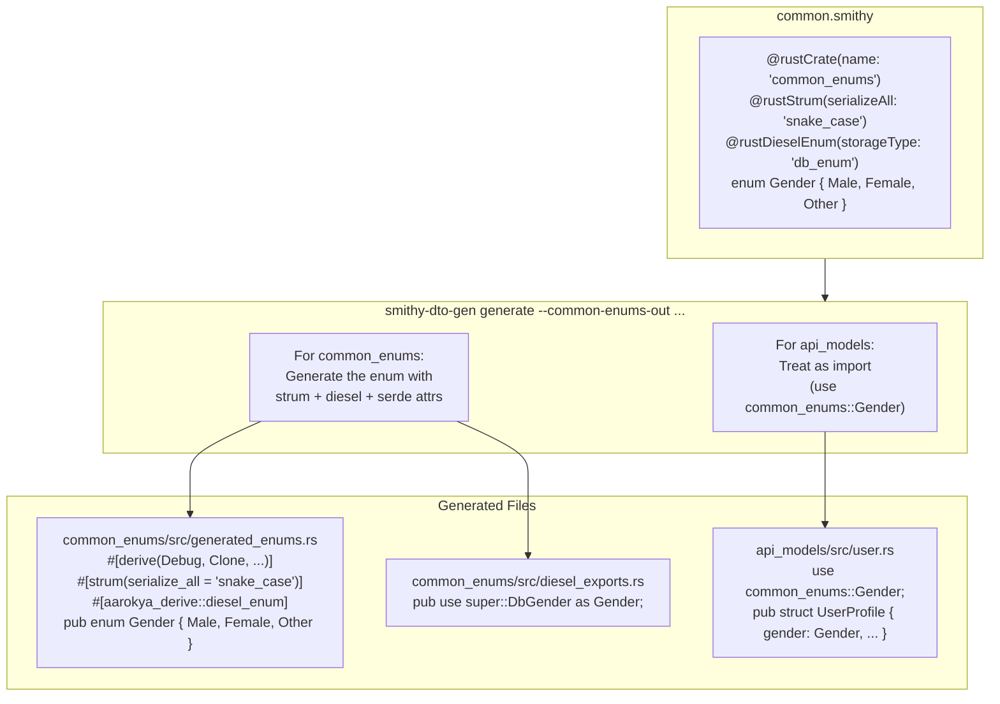
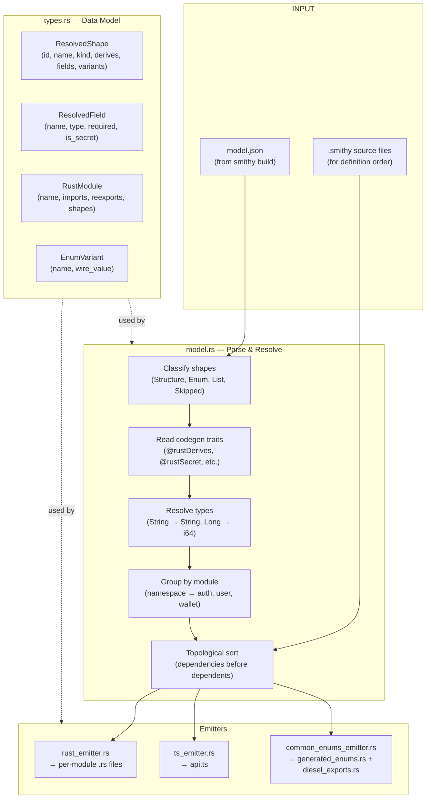
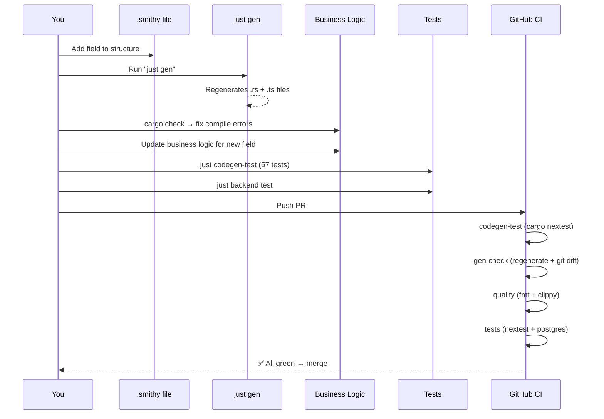
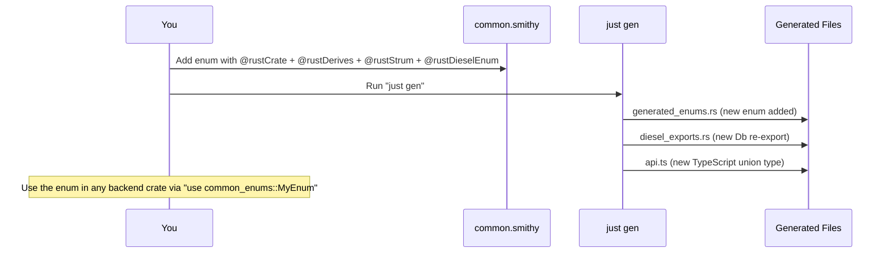
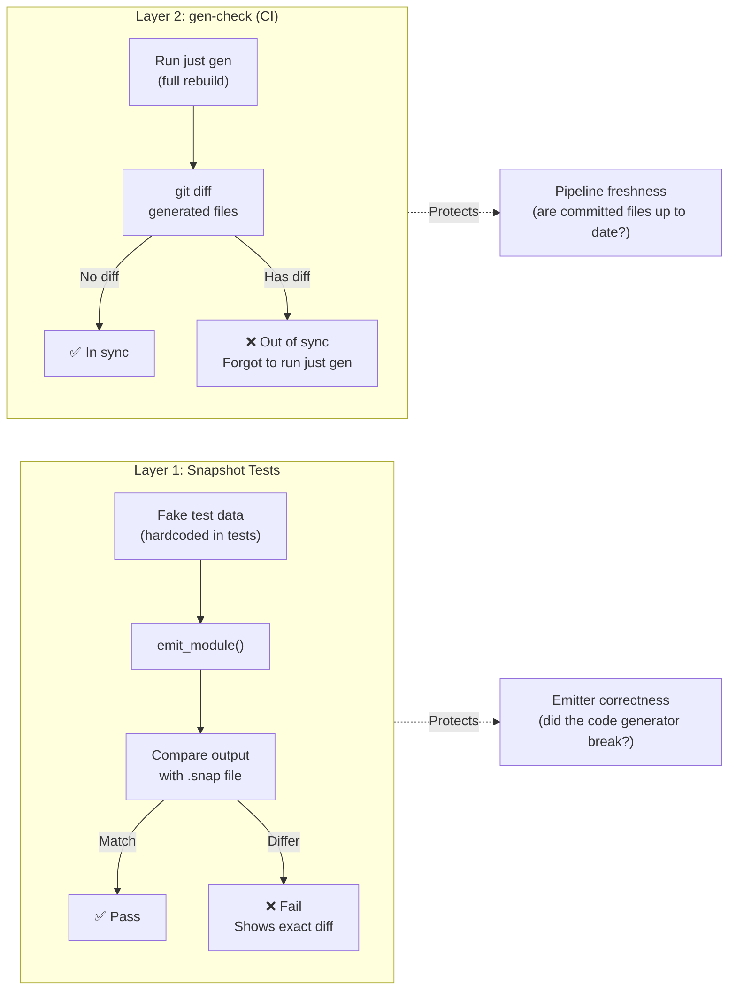
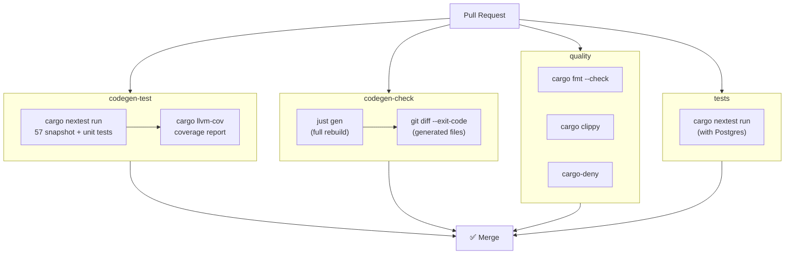

## What is Smithy?

Smithy is an **Interface Definition Language (IDL)** created by AWS. You write your API contract once in `.smithy` files, and tools generate code for multiple languages from that single definition.

In this project, Smithy is the **single source of truth** for:
- Rust backend DTOs (request/response types)
- Shared enums used across the backend (Gender, Currency, WalletStatus, etc.)
- TypeScript interfaces for the frontend
- Zod runtime validation schemas (optional)



---

## The Files You'll Work With

### Smithy Models (you edit these)

```
smithy/model/
├── main.smithy              # Service definition — lists all resources
├── codegen-traits.smithy    # Custom traits that control code generation
├── common.smithy            # Shared enums (Gender, Currency, etc.) + types
├── auth.smithy              # Auth operations (OTP, tokens)
├── user.smithy              # User profile operations
├── wallet.smithy            # Wallet operations (renamed to customer_wallet namespace)
├── insurance_plans.smithy   # Insurance plan queries
├── insurance_policy.smithy  # Policy lifecycle (purchase, cancel, etc.)
└── insurance_claims.smithy  # Claims submission and status
```

### Generated Code (never edit these manually)

```
backend/crates/api_models/src/
├── auth.rs                  # ← Generated from auth.smithy
├── user.rs                  # ← Generated from user.smithy
├── customer_wallet.rs       # ← Generated from wallet.smithy
├── insurance_claims.rs      # ← Generated from insurance_claims.smithy
├── insurance_plans.rs       # ← Generated from insurance_plans.smithy
├── insurance_policy.rs      # ← Generated from insurance_policy.smithy
├── lib.rs                   # ← Generated module declarations
└── errors.rs                # ← Hand-written (NOT generated)

backend/crates/common_enums/src/
├── generated_enums.rs       # ← Generated from common.smithy
├── diesel_exports.rs        # ← Generated Diesel re-exports
├── extensions.rs            # ← Hand-written (Status enum + Currency methods)
└── lib.rs                   # ← Hand-written module declarations

backend/smithy-api-model-generated/dto-ts/
└── api.ts                   # ← Generated TypeScript interfaces
```

---

## How the Pipeline Works

### The Big Picture



### Step 1: You Write Smithy

A Smithy file defines **what** your API looks like — the operations, inputs, outputs, and errors:

```smithy
// smithy/model/auth.smithy

@http(method: "POST", uri: "/auth/otp/trigger")
operation RequestOtp {
    input: RequestOtpInput
    output: RequestOtpOutput
    errors: [ValidationException]
}

@rustRename(name: "OtpTriggerRequest")
@rustDerives(["Deserialize", "ToSchema"])
structure RequestOtpInput {
    @required
    @rustSecret
    phone: String

    @required
    phoneCountryCode: String
}
```

The `@rust*` traits are **codegen hints** — they tell our custom code generator how to produce the Rust output. They don't affect the Smithy model itself.

### Step 2: `just gen` Runs the Pipeline



Internally, the codegen tool:

1. **Parses** `model.json` — classifies each shape as Structure, Enum, List, Map, or Skipped
2. **Reads codegen traits** — `@rustDerives`, `@rustSecret`, `@rustRename`, `@rustCrate`, etc.
3. **Groups by module** — shapes go into `auth.rs`, `user.rs`, etc. based on namespace
4. **Topologically sorts** — ensures a struct is defined before another struct references it
5. **Emits code** — generates Rust structs/enums and TypeScript interfaces

### Step 3: What Gets Generated

From this Smithy input:

```smithy
@rustRename(name: "OtpTriggerRequest")
@rustDerives(["Deserialize", "ToSchema"])
structure RequestOtpInput {
    @required
    @rustSecret
    phone: String

    @required
    phoneCountryCode: String
}
```

**Rust output** (`api_models/src/auth.rs`):
```rust
#[derive(Deserialize, ToSchema)]
pub struct OtpTriggerRequest {
    #[schema(value_type = String)]
    pub phone: Secret<String>,
    pub phone_country_code: String,
}
```

**TypeScript output** (`api.ts`):
```typescript
export interface OtpTriggerRequest {
  phone: string;
  phone_country_code: string;
}
```

Notice:
- `@rustRename` changed the struct name
- `@rustSecret` wrapped `phone` in `Secret<T>` (Rust only — TS has no equivalent)
- `phoneCountryCode` became `phone_country_code` (automatic camelCase → snake_case)
- Optional fields (without `@required`) get `Option<T>` in Rust and `?:` in TypeScript

---

## Codegen Traits

Traits are annotations on Smithy shapes that control code generation. They're defined in `codegen-traits.smithy`.



### The Most Important Traits

| Trait | Where | What it does | Example |
|-------|-------|-------------|---------|
| `@rustDerives` | Shape | Sets `#[derive(...)]` macros | `@rustDerives(["Serialize", "Deserialize", "ToSchema"])` |
| `@rustRename` | Shape | Changes the generated name | `@rustRename(name: "OtpTriggerRequest")` |
| `@rustSkip` | Shape | Don't generate in Rust or TS | Error types that map to `ApiErrorResponse` |
| `@rustSecret` | Field | Wraps in `masking::Secret<T>` | Phone numbers, OTP codes, tokens |
| `@rustType` | Field | Override the Rust type | `@rustType(value: "time::Date")` |
| `@rustCrate` | Enum | Generate into `common_enums` crate | Shared enums like Gender, Currency |
| `@rustStrum` | Enum | Add strum string conversion | `@rustStrum(serializeAll: "snake_case")` |
| `@rustDieselEnum` | Enum | Add Diesel DB support | `@rustDieselEnum(storageType: "db_enum")` |
| `@tsSkip` | Shape | Skip from TypeScript only | Rust-only internal types |

---

## Shared Enums: The `@rustCrate` Flow

Enums like `Gender`, `Currency`, `WalletStatus` are used across many backend crates — not just `api_models`. They live in the `common_enums` crate.



The key: `@rustCrate` has **dual behavior**. When generating `api_models`, it acts like "import this from another crate". When generating `common_enums` (via `--common-enums-out`), it generates the actual enum code.

---

## The Codegen Tool Architecture



### Key Source Files

| File | Lines | Purpose |
|------|-------|---------|
| `main.rs` | CLI entry point, orchestrates the pipeline |
| `model.rs` | Parses model.json, resolves shapes, handles `@rustCrate`/`@rustImport` |
| `types.rs` | Data structures: `ResolvedShape`, `ResolvedField`, `RustModule` |
| `config.rs` | Namespace→module mapping, primitive type maps |
| `rust_emitter.rs` | Generates Rust structs, enums, imports, `lib.rs` |
| `ts_emitter.rs` | Generates TypeScript interfaces, union types, Zod schemas |
| `common_enums_emitter.rs` | Generates `generated_enums.rs` + `diesel_exports.rs` |

---

## Developer Workflow

### Adding a New Field



### Adding a New Shared Enum



### Adding a New API Domain

1. Create `smithy/model/new_domain.smithy`
2. Define resource, operations, structures with codegen traits
3. Register resource in `main.smithy`
4. Run `just gen`
5. New module appears in `api_models/src/new_domain.rs`

---

## Testing & CI

### Two Layers of Protection



**Snapshot tests** catch bugs in the emitter code itself. They use fake test data and compare emitter output against saved `.snap` files. Your Smithy model changes don't affect these tests — they only break if someone modifies the emitter functions.

**gen-check** catches forgotten regeneration. It runs the full pipeline and diffs the output against what's committed. If you edited a Smithy file but forgot `just gen`, CI catches it.

### CI Pipeline



---

## Quick Reference

### Commands

| Command | Where | What it does |
|---------|-------|-------------|
| `just gen` | Repo root | Full pipeline: smithy build → codegen → format → npm install |
| `just gen-quick` | Repo root | Skip smithy build (when only codegen traits changed) |
| `just gen-check` | Repo root | Verify generated code is in sync (for CI) |
| `just codegen-test` | Repo root | Run smithy-codegen unit tests |
| `just test-all` | Repo root | Run codegen tests + backend tests |
| `just backend test` | Repo root | Run backend tests only |

### File Ownership

| File | Owned by | Can I edit it? |
|------|----------|----------------|
| `smithy/model/*.smithy` | You | **Yes** — this is the source of truth |
| `api_models/src/*.rs` | Codegen | **No** — run `just gen` instead |
| `api_models/src/errors.rs` | You | **Yes** — hand-written |
| `common_enums/src/generated_enums.rs` | Codegen | **No** — run `just gen` instead |
| `common_enums/src/extensions.rs` | You | **Yes** — hand-written |
| `common_enums/src/lib.rs` | You | **Yes** — hand-written |
| `dto-ts/api.ts` | Codegen | **No** — run `just gen` instead |
| `smithy-codegen/src/*.rs` | You | **Yes** — the codegen tool itself |
| `smithy-codegen/src/snapshots/*.snap` | Codegen tests | **Review with `cargo insta review`** |
