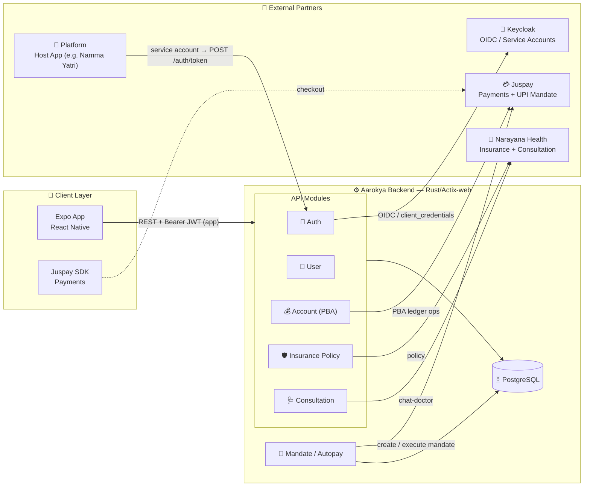
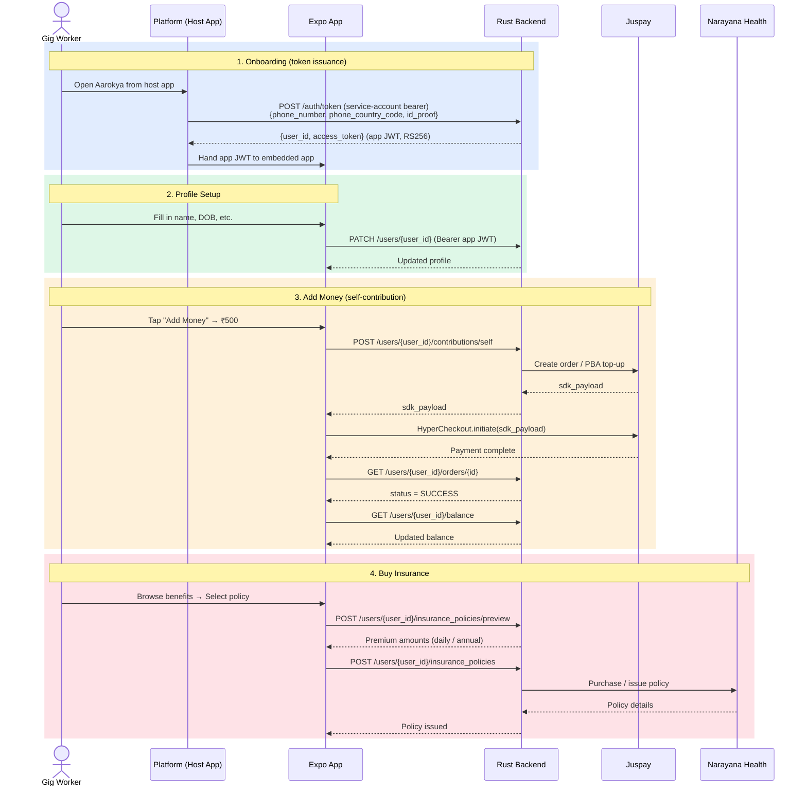
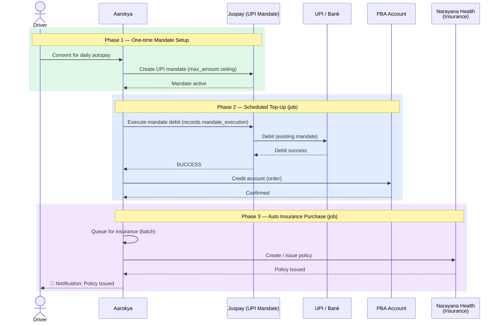
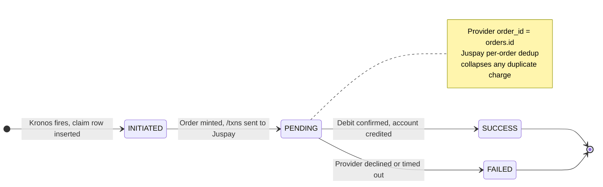

## High-Level Architecture

---

## Domain Breakdown

The current domain set is: `account`, `admin_narayana`, `auth`, `benefit`, `benefit_entity`, `benefit_provider`, `benefit_provider_order`, `config`, `consultation`, `daily_contribution`, `dashboard_user`, `dependant`, `event_log`, `insurance_policy`, `mandate`, `mandate_execution`, `mrn`, `order`, `platform`, `sponsor`, and `user`. The cards below highlight the user-facing domains.

<CardGroup cols={2}>
  <Card title="Auth" icon="lock" color="#f59e0b">
    **Tables:** `users`, `user_key_store`

    Bearer JWT end to end. A platform **service account** (authenticated to Keycloak via `client_credentials`) calls `POST /auth/token` with `` `{phone_number, phone_country_code, id_proof}` `` and receives `` `{user_id, access_token}` `` — a stateless, self-contained app JWT (RS256).

  </Card>
  <Card title="User Profile" icon="user" color="#3b82f6">
    **Tables:** `users` (shared with Auth), `dependant`

    Reads/writes profile fields (`first_name`, `last_name`, `email`, `dob`, `gender`, `address`). `phone_number` and `id_proof` are set at provisioning. PII is encrypted at rest via a per-user key in `user_key_store`.

  </Card>
  <Card title="Account (PBA)" icon="wallet" color="#16a34a">
    **Tables:** `accounts`, `orders`

    User money lives in a Prepaid Bank Account (PBA) ledger, surfaced via `GET /users/{user_id}/balance` and `GET /users/{user_id}/ledger`. Contributions flow through `orders`; the `holder` column keys each account to a `user:<id>` or `sponsor:<id>`.

  </Card>
  <Card title="Insurance Policy" icon="shield-heart" color="#ec4899">
    **Tables:** `insurance_policies`, `benefits`

    Policy lifecycle under `/users/{user_id}/insurance_policies/*`. Each policy references a `benefit` and covers a set of `dependant_ids`. Purchase/issuance is delegated to Narayana Health.

  </Card>
  <Card title="Order / Mandate" icon="credit-card" color="#06b6d4">
    **Tables:** `orders`, `mandates`, `mandate_executions`

    Self-contribution and sponsor-funded top-ups create `orders`. Recurring autopay is driven by a Juspay UPI `mandate`; each scheduled debit lands a row in `mandate_executions`.

  </Card>
  <Card title="Consultation" icon="stethoscope" color="#8b5cf6">
    **Tables:** `consultations`, `benefits`

    Provider-agnostic chat-doctor pipeline (currently Narayana Health). A consultation is tied to a `dependant` and a consultation `benefit`; messages are exchanged through the provider gateway. See [ADR-005](/decisions/adr-005-neutral-consultation-message-shape).

  </Card>
</CardGroup>

---

## User Journeys

### Manual Flow (User-Initiated)

### Automated Flow (Habit Forming — Autopay + Insurance)

This is the primary flow for drivers on a host platform. After a one-time mandate setup, the system automatically tops up the PBA account and purchases insurance on schedule — no manual intervention needed.

---

## Scheduled Autopay (Mandate Execution)

Recurring debits are not driven by an in-process worker. An external scheduler (**Kronos**) fires each due mandate into the backend at `POST /mandate/{mandate_id}/execute`, passing a per-firing `X-Mandate-Execution-Id` (the `job_execution_id`). The handler is idempotent: it claims a `mandate_executions` row via `INSERT ... ON CONFLICT (job_execution_id) DO NOTHING RETURNING *`, so a Kronos retry of the same firing replays rather than double-charges.

The `MandateExecutionStatus` enum is `initiated | pending | success | failed`. Each firing also mints an `orders` row (the funding ledger entry) before the provider charge, satisfying the `mandate_executions.order_id` foreign key.

---

## Security Model

<CardGroup cols={2}>
  <Card title="App JWT (mobile)" icon="key" color="#7c3aed">
    RS256-signed app token issued by `POST /auth/token`. Validated on every
    protected endpoint by the auth middleware. Stateless — verified by
    signature alone, with no per-request DB lookup.
  </Card>
  <Card title="Platform Service Accounts" icon="arrows-rotate" color="#dc2626">
    Only a platform **service account** may call `POST /auth/token`. It
    authenticates to Keycloak via `client_credentials` and presents a bearer
    JWT with `actor_type: "platform_service"`.
  </Card>
  <Card title="Admin / Dashboard OIDC" icon="shield-check" color="#0891b2">
    Admin, dashboard, and other service actors authenticate via **Keycloak
    OIDC**. Tokens are JWKS-verified (signature + `iss` + `aud` + `exp`) and
    the `actor_type` claim drives role-based access.
  </Card>
  <Card title="PII Protection" icon="eye-slash" color="#059669">
    PII fields are encrypted at rest with a per-user data key in
    `user_key_store` (application-level). Secret fields (phone, tokens) are
    wrapped in `Secret<T>` and never logged in plaintext.
  </Card>
</CardGroup>

<Note>
  Token issuance is entirely service-account driven — the host platform
  exchanges the user's `{phone_number, phone_country_code, id_proof}` for an
  app JWT on the user's behalf.
</Note>
