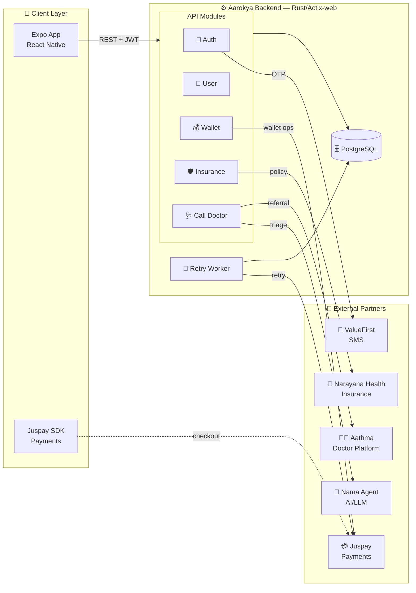
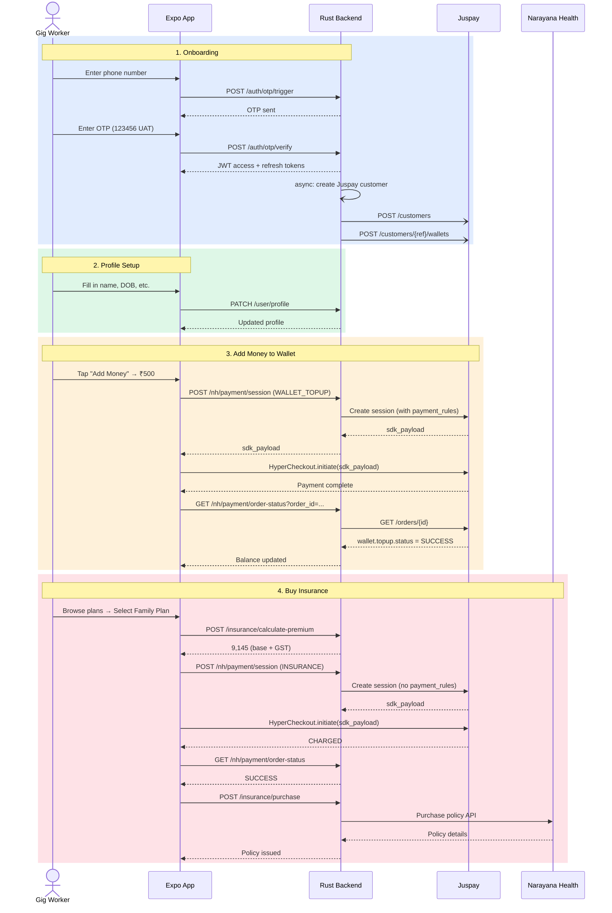
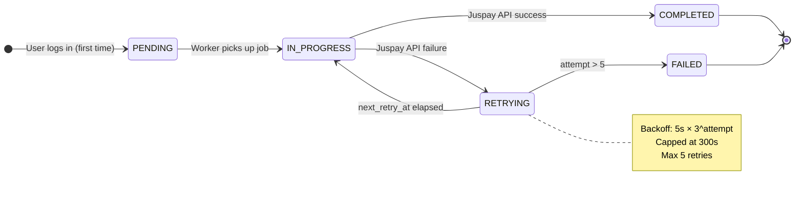

## High-Level Architecture

---

## Domain Breakdown

<CardGroup cols={2}>
  <Card title="Auth" icon="lock" color="#f59e0b">
    **Tables:** `users`, `otp_sessions`, `user_sessions`

    Phone OTP → JWT pair. Stateless access token (24h) + rotation-based refresh token (30d). Sessions hashed — never plaintext in DB.

  </Card>
  <Card title="User Profile" icon="user" color="#3b82f6">
    **Tables:** `users` (shared with Auth)

    Reads/writes profile fields. `phone` and `aadhaar` are immutable via this module. Aadhaar returned masked: `XXXX-XXXX-1234`.

  </Card>
  <Card title="Wallet" icon="wallet" color="#16a34a">
    **Tables:** `customer_wallets`

    Auto-created async on first login. Tracks Juspay customer ID + wallet ID. Retry worker handles failures (5 attempts, exponential backoff).

  </Card>
  <Card title="Insurance" icon="shield-heart" color="#ec4899">
    **Tables:** `insurance_plans`, `insurance_policies`, `policy_dependants`

    Local plan catalog + purchased policy references. All purchase/claims delegated to Narayana Health APIs.

  </Card>
  <Card title="Payments" icon="credit-card" color="#06b6d4">
    **Tables:** `payment_orders`

    Single endpoint for wallet top-up and insurance purchase. Juspay Session API → app opens SDK → poll order status.

  </Card>
  <Card title="Call Doctor" icon="stethoscope" color="#8b5cf6">
    **Tables:** `chat_sessions`, `chat_messages`

    Nama Agent conversation → clinical summary → Aathma assignment. Session locked after submission.

  </Card>
</CardGroup>

---

## User Journey — Full Flow

---

## Background Retry Worker

The wallet provisioning worker runs on startup and polls every **10 seconds** for stalled wallet creation jobs.

---

## Security Model

<CardGroup cols={2}>
  <Card title="JWT Access Token" icon="key" color="#7c3aed">
    24-hour expiry. Claims: `user_id`, `phone`. Validated on every protected
    endpoint via middleware.
  </Card>
  <Card title="Refresh Token Rotation" icon="arrows-rotate" color="#dc2626">
    30-day opaque token. Stored as **SHA-256 hash** only — never plaintext. Old
    session revoked atomically before new pair issued.
  </Card>
  <Card title="OTP Security" icon="shield-check" color="#0891b2">
    OTP hash stored (never plaintext). Single-use via `verified_at`. Attempt
    counter prevents brute force.
  </Card>
  <Card title="PII Protection" icon="eye-slash" color="#059669">
    Aadhaar stored as last 4 digits only. All PII fields encrypted at rest
    (application-level). Masked in all API responses.
  </Card>
</CardGroup>

<Warning>
  **UAT Note:** In UAT/sandbox mode, the OTP is hardcoded as `123456` — no SMS
  is sent. In production, ValueFirst (or equivalent) SMS provider sends the real
  OTP.
</Warning>
