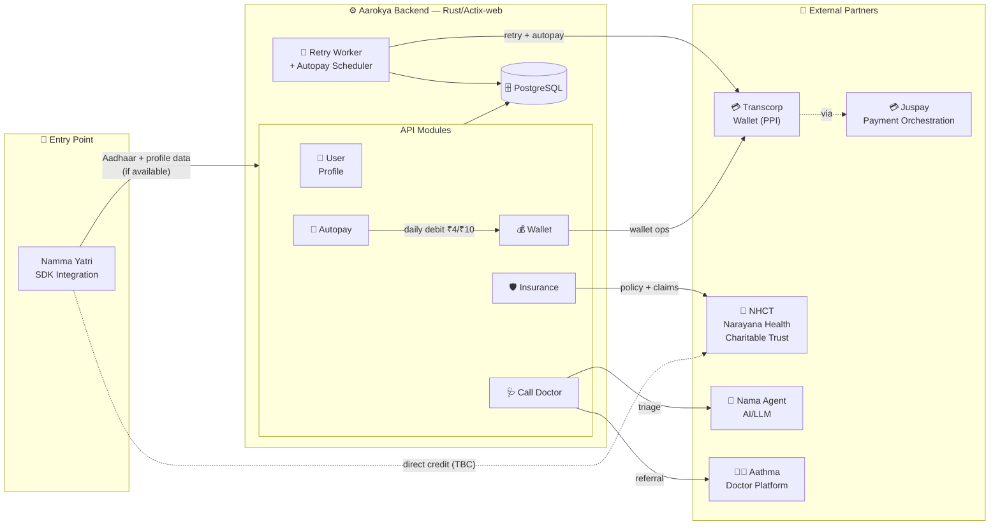
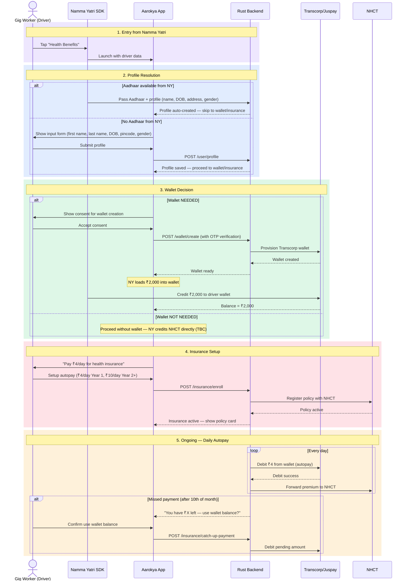
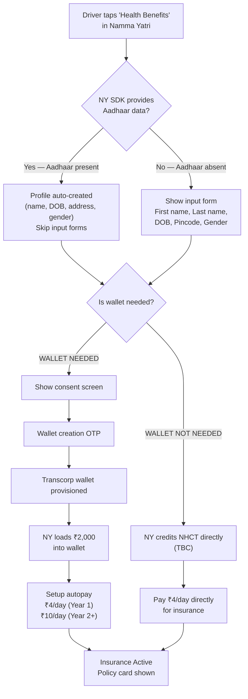
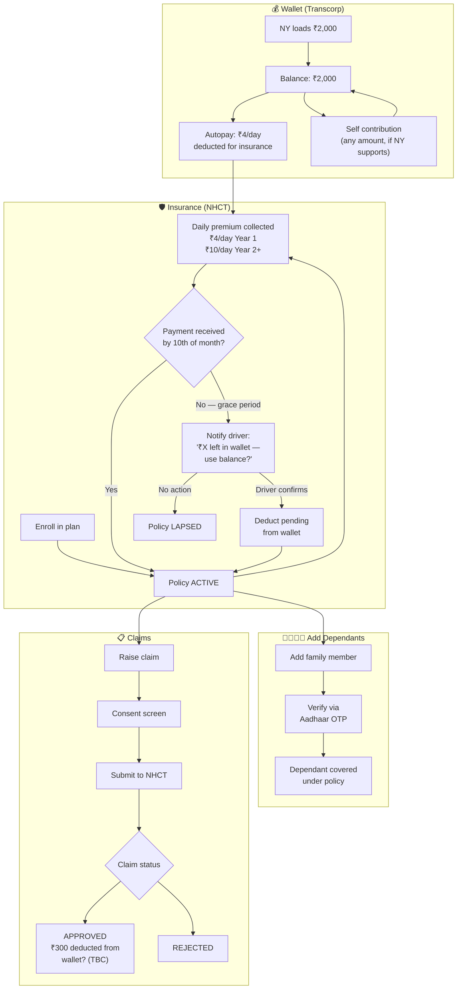
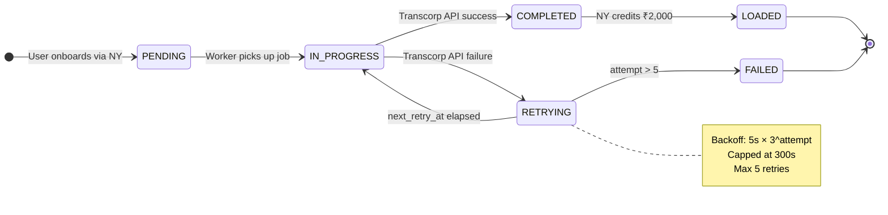
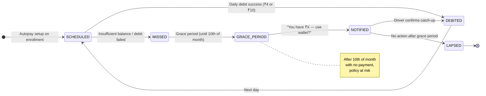

## High-Level Architecture

---

## Domain Breakdown

<CardGroup cols={2}>
  <Card title="User Profile" icon="user" color="#3b82f6">
    **Tables:** `users`

    Aadhaar from Namma Yatri auto-populates profile and skips to wallet/insurance. If no Aadhaar, driver fills input form (first name, last name, DOB, pincode, gender). No separate phone OTP auth — identity comes from NY SDK.

  </Card>
  <Card title="Wallet" icon="wallet" color="#16a34a">
    **Tables:** `customer_wallets`

    Transcorp wallet created with OTP consent. NY loads ₹2,000 initial balance. Supports self-contribution and autopay deductions for insurance.

  </Card>
  <Card title="Insurance" icon="shield-heart" color="#ec4899">
    **Tables:** `insurance_plans`, `insurance_policies`, `policy_dependants`, `autopay_schedules`

    Micropayment model: ₹4/day (Year 1), ₹10/day (Year 2+). Dependants added via Aadhaar OTP. Claims forwarded to NHCT.

  </Card>
  <Card title="Autopay" icon="arrows-rotate" color="#06b6d4">
    **Tables:** `autopay_schedules`, `autopay_transactions`

    Daily debit from wallet for insurance premium. Grace period until 10th of month. Notification on missed payments with wallet balance prompt.

  </Card>
  <Card title="Call Doctor" icon="stethoscope" color="#8b5cf6">
    **Tables:** `chat_sessions`, `chat_messages`

    Nama Agent conversation → clinical summary → Aathma assignment. Session locked after submission.

  </Card>
</CardGroup>

---

## User Journey — Full Flow (Namma Yatri Entry)

---

## Onboarding Decision Flow

---

## Wallet + Insurance Lifecycle

---

## Background Workers

Two background workers run on startup:

1. **Wallet Provisioning Worker** — polls every 10 seconds for stalled wallet creation jobs
2. **Autopay Scheduler** — runs daily, debits ₹4 (Year 1) or ₹10 (Year 2+) from each active wallet for insurance premium

### Wallet Provisioning State Machine

### Autopay + Grace Period Flow

---

## Security Model

<CardGroup cols={2}>
  <Card title="NY SDK Identity" icon="id-card" color="#7c3aed">
    Driver identity is established by Namma Yatri SDK. Aadhaar data (when present) is passed securely from NY — no separate phone OTP auth required.
  </Card>
  <Card title="PII Protection" icon="eye-slash" color="#059669">
    Aadhaar stored as last 4 digits only. All PII fields encrypted at rest
    (application-level). Masked in all API responses.
  </Card>
  <Card title="Wallet OTP" icon="shield-check" color="#0891b2">
    Wallet creation requires a separate OTP consent flow via Transcorp. This is the only OTP in the system — used for wallet provisioning, not login.
  </Card>
  <Card title="Aadhaar OTP (Dependants)" icon="users" color="#dc2626">
    Adding dependants to insurance requires Aadhaar OTP verification for each family member. Ensures only verified individuals are covered.
  </Card>
</CardGroup>
