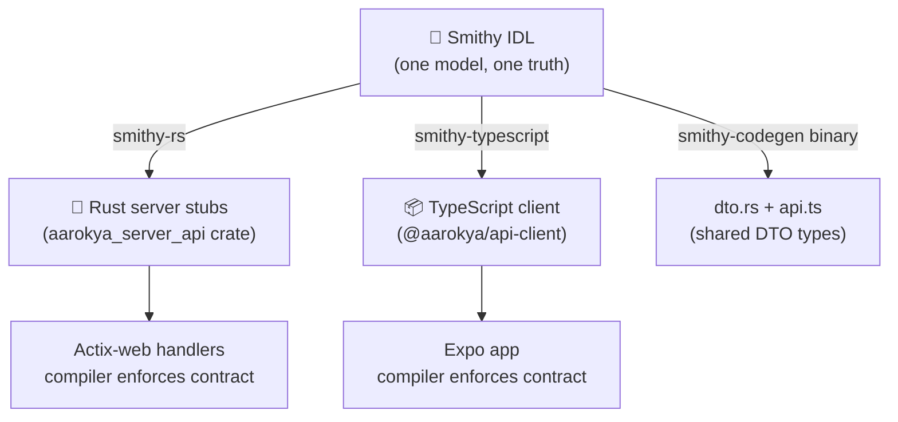

<Note>
  **Status:** Accepted · **Date:** 2025-Q1 · **Deciders:** Aarokya Engineering
</Note>

## Context

Aarokya has a Rust backend and a TypeScript/React Native frontend. Both ends need to agree on the exact shape of every API request and response. The traditional approach has three common failure modes:

1. **Rust team writes structs** → TypeScript team writes matching types by hand → they silently diverge
2. **OpenAPI-first** → spec written by hand → developers forget to update it → it drifts from implementation
3. **Prose specs** → no enforcement → discovered at integration time, never before

We needed a single place where the contract lives, with *mechanical enforcement* that both ends stay in sync.

---

## Options Considered

<AccordionGroup>
  <Accordion title="Option A: Hand-written Rust structs + manual TypeScript types" icon="pen">
    Each team maintains their own type definitions. OpenAPI optionally generated from Rust annotations (utoipa).

    **Pros:**
    - Simple to set up — no new tooling
    - Teams work independently

    **Cons:**
    - Guaranteed to drift over time
    - No compile-time enforcement of the contract on the TypeScript side
    - Review burden falls on humans ("did you update the TS types?")

    **Verdict:** Rejected. Drift is a when, not an if.
  </Accordion>

  <Accordion title="Option B: OpenAPI-first (write spec by hand)" icon="file-code">
    Write an `openapi.yaml` as the source of truth. Generate Rust server stubs and TypeScript clients from it using `openapi-generator` or similar.

    **Pros:**
    - Industry-standard format
    - Huge ecosystem of tooling

    **Cons:**
    - OpenAPI YAML is verbose and error-prone to maintain by hand
    - `openapi-generator` Rust output is generally poor quality — requires significant post-processing
    - Two serialization concerns: OpenAPI semantics and HTTP protocol details collapse into the same file
    - No built-in model validation (OpenAPI is a document format, not a type system)

    **Verdict:** Rejected. The Rust codegen quality was a blocker.
  </Accordion>

  <Accordion title="Option C: Smithy IDL (chosen)" icon="star" defaultOpen>
    Write API shapes in Smithy IDL. Use **smithy-rs** to generate type-safe Rust server stubs and **smithy-typescript** to generate a typed npm client.

    **Pros:**
    - Smithy is a proper type system with constraints, traits, and protocol semantics
    - smithy-rs generates production-quality Rust (used by AWS SDK for Rust internally)
    - The TypeScript client is fully typed — the compiler catches mismatches
    - Single model file is the definitive contract — not documentation
    - Protocol (`@restJson1`) is declared in the model, not scattered across YAML

    **Cons:**
    - Requires JVM + Smithy CLI — non-trivial first-time setup
    - Smaller community than OpenAPI
    - No native OpenAPI export in the codegen path (we handle this separately via utoipa)

    **Verdict:** Accepted.
  </Accordion>
</AccordionGroup>

---

## Decision

**Use Smithy IDL as the single source of truth for all API contracts.**

Separately, the Rust backend uses **utoipa** to generate an OpenAPI JSON spec from code annotations. This powers the Swagger UI developer tooling — but it is **downstream of the implementation**, not upstream of it.

---

## Consequences

<CardGroup cols={2}>
  <Card title="Gained" icon="circle-check" color="#16a34a">
    - Contract mismatch caught at compile time on both ends
    - No "did you update the types?" in code review
    - Smithy model is the source of truth — not a document, not prose
    - AWS-grade codegen quality for Rust (smithy-rs)
  </Card>
  <Card title="Trade-offs accepted" icon="triangle-exclamation" color="#f59e0b">
    - JVM dependency for codegen (not for runtime)
    - First-time setup is non-trivial (see `smithy/SETUP.md`)
    - Any model change requires running `smithy build` before the backend compiles
    - Smaller ecosystem than OpenAPI for tooling
  </Card>
</CardGroup>

---

## Related

- [ADR-002: Rust Stack](/decisions/adr-002-rust-stack)
- [Codegen Pipeline](/architecture/codegen-pipeline)
