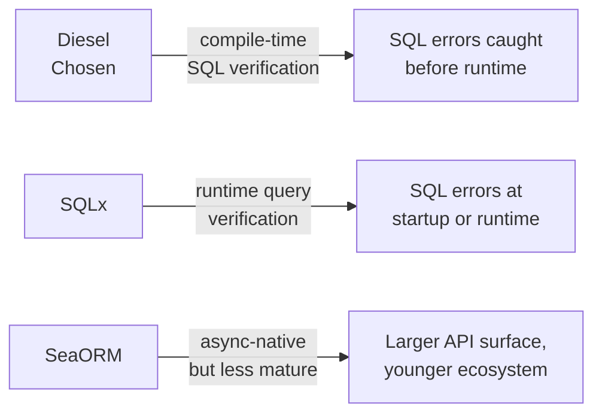

<Note>
  **Status:** Accepted · **Date:** 2025-Q1 · **Deciders:** Aarokya Engineering
</Note>

## Context

We needed a backend that could:
- Handle concurrent payment webhook processing without data races
- Be deployed on constrained infrastructure (cost matters for a gig-worker product)
- Integrate with an existing Rust/Smithy expertise within the team
- Give us compile-time guarantees on SQL queries and API contract shapes

---

## Language Decision: Rust

<AccordionGroup>
  <Accordion title="Why not Node.js / TypeScript?" icon="node-js">
    Node is the natural choice given the TypeScript frontend. However:
    - Payment processing logic benefits from strong type safety and no null/undefined surprises
    - The GIL-equivalent in Node's event loop limits true CPU parallelism for compute-heavy operations
    - Memory safety guarantees matter when handling financial data
    - Team had deeper Rust expertise for this domain

    **Verdict:** Not chosen for backend core (TypeScript used for generated client SDK only).
  </Accordion>

  <Accordion title="Why not Go?" icon="golang">
    Go is a strong contender with excellent concurrency primitives, fast compile times, and a mature ecosystem.

    - Go would have been a reasonable choice
    - Rust was preferred for the compile-time safety guarantees on DB queries (Diesel) and API contracts (smithy-rs)
    - The team's existing Rust proficiency tipped the decision

    **Verdict:** Not chosen, but acknowledged as a valid alternative.
  </Accordion>

  <Accordion title="Rust" icon="gear" defaultOpen>
    - **Memory safety without GC** — no runtime crashes from null dereferences or data races
    - **Smithy-rs** generates production-quality code (it's what AWS uses internally)
    - **Diesel** provides compile-time verified SQL queries
    - **Excellent async story** via Tokio (used by both Actix-web and our async worker)
    - **Small binary, low memory footprint** — cost-efficient deployment

    **Verdict:** Chosen.
  </Accordion>
</AccordionGroup>

---

## Framework Decision: Actix-web

| Framework | Why Considered | Why Not Chosen |
|-----------|---------------|---------------|
| **Axum** | Type-safe routing, Tokio-native, rapidly growing | We evaluated Actix-web first; no compelling migration reason mid-project |
| **Rocket** | Ergonomic macros, good documentation | Historically had blocking issues in async contexts |
| **Actix-web** | Battle-tested, excellent performance, utoipa integration, mature ecosystem | — |

<Tip>
  Axum is an equally valid choice — both Actix-web and Axum are production-ready. We chose Actix-web due to team familiarity and the utoipa integration (OpenAPI generation for Swagger UI) being more mature at the time.
</Tip>

---

## ORM Decision: Diesel



**Why Diesel over SQLx:**
- Diesel's query builder is checked **at compile time** — a wrong column name or type mismatch is a compiler error, not a runtime panic
- For financial data (wallet balances, payment orders), this level of safety is worth the synchronous API trade-off
- SQLx's async advantage is partially mitigated by using `async-bb8-diesel` for the connection pool

---

## Architecture: How the Crates Fit Together

```yaml
backend/
├── crates/
│   ├── aarokya/          # Main service — routes, handlers, middleware
│   │   ├── src/
│   │   │   ├── core/     # Business logic (auth, user, wallet)
│   │   │   ├── db/       # Diesel query implementations
│   │   │   ├── routes/   # Actix-web route builders
│   │   │   ├── errors/   # Error types + HTTP error handlers
│   │   │   ├── services/ # External API clients (Juspay, NH)
│   │   │   └── openapi/  # utoipa OpenAPI generation
│   ├── api_models/       # Request/response types (serde + utoipa)
│   ├── domain_models/    # Core domain types
│   ├── diesel_models/    # Diesel ORM models + schema
│   ├── common_types/     # Shared primitive types
│   ├── common_enums/     # Shared enums (Gender, WalletStatus, ...)
│   └── aarokya_derive/   # Custom derive macros
```

---

## Consequences

<CardGroup cols={2}>
  <Card title="Gained" icon="circle-check" color="#16a34a">
    - Compile-time SQL safety (Diesel)
    - Compile-time API contract safety (smithy-rs)
    - Memory-safe concurrent payment processing
    - Low-memory production footprint
    - Strong ecosystem for background job patterns (Tokio tasks)
  </Card>
  <Card title="Trade-offs accepted" icon="triangle-exclamation" color="#f59e0b">
    - Diesel is synchronous — mitigated with `async-bb8-diesel` pool
    - Rust compile times are longer than Go/Node
    - Steeper onboarding curve for new engineers
    - Schema migrations require Diesel CLI (`diesel migration run`)
  </Card>
</CardGroup>
