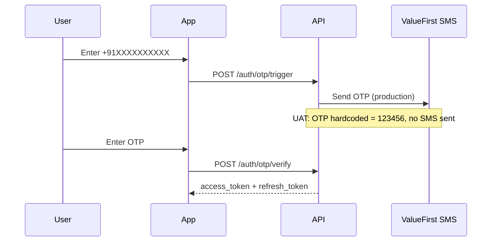
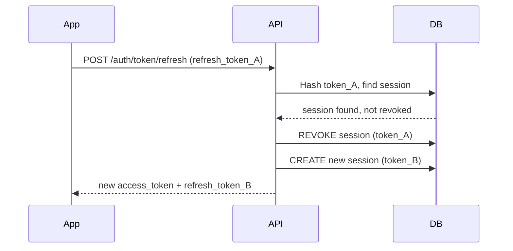
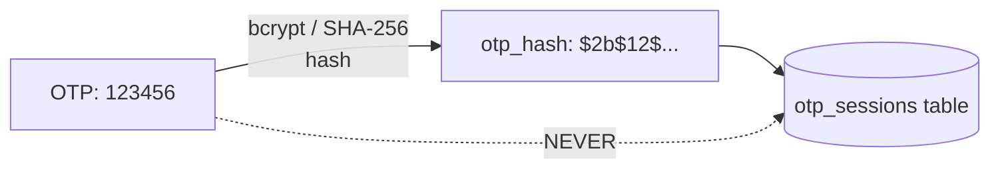

<Note>
  **Status:** Accepted · **Date:** 2025-Q1 · **Deciders:** Aarokya Engineering
</Note>

## Context

Aarokya targets gig workers who primarily use smartphones. Auth requirements:
- **Phone-first**: no passwords — OTP via SMS
- **Multi-device**: a user can be logged in on multiple devices simultaneously
- **Offline-tolerant**: access tokens must be verifiable without a DB round-trip
- **Revocable**: logout must work even if the access token hasn't expired

---

## Decisions Made

### 1. Phone OTP (not password-based)

Gig workers often share devices and don't remember passwords. OTP to SMS is the lowest-friction auth method for this demographic.

### 2. Stateless JWT Access Tokens (24h)

Access tokens are signed JWTs. Claims: `{ user_id, phone }`. No DB lookup needed on every request — the middleware just verifies the signature.

**Why 24h expiry?**
Shorter than typical (1h) because gig workers check the app irregularly. A 1h token would require frequent re-authentication mid-shift. The refresh token (30d) handles silent re-auth.

### 3. Refresh Token Rotation

<Warning>
  Refresh tokens are **single-use**. On every refresh, the old token is revoked and a new pair is issued atomically. If a stolen token is used, the legitimate user's next refresh attempt will fail (their token was already rotated).
</Warning>

### 4. OTP Stored as Hash (Never Plaintext)

**Additional protections on `otp_sessions`:**
- `expires_at` — OTP expires after a configurable window
- `verified_at` — set once on successful verify; prevents reuse
- `attempts` counter — limits brute-force attempts

### 5. Per-Device Sessions in `user_sessions`

Each device gets its own row in `user_sessions`. This enables:
- **Selective logout** (`POST /auth/logout`) — revoke just the current device's session
- **Logout all** — revoke all rows for a user
- **Audit trail** — `device_info`, `ip_address`, `last_used_at` per session

---

## Security Properties Summary

| Property | How Achieved |
|---------|-------------|
| OTP not guessable | Short-lived, hashed, single-use, attempt-limited |
| Access token forgery prevention | HMAC-SHA256 signed, secret only on server |
| Refresh token theft detection | Rotation — reuse of revoked token signals compromise |
| Session hijacking via stolen refresh token | Hashed in DB — raw token never persisted |
| Mass logout on compromise | Single DB query revokes all user sessions |
| Replay attacks on OTP | `verified_at` set on first use blocks reuse |

---

## Consequences

<CardGroup cols={2}>
  <Card title="Gained" icon="circle-check" color="#16a34a">
    - Stateless access token verification — no DB on every request
    - Per-device control — selective logout works
    - Refresh token rotation provides theft detection
    - No plaintext secrets in DB
  </Card>
  <Card title="Trade-offs accepted" icon="triangle-exclamation" color="#f59e0b">
    - Access tokens cannot be revoked mid-life (24h window)
    - Must store `user_sessions` table for refresh token management (not purely stateless)
    - OTP expiry window must be tuned for SMS delivery latency in India
  </Card>
</CardGroup>
