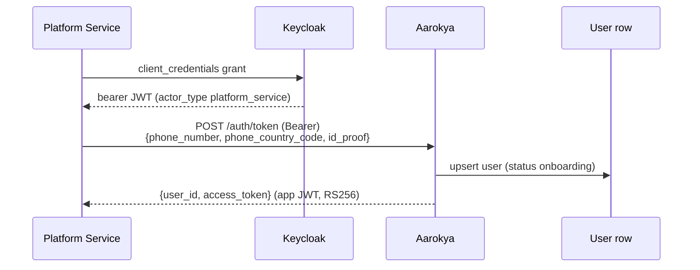

<Note>
  **Status:** Accepted · **Date:** 2025-Q1 · **Deciders:** Aarokya Engineering
</Note>

<Info>
  This design evolved. An earlier draft proposed a phone-OTP flow with refresh-token rotation and per-device session rows (`otp_sessions`, `user_sessions`). That was **not** what shipped — there is no OTP, no refresh token, and no server-side session table in the codebase. The Decision below documents what actually runs today.
</Info>

## Context

Aarokya is embedded inside a host platform (for example a driver app). The user never types a password or an OTP into Aarokya — the host platform already knows who they are. Auth requirements:
- **Platform-mediated identity**: the host platform vouches for the user and exchanges their identity for an app token.
- **Offline-tolerant**: app access tokens must be verifiable without a DB round-trip.
- **Separate admin plane**: admin, dashboard, and service actors authenticate through a central IdP with role information on the token.

---

## Decisions Made

### 1. App Token Issuance via Platform Service Account

There is exactly one token-issuance endpoint for app users: `POST /auth/token`. A **platform service account** (not the end user) calls it with the user's `{phone_number, phone_country_code, id_proof}` and receives `{user_id, access_token}`. The `access_token` is an app JWT signed RS256 by the backend.

The service account authenticates to Aarokya with a bearer JWT minted by Keycloak via the `client_credentials` grant; the route requires `actor_type: "platform_service"`.



### 2. Stateless RS256 App JWT

The app token is a signed JWT verified on every protected request by the auth middleware — no DB lookup, no server-side session row. The app is purely a bearer of this token. There is no refresh token; when the token expires the platform re-issues one through `POST /auth/token`.

The signing algorithm is pinned per issuer (`APP_JWT_ALGORITHM = RS256`) as a defense against algorithm-confusion attacks.

### 3. Keycloak OIDC for Admin / Dashboard / Service Actors

Admin, dashboard, benefit-provider, platform, and callback actors authenticate through **Keycloak OIDC**. Their tokens are JWKS-verified (signature + `iss` + `aud` + `exp`), and an `actor_type` claim drives role-based access. The `actor_type` discriminator covers app users plus admin, readonly-admin, admin-service, benefit-provider (human + service), platform (human + service), and callback-service roles.

```mermaid
sequenceDiagram
    participant Actor as Admin / Service
    participant KC as Keycloak (OIDC)
    participant API as Aarokya

    Actor->>KC: OIDC login / client_credentials
    KC-->>Actor: JWT (actor_type claim)
    Actor->>API: Request with Bearer JWT
    API->>API: JWKS verify (iss, aud, exp) + role check
    API-->>Actor: Authorized response
```

### 4. No OTP, No Refresh Token, No Session Table

The app auth path has no SMS step, no OTP, and no refresh token. There are no `otp_sessions` or `user_sessions` tables — app sessions are entirely stateless JWTs. (A separate dashboard OIDC flow does use Keycloak-managed refresh cookies for browser sessions, but that is the IdP's mechanism, not an Aarokya-owned token store.)

---

## Security Properties Summary

| Property | How Achieved |
|---------|-------------|
| App token forgery prevention | RS256-signed; private key only on server, algorithm pinned per issuer |
| Admin/service token integrity | JWKS-verified (signature + `iss` + `aud` + `exp`) against Keycloak |
| Authorization | `actor_type` claim checked per route (e.g. `require_platform_service`) |
| User cannot self-mint tokens | Only a `platform_service` actor may call `POST /auth/token` |
| Secrets in transit/at rest | Phone numbers and access tokens wrapped in `Secret<T>`; never logged plaintext |

---

## Consequences

<CardGroup cols={2}>
  <Card title="Gained" icon="circle-check" color="#16a34a">
    - Stateless app token verification — no DB on every request
    - No OTP/SMS dependency or delivery-latency tuning
    - One central IdP (Keycloak) for all admin/service roles
    - No session/OTP tables to secure, rotate, or reconcile
  </Card>
  <Card title="Trade-offs accepted" icon="triangle-exclamation" color="#f59e0b">
    - App tokens cannot be revoked mid-life — re-issuance is platform-driven
    - Auth depends on the host platform's service-account integrity
    - Keycloak is a hard runtime dependency for the admin/service plane
  </Card>
</CardGroup>
