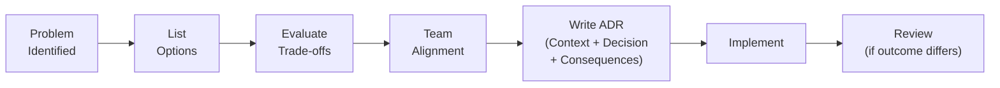

## Decision Log

We document significant architectural decisions as **Architecture Decision Records (ADRs)**. Each ADR captures the context, the options considered, the decision made, and the trade-offs accepted.

<CardGroup cols={2}>
  <Card title="ADR-001: Smithy as API IDL" icon="code" href="/decisions/adr-001-smithy" color="#f59e0b">
    Why we chose Smithy over OpenAPI-first or hand-written contracts as the single source of truth.
  </Card>
  <Card title="ADR-002: Rust + Actix-web" icon="gear" href="/decisions/adr-002-rust-stack" color="#16a34a">
    Why Rust over Go/Node for the backend, and why Actix-web + Diesel over Axum or SQLx.
  </Card>
  <Card title="ADR-003: JWT Auth Design" icon="lock" href="/decisions/adr-003-auth-design" color="#0891b2">
    Platform-service-account token issuance, stateless app JWTs (RS256), and Keycloak OIDC for admin/dashboard actors.
  </Card>
  <Card title="ADR-004: Provider-Keyed Consultation Messages" icon="comments" href="/decisions/adr-004-provider-keyed-consultation-messages" color="#7c3aed">
    Per-provider chat message contracts via a discriminated union. **Superseded by ADR-005** for the wire shape.
  </Card>
  <Card title="ADR-005: Neutral Consultation Message Shape" icon="comments" href="/decisions/adr-005-neutral-consultation-message-shape" color="#7c3aed">
    Replace the per-provider message union with one neutral wire shape we own; adapters map upstream messages into it.
  </Card>
</CardGroup>

---

## Decision Summary Table

| # | Decision | Status | Date |
|---|----------|--------|------|
| ADR-001 | Smithy IDL as API source of truth | Accepted | 2025-Q1 |
| ADR-002 | Rust + Actix-web + Diesel + PostgreSQL | Accepted | 2025-Q1 |
| ADR-003 | Bearer JWT auth (service-account issuance + Keycloak OIDC) | Accepted | 2025-Q1 |
| ADR-004 | Provider-Keyed Consultation Messages | Superseded by ADR-005 (wire) | 2026-Q2 |
| ADR-005 | Neutral Consultation Message Shape | Accepted | 2026-05 |

---

## How We Make Decisions

