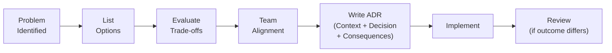

## Decision Log

We document significant architectural decisions as **Architecture Decision Records (ADRs)**. Each ADR captures the context, the options considered, the decision made, and the trade-offs accepted.

<CardGroup cols={2}>
  <Card title="ADR-001: Smithy as API IDL" icon="code" href="/decisions/adr-001-smithy" color="#f59e0b">
    Why we chose Smithy over OpenAPI-first or hand-written contracts as the single source of truth.
  </Card>
  <Card title="ADR-002: Rust + Actix-web" icon="gear" href="/decisions/adr-002-rust-stack" color="#16a34a">
    Why Rust over Go/Node for the backend, and why Actix-web + Diesel over Axum or SQLx.
  </Card>
  <Card title="ADR-003: JWT Auth Design" icon="lock" href="/decisions/adr-003-auth-design" color="#0891b2">
    Token rotation, OTP hashing, device-level sessions, and the stateless access token approach.
  </Card>
</CardGroup>

---

## Decision Summary Table

| # | Decision | Status | Date |
|---|----------|--------|------|
| ADR-001 | Smithy IDL as API source of truth | Accepted | 2025-Q1 |
| ADR-002 | Rust + Actix-web + Diesel + PostgreSQL | Accepted | 2025-Q1 |
| ADR-003 | JWT stateless auth with token rotation | Accepted | 2025-Q1 |
| ADR-004 | Async wallet provisioning with retry worker | Accepted | 2025-Q1 |
| ADR-005 | No OpenAPI in Smithy codegen path | Accepted | 2025-Q1 |

---

## How We Make Decisions

