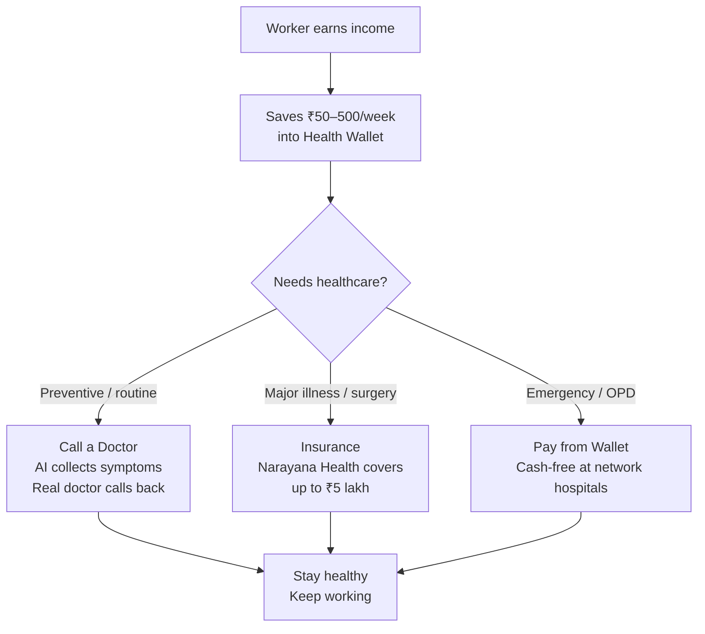

<p align="center">
  
</p>

## Are you ok?

That's what "Aarokya" asks — it's a name that phonetically echoes *"Are you ok?"*, rooted in the Sanskrit word for wholistic wellbeing. For India's delivery riders, drivers, domestic workers, and construction workers, the answer has too often been: *not really*.

Aarokya changes that. It's a healthcare super-app that brings together a health savings wallet, affordable insurance, and on-demand doctor access — all in one place, built for people who've never had any of this before.

---

## Who Is Aarokya For?

India has over **200 million gig workers** — delivery riders on Swiggy and Zomato, auto and cab drivers on Ola and Namma Yatri, domestic workers, construction laborers, and daily-wage earners across every city and town. These workers are:

- **Uninsured:** Most have never bought health insurance. Premiums feel inaccessible, the paperwork is confusing, and no one explains what is actually covered.
- **Unbanked or under-banked:** Many do not have savings set aside for a medical emergency. A hospitalization can wipe out months of earnings.
- **Without easy access to doctors:** Taking time off for a clinic visit means lost income. Specialist consultations feel expensive and distant.
- **Digitally capable but underserved:** These workers use smartphones every day for work — but fintech and health-tech apps are built for urban professionals, not for them.

Aarokya meets gig workers where they are: on their phone, in their language, with products priced for their income.

---

## The Problem We Solve

<CardGroup cols={3}>
  <Card title="No safety net" icon="triangle-exclamation" color="#dc2626">
    A single hospitalization costs ₹30,000–₹1,50,000 on average. Without insurance or savings, gig workers borrow from money lenders at high interest rates, or simply delay care until it is too late.
  </Card>
  <Card title="Insurance is opaque" icon="eye-slash" color="#f59e0b">
    Buying insurance requires understanding plan types, exclusions, waiting periods, and claim processes. For a first-time buyer, this is a wall of jargon that keeps them uninsured.
  </Card>
  <Card title="Doctors feel inaccessible" icon="hospital" color="#8b5cf6">
    A clinic visit costs time and money. Knowing what to tell a doctor — and getting the right specialist — is hard without any medical literacy. Symptoms get ignored until they become emergencies.
  </Card>
</CardGroup>

---

## How the Three Features Work Together



The wallet, insurance, and doctor features are not three separate products — they are one integrated safety net:

1. **Save regularly** — small weekly contributions into a ring-fenced health wallet
2. **Stay covered** — buy a Narayana Health insurance plan in minutes, paid from the wallet or directly
3. **Get care quickly** — describe symptoms to an AI, get triaged, and speak to a real doctor without leaving home

---

## The "Are you ok?" Brand Story

The name *Aarokya* works on two levels. In Sanskrit, *Ārogya* (आरोग्य) means the state of being free from disease — wholistic physical and mental wellbeing. But phonetically, when spoken aloud, it echoes the simple question: *"Are you ok?"*

That question is the product's core philosophy. In the age of AI and automation, gig workers are becoming invisible to the systems that serve them. Aarokya is a counter-statement: **in the age of AI, empathy will matter even more.** Every product decision — the OTP-only login that doesn't require remembering passwords, the AI that collects symptoms conversationally before connecting to a real human doctor, the wallet that accepts small contributions without minimum balance requirements — is designed to say, implicitly: *we see you, and we're asking if you're ok.*

---

<CardGroup cols={3}>
  <Card title="Health Savings Wallet" icon="wallet" color="#16a34a" href="/modules/wallet">
    A digital health wallet that can receive contributions from you, your employer, your platform, or family. Money flows only toward healthcare.
  </Card>
  <Card title="Insurance" icon="shield-heart" color="#ec4899" href="/modules/insurance">
    Browse Narayana Health plans, see the exact premium for your family, and buy a policy in minutes.
  </Card>
  <Card title="Call a Doctor" icon="stethoscope" color="#8b5cf6" href="/modules/call-doctor">
    Describe your symptoms through a chat. AI collects and summarizes your case, then connects you to a real doctor.
  </Card>
</CardGroup>

---

## Get Started in 3 Steps

<Steps>
  <Step title="Log in with your phone">
    No passwords. Enter your number, receive an OTP, and you're in. The first login creates your account and provisions your health wallet automatically.
    ```bash
    curl -X POST https://api.aarokya.in/auth/otp/trigger \
      -H 'Content-Type: application/json' \
      -d '{"phone": "9876543210"}'
    ```
  </Step>
  <Step title="Verify OTP and get your token">
    Exchange the OTP for a JWT access token. A wallet is automatically created in the background.
    ```bash
    curl -X POST https://api.aarokya.in/auth/otp/verify \
      -H 'Content-Type: application/json' \
      -d '{"phone": "9876543210", "otp": "123456"}'
    ```
    Response includes `access_token`, `refresh_token`, and `is_new_user`.
  </Step>
  <Step title="Call any endpoint">
    Pass the token as a Bearer header on every request. The access token lasts 24 hours; use the refresh token to get a new pair before it expires.
    ```bash
    curl https://api.aarokya.in/user/profile \
      -H 'Authorization: Bearer <access_token>'
    ```
  </Step>
</Steps>

<Note>
  **Testing locally:** OTP is hardcoded as `123456` — no SMS is sent. Use `http://localhost:8080` as the base URL.
</Note>

---

## Explore

<CardGroup cols={2}>
  <Card title="API Reference" icon="code" href="/api/overview">
    Authentication, error codes, rate limits, and the interactive Try It Out playground.
  </Card>
  <Card title="Module Guides" icon="book-open" href="/modules/overview">
    Deep dives into Wallet, Insurance, Call Doctor, Auth, and User Profile.
  </Card>
  <Card title="System Architecture" icon="sitemap" href="/architecture/system-overview">
    How the mobile app, Rust backend, Juspay, and Narayana Health fit together.
  </Card>
  <Card title="Architecture Decisions" icon="lightbulb" href="/decisions/overview">
    Why Rust, why Smithy, and how we designed the auth system.
  </Card>
</CardGroup>

---

## Common Questions

<AccordionGroup>
  <Accordion title="Why does Aarokya not require passwords?">
    Gig workers use multiple devices, share phones with family members, and frequently change SIM cards. A password-based system would result in high account recovery rates and locked-out users. Phone OTP is familiar (every UPI app uses it), works on any device, and requires no memory burden. It also has a meaningful secondary benefit: the phone number acts as the identity anchor, which ties neatly into Aadhaar-based KYC when needed for insurance.
  </Accordion>
  <Accordion title="How is the wallet different from a bank account?">
    The health wallet is **ring-fenced** — money in it can only be used for healthcare expenses. This is intentional: it prevents health savings from being spent on other expenses, which is the most common reason medical emergency funds disappear. The wallet is powered by Juspay/Transcorp and operates under the RBI's Prepaid Payment Instrument (PPI) framework.
  </Accordion>
  <Accordion title="What happens if the user doesn't have insurance and gets hospitalised?">
    In that case they can use their wallet balance to pay for OPD, pharmacy, and other covered expenses at network hospitals. Aarokya encourages buying insurance, but the wallet is immediately useful even before a policy is purchased. The app also surfaces insurance options at the moment of care — "you'd be covered for this if you had Plan X."
  </Accordion>
  <Accordion title="What is Narayana Health's role?">
    Narayana Health (NH) is one of India's largest hospital networks, known for making cardiac surgery affordable. They provide: (a) insurance plans that workers can buy through Aarokya, (b) the Aathma doctor assignment platform used for teleconsultations, and (c) a network of hospitals where wallet payments are accepted.
  </Accordion>
  <Accordion title="Is the backend production-ready?">
    The Auth and User Profile modules are production-grade. The Wallet module currently has a local stub — full Juspay/Transcorp integration is in progress. Insurance and Call Doctor modules are planned and have complete endpoint contracts defined.
  </Accordion>
  <Accordion title="How do I run the backend locally?">
    See the repository README for local setup. The backend requires PostgreSQL and a `.env` file with the right secrets. Once running, the local base URL is `http://localhost:8080`. All OTPs are `123456` in the local environment.
  </Accordion>
</AccordionGroup>
