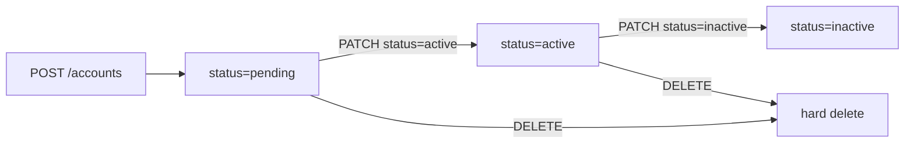

<Info>
  **Auth guard:** JWT self-access (`jwt.sub == user_id`) or any external partner
  key. Admin key is not accepted — use partner key for programmatic access.
</Info>

## Overview

An account stores a user's external account reference (`external_account_id`, e.g. a bank account number). For type-specific metadata (e.g. IFSC for `SAVINGS`), use the optional `account_details` JSONB field. All routes are scoped under `/users/{user_id}/accounts`. Accounts are created with `status = pending` by default.

---

## Account Types

| Value       | Description               |
| ----------- | ------------------------- |
| `savings`   | Savings bank account      |
| `hsa`       | Health Savings Account    |
| `education` | Education savings account |

---

## Auth Guards by Endpoint

| Endpoint                                | JWT user   | Partner key | Notes                              |
| --------------------------------------- | ---------- | ----------- | ---------------------------------- |
| `POST /users/{user_id}/accounts`        | ✓ own only | ✓           |                                    |
| `GET /users/{user_id}/accounts`         | ✓ own only | ✓           | Filter by `status`, `account_type` |
| `GET /users/{user_id}/accounts/{id}`    | ✓ own only | ✓           |                                    |
| `PATCH /users/{user_id}/accounts/{id}`  | ✓ own only | ✓           | Only `status` updatable            |
| `DELETE /users/{user_id}/accounts/{id}` | ✓ own only | ✓           | Hard delete                        |

JWT users receive `403` if `user_id` in the path does not match `jwt.sub`.

---

## Account Lifecycle



---

## Endpoints

<CardGroup cols={2}>
  <Card
    title="POST /users/{user_id}/accounts"
    icon="plus"
    color="#16a34a"
    href="/api/endpoints/accounts/create"
  >
    Create a new account.
  </Card>
  <Card
    title="GET /users/{user_id}/accounts"
    icon="list"
    color="#3b82f6"
    href="/api/endpoints/accounts/list"
  >
    Paginated list. Filter by `status` or `account_type`.
  </Card>
  <Card
    title="GET /users/{user_id}/accounts/{id}"
    icon="credit-card"
    color="#3b82f6"
    href="/api/endpoints/accounts/get"
  >
    Fetch a single account.
  </Card>
  <Card
    title="PATCH /users/{user_id}/accounts/{id}"
    icon="pen"
    color="#8b5cf6"
    href="/api/endpoints/accounts/update"
  >
    Update account `status`.
  </Card>
  <Card
    title="DELETE /users/{user_id}/accounts/{id}"
    icon="trash"
    color="#dc2626"
    href="/api/endpoints/accounts/delete"
  >
    Hard delete an account.
  </Card>
</CardGroup>

---

## Request / Response Examples

<CodeGroup>
```bash Create an account
curl -X POST http://localhost:8080/users/047382910564/accounts \
  -H 'Authorization: Bearer eyJhbGci...' \
  -H 'Content-Type: application/json' \
  -d '{
    "external_account_id": "12345678",
    "account_type": "SAVINGS",
    "account_details": {
      "account_type": "SAVINGS",
      "ifsc_code": "HDFC0001234"
    }
  }'
```

```json Response 201
{
  "id": "01926b3a-7c2e-7d4f-a1b2-c3d4e5f60040",
  "user_id": "047382910564",
  "external_account_id": "12345678",
  "status": "PENDING",
  "account_type": "SAVINGS",
  "account_details": {
    "account_type": "SAVINGS",
    "ifsc_code": "HDFC0001234"
  },
  "created_at": "2026-04-12T10:00:00Z",
  "last_modified_at": "2026-04-12T10:00:00Z"
}
```

</CodeGroup>

---

## Error Codes

| Code     | HTTP | Description           |
| -------- | ---- | --------------------- |
| `AE-800` | 500  | Internal server error |
| `AE-801` | 404  | Account not found     |
| `AE-803` | 400  | Validation error      |
