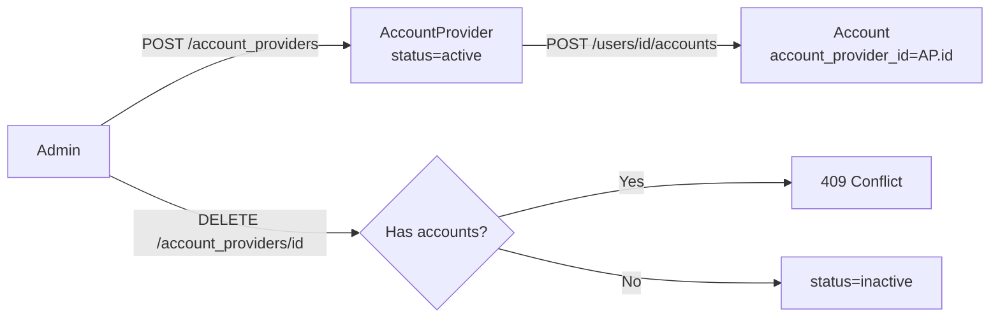

<Info>
  **Auth guard:** `admin-api-key` header required for all endpoints. No JWT or partner key access.
</Info>

## Overview

An **account provider** is a financial or health institution (e.g. a bank, HSA custodian, or insurer) that can be linked to user accounts. Providers are global configuration managed exclusively by platform administrators.

- **Name uniqueness is global.** No two providers may share the same name.
- **Delete is guarded.** A provider with associated accounts cannot be deleted.

---

## Data Flow



---

## Auth Guards by Endpoint

| Endpoint | Admin key | Notes |
|----------|-----------|-------|
| `POST /account_providers` | ✓ | Name must be unique |
| `GET /account_providers` | ✓ | Filter by `status` |
| `GET /account_providers/{id}` | ✓ | |
| `PATCH /account_providers/{id}` | ✓ | `name` and/or `status` updatable |
| `DELETE /account_providers/{id}` | ✓ | Blocked if accounts exist |

---

## Endpoints

<CardGroup cols={2}>
  <Card title="POST /account_providers" icon="plus" color="#16a34a" href="/api/endpoints/account_providers/create">
    Create a new account provider. Name must be unique.
  </Card>
  <Card title="GET /account_providers" icon="list" color="#3b82f6" href="/api/endpoints/account_providers/list">
    Paginated list. Filter by `status`.
  </Card>
  <Card title="GET /account_providers/{id}" icon="building-columns" color="#3b82f6" href="/api/endpoints/account_providers/get">
    Fetch a single provider by UUID.
  </Card>
  <Card title="PATCH /account_providers/{id}" icon="pen" color="#8b5cf6" href="/api/endpoints/account_providers/update">
    Update name or status. New name must not conflict.
  </Card>
  <Card title="DELETE /account_providers/{id}" icon="trash" color="#dc2626" href="/api/endpoints/account_providers/delete">
    Delete provider. Returns 409 if it has associated accounts.
  </Card>
</CardGroup>

---

## Request / Response Examples

<CodeGroup>
```bash Create an account provider
curl -X POST http://localhost:8080/account_providers \
  -H 'admin-api-key: your-admin-key' \
  -H 'Content-Type: application/json' \
  -d '{ "name": "HDFC Bank" }'
```

```json Response 201
{
  "id": "01926b3a-7c2e-7d4f-a1b2-c3d4e5f60030",
  "name": "HDFC Bank",
  "status": "active",
  "created_at": "2026-04-12T10:00:00Z",
  "last_modified_at": "2026-04-12T10:00:00Z"
}
```
</CodeGroup>

---

## Error Codes

| Code | HTTP | Description |
|------|------|-------------|
| `APE-700` | 500 | Internal server error |
| `APE-701` | 404 | Account provider not found |
| `APE-702` | 409 | Name already exists |
| `APE-703` | 409 | Provider has associated accounts — delete accounts first |
| `APE-704` | 400 | Validation error (e.g. empty name) |
