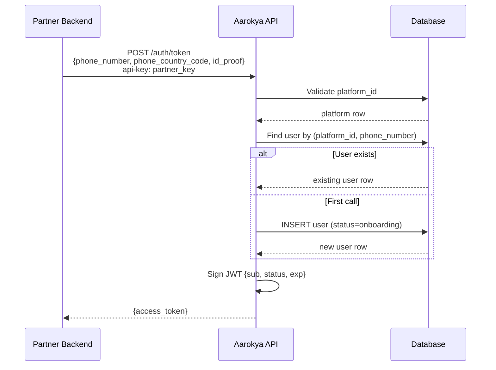

<Info>
  **Auth guard:** `api-key` header (external partner key). Partners cannot call admin endpoints. Admin cannot call this endpoint.
</Info>

## Overview

Aarokya does not own user authentication — that belongs to the partner app (e.g. Namma Yatri). The partner backend calls `POST /auth/token` with a verified phone number and receives a short-lived JWT scoped to that user. This is the only auth endpoint; there are no refresh tokens, OTP flows, or session management.

---

## Token Issuance Flow



---

## Find-or-Create Semantics

| Scenario | Behaviour |
|----------|-----------|
| First call for this phone + platform | Creates user with `status = onboarding`, returns token |
| Subsequent calls | Returns fresh token for existing user, reflects current `status` |
| User is deactivated | Returns error — deactivated users cannot receive tokens |

---

## JWT Claims

```json
{
  "sub": "047382910564",
  "status": "ONBOARDING",
  "iat": 1718000000,
  "exp": 1718086400
}
```

| Claim | Description |
|-------|-------------|
| `sub` | User ID — pass in `{user_id}` path params for all user-scoped calls |
| `status` | `onboarding` or `active` — drive onboarding UI from this |
| `exp` | Configurable via `jwt.expiry_hours`; call token again when expired |

---

## Endpoints

<CardGroup cols={1}>
  <Card title="POST /auth/token" icon="key" color="#16a34a" href="/api/endpoints/auth/generate-token">
    Issue a JWT for a user. Creates the user on first call. Requires partner `api-key` header.
  </Card>
</CardGroup>

---

## Request / Response Example

<CodeGroup>
```bash Generate token
curl -X POST http://localhost:8080/auth/token \
  -H 'api-key: your-partner-key' \
  -H 'Content-Type: application/json' \
  -d '{
    "phone_number": "9876543210",
    "phone_country_code": "+91",
    "id_proof": {
      "proof_type": "AADHAAR",
      "number": "123456789012"
    }
  }'
```

```json Response 201
{
  "access_token": "eyJhbGciOiJIUzI1NiIsInR5cCI6IkpXVCJ9..."
}
```
</CodeGroup>

---

## Error Codes

| Code | HTTP | Description |
|------|------|-------------|
| `AUE-300` | 500 | Internal server error |
| `AUE-301` | 401 | Invalid or expired token |
| `AUE-302` | 401 | Invalid API key |
| `AUE-303` | 403 | User account is not active |
| `AUE-304` | 400 | Invalid platform ID format |
| `AUE-305` | 400 | Platform not found |
| `AUE-306` | 400 | Platform is inactive |
| `AUE-307` | 422 | Onboarding already complete |
