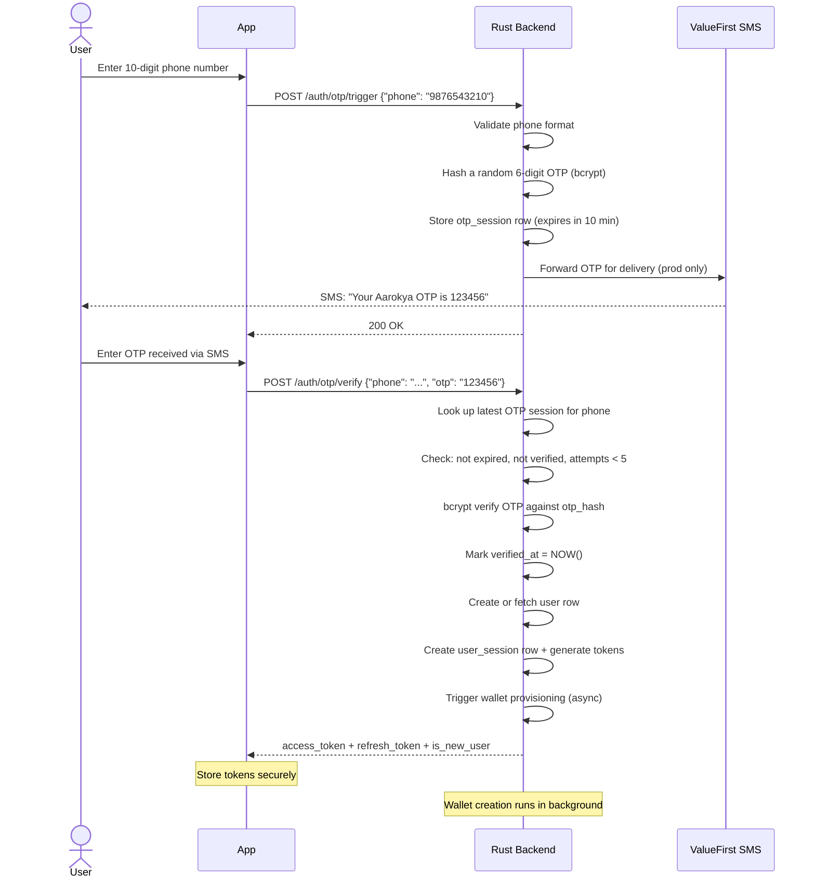
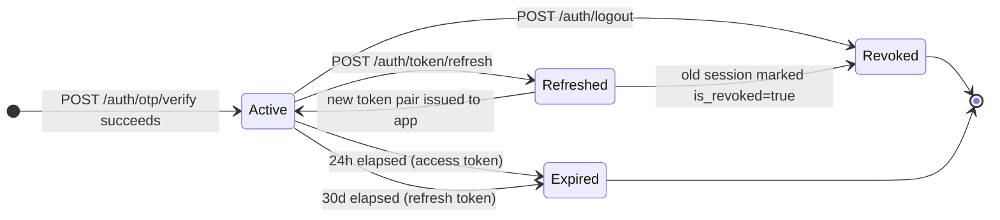
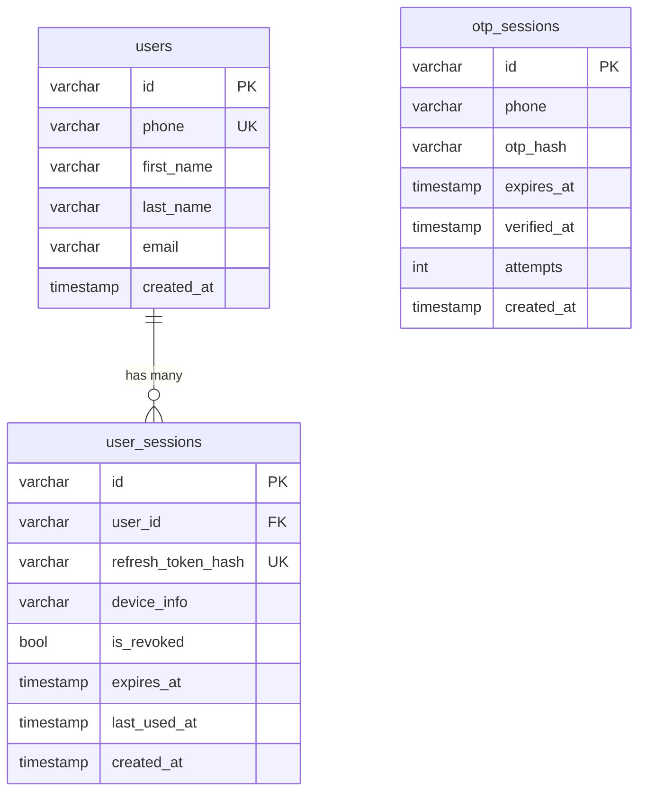

<Info>
  Aarokya supports **two authentication channels**:

  1. **Direct OTP login** -- for standalone use (phone OTP -> JWT). Auth endpoints are public except `POST /auth/logout`.
  2. **Partner SDK token** -- for embedded SDK use (NammaYatri backend requests token via API key). See [SDK Authentication](/api/sdk-authentication).

  **UAT:** OTP is hardcoded as `123456` — no SMS is sent in the sandbox environment.
</Info>

## Why No Passwords?

Aarokya's primary users are gig workers — delivery riders, drivers, domestic workers. Designing for this user base led directly to a password-free system:

- **Multiple devices:** A delivery rider may use a shared household phone in the morning and a company-issued device in the evening. Passwords create friction at every device switch.
- **No password manager culture:** The target audience does not use password managers. Passwords get forgotten, leading to support calls and account lockouts.
- **OTP is already trusted:** Every UPI payment in India uses OTP as the authentication primitive. Users already understand the flow — enter your number, get an SMS, enter the code.
- **Reduced credential stuffing risk:** Without passwords, there are no stored credential pairs that can be harvested from a breach and reused elsewhere.
- **Natural alignment with phone number as identity:** In India, the mobile number is the primary digital identity. It links to Aadhaar, UPI, and now to Aarokya.

---

## OTP Flow — Step by Step



### OTP Timing Constraints

| Parameter | Value | Notes |
|-----------|-------|-------|
| OTP validity | 10 minutes | `expires_at = created_at + 10 min` |
| Max attempts | 5 | Session permanently invalidated after 5 failures |
| Access token lifetime | 24 hours | JWT `exp` claim |
| Refresh token lifetime | 30 days | `user_sessions.expires_at` |
| OTP length | 6 digits | Numeric only |
| OTP generation | CSPRNG | Never predictable |

---

## Endpoints

<CardGroup cols={2}>
  <Card title="POST /auth/otp/trigger" icon="phone" color="#f59e0b">
    Send OTP to phone number. UAT always succeeds and returns `otp: "123456"` in the response body (dev convenience — not present in production).
  </Card>
  <Card title="POST /auth/otp/verify" icon="check" color="#16a34a">
    Verify OTP → JWT pair + `is_new_user` flag. Triggers wallet provisioning on success. Increments `attempts` on every wrong OTP.
  </Card>
  <Card title="POST /auth/token/refresh" icon="arrows-rotate" color="#3b82f6">
    Exchange a valid refresh token for a new token pair. Old refresh token is **revoked immediately** (single-use rotation).
  </Card>
  <Card title="POST /auth/logout" icon="right-from-bracket" color="#dc2626">
    Revoke current device session. Requires `Authorization: Bearer` header. Other active sessions on other devices are unaffected.
  </Card>
</CardGroup>

---

## Security Model

### OTP Security

<CardGroup cols={2}>
  <Card title="OTP Hashing" icon="shield-check" color="#0891b2">
    OTP is hashed with **bcrypt** (cost factor 12) before storage. The plaintext OTP is never written to the database. When the user submits their OTP, it is verified against the bcrypt hash using constant-time comparison.
  </Card>
  <Card title="Single Use" icon="ban" color="#dc2626">
    `verified_at` is set on the first successful verification. Any subsequent call to verify with the same OTP — even the correct one — returns `INVALID_OTP`. This prevents replay attacks.
  </Card>
  <Card title="Brute Force Protection" icon="shield" color="#7c3aed">
    `attempts` is incremented atomically on every wrong OTP. After 5 failures, the session is permanently invalidated — no further attempts are accepted regardless of the OTP value. The user must trigger a new OTP.
  </Card>
  <Card title="10-Minute Expiry" icon="clock" color="#f59e0b">
    OTP sessions expire 10 minutes after creation. `expires_at` is checked before bcrypt verification, so an expired OTP returns `OTP_EXPIRED` immediately without doing bcrypt work.
  </Card>
</CardGroup>

### Token Security

<CardGroup cols={2}>
  <Card title="JWT Access Token" icon="key" color="#16a34a">
    Signed with HS256 using a server-side secret. Claims include `user_id` and `exp`. Validated on every protected request by the middleware — no DB lookup required for access token validation (stateless).
  </Card>
  <Card title="Refresh Token — Hash Only" icon="database" color="#f59e0b">
    Refresh tokens are 256-bit random hex strings. Only the SHA-256 hash is stored in `user_sessions.refresh_token_hash`. The plaintext token is only ever in the HTTP response — the DB never holds it.
  </Card>
  <Card title="Token Rotation" icon="arrows-rotate" color="#3b82f6">
    Refresh tokens are single-use. `/auth/token/refresh` atomically revokes the submitted token and issues a new pair. If the same token is used twice (race condition), the second call returns `401`.
  </Card>
  <Card title="Per-Device Sessions" icon="mobile" color="#8b5cf6">
    Each login creates a new `user_sessions` row. Logout revokes only the session associated with the current `Authorization` token. A user with 3 active devices can log out of one without affecting the others.
  </Card>
</CardGroup>

---

## Token Lifecycle



| Token | Expiry | Recommended Storage |
|-------|--------|---------------------|
| Access token (JWT) | 24 hours | In-memory only; SecureEnclave/TEE if persisted |
| Refresh token (opaque) | 30 days | iOS Keychain / Android Keystore |

<Warning>
  Never store tokens in `localStorage`, `SharedPreferences` (unencrypted), or in plaintext files. The access token is essentially a password for 24 hours — treat it with equivalent care.
</Warning>

---

## Session Management

Each user can have multiple concurrent sessions — one per device or app install. Sessions are tracked in the `user_sessions` table:

- **`is_revoked`**: Set to `true` by logout or by double-use of a refresh token.
- **`expires_at`**: Hard expiry after 30 days regardless of activity.
- **`last_used_at`**: Updated on each token refresh. Used for audit and inactive session cleanup.
- **`device_info`**: Optional client-provided string identifying the device/platform.

### What happens on token refresh?

```text
1. Receive refresh_token from client
2. Compute SHA-256(refresh_token) → lookup_hash
3. SELECT session WHERE refresh_token_hash = lookup_hash AND NOT is_revoked AND expires_at > NOW()
4. If not found → 401 INVALID_TOKEN
5. UPDATE session SET is_revoked = true  (old token invalidated)
6. INSERT new session row with new token pair
7. Return new access_token + refresh_token to client
```

This is an atomic read-invalidate-reissue pattern. Steps 5 and 6 run in a database transaction.

---

## Database Schema



<Tip>
  `otp_hash` and `refresh_token_hash` are **never** plaintext. Raw values exist only in transit (HTTP response body). The DB stores only hashes.
</Tip>

---

## Request / Response Examples

<CodeGroup>
```bash Trigger OTP
curl -X POST http://localhost:8080/auth/otp/trigger \
  -H 'Content-Type: application/json' \
  -d '{"phone": "9876543210"}'
```

```json Response 200 (UAT)
{
  "success": true,
  "otp": "123456"
}
```

```json Response 400 — invalid phone
{
  "error": "VALIDATION_ERROR",
  "message": "Phone must be a 10-digit Indian mobile number",
  "status_code": 400
}
```
</CodeGroup>

<CodeGroup>
```bash Verify OTP
curl -X POST http://localhost:8080/auth/otp/verify \
  -H 'Content-Type: application/json' \
  -d '{
    "phone": "9876543210",
    "otp": "123456"
  }'
```

```json Response 200 — success
{
  "success": true,
  "message": "OTP verified successfully",
  "user_id": "a3f8c2d1-...",
  "is_new_user": true,
  "access_token": "eyJhbGci...",
  "refresh_token": "d4e5f6a7...",
  "access_token_expires_at": 1750000000,
  "refresh_token_expires_at": 1752592000
}
```

```json Response 401 — wrong OTP
{
  "error": "INVALID_OTP",
  "message": "OTP is incorrect or has expired",
  "status_code": 401
}
```

```json Response 401 — OTP expired
{
  "error": "OTP_EXPIRED",
  "message": "OTP session has expired. Please request a new OTP.",
  "status_code": 401
}
```

```json Response 429 — too many attempts
{
  "error": "TOO_MANY_OTP_ATTEMPTS",
  "message": "Too many incorrect attempts. Please request a new OTP.",
  "status_code": 429
}
```
</CodeGroup>

<CodeGroup>
```bash Refresh Token
curl -X POST http://localhost:8080/auth/token/refresh \
  -H 'Content-Type: application/json' \
  -d '{"refresh_token": "d4e5f6a7..."}'
```

```json Response 200
{
  "success": true,
  "access_token": "eyJhbGci...",
  "refresh_token": "b8c9d0e1...",
  "access_token_expires_at": 1750086400,
  "refresh_token_expires_at": 1752678400
}
```

```json Response 401 — token already used or expired
{
  "error": "INVALID_TOKEN",
  "message": "Refresh token is invalid, revoked, or expired",
  "status_code": 401
}
```
</CodeGroup>

<CodeGroup>
```bash Logout
curl -X POST http://localhost:8080/auth/logout \
  -H 'Authorization: Bearer eyJhbGci...'
```

```json Response 200
{
  "success": true,
  "message": "Logged out successfully"
}
```
</CodeGroup>

---

## Wallet Provisioning at Login

When a new user successfully verifies their OTP, the Auth module triggers wallet creation in the background:

```text
POST /auth/otp/verify (success)
  └── User row created (or fetched if existing)
  └── JWT token pair issued  ← returned to client immediately
  └── [background] wallet::ensure_customer_wallet(user_id)
        └── Check: does customer_wallets row exist?
        └── No → insert with status = CREATED, balance = 0
        └── Yes → no-op (idempotent)
```

The login response does **not** wait for wallet creation. The wallet status transitions from `CREATED` → `PENDING` → `IN_PROGRESS` → `COMPLETED` as the Juspay API is called in the background. Check `/wallet` status before initiating payments.
