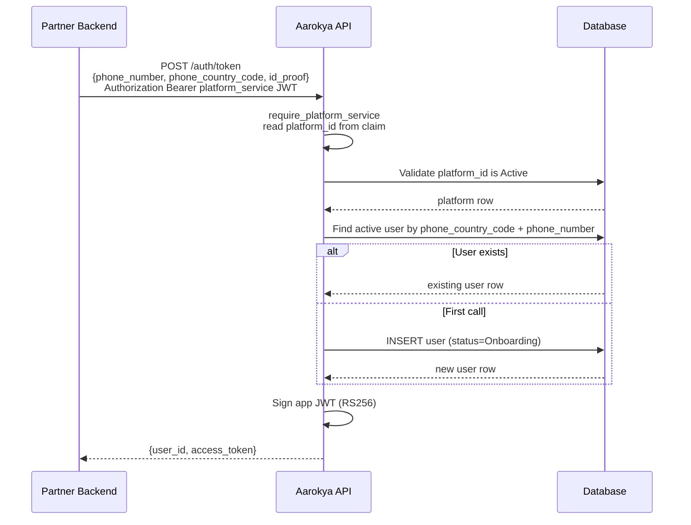

<Info>
  **Auth guard:** bearer JWT minted for a platform *service account* (`actor_type: platform_service`). The handler calls `actor.require_platform_service()`, so only a platform service-account token is admitted — admins, dashboard users, and end-user tokens are rejected. The `platform_id` is taken from the token claim, never from the request body.
</Info>

## Overview

Aarokya does not own user authentication — that belongs to the partner app (e.g. Namma Yatri). The partner backend authenticates as its platform service account, then calls `POST /auth/token` with a verified phone number and id-proof and receives a short-lived app JWT scoped to that user. This is the only token-issuance endpoint, and the app JWT is stateless and self-contained.

The platform service-account bearer is obtained out-of-band: an admin provisions a credential via `POST /platforms/{platform_id}/credentials`, which returns a `basic_token`. The platform exchanges that `basic_token` with Keycloak (`client_credentials` grant) for the service-account JWT it presents here. See the [Platform module](/modules/platform) for credential provisioning.

---

## Token Issuance Flow



---

## Find-or-Create Semantics

| Scenario | Behaviour |
|----------|-----------|
| First call for this phone (`phone_country_code` + `phone_number`) | Creates user with `status = ONBOARDING`, persists `id_proof`, returns token |
| Subsequent calls | Returns fresh token for the existing active user, reflects current `status` |
| `id_proof` on a repeat call | Ignored — `id_proof` is consumed only on the create path |

<Note>
  Lookup is by `(phone_country_code, phone_number)` against active users — it is not keyed on `platform_id`. The `platform_id` from the token is validated and embedded in the issued app token's claims.
</Note>

---

## App JWT Claims

The issued `access_token` is an RS256 app token. Its claims flatten an `app` actor block alongside standard `iss` / `aud` / `iat` / `exp`:

```json
{
  "actor_type": "app",
  "user_info": {
    "user_id": "047382910564",
    "phone_number": "9876543210",
    "phone_country_code": "+91",
    "first_name": null,
    "last_name": null
  },
  "status": "ONBOARDING",
  "platform_id": "0190b6c2-7e3a-7c6e-9b1d-2f4a8c1e5d33",
  "iss": "aarokya-backend",
  "aud": "aarokya-mobile",
  "iat": 1718000000,
  "exp": 1718086400
}
```

| Claim | Description |
|-------|-------------|
| `user_info.user_id` | 12-digit numeric user ID — pass in `{user_id}` path params for all user-scoped calls |
| `status` | `ONBOARDING`, `ACTIVE`, or `DEACTIVATED` — drive onboarding UI from this |
| `platform_id` | UUID of the issuing platform, carried from the service-account token |
| `exp` | Configurable via `auth.app.expiry_hours`; call token again when expired |

---

## Endpoints

<CardGroup cols={1}>
  <Card title="POST /auth/token" icon="key" color="#16a34a" href="/api/endpoints/auth/generate-token">
    Issue an app JWT for a user. Creates the user on first call. Requires a platform service-account bearer token.
  </Card>
</CardGroup>

---

## Request / Response Example

<CodeGroup>
```bash Generate token
curl -X POST http://localhost:8080/auth/token \
  -H 'Authorization: Bearer <platform_service-jwt>' \
  -H 'Content-Type: application/json' \
  -d '{
    "phone_number": "9876543210",
    "phone_country_code": "+91",
    "id_proof": {
      "proof_type": "AADHAAR",
      "number": "123456789012"
    }
  }'
```

```json Response 200
{
  "user_id": "047382910564",
  "access_token": "eyJhbGciOiJSUzI1NiIsInR5cCI6IkpXVCJ9..."
}
```
</CodeGroup>

`proof_type` accepts `AADHAAR`, `PAN`, `PASSPORT`, `DRIVING_LICENSE`, or `VOTER_ID`.

---

## Error Codes

| Code | HTTP | Description |
|------|------|-------------|
| `AUE_300` | 500 | Internal server error |
| `AUE_301` | 401 | Invalid or expired token |
| `AUE_302` | 403 | User account is not active |
| `AUE_304` | 400 | Platform not found |
| `AUE_305` | 400 | Platform is inactive |
| `AUE_306` | 422 | Onboarding already complete |
| `AUE_307` | 500 | Dashboard authentication is not configured on this server |
| `AUE_308` | 500 | OpenID Connect upstream call failed |
