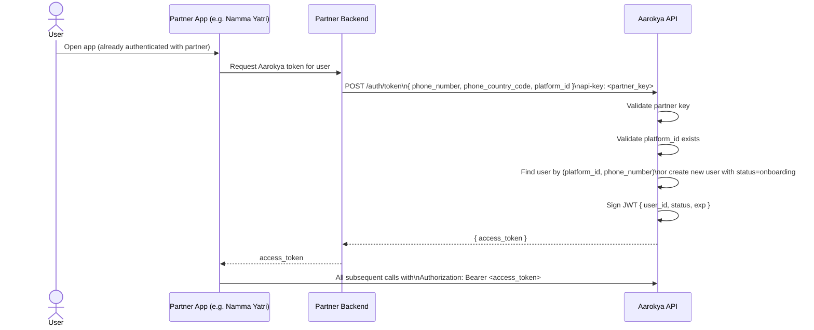

<Info>
  **Auth guard:** `api-key` header (external partner key — one key per partner, configured server-side).
  Partners cannot call admin endpoints. Admin cannot call this endpoint.
</Info>

## Design — Why No OTP?

Aarokya's users module is embedded in partner apps (e.g. Namma Yatri). The partner app already owns the user's phone-based identity. Rather than duplicating OTP infrastructure, the partner backend calls `POST /auth/token` with a verified phone number and receives a JWT scoped to that user.

This is the "partner SDK" pattern — the partner is the identity authority, Aarokya is the service layer.

**Benefits:**
- No SMS infrastructure in Aarokya
- No OTP session management or replay risk
- Single API call: phone number in, JWT out
- Partners retain full control of their auth UX

---

## Token Issuance Flow



---

## Find-or-Create Semantics

`POST /auth/token` is **idempotent** for the same `(platform_id, phone_number)` pair:

- **First call:** creates a user with `status = onboarding`, returns token
- **Subsequent calls:** returns a fresh token for the existing user (reflects current `status`)

The token always reflects the **current status in DB**. If a user has been soft-deleted, the endpoint returns an error — deleted users cannot receive new tokens.

---

## JWT Claims

```json
{
  "sub": "usr_7Hq4nMdKpRsXwYzA1b",
  "status": "onboarding",
  "iat": 1718000000,
  "exp": 1718086400
}
```

| Claim | Description |
|-------|-------------|
| `sub` | User ID — use this to identify the user in all subsequent calls |
| `status` | `onboarding` or `active` — use to decide whether to show onboarding UI |
| `exp` | Expiry (configurable via `jwt.expiry_hours`) |

There are **no refresh tokens**. When the JWT expires, call `POST /auth/token` again from the partner backend.

---

## Endpoints

<CardGroup cols={1}>
  <Card title="POST /auth/token" icon="key" color="#16a34a" href="/api/endpoints/auth/generate-token">
    Issue a JWT for a user. Creates the user on first call. Requires partner `api-key` header.
  </Card>
</CardGroup>

---

## Request / Response Example

<CodeGroup>
```bash Generate token
curl -X POST http://localhost:8080/auth/token \
  -H 'api-key: your-partner-key' \
  -H 'Content-Type: application/json' \
  -d '{
    "phone_number": "9876543210",
    "phone_country_code": "+91",
    "platform_id": "platform_3Xk9mNpQrBvLwJtY2c"
  }'
```

```json Response 201 — token issued
{
  "access_token": "eyJhbGciOiJIUzI1NiIsInR5cCI6IkpXVCJ9..."
}
```

```json Response 400 — platform not found
{
  "error": {
    "code": "PLATFORM_NOT_FOUND",
    "message": "platform not found"
  }
}
```

```json Response 401 — invalid partner key
{
  "error": {
    "code": "UNAUTHORIZED",
    "message": "missing or invalid API key"
  }
}
```
</CodeGroup>
