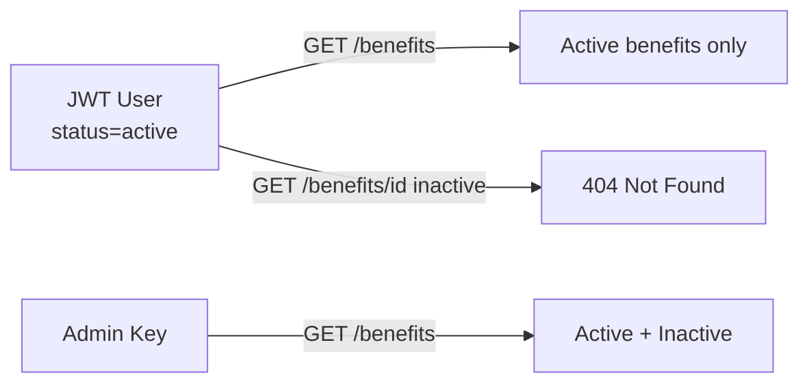

<Info>
  **Auth guards vary by endpoint** — Create, Update, Delete are admin-only. Get and List accept both JWT users (active benefits only) and the admin key (all benefits).
</Info>

## Overview

A **benefit** is a specific offering — a free consultation, an insurance policy, a diagnostic test — provided by a [Benefit Provider](/modules/benefit_provider). Benefits carry a `benefit_type` enum and a `benefit_details` JSONB block whose variant must match the type.

Responses always include `provider_name` via a JOIN — callers never need a separate provider lookup.

---

## Benefit Types

| `benefit_type` | `benefit_details` variant | Description |
|----------------|--------------------------|-------------|
| `consultation` | `Consultation { description }` | Free or subsidised doctor consultation |
| `insurance_policy` | `InsurancePolicy { description }` | Health or accident insurance |

Type and details must be consistent — mismatches return `BE-503`.

---

## Visibility by Actor



---

## Auth Guards by Endpoint

| Endpoint | JWT user | Admin key | Notes |
|----------|----------|-----------|-------|
| `POST /benefits` | — | ✓ | Provider must be active |
| `GET /benefits` | ✓ active only | ✓ all | |
| `GET /benefits/{id}` | ✓ active only | ✓ all | |
| `PATCH /benefits/{id}` | — | ✓ | |
| `DELETE /benefits/{id}` | — | ✓ | Sets `status → inactive` |

---

## Endpoints

<CardGroup cols={2}>
  <Card title="POST /benefits" icon="plus" color="#16a34a" href="/api/endpoints/benefits/create">
    **Admin only.** Create a benefit. Provider must exist and be active.
  </Card>
  <Card title="GET /benefits" icon="list" color="#3b82f6" href="/api/endpoints/benefits/list">
    List benefits. JWT users see only `active` ones. Filter by `provider_id`, `benefit_type`, `status`.
  </Card>
  <Card title="GET /benefits/{benefit_id}" icon="stethoscope" color="#3b82f6" href="/api/endpoints/benefits/get">
    Fetch a benefit by UUID. JWT users receive 404 for inactive benefits.
  </Card>
  <Card title="PATCH /benefits/{benefit_id}" icon="pen" color="#8b5cf6" href="/api/endpoints/benefits/update">
    **Admin only.** Update `name`, `benefit_details`, or `status`.
  </Card>
  <Card title="DELETE /benefits/{benefit_id}" icon="trash" color="#dc2626" href="/api/endpoints/benefits/delete">
    **Admin only.** Soft-delete (`status → inactive`).
  </Card>
</CardGroup>

---

## Request / Response Examples

<CodeGroup>
```bash Create a benefit
curl -X POST http://localhost:8080/benefits \
  -H 'admin-api-key: your-admin-key' \
  -H 'Content-Type: application/json' \
  -d '{
    "name": "Free GP Consultation",
    "benefit_type": "consultation",
    "provider_id": "018f4c2a-1b3e-7d8f-9a0b-2c3d4e5f6a7b",
    "benefit_details": {
      "type": "Consultation",
      "description": "One free general physician consultation per month"
    }
  }'
```

```json Response 201
{
  "id": "019a1b2c-3d4e-5f6a-7b8c-9d0e1f2a3b4c",
  "name": "Free GP Consultation",
  "benefit_type": "consultation",
  "provider_id": "018f4c2a-1b3e-7d8f-9a0b-2c3d4e5f6a7b",
  "provider_name": "Apollo Diagnostics",
  "benefit_details": { "type": "Consultation", "description": "..." },
  "status": "active",
  "created_at": "2026-04-12T10:05:00Z",
  "last_modified_at": "2026-04-12T10:05:00Z"
}
```
</CodeGroup>

---

## Error Codes

| Code | HTTP | Description |
|------|------|-------------|
| `BE-500` | 500 | Internal server error |
| `BE-501` | 404 | Benefit not found |
| `BE-502` | 409 | Name already exists for this provider |
| `BE-503` | 400 | `benefit_type` / `benefit_details` type mismatch |
| `BE-504` | 404 | Benefit provider not found or inactive |
| `BE-505` | 400 | Validation error (e.g. empty name) |
