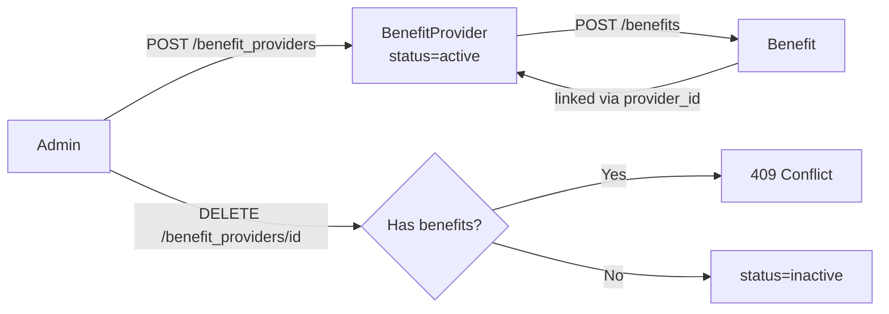

<Info>
  **Auth guard:** `admin-api-key` header required for all endpoints. No JWT or partner key access.
</Info>

## Overview

A **benefit provider** is a company or entity (e.g. a diagnostic chain, insurer, or telemedicine platform) that offers one or more benefits to Aarokya users. Providers are the top-level catalogue entry — every `Benefit` row has a `provider_id` FK referencing a provider.

- **Name uniqueness is global.** No two providers may share the same name.
- **Delete is guarded.** A provider with associated benefits cannot be deleted — remove benefits first.

---

## Data Flow



---

## Auth Guards by Endpoint

| Endpoint | Admin key | Notes |
|----------|-----------|-------|
| `POST /benefit_providers` | ✓ | Name must be unique |
| `GET /benefit_providers` | ✓ | Filter by `status` |
| `GET /benefit_providers/{id}` | ✓ | |
| `PATCH /benefit_providers/{id}` | ✓ | Only `name` is updatable |
| `DELETE /benefit_providers/{id}` | ✓ | Blocked if benefits exist |

---

## Endpoints

<CardGroup cols={2}>
  <Card title="POST /benefit_providers" icon="plus" color="#16a34a" href="/api/endpoints/benefit_providers/create">
    Create a new benefit provider. Name must be unique.
  </Card>
  <Card title="GET /benefit_providers" icon="list" color="#3b82f6" href="/api/endpoints/benefit_providers/list">
    Paginated list. Filter by `status`.
  </Card>
  <Card title="GET /benefit_providers/{id}" icon="building" color="#3b82f6" href="/api/endpoints/benefit_providers/get">
    Fetch a single provider by UUID.
  </Card>
  <Card title="PATCH /benefit_providers/{id}" icon="pen" color="#8b5cf6" href="/api/endpoints/benefit_providers/update">
    Rename a provider. New name must not conflict.
  </Card>
  <Card title="DELETE /benefit_providers/{id}" icon="trash" color="#dc2626" href="/api/endpoints/benefit_providers/delete">
    Soft-delete (`status → inactive`). Fails if provider has benefits.
  </Card>
</CardGroup>

---

## Request / Response Examples

<CodeGroup>
```bash Create a provider
curl -X POST http://localhost:8080/benefit_providers \
  -H 'admin-api-key: your-admin-key' \
  -H 'Content-Type: application/json' \
  -d '{ "name": "Apollo Diagnostics" }'
```

```json Response 201
{
  "id": "018f4c2a-1b3e-7d8f-9a0b-2c3d4e5f6a7b",
  "name": "Apollo Diagnostics",
  "status": "active",
  "created_at": "2026-04-12T10:00:00Z",
  "last_modified_at": "2026-04-12T10:00:00Z"
}
```
</CodeGroup>

---

## Error Codes

| Code | HTTP | Description |
|------|------|-------------|
| `BPE-400` | 500 | Internal server error |
| `BPE-401` | 404 | Provider not found |
| `BPE-402` | 409 | Name already exists |
| `BPE-403` | 409 | Provider has associated benefits — delete benefits first |
| `BPE-404` | 400 | Validation error (e.g. empty name) |
