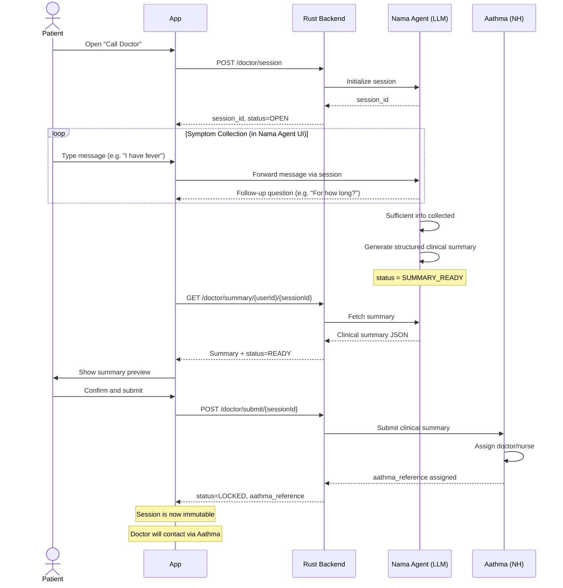
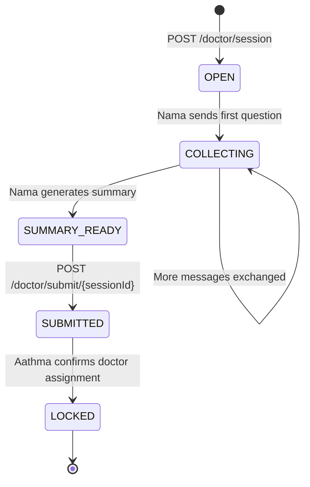
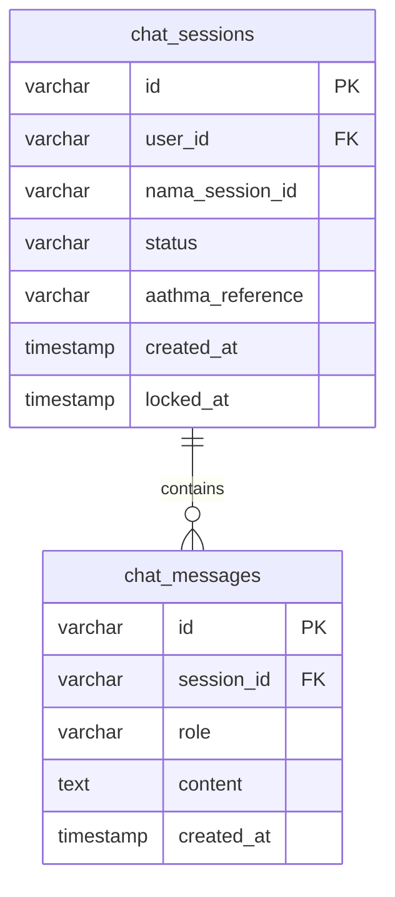

<Info>
  **Authentication:** All endpoints require `Authorization: Bearer <access_token>`.

  **External Dependencies:** Nama Agent (internal LLM) · Aathma (Narayana Health doctor platform)

  **Status:** Planned — endpoint contracts pending confirmation from the Nama Agent team.
</Info>

## Why AI Before Doctor?

Connecting every user directly to a doctor would require a massive pool of physicians on call at all times — economically unsustainable for a ₹0 entry-point product serving gig workers.

More importantly, the first 5 minutes of every doctor consultation are usually the same: the doctor collects basic information. What is the chief complaint? How long has it been happening? How severe? Any existing conditions? Current medications? Allergies?

**Nama Agent** handles that intake conversationally — in the user's language, at their pace, via text. By the time a real doctor receives the case, they have a structured clinical summary with all intake fields completed. The consultation becomes immediately productive.

This approach also benefits patients: the conversational format is less intimidating than a clinical questionnaire. Users are more forthcoming about symptoms when talking to a bot than when filling out a form.

---

## The Role of Each Component

### Nama Agent (Internal LLM)

Nama is an internal LLM (large language model) built by the Aarokya engineering team. Its role in the Call Doctor flow:

1. Initialises a session when the patient starts the consultation
2. Conducts a structured intake conversation in natural language
3. Dynamically chooses follow-up questions based on the user's responses (e.g. if the user says "chest pain", Nama asks about radiation, duration, and associated symptoms)
4. When it has sufficient information, generates a structured **clinical summary JSON** object
5. Sets the session status to `SUMMARY_READY`

Nama does **not** diagnose. It triages and summarises. The diagnosis is made by the human doctor assigned via Aathma.

### Aathma (Narayana Health Doctor Platform)

Aathma is Narayana Health's doctor assignment and teleconsultation platform. Once the clinical summary is submitted:

1. Aathma receives the structured summary
2. Routes to an available doctor based on specialty, geography, and availability
3. Returns an `aathma_reference` ID (e.g. `ATH-2025-00456`)
4. The doctor contacts the patient via the Narayana Health app/call

Aarokya's backend does not own doctor scheduling or the actual consultation — it bridges the patient to Aathma.

---

## How It Works — End to End



---

## Session State Machine



| State | What it means | Patient can send messages? |
|-------|--------------|---------------------------|
| `OPEN` | Session created, Nama not yet engaged | No |
| `COLLECTING` | Nama is asking intake questions | Yes — to Nama directly |
| `SUMMARY_READY` | Nama has generated the clinical summary | No — summary is ready to review |
| `SUBMITTED` | Summary submitted to Aathma, awaiting doctor assignment | No |
| `LOCKED` | Doctor assigned, session permanently frozen | No |

<Warning>
  Once a session reaches **LOCKED**, no further messages are accepted on any endpoint. This is permanent and by design — it prevents patients from editing their symptom description after a doctor has already been briefed on the original summary. Clinical integrity requires the record to be immutable after handoff.
</Warning>

---

## The Clinical Summary Structure

The clinical summary produced by Nama Agent is a structured JSON object that maps to standard clinical intake fields:

```json
{
  "chief_complaint": "Fever and body ache for 3 days",
  "symptoms": ["fever", "body ache", "fatigue", "mild headache"],
  "duration": "3 days",
  "severity": "moderate",
  "onset": "gradual",
  "location": null,
  "radiation": null,
  "aggravating_factors": ["physical activity"],
  "relieving_factors": ["rest", "paracetamol"],
  "associated_symptoms": ["loss of appetite"],
  "existing_conditions": ["none reported"],
  "current_medications": ["paracetamol 500mg as needed"],
  "allergies": ["none known"],
  "family_history": ["none relevant"],
  "social_history": {
    "occupation": "Delivery Partner",
    "recent_travel": "none",
    "smoking": "no",
    "alcohol": "occasional"
  },
  "vital_signs": {
    "self_reported_temperature": "102°F"
  }
}
```

This format is designed to be immediately useful to the receiving doctor — they can read it in under 60 seconds and begin the consultation with specific follow-up questions rather than starting from scratch.

---

## Why Sessions Are Immutable After LOCK

This is one of the most deliberate design decisions in the module:

1. **Clinical integrity:** A doctor receives a summary, forms a clinical impression, and prepares questions. If the patient could edit the summary after submission, the doctor's preparation would be based on outdated information.
2. **Liability boundary:** The locked summary is the authoritative record of what was communicated. Both patient and doctor have a clear, immutable reference point.
3. **Prevents gaming:** In a system where insurance covers certain conditions, mutability could be exploited. The immutable session is the source of truth.
4. **Audit trail:** For HIPAA-adjacent compliance, the session record must be unchangeable after the point of professional handoff.

The `locked_at` timestamp records exactly when the session was frozen — this is the legal handoff moment.

---

## Endpoints

| Method | Path | Description |
|--------|------|-------------|
| `POST` | `/doctor/session` | Start a new consultation session |
| `GET` | `/doctor/summary/{userId}/{sessionId}` | Fetch Nama-generated clinical summary |
| `POST` | `/doctor/submit/{sessionId}` | Submit summary to Aathma, lock session |

---

## Request / Response Examples

<CodeGroup>
```bash Start Session
curl -X POST http://localhost:8080/doctor/session \
  -H 'Authorization: Bearer eyJhbGci...'
```

```json Response 200
{
  "session_id": "sess-abc123",
  "status": "OPEN",
  "created_at": "2025-06-14T09:00:00Z"
}
```
</CodeGroup>

<CodeGroup>
```bash Get Clinical Summary
curl "http://localhost:8080/doctor/summary/a3f8c2d1.../sess-abc123" \
  -H 'Authorization: Bearer eyJhbGci...'
```

```json Response 200 — summary ready
{
  "session_id": "sess-abc123",
  "user_id": "a3f8c2d1-...",
  "summary": {
    "chief_complaint": "Fever and body ache for 3 days",
    "symptoms": ["fever", "body ache", "fatigue", "mild headache"],
    "duration": "3 days",
    "severity": "moderate",
    "existing_conditions": ["none reported"],
    "current_medications": ["none"],
    "allergies": ["none known"]
  },
  "generated_at": "2025-06-14T09:15:00Z",
  "status": "READY"
}
```

```json Response 404 — summary not yet generated
{
  "error": "SUMMARY_NOT_READY",
  "message": "The Nama Agent has not yet generated a summary for this session"
}
```

```json Response 403 — session belongs to different user
{
  "error": "RESOURCE_NOT_FOUND",
  "message": "Session not found or does not belong to this user"
}
```
</CodeGroup>

<CodeGroup>
```bash Submit to Aathma
curl -X POST "http://localhost:8080/doctor/submit/sess-abc123" \
  -H 'Authorization: Bearer eyJhbGci...'
```

```json Response 200
{
  "session_id": "sess-abc123",
  "status": "LOCKED",
  "aathma_reference": "ATH-2025-00456",
  "message": "A care professional has been assigned. They will contact you shortly."
}
```

```json Response 409 — session already locked
{
  "error": "RESOURCE_CONFLICT",
  "message": "Session sess-abc123 is already locked",
  "status_code": 409
}
```
</CodeGroup>

---

## What This Module Does NOT Own

<CardGroup cols={3}>
  <Card title="Doctor Scheduling" icon="calendar" color="#6b7280">
    Handled entirely by Aathma (Narayana Health). Aarokya only submits the clinical summary and stores the reference ID.
  </Card>
  <Card title="Video / Audio Calls" icon="video" color="#6b7280">
    Out of scope for v1. Consultation happens via Narayana Health's platform after Aathma assigns a care professional.
  </Card>
  <Card title="Summary Generation" icon="brain" color="#6b7280">
    Nama Agent generates the clinical summary from the conversation — the Aarokya backend only stores and forwards it.
  </Card>
</CardGroup>

---

## Database Schema



<Note>
  `chat_messages` stores the full conversation transcript for audit purposes. The `role` field distinguishes patient messages (`user`) from Nama Agent messages (`assistant`). Messages are stored even after the session is locked.
</Note>
