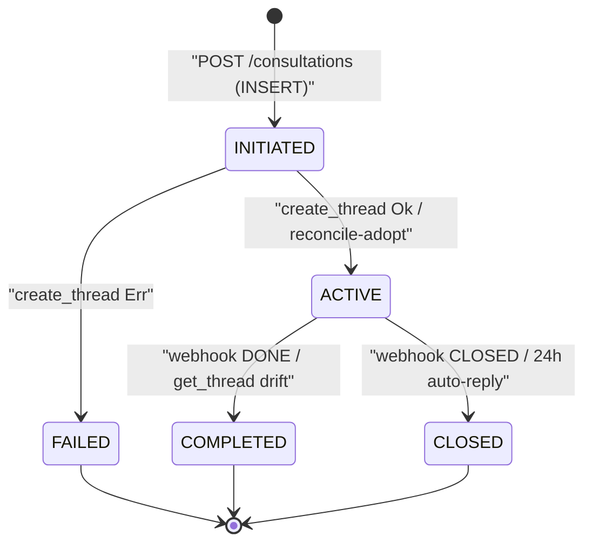
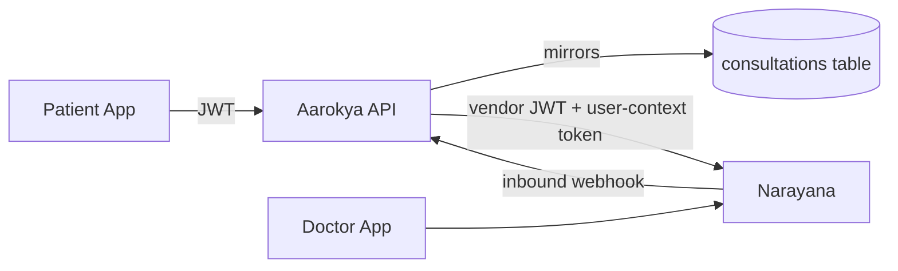

<Info>
  **Authentication:** All user-facing endpoints require `Authorization: Bearer <access_token>`. Admin (cross-user) endpoints require trusted-backend (admin/operator) auth.

  **External Dependencies:** Narayana Health Conversation Gateway. All upstream calls go through the `narayana` crate.

  **Status:** Shipped (single-provider). Provider-agnostic dispatcher in place for a second provider.
</Info>

## What This Module Does

Lets an authenticated primary user open and run a chat thread with a doctor on behalf
of any of their eligible dependants. Messages (text + file attachments) round-trip
through the Aarokya backend; doctor replies arrive on Aarokya via an inbound webhook.

The Aarokya backend never owns the chat itself — it mirrors a row per thread for
indexing, eligibility, and audit, and forwards every message through the upstream
provider with freshly-minted user-context and participant tokens.

---

## Eligibility Rule

A dependant is eligible for a consultation under a given consultation benefit when:

1. The primary user holds an `Issued` `InsurancePolicy` benefit whose provider also
   offers an active `Consultation` benefit, **and**
2. The dependant is covered by that policy.

Only **one active consultation** is allowed per `(dependant, benefit)` pair — a fresh
`POST /consultations` against a still-`ACTIVE` thread returns `409 CN_1613
ActiveConsultationExists`. `eligible_dependants` reports `active_consultation_count`
(0 means creating one starts a new thread).

A future free tier (3 free consultations for users without a policy) will surface
through the same `eligible_dependants` endpoint.

---

## State Machine

`ConsultationStatus` has five values. Create is two-phase: the row is INSERTed as
`INITIATED` (no upstream thread yet), then the provider `create_thread` call flips it
to `ACTIVE` (with the upstream `external_reference_id`) or `FAILED`.

`INITIATED` and `FAILED` rows have no `external_reference_id`, so messaging endpoints
return `400 CN_1616 ConsultationNotReady`. `ACTIVE`/`COMPLETED`/`CLOSED` always carry
one. Upstream Narayana owns the open/closed lifecycle; Aarokya mirrors `ACTIVE →
COMPLETED`/`CLOSED` drift lazily on every `GET` and `LIST` call (see Read-time Sync
below) and on the inbound webhook.

---

## Architecture

The provider-agnostic dispatcher (`ConsultationContext`) lives in
`backend/crates/aarokya/src/domain/consultation.rs`. Each provider gets its own
adapter sibling module that owns DTO ↔ domain conversion, token orchestration, and
error mapping. `core/consultation.rs` only ever talks to the dispatcher — it doesn't
name the provider.

### Neutral message shape

The consultation **entity** (create / get / list) and the **messages** payload are both
neutral shapes we own. List-messages returns `data: ConsultationMessages { provider,
messages: [ConsultationMessage] }` — `provider` is an informational tag carrying the
upstream that backed this thread (today only `NARAYANA`), and each `ConsultationMessage`
has a uniform shape regardless of provider: `id`, `sender_display_name`, `sender_role`
(`PATIENT | DOCTOR | SYSTEM | UNKNOWN`), `created_at` (UTC ISO 8601), and a discriminated
`body` (`TEXT | ATTACHMENT | SYSTEM_EVENT` with our owned `SystemEventKind` enum). Provider
adapters map their upstream messages into this shape internally. Which provider backs a
consultation is set on its **benefit** (`ConsultationBenefitDetails.provider`,
admin-configured) and derived server-side — the client never sends it. Adding a provider
means adding one mapping arm, not a public schema change. See
[ADR-005](/decisions/adr-005-neutral-consultation-message-shape) (supersedes
[ADR-004](/decisions/adr-004-provider-keyed-consultation-messages)).

---

## Tokens — Minted Per Call

There is **no token cache**. Every upstream call mints fresh:

1. **Vendor JWT** — service-to-service, scoped to Aarokya as a Narayana tenant.
2. **User-context token** — scoped to a single primary user.
3. **Participant access token** — scoped to a single thread (chat room).

Token lifecycle stays inside the `narayana` crate. Aarokya code never sees raw
tokens. Don't introduce caching without aligning on rotation/expiry semantics.

---

## Read-time Sync

`GET /users/{user_id}/consultations/{consultation_id}` and
`GET /users/{user_id}/consultations` perform a best-effort upstream `get_thread` /
`list_threads` round-trip to populate the `unread_count` field and lazily mirror
status drift (`Active → Completed`/`Closed`) onto the row.

Upstream failures **do not** fail the request — the mirror row is returned
unchanged, and a `warn!` log line with `tag = "ConsultationGetUpstream"` records
the degradation.

---

## Inbound Webhook

The single inbound provider webhook — `POST /benefits/{benefit_id}/webhook` — is owned
by the **benefit** module, not this one. `core::benefit::handle_benefit_webhook` loads
the benefit, enforces benefit-provider-service auth (`require_benefit_provider_service`
plus a strict `benefit_provider_id` check), and dispatches on `benefit_type`. For a
`Consultation` benefit it calls into `core::consultation::handle_consultation_webhook`,
which owns only the consultation-specific work described below.

Called by Narayana when a new message (typically a doctor reply) arrives. The handler
resolves the mirror row via the upstream `chat_conversation_source_id` scoped to
`{benefit_id}`, emits a fields-only audit log (no PHI), and mirrors lifecycle markers
onto the row:

- `DONE` (doctor marked done) → `ConsultationStatus::Completed`
- `CLOSED` (24h auto-reply close) → `ConsultationStatus::Closed`

A row lookup or status-update failure surfaces as **5xx** so Narayana retries; a clean
"no matching row" or "no lifecycle marker" stays **200** (cross-tenant / stale webhooks
are legitimate and retrying wouldn't change anything).

<Note>
The webhook authenticates as a benefit-provider-service; it is **not** a public,
unauthenticated endpoint. Integrity also relies on strict payload-shape
deserialisation (serde rejects anything else) and `benefit_id` scoping in the URL.
</Note>

Inbound new-message side effects (push notifications, last-message cache, read-state)
are deliberately deferred — only the `DONE`/`CLOSED` lifecycle markers are acted on.

---

## Error Codes (CN 16xx)

| Code | HTTP | Meaning |
|---|---|---|
| CN_1600 | 500 | Internal server error |
| CN_1601 | 404 | Consultation not found |
| CN_1602 | 403 | Caller is not the consultation owner |
| CN_1603 | 404 | Dependant not found or inactive |
| CN_1604 | 403 | Dependant is not eligible for consultations |
| CN_1605 | 400 | Provider does not accept the dependant's gender |
| CN_1606 | **502** | Upstream vendor authentication failed |
| CN_1607 | **502** | Upstream user-context authentication failed |
| CN_1608 | **502** | Upstream provider error |
| CN_1609 | 400 | Attachments not supported by this provider |
| CN_1610 | 400 | Read receipts not supported by this provider |
| CN_1611 | 400 | Attachment downloads not supported by this provider |
| CN_1612 | 400 | More than one file attached (single attachment only) |
| CN_1613 | 409 | An active consultation already exists for this `(dependant, benefit)` |
| CN_1614 | 404 | Benefit not found |
| CN_1615 | 400 | Benefit is not a consultation-type benefit (eligibility endpoint) |
| CN_1616 | 400 | Consultation row exists but has no upstream thread yet (messaging on `INITIATED` / `FAILED`) |

Upstream variants surface as **502 Bad Gateway**, not 500, so monitoring can
distinguish "we broke" from "Narayana broke".

---

## PII Policy

- Phone numbers, names, dates of birth, and pincodes flow through the `narayana` crate
  as `Secret<String>` where applicable. Logs mask these.
- The inbound webhook handler emits a fields-only audit log: `chat_conversation_source_id`,
  message id, message type, benefit id, and the resolved consultation id. **No message
  content, no patient metadata.**
- Upstream attachment binaries are streamed through the API without buffering to
  disk.
