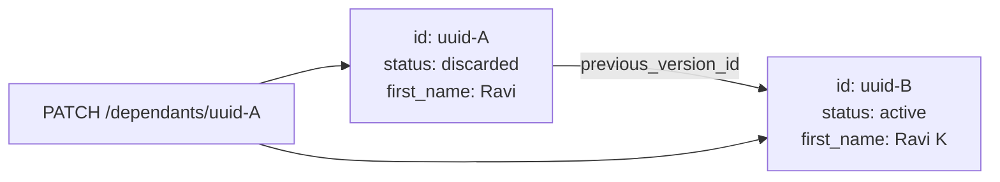

<Info>
  **Immutable rows** — dependant fields are never updated in place. Every change produces a new row (`status = active`); the old row becomes `status = discarded`. Follow `previous_version_id` links to walk version history.
</Info>

## Overview

A dependant represents a family member linked to a primary user (spouse, child, parent, sibling, etc.). The `SELF` dependant is a special row that mirrors the user's own identity — it is managed automatically by the server and cannot be created or deleted via this API.

---

## Immutability Model



When you `PATCH /dependants/{id}`, the server:
1. Sets the old row `status → discarded`
2. Inserts a new row with a fresh UUID and `previous_version_id = old_id`
3. Returns the new (current) row

---

## Auth Guards by Endpoint

| Endpoint | JWT user | Admin key | Notes |
|----------|----------|-----------|-------|
| `POST /users/{user_id}/dependants` | ✓ own only | ✓ | `relationship = self` not allowed |
| `POST /users/{user_id}/dependants/bulk` | ✓ own only | ✓ | Atomic batch insert, max 50. `relationship = self` not allowed |
| `GET /users/{user_id}/dependants` | ✓ own only | ✓ | Defaults to `status = active` |
| `GET /users/{user_id}/dependants/{id}` | ✓ own only | ✓ | 403 if accessing another user's |
| `PATCH /users/{user_id}/dependants/{id}` | ✓ own only | ✓ | SELF not allowed |
| `DELETE /users/{user_id}/dependants/{id}` | ✓ own only | ✓ | Sets `status → discarded`. SELF not allowed |

---

## SELF Dependant

Every user has exactly one active `relationship = self` dependant. It is created automatically on `POST /users/{user_id}/complete_onboarding` (which also accepts an optional `salutation` field) and re-versioned when `PATCH /users/{user_id}` changes `first_name`, `last_name`, `dob`, or `gender`. Attempting to create, update, or delete SELF via the dependants API returns `400 DE-603`.

---

## Relationship Values

| Value | Description |
|-------|-------------|
| `self` | The user themselves (system-managed) |
| `spouse` | Husband or wife |
| `mother` | Mother |
| `father` | Father |
| `child` | Son or daughter |
| `father_in_law` | Father-in-law |
| `mother_in_law` | Mother-in-law |
| `sibling` | Brother or sister |

---

## Salutation Values

An optional `salutation` field is available on create, update, and response objects:

| Value | Description |
|-------|-------------|
| `mr` | Mr |
| `mrs` | Mrs |
| `ms` | Ms |
| `master` | Master (typically for young males) |

---

## Endpoints

<CardGroup cols={2}>
  <Card title="POST /users/{user_id}/dependants" icon="plus" color="#16a34a" href="/api/endpoints/dependants/create">
    Add a new dependant. `relationship = self` not allowed.
  </Card>
  <Card title="POST /users/{user_id}/dependants/bulk" icon="layer-group" color="#16a34a" href="/api/endpoints/dependants/bulk-create">
    Atomically insert up to 50 dependants in one request. `relationship = self` not allowed.
  </Card>
  <Card title="GET /users/{user_id}/dependants" icon="list" color="#3b82f6" href="/api/endpoints/dependants/list">
    Paginated list. Defaults to `status = active`. JWT users see only their own.
  </Card>
  <Card title="GET /users/{user_id}/dependants/{id}" icon="user-group" color="#3b82f6" href="/api/endpoints/dependants/get">
    Fetch a single dependant by UUID.
  </Card>
  <Card title="PATCH /users/{user_id}/dependants/{id}" icon="pen" color="#8b5cf6" href="/api/endpoints/dependants/update">
    Update fields. Produces a new immutable row; old row is discarded.
  </Card>
  <Card title="DELETE /users/{user_id}/dependants/{id}" icon="trash" color="#dc2626" href="/api/endpoints/dependants/delete">
    Discard a dependant (`status → discarded`). SELF not allowed.
  </Card>
</CardGroup>

---

## Request / Response Examples

<CodeGroup>
```bash Create a dependant
curl -X POST http://localhost:8080/users/047382910564/dependants \
  -H 'Authorization: Bearer eyJhbGci...' \
  -H 'Content-Type: application/json' \
  -d '{
    "relationship": "spouse",
    "first_name": "Priya",
    "last_name": "Kumar",
    "date_of_birth": "1992-08-20",
    "gender": "female",
    "salutation": "mrs"
  }'
```

```json Response 201
{
  "id": "01926b3a-7c2e-7d4f-a1b2-c3d4e5f60001",
  "primary_user_id": "047382910564",
  "relationship": "spouse",
  "first_name": "Priya",
  "last_name": "Kumar",
  "date_of_birth": "1992-08-20",
  "gender": "female",
  "salutation": "mrs",
  "status": "active",
  "previous_version_id": null,
  "created_at": "2026-04-12T10:00:00Z",
  "last_modified_at": "2026-04-12T10:00:00Z"
}
```

```bash Bulk create dependants
curl -X POST http://localhost:8080/users/047382910564/dependants/bulk \
  -H 'Authorization: Bearer eyJhbGci...' \
  -H 'Content-Type: application/json' \
  -d '{
    "dependants": [
      {
        "relationship": "spouse",
        "first_name": "Priya",
        "last_name": "Kumar",
        "date_of_birth": "1992-08-20",
        "gender": "female",
        "salutation": "mrs"
      },
      {
        "relationship": "child",
        "first_name": "Arjun",
        "last_name": "Kumar",
        "date_of_birth": "2015-03-10",
        "gender": "male",
        "salutation": "master"
      }
    ]
  }'
```

```json Response 201
{
  "data": [
    {
      "id": "01926b3a-7c2e-7d4f-a1b2-c3d4e5f60001",
      "primary_user_id": "047382910564",
      "relationship": "spouse",
      "first_name": "Priya",
      "last_name": "Kumar",
      "date_of_birth": "1992-08-20",
      "gender": "female",
      "salutation": "mrs",
      "status": "active",
      "previous_version_id": null,
      "created_at": "2026-04-12T10:00:00Z",
      "last_modified_at": "2026-04-12T10:00:00Z"
    },
    {
      "id": "01926b3a-7c2e-7d4f-a1b2-c3d4e5f60002",
      "primary_user_id": "047382910564",
      "relationship": "child",
      "first_name": "Arjun",
      "last_name": "Kumar",
      "date_of_birth": "2015-03-10",
      "gender": "male",
      "salutation": "master",
      "status": "active",
      "previous_version_id": null,
      "created_at": "2026-04-12T10:00:00Z",
      "last_modified_at": "2026-04-12T10:00:00Z"
    }
  ]
}
```
</CodeGroup>

---

## Error Codes

| Code | HTTP | Description |
|------|------|-------------|
| `DE-600` | 500 | Internal server error |
| `DE-601` | 404 | Dependant not found |
| `DE-602` | 403 | JWT user accessing another user's dependant |
| `DE-603` | 400 | Operation not allowed on SELF dependant |
| `DE-604` | 400 | No fields provided to update |
| `DE-605` | 400 | Validation error |
