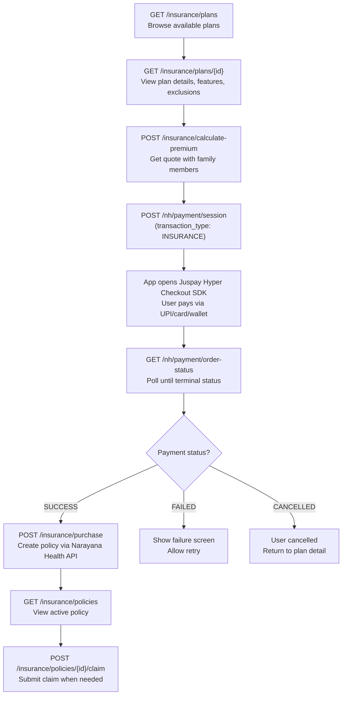
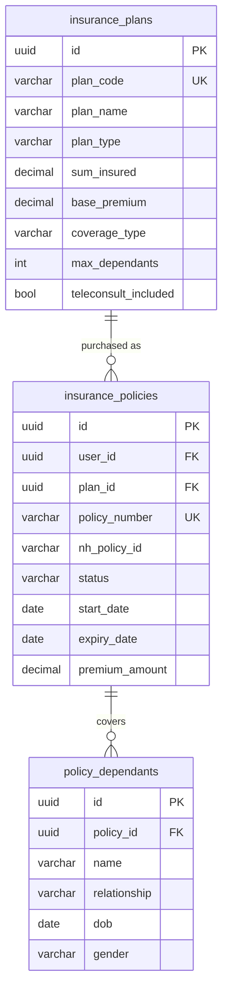

<Info>
  **Authentication:** All endpoints require `Authorization: Bearer <access_token>`.

  **External Dependency:** Narayana Health Insurance API — purchase, claims, and policy status.

  **Status:** Planned — not yet implemented in the backend.
</Info>

## What Aarokya Does vs What Narayana Health Does

Aarokya is a **distribution channel** for Narayana Health insurance products. Understanding the boundary is important:

| Responsibility | Handled By |
|---------------|-----------|
| Plan catalogue (pricing, features, exclusions) | Narayana Health — synced to Aarokya DB |
| Premium calculation | Aarokya (formula-based, see below) |
| Payment processing | Juspay (via Aarokya payment session) |
| Policy issuance | Narayana Health API |
| Claims adjudication | Narayana Health (TPA/in-house) |
| Policy status updates | Narayana Health → Aarokya webhook |
| Customer-facing UI | Aarokya mobile app |
| Customer support for claims | Narayana Health call centre (NH handles post-issuance) |

---

## Plan Types

Narayana Health offers plans across three dimensions:

### By Coverage Scope

| Type | Description | Max Dependants |
|------|-------------|----------------|
| `INDIVIDUAL` | Covers the policyholder only | 0 |
| `FAMILY_FLOATER` | Covers policyholder + family under one shared sum insured | Up to 5 (spouse + 4 children) |
| `MULTI_INDIVIDUAL` | Separate sum insured for each member under one policy | Up to 5 |

### By Coverage Level

| Type | What It Covers | Typical Sum Insured |
|------|---------------|---------------------|
| `BASIC` | Inpatient hospitalisation, pre/post-hospital | ₹1–2 lakh |
| `STANDARD` | Basic + OPD, day care, ambulance | ₹2–5 lakh |
| `COMPREHENSIVE` | Standard + critical illness, maternity, mental health | ₹5–10 lakh |

### Teleconsult Included

All Narayana Health plans sold through Aarokya include a `teleconsult_included: true` flag. This means the Call Doctor feature (Nama Agent + Aathma) is available to policyholders at no additional cost.

---

## Premium Calculation — With Worked Example

Aarokya calculates the premium locally using a formula before any Juspay payment session is created. The formula is:

```text
base_premium                         (from plan)
+ age_loading                        (if policyholder age > 35)
+ dependant_premium                  (per dependant by relationship)
= subtotal
+ GST (18% of subtotal)
= total
```

### Component Details

| Component | Formula | Notes |
|-----------|---------|-------|
| Base premium | `plan.base_premium` | Fixed per plan |
| Age loading | `5% × floor((age − 35) / 5) × base_premium` | Only if age > 35; each 5-year band adds 5% |
| Per spouse | `+30% of base_premium` | Per spouse (max 1) |
| Per child | `+20% of base_premium` | Per child (max 4) |
| GST | `+18% of subtotal` | Flat rate on all insurance |

### Worked Example

**Plan:** NH Comprehensive Family, base premium = ₹7,500
**Policyholder:** Age 40, male
**Dependants:** 1 spouse (age 37, female), 1 child (age 8, male)

| Component | Calculation | Amount |
|-----------|-------------|--------|
| Base premium | — | ₹7,500 |
| Age loading | `5% × floor((40-35)/5) × 7500 = 5% × 1 × 7500` | ₹375 |
| Spouse loading | `30% × 7500` | ₹2,250 |
| Child loading | `20% × 7500` | ₹1,500 |
| Subtotal | `7500 + 375 + 2250 + 1500` | ₹11,625 |
| GST (18%) | `18% × 11625` | ₹2,092.50 |
| **Total** | | **₹13,717.50** |

<Note>
  Age is calculated at the time of premium calculation using the policyholder's `dob` from their profile. The profile must have `dob` set before calling `POST /insurance/calculate-premium`.
</Note>

---

## Purchase Flow



---

## Claims Flow

Claims are submitted to Aarokya's API, which forwards them to Narayana Health's claims system. Aarokya does not adjudicate — it provides the submission interface and tracks status.

### Claim Submission Steps

<Steps>
  <Step title="Identify the policy">
    The user selects which active policy to claim against. Common scenarios: hospitalisation, OPD visit at NH network hospital, pharmacy at NH outlet.
  </Step>
  <Step title="Upload documents">
    The app collects: hospital bills, discharge summary, prescription, and any diagnostic reports. Documents are uploaded before calling the claim endpoint.
  </Step>
  <Step title="Submit claim">
    `POST /insurance/policies/{id}/claim` with document references and claim amount. Aarokya forwards to NH's claims API.
  </Step>
  <Step title="Track status">
    NH adjudicates and updates claim status. Aarokya receives webhooks and the app displays current status: `SUBMITTED` → `UNDER_REVIEW` → `APPROVED` | `REJECTED`.
  </Step>
  <Step title="Settlement">
    Approved claims are settled directly by NH — either cashless (for in-network hospitals) or as reimbursement (for out-of-network).
  </Step>
</Steps>

---

## Endpoints

| Method | Path | Description |
|--------|------|-------------|
| `GET` | `/insurance/plans` | List plans with optional filters |
| `GET` | `/insurance/plans/{id}` | Full plan detail with features and exclusions |
| `POST` | `/insurance/calculate-premium` | Premium breakdown for a plan + dependants |
| `POST` | `/insurance/purchase` | Purchase plan, create policy via NH API |
| `GET` | `/insurance/policies` | List user's active policies |
| `GET` | `/insurance/policies/{id}` | Policy detail with dependants |
| `POST` | `/insurance/policies/{id}/claim` | Submit claim to Narayana Health |

---

## Request / Response Examples

<CodeGroup>
```bash List Plans
curl "http://localhost:8080/insurance/plans" \
  -H 'Authorization: Bearer eyJhbGci...'
```

```json Response 200
{
  "plans": [
    {
      "id": "a1b2c3d4-...",
      "plan_code": "NH-BASIC-IND-001",
      "plan_name": "Basic Individual Plan",
      "plan_type": "INDIVIDUAL",
      "sum_insured": 200000.00,
      "base_premium": 5000.00,
      "coverage_type": "BASIC",
      "max_dependants": 0,
      "teleconsult_included": true
    },
    {
      "id": "b2c3d4e5-...",
      "plan_code": "NH-COMP-FAM-001",
      "plan_name": "Comprehensive Family Plan",
      "plan_type": "FAMILY_FLOATER",
      "sum_insured": 500000.00,
      "base_premium": 7500.00,
      "coverage_type": "COMPREHENSIVE",
      "max_dependants": 5,
      "teleconsult_included": true
    }
  ]
}
```
</CodeGroup>

<CodeGroup>
```bash Calculate Premium
curl -X POST http://localhost:8080/insurance/calculate-premium \
  -H 'Authorization: Bearer eyJhbGci...' \
  -H 'Content-Type: application/json' \
  -d '{
    "plan_id": "b2c3d4e5-...",
    "policyholder": { "dob": "1985-03-20", "gender": "MALE" },
    "dependants": [
      { "relationship": "SPOUSE", "dob": "1988-07-12", "gender": "FEMALE" },
      { "relationship": "CHILD", "dob": "2015-01-05", "gender": "MALE" }
    ]
  }'
```

```json Response 200
{
  "plan_id": "b2c3d4e5-...",
  "plan_name": "Comprehensive Family Plan",
  "breakdown": {
    "base_premium": 7500.00,
    "age_loading": 750.00,
    "dependant_premium": 3750.00,
    "subtotal": 12000.00,
    "gst": 2160.00,
    "total": 14160.00
  },
  "dependants_count": 2,
  "currency": "INR"
}
```
</CodeGroup>

<CodeGroup>
```bash Purchase Policy
curl -X POST http://localhost:8080/insurance/purchase \
  -H 'Authorization: Bearer eyJhbGci...' \
  -H 'Content-Type: application/json' \
  -d '{
    "plan_id": "b2c3d4e5-...",
    "payment_order_id": "aarokya-1767808100",
    "dependants": [
      { "name": "Sunita Kumar", "relationship": "SPOUSE", "dob": "1988-07-12", "gender": "FEMALE" }
    ]
  }'
```

```json Response 201
{
  "policy_id": "c3d4e5f6-...",
  "policy_number": "NH-2025-00123456",
  "plan_name": "Comprehensive Family Plan",
  "status": "ACTIVE",
  "start_date": "2025-06-15",
  "expiry_date": "2026-06-14",
  "premium_amount": 14160.00,
  "sum_insured": 500000.00
}
```
</CodeGroup>

---

## Database Schema



<Note>
  Claims are **forwarded to Narayana Health's API** — adjudication happens on their side. Aarokya does not own the claims workflow beyond submission and status tracking.
</Note>
