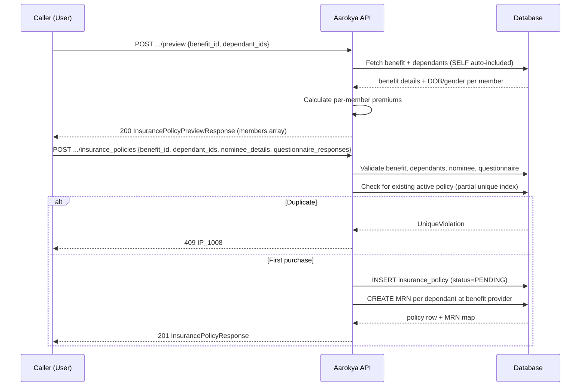
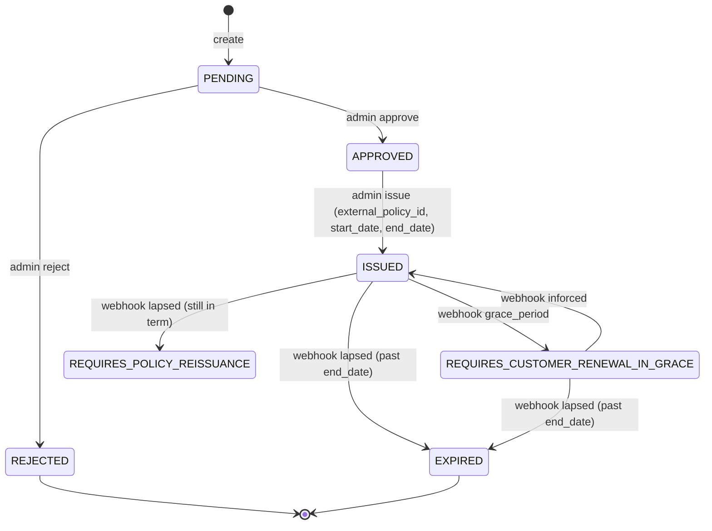
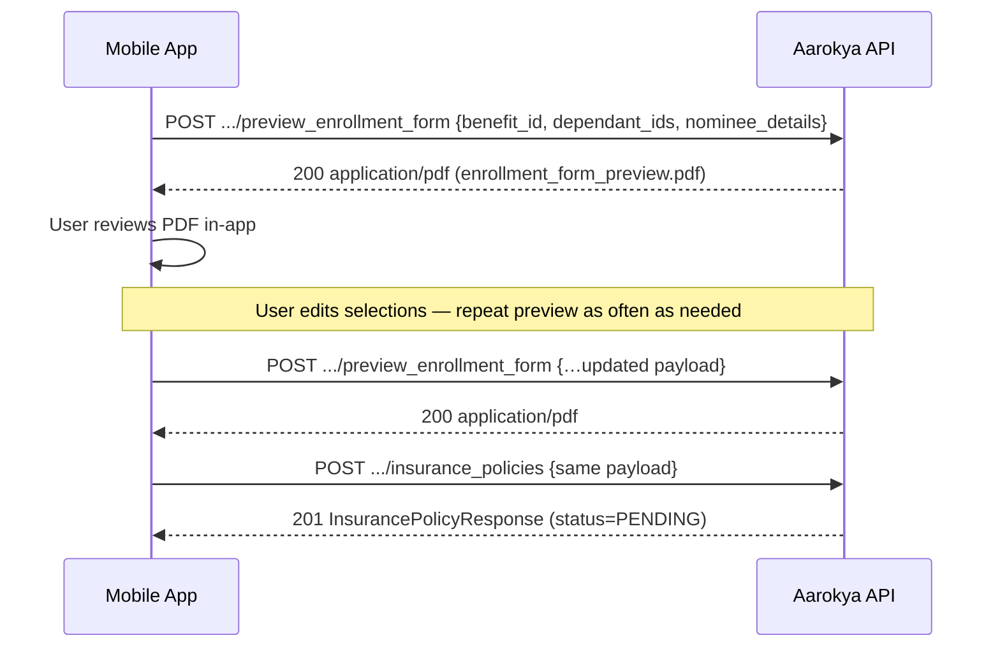

<Info>
  **Two auth tiers** — every endpoint uses a `Bearer` JWT; the actor guard decides user vs admin/provider. User-facing endpoints (preview, create, get, list, document download) require the token to be the policy's user (or a trusted backend). Admin/provider endpoints (list all, get one, update, status transition, export, bulk update) require a dashboard-user or benefit-provider token.
</Info>

## Overview

An insurance policy ties a **primary user** to an **insurance-type benefit** and a set of **dependants** to be covered. The SELF dependant (the primary user themselves) is always auto-included in the covered members — you do not need to add it manually to `dependant_ids`.

Premium amounts are **read directly from the matched plan variant** in the benefit's `benefit_details.plans` map. The server derives a `plan_code` (e.g. `1A`, `2A`, `2A1C`, `2A2C`) from the resolved member list and looks up the variant's `daily_premium_amount`, `annual_premium_amount`, `coverage_amount`, `currency`, and optional `grace_period_days` — a flat per-variant lookup.

The purchase flow has three steps:

1. **Preview premium** — compute the premium breakdown without creating a record
2. **Preview enrollment form** _(optional)_ — render the prospective enrollment-form PDF for in-app confirmation; read-only
3. **Create** — purchase the policy; status starts as `PENDING`

At creation time, the server also **auto-creates MRN records** for each covered dependant at the benefit's provider. The resulting mapping is stored in the policy's `metadata.dependant_mrn_map`.

After purchase, an admin reviews the policy (`PENDING → APPROVED`, or `PENDING → REJECTED`) and, once the external insurer issues a policy number, records issuance (`APPROVED → ISSUED`, supplying `external_policy_id` + `start_date` + `end_date`). The live in-force lifecycle (grace, renewal, reissuance, expiry) is then driven by the insurer's webhooks.

---

## Purchase Flow



---

## Auth Guards by Endpoint

All endpoints authenticate with a `Bearer` JWT. The user vs admin/provider distinction is enforced by the actor guard, not by a separate API key.

| Endpoint | User | Admin / provider | Notes |
|----------|------|------------------|-------|
| `POST /users/{id}/insurance_policies/preview` | ✓ | — | Dependants must belong to the token user |
| `POST /users/{id}/insurance_policies/preview_enrollment_form` | ✓ | — | Read-only — returns `application/pdf`. Zero DB writes, no Narayana calls |
| `POST /users/{id}/insurance_policies` | ✓ | — | One active policy per user+benefit |
| `GET /users/{id}/insurance_policies/{pid}` | ✓ | — | Returns 404 for wrong user |
| `GET /users/{id}/insurance_policies/{pid}/details` | ✓ | — | Adds the linked benefit summary alongside the policy |
| `GET /users/{id}/insurance_policies` | ✓ | — | Filters by status, benefit_id, benefit_provider_id |
| `GET /users/{id}/insurance_policies/details` | ✓ | — | List variant that bundles each policy's benefit summary |
| `GET /users/{id}/insurance_policies/{pid}/documents/{document_type}` | ✓ | — | Streams a PDF; see the document download tokens below |
| `GET /insurance_policies` | — | ✓ | Filter by user, benefit, provider, statuses, time range |
| `GET /insurance_policies/{pid}` | — | ✓ | Fetch one policy by id, no `user_id` in path |
| `GET /insurance_policies/export` | — | ✓ | Joined onboarding export for one `status` (one row per policy x member) |
| `PATCH /insurance_policies/{pid}` | — | ✓ | Set status, external_policy_id, start/end dates |
| `PATCH /insurance_policies/{pid}/status` | — | ✓ | Single `status` transition; enforces the allowed-transition state machine |
| `POST /insurance_policies/bulk_update` | — | ✓ | Bulk-issuance: applies external_policy_id + dates per policy id |

---

## Key Concepts

### Plan code derivation

The server derives a `plan_code` for each preview/purchase request from the resolved member list (SELF + selected dependants):

- **Adult vs child cutoff**: members with `age < 25` count as Children, `age ≥ 25` as Adults.
- **Code format**: `{adult_count}A` when there are no children, otherwise `{adult_count}A{child_count}C`.
- **Examples**: `1A` (self only), `2A` (self + spouse), `2A1C` (self + spouse + 1 child), `2A2C` (self + spouse + 2 children).

The benefit's `benefit_details.plans` map is a free-form dictionary of `plan_code → PlanVariant`. If the derived code is not a key in that map (e.g. `3A`, `1A2C`, or any combination the provider has not priced), the request is rejected with **400 `IP_1009 PlanVariantNotAvailable`**. The benefit's `plans` map is the single source of truth for which combinations are sellable.

### Premium amounts

Each `PlanVariant` carries:

On the API surface each money field is an `AmountResponse` (`{ value, currency }`, major-unit float). They are stored in minor units (`MinorUnit`) and converted at the boundary.

| Field | Type | Description |
|-------|------|-------------|
| `description` | string (optional) | Variant copy (e.g. "Self + Spouse + 1 Child") |
| `daily_premium_amount` | AmountResponse | Daily premium |
| `annual_premium_amount` | AmountResponse | Annual premium |
| `coverage_amount` | AmountResponse | Sum insured |
| `grace_period_days` | integer (optional) | Days after expiry during which renewal is still possible |
| `nominee_required` | boolean | Whether a nominee must be supplied to purchase this variant |

On every response, `premium_amounts` is serialized with each money field as an `AmountResponse` (`{ value, currency }`, major-unit float) — `{ daily, annual, sponsor_contribution }`. The `sponsor_contribution` is resolved at preview/create time (a sponsored subsidy; `0` when there is none). Coverage and grace period are not part of `premium_amounts`; they are re-derived from the matched variant when needed (e.g. by the document renderer).

### Policy Status Lifecycle

`PolicyStatus` has exactly eight states: `PENDING`, `APPROVED`, `ISSUED`, `REQUIRES_CUSTOMER_RENEWAL_IN_GRACE`, `REQUIRES_POLICY_REISSUANCE`, `REQUIRES_CUSTOMER_RENEWAL`, `EXPIRED`, `REJECTED`.

Transitions fall into two groups:

- **Human decisions** (admin/provider via `PATCH .../status`): `PENDING → APPROVED`, `PENDING → REJECTED`, and `APPROVED → ISSUED`. The issuance transition requires `external_policy_id`, `start_date`, and `end_date` in the body. These are the only transitions the status endpoint accepts.
- **Provider-authoritative** (insurer webhooks): once a policy is `ISSUED`, the live in-force lifecycle is driven by the insurer — `inforced → ISSUED`, `grace_period → REQUIRES_CUSTOMER_RENEWAL_IN_GRACE`, and `lapsed → EXPIRED` once the policy's `end_date` has passed, otherwise `REQUIRES_POLICY_REISSUANCE` (still within term).



<Note>
  `REJECTED`, `EXPIRED`, and `REQUIRES_POLICY_REISSUANCE` are frozen against in-force webhook signals — a provider in-force event will not reopen them. A pre-issue policy (`PENDING` / `APPROVED`) ignores every webhook signal. `REQUIRES_CUSTOMER_RENEWAL` is an admin-driven in-force state. Unknown provider statuses (the provider's own vocabulary outside our enum) are mapped to a no-op and leave the policy unchanged — they never appear as a `PolicyStatus`.
</Note>

---

## Pre-purchase confirmation

Before creating a policy, the mobile/SDK frontend can render the **enrollment form PDF** for a prospective (not-yet-issued) policy and ask the user to verify their selected coverage, members, nominee, and computed premium. The endpoint is **read-only and idempotent** — it performs zero database writes, makes no Narayana calls, and creates no MRN rows. It is safe to re-call as the user adds or removes dependants, swaps the nominee, or switches plans.

The rendered PDF carries a `PREVIEW — not yet issued` banner, a synthetic policy id of all zeros, and the same applicant / coverage / members / nominee blocks as the post-issuance enrollment form. After the user reviews and confirms in-app, the frontend submits `POST /users/{user_id}/insurance_policies` with the same payload to create the policy.



---

### Preview Enrollment Form

<Info>
  **Authentication:** `Authorization: Bearer <access_token>`. Auth gate is `actor.require_self_or_trusted_backend(&user_id)` — same as `preview` and `create`.
</Info>

**What happens server-side**

- Loads the benefit + provider, asserts it is `Active` and of type `InsurancePolicy`.
- Resolves the caller-supplied dependant ids (ownership-checked) and **auto-includes the SELF dependant** at the head of the member list.
- Derives the `plan_code` from the member list (adults/children) and looks up the matching `PlanVariant` in the benefit. Unsupported combinations return **400 `IP_1009 PlanVariantNotAvailable`**.
- Validates the nominee per plan: required when the matched variant's `nominee_required` flag is `true` (surfaced as `nominee_required` in the premium-preview response — do not infer it from the plan code). Missing returns **400 `IP_1015 NomineeRequiredForPlan`**. When a nominee is present — on any plan — it must be the policyholder's spouse (`relationship = SPOUSE`), else **400 `IP_1010`**.
- Reads `daily_premium_amount` / `annual_premium_amount` / `coverage_amount` / `currency` / `grace_period_days` from the matched variant (no on-the-fly bracket calc).
- Renders the enrollment-form PDF directly from the resolved data.
- **No** `INSERT` / `UPDATE` against `insurance_policies` or `mrns`. **No** Narayana `find_or_register_patients` call.

**Request body**

<ParamField body="benefit_id" type="string (uuid)" required>
  Benefit to preview against. Must be `Active` and of type `InsurancePolicy`.
</ParamField>

<ParamField body="dependant_ids" type="string (uuid)[]" required>
  Caller-supplied dependants to cover. SELF is auto-included if absent — you may pass an empty array.
</ParamField>

<ParamField body="nominee_details" type="object">
  Nominee details — either `DEPENDANT` (existing dependant id, must be a SPOUSE) or `EXTERNAL` (inline name + DOB + relationship, relationship must be `SPOUSE`). **Optional**: omit when the matched plan variant's `nominee_required` is `false`. Required when `nominee_required` is `true`; missing → 400 `IP_1015`.
</ParamField>

<ParamField body="questionnaire_responses" type="object[]">
  Optional answers to the benefit's health questionnaire (`{ question, answer }` per item). Validated against the benefit's `questionnaire`; disqualifying answers return **400 `IP_1016`**.
</ParamField>

**Example**

<CodeGroup>
```bash curl
curl -X POST http://localhost:8080/users/USER_ID/insurance_policies/preview_enrollment_form \
  -H 'Authorization: Bearer eyJhbGci...' \
  -H 'Content-Type: application/json' \
  --output enrollment_form_preview.pdf \
  -d '{
    "benefit_id": "018f4c2a-1b3e-7d8f-9a0b-2c3d4e5f6a7b",
    "dependant_ids": [],
    "nominee_details": {
      "nominee_type": "EXTERNAL",
      "salutation": "MRS",
      "name": "Spouse Name",
      "date_of_birth": "1992-04-15",
      "relationship": "SPOUSE",
      "gender": "FEMALE",
      "phone": "+919999999999"
    }
  }'
```

```json Request body
{
  "benefit_id": "018f4c2a-1b3e-7d8f-9a0b-2c3d4e5f6a7b",
  "dependant_ids": [],
  "nominee_details": {
    "nominee_type": "EXTERNAL",
    "salutation": "MRS",
    "name": "Spouse Name",
    "date_of_birth": "1992-04-15",
    "relationship": "SPOUSE",
    "gender": "FEMALE",
    "phone": "+919999999999"
  }
}
```
</CodeGroup>

**Response**

`200 OK` with `Content-Type: application/pdf`. Body is the binary PDF (`enrollment_form_preview.pdf`).

---

## Endpoints

<CardGroup cols={2}>
  <Card title="POST .../preview" icon="calculator" color="#8b5cf6" href="/api/endpoints/insurance_policies/preview">
    Preview the premium breakdown for a set of dependants without creating a policy.
  </Card>
  <Card title="POST .../preview_enrollment_form" icon="file-pdf" color="#8b5cf6" href="/api/endpoints/insurance_policies/preview-enrollment-form">
    Render the enrollment form PDF for a prospective policy. Read-only — safe to re-call as the user adjusts dependants/nominee.
  </Card>
  <Card title="POST .../insurance_policies" icon="plus" color="#16a34a" href="/api/endpoints/insurance_policies/create">
    Purchase an insurance policy. Status starts as `PENDING`.
  </Card>
  <Card title="GET .../insurance_policies/{id}" icon="id-card" color="#3b82f6" href="/api/endpoints/insurance_policies/get">
    Fetch a single policy by its internal UUID.
  </Card>
  <Card title="GET .../insurance_policies/{id}/details" icon="layer-group" color="#3b82f6" href="/api/endpoints/insurance_policies/get_with_benefit_details">
    Fetch a single policy bundled with its linked benefit summary (name, type, provider, benefit_details).
  </Card>
  <Card title="GET .../insurance_policies" icon="list" color="#3b82f6" href="/api/endpoints/insurance_policies/list">
    List the authenticated user's policies. Filter by `status`, `benefit_id`, or `benefit_provider_id`.
  </Card>
  <Card title="GET .../documents/{document_type}" icon="file-arrow-down" color="#3b82f6" href="/api/endpoints/insurance_policies/download_document">
    Stream a policy PDF (`POLICY_CERTIFICATE`, `ENROLLMENT_FORM`, `CUSTOMER_INFORMATION_SHEET`, or `HEALTH_CARD/{dependant_id}`).
  </Card>
  <Card title="GET /insurance_policies (admin)" icon="shield" color="#f59e0b" href="/api/endpoints/insurance_policies/admin_list">
    Admin: list all policies with full filtering including statuses, provider, time range and user.
  </Card>
  <Card title="GET /insurance_policies/{id} (admin)" icon="id-card" color="#f59e0b" href="/api/endpoints/insurance_policies/admin_get">
    Admin: fetch a single policy by id (no `user_id` in the path).
  </Card>
  <Card title="PATCH /insurance_policies/{id} (admin)" icon="pen" color="#f59e0b" href="/api/endpoints/insurance_policies/admin_update">
    Admin: set status, external policy ID, start/end dates.
  </Card>
</CardGroup>

<Note>
  Three further admin/provider endpoints back the bulk onboarding flow and are not yet linked above: `PATCH /insurance_policies/{id}/status` (single guarded status transition), `GET /insurance_policies/export` (joined onboarding rows for one `status`), and `POST /insurance_policies/bulk_update` (apply `external_policy_id` + dates per policy id). `GET /users/{id}/insurance_policies/details` is the list-with-benefit-details variant of the user list.
</Note>

---

## Request / Response Examples

<CodeGroup>
```bash Preview Premium
curl -X POST http://localhost:8080/users/USER_ID/insurance_policies/preview \
  -H 'Authorization: Bearer eyJhbGci...' \
  -H 'Content-Type: application/json' \
  -d '{
    "benefit_id": "018f4c2a-1b3e-7d8f-9a0b-2c3d4e5f6a7b",
    "dependant_ids": ["01926b3a-7c2e-7d4f-a1b2-c3d4e5f60001"],
    "questionnaire_responses": [
      { "question": "Have you ever been diagnosed with cancer?", "answer": false }
    ]
  }'
```

```json Preview Response 200
{
  "benefit_name": "Narayana Health Shield",
  "plan_code": "2A",
  "coverage_amount": { "value": 500000.0, "currency": "INR" },
  "duration": { "years": 1 },
  "grace_period_days": 30,
  "members": [
    {
      "dependant_id": "01926b3a-7c2e-7d4f-a1b2-c3d4e5f60099",
      "first_name": "John",
      "last_name": "Doe",
      "salutation": "MR",
      "age": 31,
      "gender": "MALE",
      "relationship": "SELF"
    },
    {
      "dependant_id": "01926b3a-7c2e-7d4f-a1b2-c3d4e5f60001",
      "first_name": "Mary",
      "last_name": "Doe",
      "salutation": "MRS",
      "age": 33,
      "gender": "FEMALE",
      "relationship": "SPOUSE"
    }
  ],
  "premium_amounts": {
    "daily": { "value": 17.0, "currency": "INR" },
    "annual": { "value": 6205.0, "currency": "INR" },
    "sponsor_contribution": { "value": 0.0, "currency": "INR" }
  },
  "nominee_required": true
}
```

```bash Create Policy (nominee is an existing dependant)
curl -X POST http://localhost:8080/users/USER_ID/insurance_policies \
  -H 'Authorization: Bearer eyJhbGci...' \
  -H 'Content-Type: application/json' \
  -d '{
    "benefit_id": "018f4c2a-1b3e-7d8f-9a0b-2c3d4e5f6a7b",
    "dependant_ids": ["01926b3a-7c2e-7d4f-a1b2-c3d4e5f60001"],
    "nominee_details": {
      "nominee_type": "DEPENDANT",
      "dependant_id": "01926b3a-7c2e-7d4f-a1b2-c3d4e5f60001"
    },
    "questionnaire_responses": [
      { "question": "Have you ever been diagnosed with cancer?", "answer": false }
    ]
  }'
```

```bash Create Policy (nominee is an external person)
curl -X POST http://localhost:8080/users/USER_ID/insurance_policies \
  -H 'Authorization: Bearer eyJhbGci...' \
  -H 'Content-Type: application/json' \
  -d '{
    "benefit_id": "018f4c2a-1b3e-7d8f-9a0b-2c3d4e5f6a7b",
    "dependant_ids": ["01926b3a-7c2e-7d4f-a1b2-c3d4e5f60001"],
    "nominee_details": {
      "nominee_type": "EXTERNAL",
      "salutation": "MRS",
      "name": "Anita Sharma",
      "relationship": "SPOUSE",
      "date_of_birth": "1960-05-15",
      "gender": "FEMALE",
      "phone": "+919876543210"
    }
  }'
```

```json Create Response 201
{
  "id": "01926b3a-7c2e-7d4f-a1b2-c3d4e5f60099",
  "primary_member": {
    "id": "047382910564",
    "first_name": "John",
    "last_name": "Doe",
    "gender": "MALE"
  },
  "primary_user_id": "047382910564",
  "benefit_id": "018f4c2a-1b3e-7d8f-9a0b-2c3d4e5f6a7b",
  "benefit_name": "Narayana Health Shield",
  "external_policy_id": null,
  "dependant_ids": [
    "01926b3a-7c2e-7d4f-a1b2-c3d4e5f60099",
    "01926b3a-7c2e-7d4f-a1b2-c3d4e5f60001"
  ],
  "dependants": [
    {
      "id": "01926b3a-7c2e-7d4f-a1b2-c3d4e5f60099",
      "salutation": "MR",
      "first_name": "John",
      "last_name": "Doe",
      "relationship": "SELF",
      "gender": "MALE"
    },
    {
      "id": "01926b3a-7c2e-7d4f-a1b2-c3d4e5f60001",
      "salutation": "MRS",
      "first_name": "Mary",
      "last_name": "Doe",
      "relationship": "SPOUSE",
      "gender": "FEMALE"
    }
  ],
  "plan_code": "2A",
  "premium_amounts": {
    "daily": { "value": 17.0, "currency": "INR" },
    "annual": { "value": 6205.0, "currency": "INR" },
    "sponsor_contribution": { "value": 0.0, "currency": "INR" }
  },
  "nominee_details": {
    "nominee_type": "DEPENDANT",
    "dependant_id": "01926b3a-7c2e-7d4f-a1b2-c3d4e5f60001"
  },
  "questionnaire": {
    "questions": [
      { "question": "Have you ever been diagnosed with cancer?", "answer": false }
    ]
  },
  "metadata": {
    "dependant_mrn_map": {
      "01926b3a-7c2e-7d4f-a1b2-c3d4e5f60099": "01926b3a-7c2e-7d4f-a1b2-c3d4e5f60020",
      "01926b3a-7c2e-7d4f-a1b2-c3d4e5f60001": "01926b3a-7c2e-7d4f-a1b2-c3d4e5f60021"
    }
  },
  "status": "PENDING",
  "created_at": "2026-04-13T10:00:00",
  "last_modified_at": "2026-04-13T10:00:00",
  "documents": {
    "health_cards": {}
  }
}
```
</CodeGroup>

<Note>
  The SELF dependant is **always auto-included** in `dependant_ids` — you do not need to add it. The `members` array in the preview response and `dependant_ids` in the create response will both include SELF automatically.
</Note>

### Member fields — `primary_member` and `dependants`

Policy responses carry the policyholder identity and full dependant roster as structured objects. Names are resolved at response build time (not snapshotted on the row), so renames flow through automatically — same model as `benefit_name`. **`primary_member.id` and `dependants[].id` are the canonical identifiers** going forward.

<Warning>
  The legacy fields `primary_user_id` and `dependant_ids` are still returned on every response for backwards compatibility with existing SDK/mobile clients, but are **deprecated** and will be removed in a future release. New integrations should rely on `primary_member` and `dependants` exclusively. The deprecated fields exactly mirror their structured counterparts (same id, same order).
</Warning>

| Field | Type | Notes |
|---|---|---|
| `primary_member.id` | string | Policyholder's user id. |
| `primary_member.first_name` | string | Always populated — purchase requires a completed onboarding. |
| `primary_member.last_name` | string | Always populated — purchase requires a completed onboarding. |
| `primary_member.gender` | enum | `MALE`, `FEMALE`, `OTHER`. Always populated post-onboarding. |
| `dependants[].id` | uuid | Dependant id. |
| `dependants[].first_name` | string | Required (mirrors the `dependants` table). |
| `dependants[].last_name` | string | Required. |
| `dependants[].salutation` | enum | `MR`, `MRS`, `MS`, `MASTER`. Required. |
| `dependants[].relationship` | enum | `SELF`, `SPOUSE`, `MOTHER`, `FATHER`, `CHILD`, `FATHER_IN_LAW`, `MOTHER_IN_LAW`, `SIBLING`. Required. |
| `dependants[].gender` | enum | `MALE`, `FEMALE`, `OTHER`. Required. |

<Note>
  `dependants` includes the SELF entry (the policyholder represented as a dependant on the policy roster). UIs that want to surface only the *additional* covered family members should filter by `relationship !== "SELF"`.
</Note>

### `documents` — backend-owned download URLs

Every policy response carries a `documents` object so clients **never construct document paths themselves** — render exactly what the backend returns.

| Field | Type | Description |
|-------|------|-------------|
| `documents.health_cards` | object (map) | `dependant_id → url` map, one entry per member; `url` is that member's health-card download (`…/documents/HEALTH_CARD/<dependant_id>`). Empty `{}` until the policy is downloadable. |
| `documents.enrollment_form` | string? | Enrollment-form download URL. Omitted until the policy is downloadable. |
| `documents.policy_certificate` | string? | Certificate-of-insurance download URL. Omitted until the policy is downloadable. |
| `documents.customer_information_sheet` | string? | Customer Information Sheet download URL — a single static PDF, identical for every policy, served by the document-download endpoint. Omitted until the policy is downloadable. |

<Note>
  All document URLs (`health_cards`, `enrollment_form`, `policy_certificate`, `customer_information_sheet`) appear **only once the policy is downloadable** (status `ISSUED` and subsequent renewal states). Before then, `health_cards` is `{}` and the three URL fields are absent. The **pre-purchase** enrollment form preview is a separate endpoint (`preview_enrollment_form`) and is not part of `documents`.
</Note>

### `nominee_details` — Tagged Union

The `nominee_details` field is a JSONB tagged union discriminated by `nominee_type`. Use one of two variants. The nominee must be the policyholder's spouse on either variant (`relationship = SPOUSE`).

| `nominee_type` | Fields | Description |
|----------------|--------|-------------|
| `DEPENDANT` | `nominee_type`, `dependant_id` | Nominee is an existing dependant (must be a `SPOUSE`) on the user's profile |
| `EXTERNAL` | `nominee_type`, `salutation`, `name`, `relationship`, `date_of_birth`, `gender`, `phone` | Nominee is a person not registered as a dependant; `relationship` must be `SPOUSE` |

### Preview `members` Array

The preview response returns a unified `members` array of `MemberDetail` objects instead of separate `primary_member` and `dependants` fields:

| Field | Type | Description |
|-------|------|-------------|
| `dependant_id` | uuid | The dependant's internal ID |
| `first_name` | string | First name |
| `last_name` | string | Last name |
| `salutation` | enum | `MR`, `MRS`, `MS`, `MASTER` |
| `age` | integer | Age computed from date of birth |
| `gender` | enum | `MALE`, `FEMALE`, `OTHER` |
| `relationship` | enum | Relationship to the primary user: `SELF`, `SPOUSE`, `MOTHER`, `FATHER`, `CHILD`, `FATHER_IN_LAW`, `MOTHER_IN_LAW`, `SIBLING` |

### MRN Auto-Creation

When a policy is created, the server automatically creates one MRN record per covered dependant at the benefit's provider. The `metadata.dependant_mrn_map` field maps each dependant ID to its newly created MRN ID.

For each member without an existing MRN at this provider, the server calls the upstream insurance provider (currently **Narayana Health**) to look up the patient by name + DOB; if not found, it registers a new patient under the primary user's phone. The returned `external_mrn` (`temp_number` and/or `mrn`) is persisted on the new MRN row. If a member already has an MRN row at this provider it is reused as-is, with no upstream call.

<Warning>
  Narayana only accepts `MALE` / `FEMALE` for patient gender. Members with `gender = OTHER` cause policy creation to fail with **400 IP_1013** — update the dependant's gender before retrying. Upstream registration failures (timeout, 5xx) surface as **502 IP_1014** and the entire policy creation is rolled back.
</Warning>

---

## Error Codes

| Code | HTTP | Description |
|------|------|-------------|
| `IP_1000` | 500 | Internal server error |
| `IP_1001` | 404 | Insurance policy not found |
| `IP_1002` | 404 | Benefit not found or inactive |
| `IP_1003` | 400 | Benefit is not of type `INSURANCE_POLICY` |
| `IP_1004` | 400 | Benefit is missing a required insurance field |
| `IP_1005` | 404 | Dependant not found or inactive |
| `IP_1006` | 400 | Dependant does not belong to the requesting user |
| `IP_1007` | 404 | Nominee dependant not found or inactive |
| `IP_1008` | 409 | User already has an active policy for this benefit |
| `IP_1009` | 400 | Plan variant not available — the derived `plan_code` is not a sellable combination for this benefit |
| `IP_1010` | 400 | Validation error (e.g. nominee is not a `SPOUSE`) |
| `IP_1011` | 400 | Invalid UUID in request |
| `IP_1012` | 403 | Forbidden |
| `IP_1013` | 400 | Member gender is `OTHER` — Narayana requires `MALE` or `FEMALE` |
| `IP_1014` | 502 | Upstream insurance-provider patient registration failed |
| `IP_1015` | 400 | Nominee details required for this plan, or questionnaire validation failed |
| `IP_1016` | 400 | Not eligible for insurance based on questionnaire responses |
| `IP_1017` | 400 | Dependant age exceeds the maximum for a `CHILD` relationship |
| `IP_1018` | 404 | Health card requested for a member not on this policy |
| `IP_1019` | 400 | Policy documents are not available for this policy yet (e.g. still `PENDING`/`REJECTED`) |
| `IP_1020` | 400 | Reserved — no longer emitted (CIS is now a static download); kept for the error-code contract |
