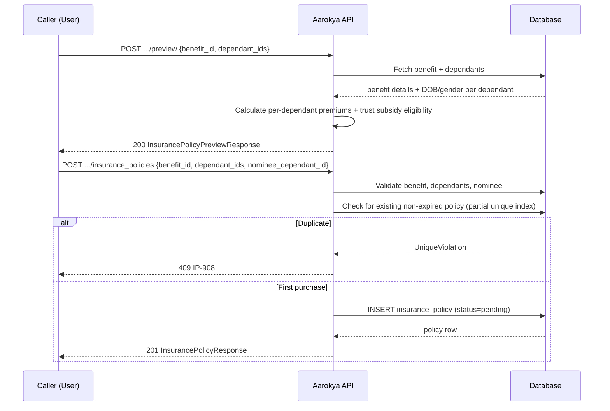

<Info>
  **Two auth tiers** — User-facing endpoints (preview, create, get, list) use JWT Bearer. Admin endpoints (list all, update) require an `admin-api-key` header.
</Info>

## Overview

An insurance policy ties a **primary user** to an **insurance-type benefit** and a set of **dependants** to be covered. Premiums are calculated per-dependant based on age and gender, stored in minor units (INR paise).

The purchase flow has two steps:

1. **Preview** — compute the premium breakdown without creating a record
2. **Create** — purchase the policy; status starts as `pending`

Activation (`status → active`) is done by an admin once the external insurer issues a policy number.

---

## Purchase Flow



---

## Auth Guards by Endpoint

| Endpoint | JWT user | Admin key | Notes |
|----------|----------|-----------|-------|
| `POST /users/{id}/insurance_policies/preview` | ✓ | — | Dependants must belong to the token user |
| `POST /users/{id}/insurance_policies` | ✓ | — | One active policy per user+benefit |
| `GET /users/{id}/insurance_policies/{pid}` | ✓ | — | Returns 404 for wrong user |
| `GET /users/{id}/insurance_policies` | ✓ | — | Filters by status, benefit_id |
| `GET /insurance_policies` | — | ✓ | Filter by user, benefit, status, time range |
| `PATCH /insurance_policies/{pid}` | — | ✓ | Set status, external_policy_id, dates |

---

## Key Concepts

### Premium Calculation

Premiums are calculated per dependant based on age bracket and gender:

| Age bracket | Monthly (INR) |
|-------------|--------------|
| 0–18 | ₹150 |
| 19–35 | ₹250 |
| 36–50 | ₹350 |
| 51–65 | ₹500 |
| 66+ | ₹650 |

Female dependants receive a 5% discount. Daily premium = ⌈monthly × 12 / 365⌉.

### Policy Status Lifecycle

```
pending → active → requires_customer_renewal_in_grace
                ↓
         requires_policy_reissuance
                ↓
         requires_customer_renewal
                ↓
              expired
```

---

## Endpoints

<CardGroup cols={2}>
  <Card title="POST .../preview" icon="calculator" color="#8b5cf6" href="/api/endpoints/insurance_policies/preview">
    Preview the premium breakdown for a set of dependants without creating a policy.
  </Card>
  <Card title="POST .../insurance_policies" icon="plus" color="#16a34a" href="/api/endpoints/insurance_policies/create">
    Purchase an insurance policy. Status starts as `pending`.
  </Card>
  <Card title="GET .../insurance_policies/{id}" icon="id-card" color="#3b82f6" href="/api/endpoints/insurance_policies/get">
    Fetch a single policy by its internal UUID.
  </Card>
  <Card title="GET .../insurance_policies" icon="list" color="#3b82f6" href="/api/endpoints/insurance_policies/list">
    List the authenticated user's policies. Filter by `status` or `benefit_id`.
  </Card>
  <Card title="GET /insurance_policies (admin)" icon="shield" color="#f59e0b" href="/api/endpoints/insurance_policies/admin_list">
    Admin: list all policies with full filtering including time range and user.
  </Card>
  <Card title="PATCH /insurance_policies/{id} (admin)" icon="pen" color="#f59e0b" href="/api/endpoints/insurance_policies/admin_update">
    Admin: set status, external policy ID, start/end dates.
  </Card>
</CardGroup>

---

## Request / Response Examples

<CodeGroup>
```bash Preview Premium
curl -X POST http://localhost:8080/users/USER_ID/insurance_policies/preview \
  -H 'Authorization: Bearer eyJhbGci...' \
  -H 'Content-Type: application/json' \
  -d '{
    "benefit_id": "018f4c2a-1b3e-7d8f-9a0b-2c3d4e5f6a7b",
    "dependant_ids": ["01926b3a-7c2e-7d4f-a1b2-c3d4e5f60001"]
  }'
```

```json Preview Response 200
{
  "benefit_name": "Narayana Health Shield",
  "coverage_amount": { "amount": 500000, "currency": "INR" },
  "duration_months": 12,
  "dependant_premiums": [
    {
      "dependant_id": "01926b3a-7c2e-7d4f-a1b2-c3d4e5f60001",
      "first_name": "Ravi",
      "last_name": "Kumar",
      "age": 31,
      "gender": "male",
      "monthly_premium": { "amount": 250, "currency": "INR" }
    }
  ],
  "total_monthly_premium": { "amount": 250, "currency": "INR" },
  "total_daily_premium": { "amount": 9, "currency": "INR" }
}
```

```bash Create Policy
curl -X POST http://localhost:8080/users/USER_ID/insurance_policies \
  -H 'Authorization: Bearer eyJhbGci...' \
  -H 'Content-Type: application/json' \
  -d '{
    "benefit_id": "018f4c2a-1b3e-7d8f-9a0b-2c3d4e5f6a7b",
    "dependant_ids": ["01926b3a-7c2e-7d4f-a1b2-c3d4e5f60001"],
    "nominee_dependant_id": "01926b3a-7c2e-7d4f-a1b2-c3d4e5f60001"
  }'
```

```json Create Response 201
{
  "id": "01926b3a-7c2e-7d4f-a1b2-c3d4e5f60099",
  "primary_user_id": "047382910564",
  "benefit_id": "018f4c2a-1b3e-7d8f-9a0b-2c3d4e5f6a7b",
  "benefit_name": "Narayana Health Shield",
  "external_policy_id": null,
  "dependant_ids": ["01926b3a-7c2e-7d4f-a1b2-c3d4e5f60001"],
  "nominee_dependant_id": "01926b3a-7c2e-7d4f-a1b2-c3d4e5f60001",
  "grace_period_days": 30,
  "daily_premium_amount": { "amount": 9, "currency": "INR" },
  "monthly_premium_amount": { "amount": 250, "currency": "INR" },
  "status": "pending",
  "created_at": "2026-04-13T10:00:00",
  "last_modified_at": "2026-04-13T10:00:00"
}
```
</CodeGroup>

---

## Error Codes

| Code | HTTP | Description |
|------|------|-------------|
| `IP-1000` | 500 | Internal server error |
| `IP-1001` | 404 | Insurance policy not found |
| `IP-1002` | 404 | Benefit not found or inactive |
| `IP-1003` | 400 | Benefit is not of type `insurance_policy` |
| `IP-1004` | 400 | Benefit is missing a required insurance field |
| `IP-1005` | 404 | Dependant not found or inactive |
| `IP-1006` | 400 | Dependant does not belong to the requesting user |
| `IP-1007` | 404 | Nominee dependant not found or inactive |
| `IP-1008` | 409 | User already has an active policy for this benefit |
| `IP-1009` | 400 | Requested dependant count exceeds benefit's `max_dependants` |
| `IP-1010` | 400 | Validation error |
| `IP-1011` | 400 | Invalid UUID in request |
| `IP-1012` | 403 | Forbidden |
