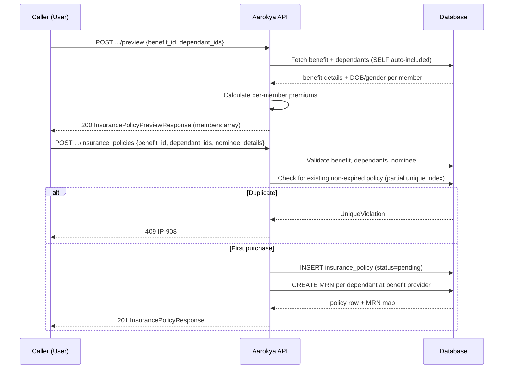
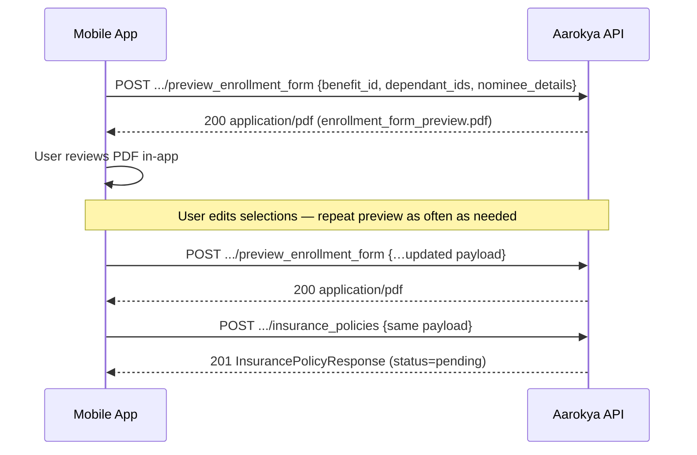

<Info>
  **Two auth tiers** — User-facing endpoints (preview, create, get, list) use JWT Bearer. Admin endpoints (list all, update) require an `admin-api-key` header.
</Info>

## Overview

An insurance policy ties a **primary user** to an **insurance-type benefit** and a set of **dependants** to be covered. The SELF dependant (the primary user themselves) is always auto-included in the covered members — you do not need to add it manually to `dependant_ids`. Premiums are calculated per member (including SELF) based on age and gender, stored in minor units (INR paise).

The purchase flow has two steps:

1. **Preview** — compute the premium breakdown without creating a record
2. **Create** — purchase the policy; status starts as `pending`

At creation time, the server also **auto-creates MRN records** for each covered dependant at the benefit's provider. The resulting mapping is stored in the policy's `metadata.dependant_mrn_map`.

Activation (`status → active`) is done by an admin once the external insurer issues a policy number.

---

## Purchase Flow



---

## Auth Guards by Endpoint

| Endpoint | JWT user | Admin key | Notes |
|----------|----------|-----------|-------|
| `POST /users/{id}/insurance_policies/preview` | ✓ | — | Dependants must belong to the token user |
| `POST /users/{id}/insurance_policies/preview_enrollment_form` | ✓ | — | Read-only — returns `application/pdf`. Zero DB writes, no Narayana calls |
| `POST /users/{id}/insurance_policies` | ✓ | — | One active policy per user+benefit |
| `GET /users/{id}/insurance_policies/{pid}` | ✓ | — | Returns 404 for wrong user |
| `GET /users/{id}/insurance_policies/{pid}/details` | ✓ | — | Wrapper response including the linked benefit summary |
| `GET /users/{id}/insurance_policies` | ✓ | — | Filters by status, benefit_id |
| `GET /insurance_policies` | — | ✓ | Filter by user, benefit, status, time range |
| `PATCH /insurance_policies/{pid}` | — | ✓ | Set status, external_policy_id, dates |

---

## Key Concepts

### Premium Calculation

Premiums are calculated per dependant based on age bracket and gender:

| Age bracket | Monthly (INR) |
|-------------|--------------|
| 0–18 | ₹150 |
| 19–35 | ₹250 |
| 36–50 | ₹350 |
| 51–65 | ₹500 |
| 66+ | ₹650 |

Female dependants receive a 5% discount. Daily premium = ⌈monthly × 12 / 365⌉.

### Policy Status Lifecycle

```
pending → active → requires_customer_renewal_in_grace
                ↓
         requires_policy_reissuance
                ↓
         requires_customer_renewal
                ↓
              expired
```

---

## Pre-purchase confirmation

Before creating a policy, the mobile/SDK frontend can render the **enrollment form PDF** for a prospective (not-yet-issued) policy and ask the user to verify their selected coverage, members, nominee, and computed premium. The endpoint is **read-only and idempotent** — it performs zero database writes, makes no Narayana calls, and creates no MRN rows. It is safe to re-call as the user adds or removes dependants, swaps the nominee, or switches plans.

The rendered PDF carries a `PREVIEW — not yet issued` banner, a synthetic policy id of all zeros, and the same applicant / coverage / members / nominee blocks as the post-issuance enrollment form. After the user reviews and confirms in-app, the frontend submits `POST /users/{user_id}/insurance_policies` with the same payload to create the policy.



---

### Preview Enrollment Form

<Info>
  **Authentication:** `Authorization: Bearer <access_token>`. Auth gate is `actor.require_self_or_trusted_backend(&user_id)` — same as `preview` and `create`.
</Info>

**What happens server-side**

- Loads the benefit + provider, asserts it is `Active` and of type `InsurancePolicy`.
- Resolves the caller-supplied dependant ids (ownership-checked) and **auto-includes the SELF dependant** at the head of the member list.
- Enforces `max_dependants` (excluding SELF).
- Validates the nominee is the policyholder's spouse.
- Computes the daily and monthly premium for the resolved member set.
- Builds an **in-memory synthetic** `InsurancePolicyApiResponse` (`id = 00000000-0000-0000-0000-000000000000`, `status = pending`, no dates, no `external_policy_id`, no metadata) and renders the enrollment-form PDF directly.
- **No** `INSERT` / `UPDATE` against `insurance_policies` or `mrns`. **No** Narayana `find_or_register_patients` call.

**Request body**

<ParamField body="benefit_id" type="string (uuid)" required>
  Benefit to preview against. Must be `Active` and of type `InsurancePolicy`.
</ParamField>

<ParamField body="dependant_ids" type="string (uuid)[]" required>
  Caller-supplied dependants to cover. SELF is auto-included if absent — you may pass an empty array.
</ParamField>

<ParamField body="nominee_details" type="object" required>
  Nominee details — either `Dependant` (existing dependant id, must be a SPOUSE) or `External` (inline name + DOB + relationship, relationship must be `spouse`).
</ParamField>

**Example**

<CodeGroup>
```bash curl
curl -X POST http://localhost:8080/users/USER_ID/insurance_policies/preview_enrollment_form \
  -H 'Authorization: Bearer eyJhbGci...' \
  -H 'Content-Type: application/json' \
  --output enrollment_form_preview.pdf \
  -d '{
    "benefit_id": "018f4c2a-1b3e-7d8f-9a0b-2c3d4e5f6a7b",
    "dependant_ids": [],
    "nominee_details": {
      "type": "external",
      "salutation": "Mrs",
      "name": "Spouse Name",
      "date_of_birth": "1992-04-15",
      "relationship": "spouse",
      "gender": "female",
      "phone": "+919999999999"
    }
  }'
```

```json Request body
{
  "benefit_id": "018f4c2a-1b3e-7d8f-9a0b-2c3d4e5f6a7b",
  "dependant_ids": [],
  "nominee_details": {
    "type": "external",
    "salutation": "Mrs",
    "name": "Spouse Name",
    "date_of_birth": "1992-04-15",
    "relationship": "spouse",
    "gender": "female",
    "phone": "+919999999999"
  }
}
```
</CodeGroup>

**Response**

`200 OK` with `Content-Type: application/pdf`. Body is the binary PDF (`enrollment_form_preview.pdf`).

---

## Endpoints

<CardGroup cols={2}>
  <Card title="POST .../preview" icon="calculator" color="#8b5cf6" href="/api/endpoints/insurance_policies/preview">
    Preview the premium breakdown for a set of dependants without creating a policy.
  </Card>
  <Card title="POST .../preview_enrollment_form" icon="file-pdf" color="#8b5cf6" href="/api/endpoints/insurance_policies/preview-enrollment-form">
    Render the enrollment form PDF for a prospective policy. Read-only — safe to re-call as the user adjusts dependants/nominee.
  </Card>
  <Card title="POST .../insurance_policies" icon="plus" color="#16a34a" href="/api/endpoints/insurance_policies/create">
    Purchase an insurance policy. Status starts as `pending`.
  </Card>
  <Card title="GET .../insurance_policies/{id}" icon="id-card" color="#3b82f6" href="/api/endpoints/insurance_policies/get">
    Fetch a single policy by its internal UUID.
  </Card>
  <Card title="GET .../insurance_policies/{id}/details" icon="layer-group" color="#3b82f6" href="/api/endpoints/insurance_policies/get_with_benefit_details">
    Fetch a single policy bundled with its linked benefit summary (name, type, provider, benefit_details).
  </Card>
  <Card title="GET .../insurance_policies" icon="list" color="#3b82f6" href="/api/endpoints/insurance_policies/list">
    List the authenticated user's policies. Filter by `status` or `benefit_id`.
  </Card>
  <Card title="GET /insurance_policies (admin)" icon="shield" color="#f59e0b" href="/api/endpoints/insurance_policies/admin_list">
    Admin: list all policies with full filtering including time range and user.
  </Card>
  <Card title="PATCH /insurance_policies/{id} (admin)" icon="pen" color="#f59e0b" href="/api/endpoints/insurance_policies/admin_update">
    Admin: set status, external policy ID, start/end dates.
  </Card>
</CardGroup>

---

## Request / Response Examples

<CodeGroup>
```bash Preview Premium
curl -X POST http://localhost:8080/users/USER_ID/insurance_policies/preview \
  -H 'Authorization: Bearer eyJhbGci...' \
  -H 'Content-Type: application/json' \
  -d '{
    "benefit_id": "018f4c2a-1b3e-7d8f-9a0b-2c3d4e5f6a7b",
    "dependant_ids": ["01926b3a-7c2e-7d4f-a1b2-c3d4e5f60001"]
  }'
```

```json Preview Response 200
{
  "benefit_name": "Narayana Health Shield",
  "coverage_amount": { "amount": 500000, "currency": "INR" },
  "duration_months": 12,
  "members": [
    {
      "dependant_id": "01926b3a-7c2e-7d4f-a1b2-c3d4e5f60099",
      "first_name": "Ravi",
      "last_name": "Kumar",
      "salutation": "MR",
      "age": 31,
      "gender": "MALE",
      "relationship": "SELF",
      "monthly_premium": { "amount": 250, "currency": "INR" }
    },
    {
      "dependant_id": "01926b3a-7c2e-7d4f-a1b2-c3d4e5f60001",
      "first_name": "Priya",
      "last_name": "Kumar",
      "salutation": "MRS",
      "age": 33,
      "gender": "FEMALE",
      "relationship": "SPOUSE",
      "monthly_premium": { "amount": 238, "currency": "INR" }
    }
  ],
  "total_monthly_premium": { "amount": 488, "currency": "INR" },
  "total_daily_premium": { "amount": 17, "currency": "INR" }
}
```

```bash Create Policy (nominee is an existing dependant)
curl -X POST http://localhost:8080/users/USER_ID/insurance_policies \
  -H 'Authorization: Bearer eyJhbGci...' \
  -H 'Content-Type: application/json' \
  -d '{
    "benefit_id": "018f4c2a-1b3e-7d8f-9a0b-2c3d4e5f6a7b",
    "dependant_ids": ["01926b3a-7c2e-7d4f-a1b2-c3d4e5f60001"],
    "nominee_details": {
      "type": "dependant",
      "dependant_id": "01926b3a-7c2e-7d4f-a1b2-c3d4e5f60001"
    }
  }'
```

```bash Create Policy (nominee is an external person)
curl -X POST http://localhost:8080/users/USER_ID/insurance_policies \
  -H 'Authorization: Bearer eyJhbGci...' \
  -H 'Content-Type: application/json' \
  -d '{
    "benefit_id": "018f4c2a-1b3e-7d8f-9a0b-2c3d4e5f6a7b",
    "dependant_ids": ["01926b3a-7c2e-7d4f-a1b2-c3d4e5f60001"],
    "nominee_details": {
      "type": "external",
      "salutation": "mrs",
      "name": "Anita Sharma",
      "relationship": "MOTHER",
      "date_of_birth": "1960-05-15",
      "gender": "FEMALE",
      "phone": "+919876543210"
    }
  }'
```

```json Create Response 201
{
  "id": "01926b3a-7c2e-7d4f-a1b2-c3d4e5f60099",
  "primary_user_id": "047382910564",
  "benefit_id": "018f4c2a-1b3e-7d8f-9a0b-2c3d4e5f6a7b",
  "benefit_name": "Narayana Health Shield",
  "external_policy_id": null,
  "dependant_ids": [
    "01926b3a-7c2e-7d4f-a1b2-c3d4e5f60099",
    "01926b3a-7c2e-7d4f-a1b2-c3d4e5f60001"
  ],
  "nominee_details": {
    "type": "dependant",
    "dependant_id": "01926b3a-7c2e-7d4f-a1b2-c3d4e5f60001"
  },
  "grace_period_days": 30,
  "daily_premium_amount": { "amount": 17, "currency": "INR" },
  "monthly_premium_amount": { "amount": 488, "currency": "INR" },
  "metadata": {
    "dependant_mrn_map": {
      "01926b3a-7c2e-7d4f-a1b2-c3d4e5f60099": "01926b3a-7c2e-7d4f-a1b2-c3d4e5f60020",
      "01926b3a-7c2e-7d4f-a1b2-c3d4e5f60001": "01926b3a-7c2e-7d4f-a1b2-c3d4e5f60021"
    }
  },
  "status": "PENDING",
  "created_at": "2026-04-13T10:00:00",
  "last_modified_at": "2026-04-13T10:00:00"
}
```
</CodeGroup>

<Note>
  The SELF dependant is **always auto-included** in `dependant_ids` — you do not need to add it. The `members` array in the preview response and `dependant_ids` in the create response will both include SELF automatically.
</Note>

### `nominee_details` — Tagged Union

The `nominee_details` field is a JSONB tagged union. Use one of two variants:

| Variant | Fields | Description |
|---------|--------|-------------|
| `dependant` | `type`, `dependant_id` | Nominee is an existing dependant on the user's profile |
| `external` | `type`, `name`, `relationship`, `date_of_birth`, `gender`, `phone` | Nominee is a person not registered as a dependant |

### Preview `members` Array

The preview response returns a unified `members` array of `MemberDetail` objects instead of separate `primary_member` and `dependants` fields:

| Field | Type | Description |
|-------|------|-------------|
| `dependant_id` | uuid | The dependant's internal ID |
| `first_name` | string | First name |
| `last_name` | string | Last name |
| `salutation` | string | Title (mr, mrs, ms, master) |
| `age` | integer | Age computed from date of birth |
| `gender` | string | male or female |
| `relationship` | string | Relationship to the primary user (self, spouse, child, etc.) |
| `monthly_premium` | Money | Per-member monthly premium in minor units |

### MRN Auto-Creation

When a policy is created, the server automatically creates one MRN record per covered dependant at the benefit's provider. The `metadata.dependant_mrn_map` field maps each dependant ID to its newly created MRN ID.

For each member without an existing MRN at this provider, the server calls the upstream insurance provider (currently **Narayana Health**) to look up the patient by name + DOB; if not found, it registers a new patient under the primary user's phone. The returned `external_mrn` (`temp_number` and/or `mrn`) is persisted on the new MRN row. If a member already has an MRN row at this provider it is reused as-is, with no upstream call.

<Warning>
  Narayana only accepts `Male` / `Female` for patient gender. Members with `gender = other` cause policy creation to fail with **400 IP-1013** — update the dependant's gender before retrying. Upstream registration failures (timeout, 5xx) surface as **502 IP-1014** and the entire policy creation is rolled back.
</Warning>

---

## Error Codes

| Code | HTTP | Description |
|------|------|-------------|
| `IP-1000` | 500 | Internal server error |
| `IP-1001` | 404 | Insurance policy not found |
| `IP-1002` | 404 | Benefit not found or inactive |
| `IP-1003` | 400 | Benefit is not of type `insurance_policy` |
| `IP-1004` | 400 | Benefit is missing a required insurance field |
| `IP-1005` | 404 | Dependant not found or inactive |
| `IP-1006` | 400 | Dependant does not belong to the requesting user |
| `IP-1007` | 404 | Nominee dependant not found or inactive |
| `IP-1008` | 409 | User already has an active policy for this benefit |
| `IP-1009` | 400 | Requested dependant count exceeds benefit's `max_dependants` |
| `IP-1010` | 400 | Validation error |
| `IP-1011` | 400 | Invalid UUID in request |
| `IP-1012` | 403 | Forbidden |
| `IP-1013` | 400 | Member gender is `other` — Narayana requires `male` or `female` |
| `IP-1014` | 502 | Upstream insurance-provider patient registration failed |
