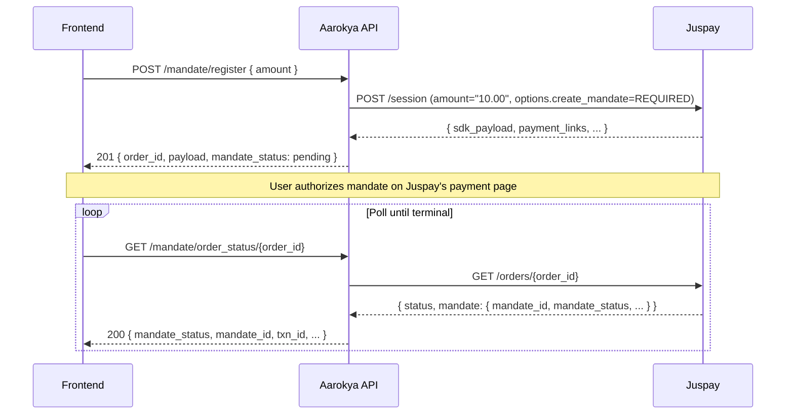

<Info>
  **Auth guard:** `require_self_or_trusted_backend` — the user themselves (`jwt.sub == user_id`) or a trusted backend actor (admin). Partner keys and the callback service are not accepted.
</Info>

<Note>
  **One live mandate per user.** A user may hold **at most one** mandate in `pending`, `active`, **or** `paused` state at a time, enforced by an application-level check before insert (no DB constraint). A `paused` mandate still counts as live — it must be resumed or cancelled before a new one can be registered. `initiated` rows (a registration that was started but never completed on the payment page) and terminal `failed`/`cancelled` rows do **not** count and can stack freely. A second `register` while a live mandate exists returns `409 ME 1207`.
</Note>

## Overview

The mandate module lets an authenticated user set up a recurring debit on a card or bank account via [Juspay](https://juspay.in)'s payment page. The flow is two-step:

1. **Register** — backend opens a Juspay `/session` and persists a pending `mandate_orders` row. The response includes the **verbatim full Juspay response** as `payload`, which the frontend hands to Juspay's SDK (native) or uses for a redirect (`payment_links.web`).
2. **Poll status** — after the user finishes the payment flow on Juspay, the frontend polls `/mandate/order_status/{order_id}`. Every call hits Juspay's `/orders/{order_id}` and syncs the row with the latest state. Frontend controls polling cadence.

Autopay execution (`/txns`), webhooks, and pause/revoke flows are **not part of this module yet** — they ship in a later milestone.

---

## Endpoints

<CardGroup cols={2}>
  <Card title="POST /users/{user_id}/mandate/register" icon="plus" color="#16a34a" href="/api/endpoints/mandate/register">
    Open a Juspay session. Returns `payload` with `sdk_payload` + `payment_links` for the frontend to consume.
  </Card>
  <Card title="GET /users/{user_id}/mandate/order_status/{order_id}" icon="magnifying-glass" color="#16a34a" href="/api/endpoints/mandate/order-status">
    Poll for the latest mandate status. Always queries Juspay — no server-side caching.
  </Card>
  <Card title="GET /users/{user_id}/mandates/active" icon="circle-check" color="#16a34a" href="/api/endpoints/mandates/active">
    Fetch the user's live (`pending`, `active`, or `paused`) mandate. DB-only, no Juspay round-trip. Returns `404 ME 1208` when there is no live mandate.
  </Card>
</CardGroup>

---

## Identifiers

Three IDs are easy to confuse. This is what each one is:

| Identifier | Shape | Where it comes from | Where it's used |
|---|---|---|---|
| `id` (primary key) | UUID v7 | Generated server-side on register | Internal DB only. Never exposed in URL paths. |
| `order_id` | `<user_id>_<unix_ms>` | Generated server-side on register | Sent to Juspay as their `order_id`. Used as the **URL path param** for the status endpoint. |
| `customer_id` | `<user_id>` | Derived server-side on register | Sent to Juspay as their `customer_id`. Stored for audit. |
| `mandate_id` | Juspay-issued string | Returned by Juspay after the user completes the SDK flow | Stored on the row once known. Required for future autopay execution. |
| `start_date` / `end_date` | ISO-8601 string (nullable) | Populated by Juspay after mandate is active | Null until Juspay returns them in the order-status response. |

---

## Amount Unit Convention

- The API accepts and returns `amount` and `max_amount` in **rupees** (integer, minimum `1`).
- The backend converts to paise (`amount_paise = amount * 100`) only at the Juspay client boundary.
- Juspay's wire format is a decimal rupee string — e.g. `amount: 10` (rupees) becomes `"10.00"` on the Juspay request.
- `max_amount` is fixed at **₹100** per debit; `frequency` is fixed at `as_presented`. Both are applied server-side; they cannot be overridden per request.

---

## Mandate Status

| Value | Meaning |
|---|---|
| `pending` | Default on creation. Awaiting user completion on Juspay's page. |
| `active` | User authorized successfully; Juspay returned `mandate_status = ACTIVE`. |
| `failed` | Juspay returned `FAILURE` / `FAILED`. |
| `paused` | Juspay returned `PAUSED`. |
| `cancelled` | Juspay returned `REVOKED` / `CANCELLED`, or we soft-cancelled via `MandateOrderUpdate::Cancel`. |

Unknown Juspay statuses map to `pending` — we wait for the next poll rather than committing to `failed` on an ambiguous response.

---

## Frontend Flow

---

## Request Validation

| Field | Rule |
|---|---|
| `amount` | Required. Integer rupees, `>= 1`. |
| `account_id` | Optional. If present, must be a valid UUID. |
| path `user_id` | Must equal `jwt.sub` (enforced by `JwtSelfAuth::strict()`). |
| path `order_id` (status) | The string we sent to Juspay, not the internal UUID. |

Also: the user row must have a non-null `email` — registration requires it for Juspay's session call. Registration returns `400 ValidationError` if missing.

---

## Error Responses

| Code | Status | Error | Situation |
|---|---|---|---|
| `ME 1200` | 500 | Internal error | Unexpected failure |
| `ME 1201` | 404 | Mandate not found | Mandate `id` doesn't exist or doesn't belong to `user_id` |
| `ME 1202` | 404 | User not found | JWT is valid but user row was deleted |
| `ME 1203` | 404 | Account not found | `account_id` doesn't exist |
| `ME 1204` | 400 | HSA account required | User has no PBA-backed (HSA) account — onboarding not completed |
| `ME 1205` | 400 | Validation error | Bad input (e.g. missing user email for the Juspay session) |
| `ME 1206` | 500 | Provider unavailable | Juspay returned 5xx or network timed out |
| `ME 1207` | 409 | Mandate already exists | User already has a live (`pending`/`active`/`paused`) mandate; only one is allowed |
| `ME 1208` | 404 | No active mandate | `GET /mandates/active` — user has no live (`pending`/`active`/`paused`) mandate |

---

## Gotchas

<Warning>
  The path param for status polling is the **Juspay `order_id`** (format `<user_id>_<unix_ms>`), **not** the internal UUID `id`. Mixing them up returns a 404 / path-parse error.
</Warning>

<Warning>
  `/mandate/order_status/{order_id}` **always** hits Juspay. There is no server-side short-circuit once `mandate_status` becomes `active`. The frontend is responsible for stopping polling at a terminal status.
</Warning>

<Info>
  The `payload` field on the register response is a **verbatim pass-through** of Juspay's `/session` body. Backend does not interpret its shape, so frontend can freely consume `sdk_payload`, `payment_links.web`, or any new fields Juspay adds later without a backend change.
</Info>
