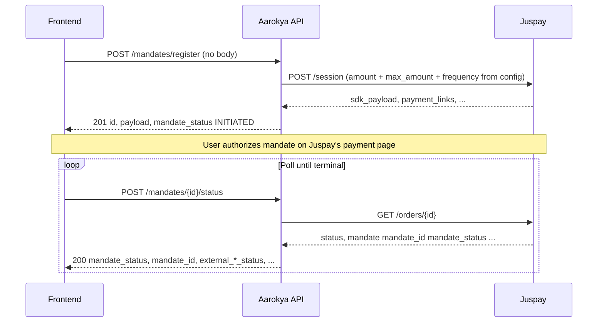

<Info>
  **Auth guards** are per-route. User-facing routes (register, status, list,
  active, pause, resume, revoke) use `require_self_or_trusted_backend` — the
  user themselves (`jwt.sub == user_id`) or a trusted backend / admin. The
  admin-pinned lifecycle routes (`update`, `start`) and the cross-user list
  (`/admin/mandates`) require an admin actor.
</Info>

<Note>
  **One live mandate per user.** A user may hold **at most one** *live* mandate
  at a time — `PENDING`, `CREATED`, `ACTIVE`, `LIVE`, `PAUSED`, or
  `EXTERNALLY_PAUSED`. This is enforced by an application-level check before
  insert (no DB constraint). `INITIATED` rows (a registration started but never
  completed on the payment page) and terminal `FAILED` / `CANCELLED` /
  `COMPLETED` rows do **not** count and can stack freely. A second `register`
  while a live mandate exists returns `409 ME_1207`.
</Note>

## Overview

The mandate module lets an authenticated user set up a recurring debit (autopay)
on a card or bank account via [Juspay](https://juspay.in)'s payment page, then
drives that mandate through its lifecycle. The flow:

1. **Register** — backend opens a Juspay `/session` and persists an `INITIATED`
   `mandates` row. The response includes the **verbatim full Juspay response**
   as `payload`, which the frontend hands to Juspay's SDK (native) or uses for a
   redirect (`payment_links.web`). Amounts are **server-derived** (config +
   Superposition) — the request body is empty.
2. **Poll status** — after the user finishes the payment flow, the frontend
   polls. Status routes hit Juspay's `/orders/{id}` and sync the row with the
   latest state.
3. **Lifecycle** — once the mandate reaches `ACTIVE`/`CREATED`, an operator
   `start`s it to schedule the Kronos autopay job (`LIVE`), and can `pause` /
   `resume` / `revoke` from there. Each transition is validated by a state
   machine and may schedule or tear down the Kronos job.

Autopay execution itself (the `/txns` debit + reconciliation) lives in the
[Mandate Execution Module](./mandate_execution).

---

## Endpoints

<CardGroup cols={2}>
  <Card title="POST /users/{user_id}/mandate/register" icon="plus" color="#16a34a" href="/api/endpoints/mandate/register">
    Open a Juspay session (legacy, flat-rupee amounts). Returns `payload` for the frontend SDK / redirect.
  </Card>
  <Card title="POST /users/{user_id}/mandates/register" icon="plus" color="#16a34a" href="/api/endpoints/mandate/register-v2">
    Same flow as register, but the response carries `AmountResponse` (value + currency) instead of flat rupees.
  </Card>
  <Card title="GET /users/{user_id}/mandate/order_status/{id}" icon="magnifying-glass" color="#16a34a" href="/api/endpoints/mandate/order-status">
    Poll a mandate's status by its UUID `id`. Always queries Juspay (legacy flat-amount shape).
  </Card>
  <Card title="POST /users/{user_id}/mandates/{mandate_id}/status" icon="magnifying-glass" color="#16a34a" href="/api/endpoints/mandate/check-status">
    Refresh a mandate from Juspay, currency-aware `MandateResponse`.
  </Card>
  <Card title="GET /users/{user_id}/mandates/active" icon="circle-check" color="#16a34a" href="/api/endpoints/mandate/active">
    Fetch the user's single live mandate. DB-only, no Juspay round-trip. `404 ME_1208` when there is none.
  </Card>
  <Card title="GET /users/{user_id}/mandates" icon="list" color="#16a34a" href="/api/endpoints/mandate/list">
    Paginated, currency-aware list of the user's mandates.
  </Card>
  <Card title="GET /users/{user_id}/mandate_orders" icon="list" color="#16a34a" href="/api/endpoints/mandate/list-orders">
    Legacy list — no pagination, flat-amount items.
  </Card>
  <Card title="POST /users/{user_id}/mandates/{mandate_id}" icon="pen" color="#7c3aed" href="/api/endpoints/mandate/update">
    Admin: set `mandate_status` directly (validated against the state machine).
  </Card>
  <Card title="POST /users/{user_id}/mandates/{mandate_id}/start" icon="play" color="#7c3aed" href="/api/endpoints/mandate/start">
    Admin: activate autopay — `→ LIVE`, schedules the Kronos job, stamps `job_id`.
  </Card>
  <Card title="POST /users/{user_id}/mandates/{mandate_id}/pause" icon="pause" color="#16a34a" href="/api/endpoints/mandate/pause">
    Pause a live mandate — cancels the Kronos job, `→ PAUSED`.
  </Card>
  <Card title="POST /users/{user_id}/mandates/{mandate_id}/resume" icon="play" color="#16a34a" href="/api/endpoints/mandate/resume">
    Resume a paused mandate — schedules a fresh Kronos job, `→ LIVE`.
  </Card>
  <Card title="POST /users/{user_id}/mandates/{mandate_id}/revoke" icon="ban" color="#16a34a" href="/api/endpoints/mandate/revoke">
    Revoke at Juspay then re-sync — `→ CANCELLED`, tears down the Kronos job.
  </Card>
  <Card title="GET /admin/mandates" icon="users" color="#7c3aed" href="/api/endpoints/mandate/admin-list">
    Admin cross-user list. `user_id` is an optional query filter, not a path label.
  </Card>
</CardGroup>

<Note>
  Two register endpoints exist. **Legacy** `POST /users/{user_id}/mandate/register`
  returns flat `i64` rupee amounts (no currency envelope). **V2**
  `POST /users/{user_id}/mandates/register` returns the same flow with
  `AmountResponse` (value + currency). Likewise the **legacy** status poll
  `GET …/mandate/order_status/{id}` and list `GET …/mandate_orders` return
  flat-amount shapes; new integrations should use `POST …/mandates/{id}/status`
  and `GET …/mandates` for the paginated, currency-aware shapes.
</Note>

---

## Identifiers

| Identifier | Shape | Where it comes from | Where it's used |
|---|---|---|---|
| `id` (primary key) | UUID v7 | Generated server-side on register | The mandate's id. **Also** the value sent to Juspay as their `order_id`, and the path param for the legacy status poll. |
| `mandate_id` | Juspay-issued string | Returned by Juspay after the user completes the SDK flow | Stored on the row once known. Required for autopay execution and provider-side revoke. |
| `account_id` | UUID | Looked up server-side (user's active PBA account) | The HSA account the autopay debit draws from. |
| `job_id` | Kronos job id | Stamped on a successful `start`/`resume` | Cleared on `pause`/`revoke`. Null until the mandate is `LIVE`. |
| `start_date` / `end_date` | ISO-8601 string (nullable) | Populated by Juspay after the mandate is active | Null until Juspay returns them. |

<Warning>
  The path routes are split: the **status-poll** routes are keyed on the
  internal UUID `id` (the legacy route's `{id}`, or the V2 route's
  `{mandate_id}` which is also the internal UUID `mandates.id`), **not** the
  Juspay-issued `mandate_id` string. The internal `id` is the value sent to
  Juspay as `order_id`.
</Warning>

---

## Amount Convention

- Amounts are **server-derived**, not supplied in the request body. The initial
  order amount comes from config (`mandate.order_amount`, in paise) and the
  per-debit ceiling (`mandate_max_amount`) and `frequency` come from Superposition
  (overridable per user via a targeting key).
- The **legacy** register/status/list shapes return flat `i64` rupee amounts.
  The **V2 / currency-aware** shapes return `AmountResponse` — `{ value, currency }`,
  where `value` is a major-unit float.
- Juspay's wire format is a decimal rupee string — the backend converts at the
  Juspay client boundary.

---

## Mandate Status

`mandate_status` is the coarse internal lifecycle (`common_enums::MandateStatus`,
wire values SCREAMING_SNAKE_CASE), derived from the raw Juspay status. The full set:

| Value | Meaning |
|---|---|
| `INITIATED` | Default on insert — registration row created before/while the Juspay session is opened. Does not count as "live". |
| `PENDING` | Registration in progress on Juspay's page. |
| `CREATED` | Juspay reported the order as set up (`ACTIVE` at provider) — ready to be started. |
| `ACTIVE` | Mandate approved; eligible for autopay activation. |
| `LIVE` | Autopay activated — Kronos job scheduled, `job_id` stamped. |
| `PAUSED` | Operator-paused; Kronos job cancelled. |
| `EXTERNALLY_PAUSED` | Juspay reported a pause we didn't initiate. |
| `FAILED` | Terminal — Juspay returned `FAILURE`. |
| `CANCELLED` | Terminal — revoked at Juspay (`REVOKED`) or operator-cancelled. |
| `COMPLETED` | Terminal — mandate expired at Juspay (`EXPIRED`). |
| `OTHER` | Unrecognised Juspay status — stored verbatim on `external_mandate_status`; blocks all lifecycle transitions until reconciled. |

Alongside `mandate_status`, the row carries `external_mandate_status` — the raw
Juspay vocabulary (`ACTIVE`, `PAUSED`, `REVOKED`, `EXPIRED`, …) stored verbatim
so new Juspay statuses don't require schema changes.

---

## State machine

`update` / `start` / `pause` / `resume` / `revoke` all flow through one
transition validator. Allowed transitions:

| From | Allowed targets |
|---|---|
| `INITIATED` | `PENDING`, `ACTIVE`, `CREATED`, `EXTERNALLY_PAUSED`, `CANCELLED`, `COMPLETED`, `FAILED` |
| `PENDING` | `ACTIVE`, `CREATED`, `EXTERNALLY_PAUSED`, `CANCELLED`, `COMPLETED`, `FAILED` |
| `ACTIVE` / `CREATED` | `LIVE`, `EXTERNALLY_PAUSED`, `CANCELLED`, `COMPLETED`, `FAILED` |
| `LIVE` | `PAUSED`, `EXTERNALLY_PAUSED`, `CANCELLED`, `COMPLETED`, `FAILED` |
| `PAUSED` | `LIVE`, `EXTERNALLY_PAUSED`, `CANCELLED`, `COMPLETED`, `FAILED` |
| `EXTERNALLY_PAUSED` | `LIVE`, `CANCELLED`, `COMPLETED`, `FAILED` |
| `FAILED` / `CANCELLED` / `COMPLETED` | terminal (self only) |
| `OTHER` | none — see note below |

Side effects: `ACTIVE`/`CREATED` → `LIVE` (and `PAUSED` → `LIVE` on resume)
schedules the Kronos autopay job and stamps `job_id`; `LIVE` → `PAUSED`/`CANCELLED`
cancels the job and clears `job_id`. An invalid transition returns
`400 ME_1210` (`InvalidMandateStatusTransition`).

<Warning>
  A mandate in `OTHER` (an unrecognised Juspay provider status) has **no
  outbound transitions** — any lifecycle op returns `400 ME_1211`
  (`MandateInUnknownProviderStatus`). An operator must reconcile the mandate at
  the provider first.
</Warning>

---

## Frontend Flow

Once `mandate_status` reaches `ACTIVE`/`CREATED`, an operator calls `start` to
activate autopay.

---

## Request validation

| Field | Rule |
|---|---|
| path `user_id` | Must equal `jwt.sub` for self-auth, or carry a trusted-backend/admin actor. |
| path `id` (legacy status) | The mandate UUID (also the value sent to Juspay as `order_id`), not the Juspay-issued `mandate_id` string. |
| `update` body `mandate_status` | Required. Validated against the state machine. |

Also: the user must have an active PBA-backed (HSA) account (else `400 ME_1204`)
and a non-null `email` (the Juspay session needs it; else `400 ME_1205`).

---

## Error responses

| Code | Status | Error | Situation |
|---|---|---|---|
| `ME_1200` | 500 | Internal error | Unexpected failure |
| `ME_1201` | 404 | Mandate not found | Mandate `id` doesn't exist or doesn't belong to `user_id` |
| `ME_1202` | 404 | User not found | JWT valid but user row deleted |
| `ME_1203` | 404 | Account not found | `account_id` doesn't exist |
| `ME_1204` | 400 | HSA account required | User has no PBA-backed (HSA) account — onboarding incomplete |
| `ME_1205` | 400 | Validation error | Bad input (e.g. missing user email for the Juspay session) |
| `ME_1206` | 500 | Provider unavailable | Juspay returned 5xx or timed out |
| `ME_1207` | 409 | Mandate already exists | User already has a live mandate; only one is allowed |
| `ME_1208` | 404 | No active mandate | `GET /mandates/active` — user has no live mandate |
| `ME_1209` | 404 | Mandate not found by mandate_id | Juspay `mandate_id` lookup miss |
| `ME_1210` | 400 | Invalid status transition | The requested `from → to` transition isn't allowed |
| `ME_1211` | 400 | Unknown provider status | Mandate is in `OTHER` — reconcile at the provider first |
| `ME_1212` | 500 | Missing mandate block | Order-status response lacked the mandate block |
| `ME_1213` | 500 | Invalid Juspay datetime | Malformed datetime in the Juspay response |
| `ME_1214` | 400 | Mandate not completed | Setup not completed on the payment provider (caller-recoverable) |

---

## Gotchas

<Warning>
  The status-poll routes **always** hit Juspay. There is no server-side
  short-circuit once `mandate_status` becomes `ACTIVE`/`LIVE`. The frontend is
  responsible for stopping polling at a terminal status. (`GET /mandates/active`
  is the exception — it is DB-only.)
</Warning>

<Info>
  The `payload` field on the register response is a **verbatim pass-through** of
  Juspay's `/session` body. Backend does not interpret its shape, so frontend
  can freely consume `sdk_payload`, `payment_links.web`, or any new fields
  Juspay adds later without a backend change.
</Info>
