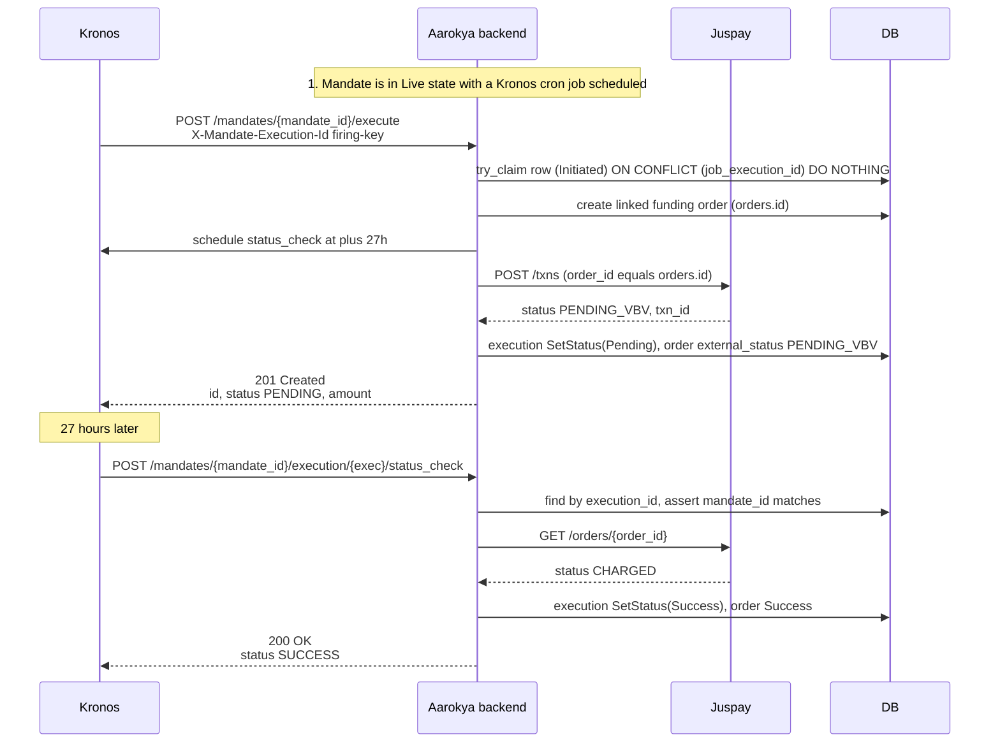

<Note>
  **Auth guard:** the Kronos-fired routes (`execute`, `status_check`) require the
  callback-service actor (`actor.require_callback_service()`). The two dashboard
  read routes (`executions` list + get) use `require_self_or_trusted_backend` —
  the user themselves or a trusted backend / admin.
</Note>

## Overview

Mandate execution is the runtime side of the mandate lifecycle —
where a registered mandate (from the [Mandate Module](./mandate)) is
**actually charged**. The mandate must be in the `LIVE` state. Two
Kronos-fired routes drive it:

1. **`POST /mandates/{mandate_id}/execute`** — Kronos fires this once
   per autopay cycle. Each firing claims a `mandate_executions` row
   (idempotent on the `X-Mandate-Execution-Id` header), creates a linked
   funding order, calls Juspay's `/txns` to debit, and stamps the txn status.
2. **`POST /mandates/{mandate_id}/execution/{execution_id}/status_check`**
   — Kronos fires this **+27h after a non-terminal debit** to
   reconcile the txn status, then reschedules every 15min up to
   `status_check.max_attempts` (default 6). If still non-terminal when the
   Kronos window (`ends_at`) expires, the row sits in its last non-terminal
   status for operator inspection — no forced terminal state.

There is **no per-firing state in the request body**. Each firing is
identified by the `X-Mandate-Execution-Id` header (templated by Kronos via
`{{execution.execution_id}}`), and the attempt cadence is implicit in Kronos's
cron schedule — no DB column tracks attempts.

Two **dashboard read routes** (bearer auth, not Kronos) surface those rows:
`GET …/executions` lists a mandate's attempts (each joined to its order's
Juspay `external_order_status`), and `GET …/executions/{execution_id}` returns
one by id (carrying the linked `order_id`). Both fail closed — the mandate must
belong to `user_id`, and the execution to that mandate — so a guessed id
returns 404, not another user's row. A cross-user admin list also exists at
`GET /admin/mandate_executions`.

---

## Endpoints

<CardGroup cols={2}>
  <Card title="POST /mandates/{mandate_id}/execute" icon="bolt" color="#dc2626" href="/api/endpoints/mandate-execution/execute">
    Run a single autopay debit. Returns 201 on first claim, 200 on idempotent replay. Callback-service auth.
  </Card>
  <Card title="POST /mandates/{mandate_id}/execution/{execution_id}/status_check" icon="rotate" color="#dc2626" href="/api/endpoints/mandate-execution/status-check">
    Reconcile a single execution row against Juspay. Callback-service auth.
  </Card>
  <Card title="GET /users/{user_id}/mandates/{mandate_id}/executions" icon="list" color="#2563eb" href="/api/endpoints/mandate-execution/list">
    Dashboard list of a mandate's execution attempts, each joined to its order's Juspay `external_order_status`. Bearer auth.
  </Card>
  <Card title="GET /users/{user_id}/mandates/{mandate_id}/executions/{execution_id}" icon="magnifying-glass" color="#2563eb" href="/api/endpoints/mandate-execution/get">
    Single execution by id, carrying the linked `order_id`. Fails closed on cross-ownership. Bearer auth.
  </Card>
  <Card title="GET /admin/mandate_executions" icon="users" color="#7c3aed" href="/api/endpoints/mandate-execution/admin-list">
    Cross-user, paginated list for the admin dashboard. Admin / readonly-admin auth.
  </Card>
</CardGroup>

---

## Lifecycle



If Juspay reports a still-non-terminal status on a reconciliation
firing, the next Kronos firing (15min later) re-checks, up to
`status_check.max_attempts` firings bounded by the cron window.

---

## Two-layer idempotency

Kronos retries on transient failures, so duplicate firings are
expected. Two layers prevent double-debits:

1. **DB claim** — `INSERT ... ON CONFLICT (job_execution_id) DO NOTHING
   RETURNING *`. Exactly one concurrent caller wins; the loser reads
   the winner's row and returns it. The conflict key is `job_execution_id`
   (the value from the `X-Mandate-Execution-Id` header).
2. **Juspay-side dedup** — Juspay deduplicates on `order_id`. We pass
   `order_id =` the linked orders-ledger row id (`orders.id`), stable across
   retries, so a firing-retry that somehow slips past the DB claim still
   doesn't double-charge. A resumed `Initiated` firing reuses its existing
   linked order (no duplicate order).

The status_check route adds a third guard: a **terminal-state
fast-path**. If the row's status is already terminal
(`Success | Failed`), the handler returns the row as-is without
hitting Juspay or rescheduling.

---

## Status vocabulary

The execution row's `status` is the **internal firing lifecycle**
(`common_enums::MandateExecutionStatus`) — repo-owned vocabulary, **not**
the Juspay status. The Juspay-side status lives on the linked funding order
(`orders.external_status`, reached via `mandate_executions.order_id`), so the
execution row never stores provider strings.

| Status | Meaning | Terminal? |
|---|---|---|
| `INITIATED` | Firing claimed; charge not yet confirmed (re-drivable on retry) | No |
| `PENDING` | Charge dispatched to Juspay; reconciliation cron owns settling it | No |
| `SUCCESS` | Debit settled (`/orders` returned `Charged`) | **Yes** |
| `FAILED` | Debit declined, or the order never reached Juspay (`/orders` 404) | **Yes** |

The mapping from the provider's `ExternalOrderStatus` to this enum is
`From<&ExternalOrderStatus>`: `Charged → Success`; `Failed` and the various
failure states (`AuthenticationFailed`, `AuthorizationFailed`, `JuspayDeclined`,
`AutoRefunded`) → `Failed`; and any non-terminal Juspay state (`PendingVbv`,
`Authorized`, `Authorizing`, `Other(_)`, …) → `Pending`. The wire value is
SCREAMING_SNAKE_CASE (`INITIATED` / `PENDING` / `SUCCESS` / `FAILED`).

---

## Debit amount

The amount Aarokya charges per firing is the **user's share** of the daily
premium on their single `Issued` insurance policy:

```text
debit = max(0, policy.premium_amounts.daily - sponsor_contribution)
```

`sponsor_contribution` is resolved from Superposition (`insurance.sponsor_contribution`,
keyed by `plan_code` / `benefit_id` / purchase date; default `0`). The
subtraction is exact `MinorUnit` (paise) math, floored at zero. If the computed
user share is zero (sponsor covers the full premium), `execute_mandate` fails
with `MXE_1608` (`ZeroDebitAmount`).

If the user has zero or multiple `Issued` policies, `execute_mandate`
fails with `MXE_1609` (`NoIssuedInsurancePolicyForUser`) or `MXE_1610`
(`AmbiguousIssuedInsurancePolicies`) respectively — there's no policy linkage
on the mandate row today.

---

## Error responses

| Code | Status | Error | Situation |
|---|---|---|---|
| `MXE_1600` | 500 | Internal error | Unexpected failure |
| `MXE_1601` | 400 | Validation error | Bad input (e.g. mandate_id/execution_id mismatch) |
| `MXE_1602` | 500 | Provider unavailable | Juspay returned 5xx or timed out |
| `MXE_1603` | 404 | Mandate not found | `mandate_id` doesn't exist |
| `MXE_1604` | 400 | HSA account required | User has no PBA-backed (HSA) account |
| `MXE_1605` | 400 | Mandate not active | Mandate is not in `LIVE` state — cannot execute |
| `MXE_1606` | 404 | Execution not found | `execution_id` row doesn't exist |
| `MXE_1607` | 404 | Job execution not found | Claimed row missing (race / DB inconsistency) |
| `MXE_1608` | 400 | Zero debit amount | Sponsor covers the full premium — user share is 0 |
| `MXE_1609` | 400 | No issued policy | User has no `Issued` policy for the autopay amount |
| `MXE_1610` | 400 | Ambiguous policies | User has multiple `Issued` policies |

---

## Configuration

The `[mandate_execution]` TOML block has been retired — every runtime knob is
served by Superposition (static fallback in
`backend/config/fallback.superposition.toml`), so values change from the admin
UI without a redeploy.

| Superposition key | Code default | Meaning |
|-------------------|--------------|---------|
| `mandate_execution.autopay.endpoint_name` | `aarokya-execute-mandate` | Kronos-registered endpoint for autopay firings |
| `mandate_execution.autopay.initial_delay_secs` | `3600` | Offset from `Active → Live` for the first autopay firing |
| `mandate_execution.autopay.interval_minutes_override` | `0` | `0` → daily-IST baseline; `n > 0` → fire every `n` minutes |
| `mandate_execution.autopay.scheduling_enabled` | `true` | Kill-switch for autopay scheduling |
| `mandate_execution.status_check.endpoint_name` | `aarokya-mandate-execution-status-check` | Kronos endpoint for the reconciliation cron |
| `mandate_execution.status_check.initial_delay_secs` | `97200` | 27h — first reconciliation poll |
| `mandate_execution.status_check.retry_interval_secs` | `900` | 15min between reconciliation polls |
| `mandate_execution.status_check.max_attempts` | `6` | Caps total reconciliation firings |
| `mandate_execution.status_check.scheduling_enabled` | `true` | Kill-switch for status-check scheduling |

<Note>
  The in-repo `fallback.superposition.toml` carries smaller placeholder values
  for the delay/interval keys; the production defaults are the Superposition
  code defaults listed above. Kronos tenant identity (`kronos.org_id`,
  `kronos.workspace_id`) is also Superposition-served; the Kronos `base_url`
  and secret `api_key` stay in TOML.
</Note>
