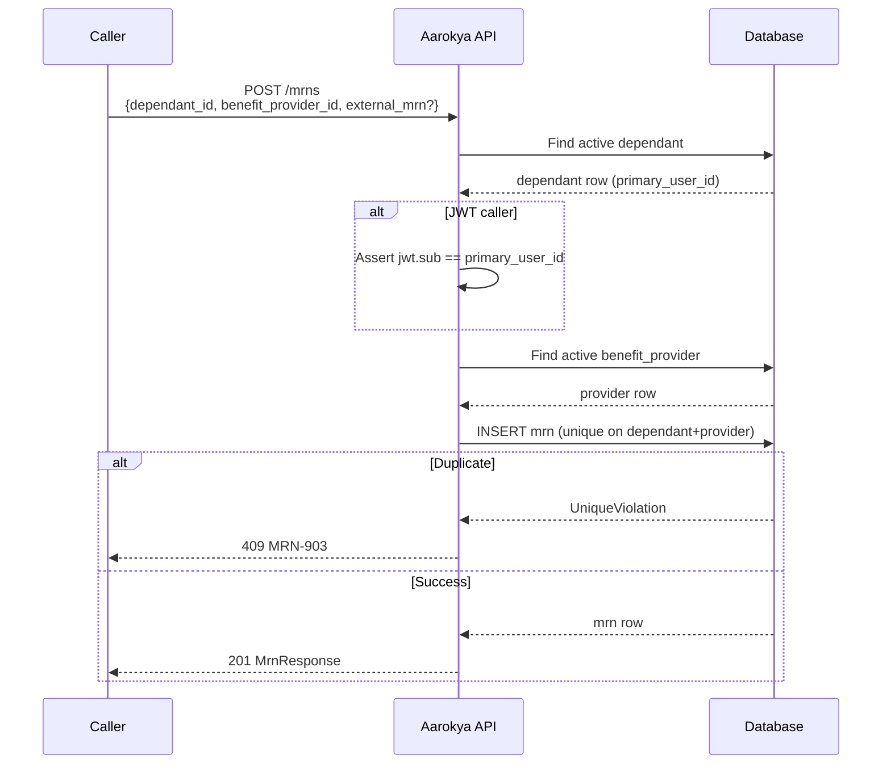

<Info>
  **Auth guards vary by endpoint** — Create and List accept JWT users and partner keys. Delete is admin-only. The JWT ownership check happens in core, not at the route level.
</Info>

## Overview

An MRN (Medical Record Number) links a **dependant** to a **benefit provider** with an external identifier. Each MRN is uniquely scoped to one `(dependant_id, benefit_provider_id)` pair — only one active MRN per dependant per provider is allowed.

The external identifier is stored as a JSONB object (`external_mrn`) with two optional fields: `temp_number` (a temporary registration number) and `mrn` (the final medical record number). Both may be null initially and populated as the provider assigns them.

Routes are flat at `/mrns` (no user nesting). The `primary_user_id` is derived server-side from the dependant row — callers never supply it.

<Note>
  MRN records are also **auto-created** during insurance policy creation — one per covered dependant at the benefit's provider. See the [Insurance Policy module](/api-reference/modules/insurance_policy) for details.
</Note>

---

## Create Flow



---

## Auth Guards by Endpoint

| Endpoint | JWT user | Partner key | Admin key | Notes |
|----------|----------|-------------|-----------|-------|
| `POST /mrns` | ✓ | ✓ | — | JWT: dependant must belong to token user |
| `GET /mrns` | ✓ | ✓ | — | All filters optional |
| `GET /mrns/{id}` | ✓ | ✓ | — | Returns 404 if inactive |
| `PATCH /mrns/{id}` | — | — | ✓ | Replaces `external_mrn` only — backfill `mrn` once provider issues it |
| `DELETE /mrns/{id}` | — | — | ✓ | Sets `status → inactive` |

---

## Endpoints

<CardGroup cols={2}>
  <Card title="POST /mrns" icon="plus" color="#16a34a" href="/api/endpoints/mrns/create">
    Create an MRN linking a dependant to a benefit provider.
  </Card>
  <Card title="GET /mrns" icon="list" color="#3b82f6" href="/api/endpoints/mrns/list">
    List MRNs. Filter by `dependant_id`, `benefit_provider_id`, or `primary_user_id`.
  </Card>
  <Card title="GET /mrns/{id}" icon="id-card" color="#3b82f6" href="/api/endpoints/mrns/get">
    Fetch a single active MRN by its internal UUID.
  </Card>
  <Card title="PATCH /mrns/{id}" icon="pen-to-square" color="#0ea5e9" href="/api/endpoints/mrns/update">
    Update the `external_mrn` JSONB (admin only). Used to backfill `mrn` once the provider issues it.
  </Card>
  <Card title="DELETE /mrns/{id}" icon="trash" color="#dc2626" href="/api/endpoints/mrns/delete">
    Soft-delete (`status → inactive`). Admin key required.
  </Card>
</CardGroup>

---

## Request / Response Examples

<CodeGroup>
```bash Create an MRN (with external identifiers)
curl -X POST http://localhost:8080/mrns \
  -H 'Authorization: Bearer eyJhbGci...' \
  -H 'Content-Type: application/json' \
  -d '{
    "dependant_id": "01926b3a-7c2e-7d4f-a1b2-c3d4e5f60001",
    "benefit_provider_id": "018f4c2a-1b3e-7d8f-9a0b-2c3d4e5f6a7b",
    "external_mrn": {
      "temp_number": "TMP-98765",
      "mrn": "MRN-12345"
    }
  }'
```

```bash Create an MRN (no external identifiers yet)
curl -X POST http://localhost:8080/mrns \
  -H 'Authorization: Bearer eyJhbGci...' \
  -H 'Content-Type: application/json' \
  -d '{
    "dependant_id": "01926b3a-7c2e-7d4f-a1b2-c3d4e5f60001",
    "benefit_provider_id": "018f4c2a-1b3e-7d8f-9a0b-2c3d4e5f6a7b"
  }'
```

```json Response 201
{
  "id": "01926b3a-7c2e-7d4f-a1b2-c3d4e5f60020",
  "primary_user_id": "047382910564",
  "dependant_id": "01926b3a-7c2e-7d4f-a1b2-c3d4e5f60001",
  "benefit_provider_id": "018f4c2a-1b3e-7d8f-9a0b-2c3d4e5f6a7b",
  "external_mrn": {
    "temp_number": "TMP-98765",
    "mrn": "MRN-12345"
  },
  "status": "ACTIVE",
  "created_at": "2026-04-12T10:00:00Z",
  "last_modified_at": "2026-04-12T10:00:00Z"
}
```
</CodeGroup>

### `external_mrn` Object

| Field | Type | Required | Description |
|-------|------|----------|-------------|
| `temp_number` | string | no | Temporary registration number assigned by the provider |
| `mrn` | string | no | Final medical record number assigned by the provider |

Both fields are optional. The `external_mrn` field itself is also optional on create — an MRN record can exist without external identifiers (e.g., when auto-created during policy purchase).

---

## Error Codes

| Code | HTTP | Description |
|------|------|-------------|
| `MR-900` | 500 | Internal server error |
| `MR-901` | 404 | MRN not found or inactive |
| `MR-902` | 403 | JWT user accessing MRN belonging to another user's dependant |
| `MR-903` | 409 | MRN already exists for this dependant + provider combination |
| `MR-904` | 404 | Dependant not found or inactive |
| `MR-905` | 404 | Benefit provider not found or inactive |
| `MR-906` | 400 | Invalid UUID in filter or request body |
