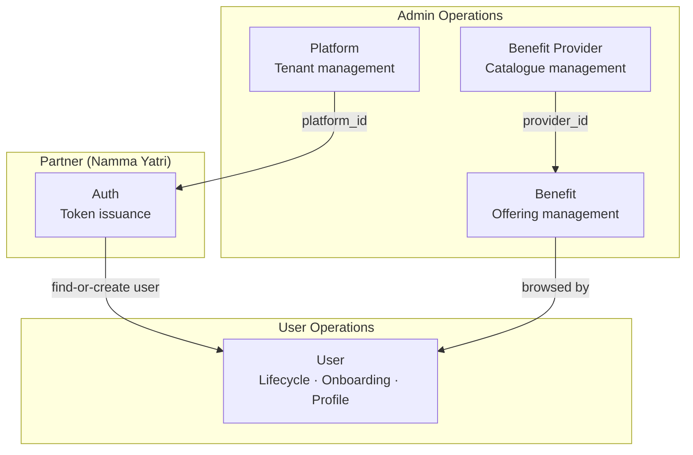
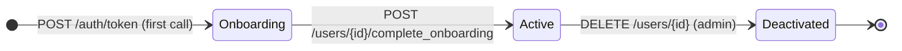

## Module Map

---

## Domains

<CardGroup cols={3}>
  <Card title="Platform" icon="building" color="#f59e0b" href="/modules/auth">
    **Admin-only**

    Create and manage tenants (e.g. Namma Yatri). Every user belongs to exactly one platform. Platform ID is required for token issuance.

    **Tables:** `platforms`
  </Card>
  <Card title="Auth" icon="key" color="#16a34a" href="/modules/auth">
    **Partner API key**

    External partners call `POST /auth/token` with a phone number and platform ID. Aarokya creates the user on first call and issues a JWT. No OTP, no passwords.

    **Tables:** `users` (find-or-create)
  </Card>
  <Card title="User" icon="user" color="#3b82f6" href="/modules/user">
    **JWT + Admin**

    Full user lifecycle — read profile, update fields, complete onboarding, soft-delete. Self-access enforced: JWT users can only read/write their own record.

    **Tables:** `users`
  </Card>
  <Card title="Benefit Provider" icon="hospital" color="#0891b2" href="/modules/benefit_provider">
    **Admin-only**

    Companies and entities that offer benefits. Top-level grouping for the benefit catalogue. A provider must exist before any benefit can reference it.

    **Tables:** `benefit_providers`
  </Card>
  <Card title="Benefit" icon="stethoscope" color="#7c3aed" href="/modules/benefit">
    **Admin write · JWT + Admin read**

    Individual offerings (consultation, insurance) linked to a provider. Admins manage the catalogue; active JWT users browse and redeem benefits.

    **Tables:** `benefits`
  </Card>
</CardGroup>

---

## Authentication Model

Aarokya uses three distinct auth mechanisms — one per actor type:

| Header | Scheme | Used by |
|--------|--------|---------|
| `admin-api-key` | Static secret | Internal ops — platform CRUD, user admin |
| `api-key` | Static secret (per partner) | External partners — token issuance |
| `Authorization: Bearer <jwt>` | JWT (HS256) | Logged-in users — profile, onboarding |

There are no passwords, no OTP flows, and no refresh tokens. The JWT is the only credential issued to end users, and its lifetime is controlled by the `jwt.expiry_hours` config.

---

## User Lifecycle

| Status | Meaning | What's allowed |
|--------|---------|----------------|
| `onboarding` | Created, profile incomplete | `PATCH /users/{id}`, `POST /users/{id}/complete_onboarding` |
| `active` | Fully onboarded | All user endpoints |
| `deactivated` | Soft-deleted | No further operations |

---

## Shared Infrastructure

<CardGroup cols={3}>
  <Card title="server_wrap" icon="shield-check" color="#7c3aed">
    Single entry point for all auth validation and error handling. Every route handler calls `server_wrap(auth_guard, ...)`. No handler can accidentally skip auth.
  </Card>
  <Card title="Error Envelope" icon="triangle-exclamation" color="#dc2626">
    All errors return `{ "error": { "code": "...", "message": "..." } }`. Machine-readable `code` field — client code should switch on `code`, not `message`.
  </Card>
  <Card title="OpenAPI / Swagger" icon="book" color="#0891b2">
    Interactive Swagger UI at `GET /docs`. OpenAPI JSON at `GET /docs/openapi.json`. Generated from code annotations using `utoipa`.
  </Card>
</CardGroup>
