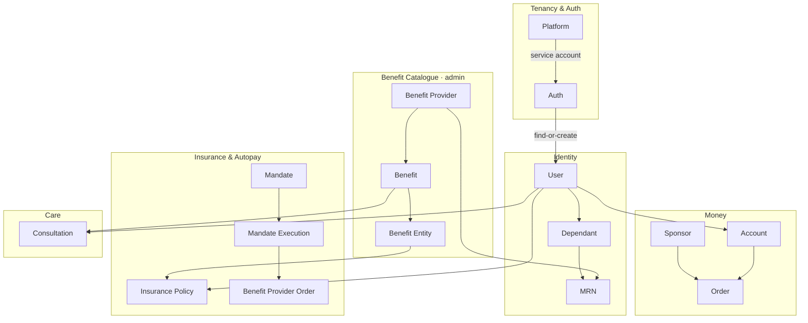
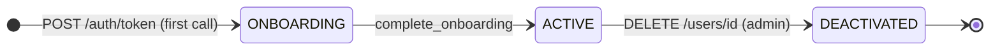

## Module Map

---

## Domains

### Tenancy & Auth

<CardGroup cols={2}>
  <Card title="Platform" icon="server" color="#f59e0b" href="/modules/platform">
    **Admin · platform user**

    Tenants (e.g. Namma Yatri). Holds service-account credentials and dashboard users. Every user belongs to one platform.

    **Tables:** `platforms`
  </Card>
  <Card title="Auth" icon="key" color="#16a34a" href="/modules/auth">
    **Platform service account**

    `POST /auth/token` — the partner backend exchanges a phone number and id-proof for an app JWT. Aarokya find-or-creates the user.

    **Tables:** `users` (find-or-create)
  </Card>
</CardGroup>

### Identity

<CardGroup cols={3}>
  <Card title="User" icon="user" color="#3b82f6" href="/modules/user">
    **App user · admin**

    Profile, onboarding, soft-delete. App users act on their own record; admins manage all.

    **Tables:** `users`
  </Card>
  <Card title="Dependant" icon="user-group" color="#0891b2" href="/modules/dependant">
    **App user · admin**

    Family members linked to a user. Append-only versioned rows — every update supersedes the previous version. The `SELF` dependant is system-managed.

    **Tables:** `dependants`
  </Card>
  <Card title="MRN" icon="id-card" color="#dc2626" href="/modules/mrn">
    **App user · benefit provider · admin**

    Links a dependant to a benefit provider with an external Medical Record Number. Unique per `(dependant, provider)` pair.

    **Tables:** `mrns`
  </Card>
</CardGroup>

### Benefit Catalogue

<CardGroup cols={3}>
  <Card title="Benefit Provider" icon="building" color="#0891b2" href="/modules/benefit_provider">
    **Admin · provider**

    Companies that offer benefits (e.g. Narayana). Holds its own service-account credentials and dashboard users. A provider must exist before any benefit references it.

    **Tables:** `benefit_providers`
  </Card>
  <Card title="Benefit" icon="stethoscope" color="#7c3aed" href="/modules/benefit">
    **Provider / admin write · authenticated read**

    Catalogue offerings — `CONSULTATION` or `INSURANCE_POLICY` — linked to a provider, with typed `benefit_details`.

    **Tables:** `benefits`
  </Card>
  <Card title="Benefit Entity" icon="layer-group" color="#7c3aed" href="/modules/benefit_entity">
    **Admin read**

    Append-only record of a benefit granted to a user (the join between a user and a `CONSULTATION` or `INSURANCE_POLICY` benefit instance).

    **Tables:** `benefit_entities`
  </Card>
</CardGroup>

### Money

<CardGroup cols={3}>
  <Card title="Account" icon="wallet" color="#16a34a" href="/modules/account">
    **App user · admin · trusted backend**

    A holder's ring-fenced accounts plus `balance` and `ledger`, backed by the PBA (Prepaid Bank Account) ledger. Holders are users or sponsors.

    **Tables:** `accounts`
  </Card>
  <Card title="Order" icon="receipt" color="#0891b2" href="/modules/order">
    **App user · admin**

    A self-contribution top-up and its settlement status against the user's account.

    **Tables:** `orders`
  </Card>
  <Card title="Sponsor" icon="hand-holding-heart" color="#ec4899" href="/modules/sponsor">
    **Trusted backend**

    An entity (individual or organisation) that funds workers' care — with its own PBA account, balance, deposits, and contributions.

    **Tables:** `sponsors`
  </Card>
</CardGroup>

### Insurance & Autopay

<CardGroup cols={2}>
  <Card title="Insurance Policy" icon="shield-heart" color="#ec4899" href="/modules/insurance_policy">
    **App user · admin**

    Preview → enrollment form → issue a Narayana policy, then track it through its provider-driven lifecycle. Documents and admin management included.

    **Tables:** `insurance_policies`
  </Card>
  <Card title="Mandate" icon="repeat" color="#f59e0b" href="/modules/mandate">
    **App user · admin**

    A recurring UPI autopay authorisation that funds a user's premiums, with register, status, pause, resume, and revoke.

    **Tables:** `mandates`
  </Card>
  <Card title="Mandate Execution" icon="bolt" color="#f59e0b" href="/modules/mandate_execution">
    **Trusted backend · admin**

    One scheduled debit attempt against a live mandate, claimed idempotently and reconciled with the upstream order.

    **Tables:** `mandate_executions`
  </Card>
  <Card title="Benefit Provider Order" icon="cart-shopping" color="#0891b2" href="/modules/benefit_provider_order">
    **Provider · admin**

    An external order placed with a benefit provider (e.g. an insurer), debited from the user's account.

    **Tables:** `benefit_provider_orders`
  </Card>
</CardGroup>

### Care

<CardGroup cols={1}>
  <Card title="Consultation" icon="comments" color="#8b5cf6" href="/modules/consultation">
    **App user · admin**

    A chat-thread teleconsultation against an eligible benefit, bridged to the Narayana conversation gateway — messages, attachments, read receipts, and a status lifecycle.

    **Tables:** `consultations`
  </Card>
</CardGroup>

---

## Authentication Model

Every request is a bearer JWT. Tokens are minted by Keycloak (service accounts, admins, dashboard users) or by `POST /auth/token` (app users).

| Caller | Token | Used for |
|--------|-------|----------|
| App user | `Authorization: Bearer <app-jwt>` from `POST /auth/token` | User-scoped endpoints — profile, dependants, accounts, policies, mandates, consultations |
| Platform service account | `Authorization: Bearer <service-jwt>` (Keycloak `client_credentials` from a platform credential) | `POST /auth/token` and partner-scoped operations |
| Admin / dashboard user | `Authorization: Bearer <oidc-jwt>` | Admin CRUD — platforms, providers, benefits, and the `/admin/*` listings |
| Benefit provider | `Authorization: Bearer <jwt>` (provider service account or dashboard user) | Provider-scoped — its benefits, MRNs, and orders |

When a token expires the issuer re-authenticates — the partner backend simply calls `POST /auth/token` again.

---

## User Lifecycle

| Status | Meaning | Allowed operations |
|--------|---------|-------------------|
| `ONBOARDING` | Created, profile incomplete | `POST /users/{user_id}/complete_onboarding` only — `PATCH` is rejected until active |
| `ACTIVE` | Fully onboarded | All user endpoints |
| `DEACTIVATED` | Soft-deleted | None |

---

## Shared Infrastructure

<CardGroup cols={3}>
  <Card title="AuthN middleware" icon="shield-check" color="#7c3aed">
    `AuthNMiddleware` authenticates every request app-wide and injects an `Actor`; handlers pull `web::ReqData<Actor>` and authorize with `actor.require_*()?` — no handler can skip auth accidentally.
  </Card>
  <Card title="Error Envelope" icon="triangle-exclamation" color="#dc2626">
    All errors return `{"error": {"code": "...", "message": "..."}}`. Switch on `code` (e.g. `MR_1103`), not `message`.
  </Card>
  <Card title="OpenAPI / Swagger" icon="book" color="#0891b2">
    The OpenAPI spec and a Swagger UI are served by the backend, generated from the route handlers via `utoipa`. The same spec powers the Try It Out playground here.
  </Card>
</CardGroup>

---

## Money & IDs

<CardGroup cols={2}>
  <Card title="Amounts" icon="indian-rupee-sign" color="#16a34a">
    Stored internally as integer minor units (`MinorUnit`) with a `Currency` enum. At the API boundary an amount is an `AmountResponse` object — `{ "value": 99.99, "currency": "INR" }` — value in major units.
  </Card>
  <Card title="Identifiers" icon="fingerprint" color="#3b82f6">
    User IDs are 12-digit numeric strings (printable on a card). Every other entity uses a UUID v7 (time-sortable). IDs are always generated server-side — never client-supplied.
  </Card>
</CardGroup>
