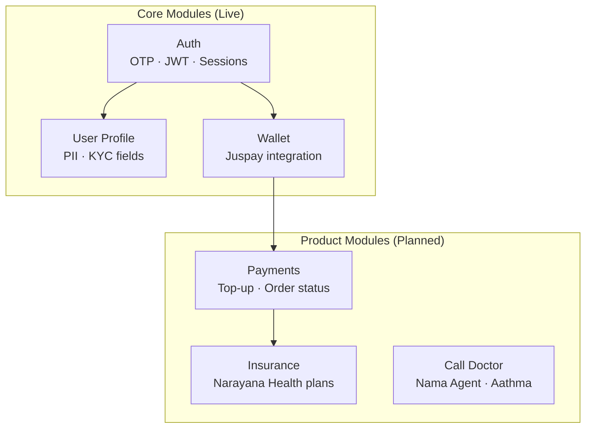
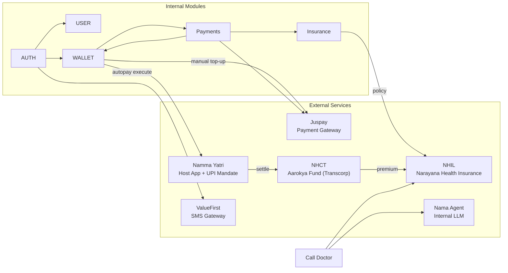

## Module Map

---

## All Modules

<CardGroup cols={2}>
  <Card title="Auth" icon="lock" color="#f59e0b" href="/modules/auth">
    **Status: Live**

    Phone OTP → JWT access + refresh token pair. Device-level sessions with token rotation. Wallet auto-provisioned on first login.

    **Tables:** `users` · `otp_sessions` · `user_sessions`
  </Card>
  <Card title="User Profile" icon="user" color="#3b82f6" href="/modules/user">
    **Status: Live**

    Read and update personal details (name, DOB, gender, address, occupation). Aadhaar stored as last 4 digits only — always masked in responses.

    **Tables:** `users` (shared with Auth)
  </Card>
  <Card title="Wallet" icon="wallet" color="#16a34a" href="/modules/wallet">
    **Status: Live (stub)**

    Health savings wallet. Auto-created on login. Balance, status, and transaction history served from local DB stub until Juspay integration is complete.

    **Tables:** `customer_wallets`
  </Card>
  <Card title="Insurance" icon="shield-heart" color="#ec4899" href="/modules/insurance">
    **Status: Planned**

    Browse Narayana Health plans, calculate premium with family members, purchase policies, and submit claims.

    **Tables:** `insurance_plans` · `insurance_policies` · `policy_dependants`
  </Card>
  <Card title="Call Doctor" icon="stethoscope" color="#8b5cf6" href="/modules/call-doctor">
    **Status: Planned**

    AI symptom collection via Nama Agent (internal LLM) → structured clinical summary → Aathma doctor assignment. Session locked after submission.

    **Tables:** `chat_sessions` · `chat_messages`
  </Card>
  <Card title="Payments" icon="credit-card" color="#06b6d4" href="/modules/wallet">
    **Status: Planned**

    Single endpoint for wallet top-up and insurance purchase via Juspay Session API. App opens Hyper Checkout SDK; poll order status for result.

    **Tables:** `payment_orders`
  </Card>
</CardGroup>

---

## Module Purpose and Data Ownership

Each module in Aarokya has a clearly bounded responsibility. Understanding what each module *owns* — and what it delegates — is the key to understanding the system.

### Auth Module

**Purpose:** Prove who the user is, and issue credentials they can use for everything else.

**Data it owns:**
- `users` table — the canonical identity row. One row per phone number.
- `otp_sessions` table — short-lived (10 minute) records of in-flight OTP challenges.
- `user_sessions` table — long-lived per-device session records, each holding a hashed refresh token.

**Key design decision — OTP only, no passwords:**
Gig workers use multiple devices and frequently share phones with family. Passwords create account recovery debt (forgotten credentials → support calls → account lockouts). Phone OTP is already the login primitive they use for every UPI transaction. It also aligns with Aadhaar-linked KYC when insurance underwriting requires identity verification.

**Key design decision — per-device sessions:**
Each successful OTP verification creates a new `user_sessions` row tagged with device info. Logout revokes only that device's session. A user on a shared phone can log out without affecting sessions on their other devices.

### User Profile Module

**Purpose:** Capture the personal details needed for insurance eligibility, KYC, and personalisation.

**Data it owns:** It shares the `users` table with Auth. Auth creates the row; User Profile reads and writes the profile fields (name, DOB, gender, address, occupation, employer, Aadhaar last-4).

**Key design decision — profile_complete flag:**
Rather than blocking login until the profile is filled, Aarokya lets the user in immediately and uses a computed `profile_complete` flag (name fields present) to gate the onboarding screen. This avoids friction on first login.

**Key design decision — Aadhaar last-4 only:**
Storing a full Aadhaar number would make Aarokya's database a high-value PII target. The last 4 digits are enough for identity confirmation ("is this the right person?") without storing the full national ID. The client is responsible for sending only the last 4 digits — the backend never receives the full number.

### Wallet Module

**Purpose:** Maintain a ring-fenced health savings account for each user, funded by contributions from the user, employers, or platforms, and spendable only on healthcare.

**Data it owns:** `customer_wallets` table. One wallet per user. Stores `transcorp_wallet_id`, `balance`, provisioning status, and a local JSONB ledger.

**Key design decision — auto-provisioning on login:**
Provisioning happens in the background after the first OTP verify. The user never has to click "create wallet." By the time they navigate to the wallet tab, it is ready (or nearly so). This reduces the number of steps required before the user can transact.

**Key design decision — async wallet creation:**
Calling Juspay's API synchronously during login would make login latency dependent on an external service. If Juspay is slow or unavailable, users couldn't log in. Async provisioning isolates the login path from external dependency latency.

### Insurance Module

**Purpose:** Let users browse Narayana Health plans, get a personalised premium quote, pay, and hold active policies. Forward claims to NH for adjudication.

**Data it owns:** `insurance_plans` (plan catalogue), `insurance_policies` (purchased policies), `policy_dependants` (covered family members).

**Key design decision — Aarokya does not adjudicate claims:**
Claims are forwarded to Narayana Health's API. NH handles underwriting, hospitalisation networks, TPA, and settlement. Aarokya's role is the distribution channel — making it easy to buy and simple to submit, not to become an insurance company.

### Call Doctor Module

**Purpose:** Let users describe symptoms conversationally (via AI), produce a structured clinical summary, and connect them with a real doctor via the Aathma platform.

**Data it owns:** `chat_sessions` (session state, Aathma reference, lock timestamp), `chat_messages` (turn-by-turn conversation history).

**Key design decision — session immutability after LOCK:**
Once a session is submitted and Aathma assigns a doctor, the session is permanently locked. A patient cannot edit their symptom description after a doctor has already been briefed. This preserves clinical integrity — the doctor acts on the summary they received, and the record cannot be altered retroactively.

**Key design decision — AI triage before human doctor:**
Routing every call directly to a doctor would require a large pool of on-call physicians. The Nama Agent pre-collects structured information (chief complaint, duration, severity, medications, allergies), enabling the doctor to be immediately productive rather than spending time on intake.

---

## Cross-Module Data Flow

| Event | Trigger | Downstream Effect |
|-------|---------|-------------------|
| First login | `POST /auth/otp/verify` | Wallet auto-provisioned (async background job) |
| Profile update | `PATCH /user/profile` | KYC fields updated; insurance eligibility recalculated |
| **Autopay consent** | User consents in Aarokya | Linked to Namma Yatri UPI mandate for daily ₹20 execution |
| **Daily wallet top-up** | Aarokya CRON → Namma Yatri mandate | ₹20 debited from driver's bank → wallet balance updated |
| Wallet top-up (manual) | Payment `SUCCESS` (WALLET_TOPUP type) | Balance updated in `customer_wallets` |
| **Auto insurance purchase** | Aarokya CRON (after wallet funded) | Policy queued → NHIL creates policy → driver notified |
| Insurance purchase (manual) | Payment `SUCCESS` + `POST /insurance/purchase` | Policy row created; NH policy issued via Narayana Health API |
| **Settlement (wallet)** | Namma Yatri → NHCT | Funds settled to Aarokya fund at Transcorp |
| **Settlement (insurance)** | NHCT → NHIL | Premium transferred to Narayana Health Insurance (periodic, manual) |
| Doctor session submit | `POST /doctor/submit/{sessionId}` | Clinical summary forwarded to Aathma; session permanently locked |
| Logout | `POST /auth/logout` | Current device session revoked; other sessions unaffected |

---

## Module Dependencies

---

## Shared Infrastructure

<CardGroup cols={3}>
  <Card title="JWT Auth Middleware" icon="shield-check" color="#7c3aed">
    All non-auth endpoints validate the `Authorization: Bearer` header. `user_id` is extracted from the JWT claims and passed to every handler. No endpoint can accidentally skip auth — the middleware is applied at the router level.
  </Card>
  <Card title="Error Envelope" icon="triangle-exclamation" color="#dc2626">
    All errors return `{ "error": "ERROR_CODE", "message": "...", "status_code": 4xx }`. See the [Error Reference](/api/errors). Error codes are machine-readable strings — client code should switch on `error`, not on `message`.
  </Card>
  <Card title="Structured Logging" icon="terminal" color="#0891b2">
    Structured JSON logs via `tracing` + `tracing-subscriber`. Every request is traced with `user_id`, method, path, and latency via `tracing-actix-web`. Logs never include PII (tokens, OTPs, Aadhaar).
  </Card>
</CardGroup>

<CardGroup cols={3}>
  <Card title="OpenAPI / Swagger" icon="book" color="#0891b2">
    The full OpenAPI spec is served at `GET /api_docs/openapi.json`. Interactive Swagger UI is at `GET /api_docs/ui`. Generated from code annotations using `utoipa`.
  </Card>
  <Card title="Health Check" icon="heart-pulse" color="#16a34a">
    `GET /health` returns `200 OK` with `{"status": "ok"}`. Used by load balancers and uptime monitors. No auth required.
  </Card>
  <Card title="Config via Environment" icon="gear" color="#f59e0b">
    All secrets and config (JWT secret, DB URL, Juspay keys) are loaded from environment variables at startup. The app panics fast on missing required config — no silent misconfiguration.
  </Card>
</CardGroup>
